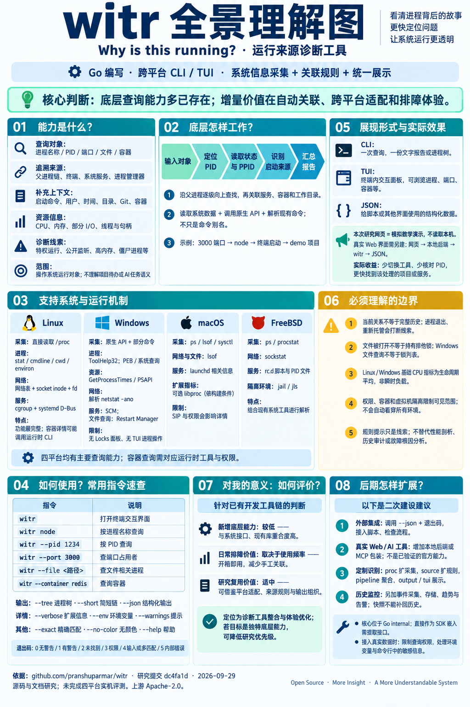
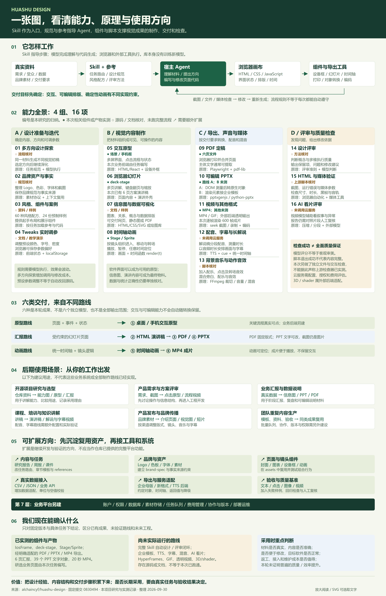
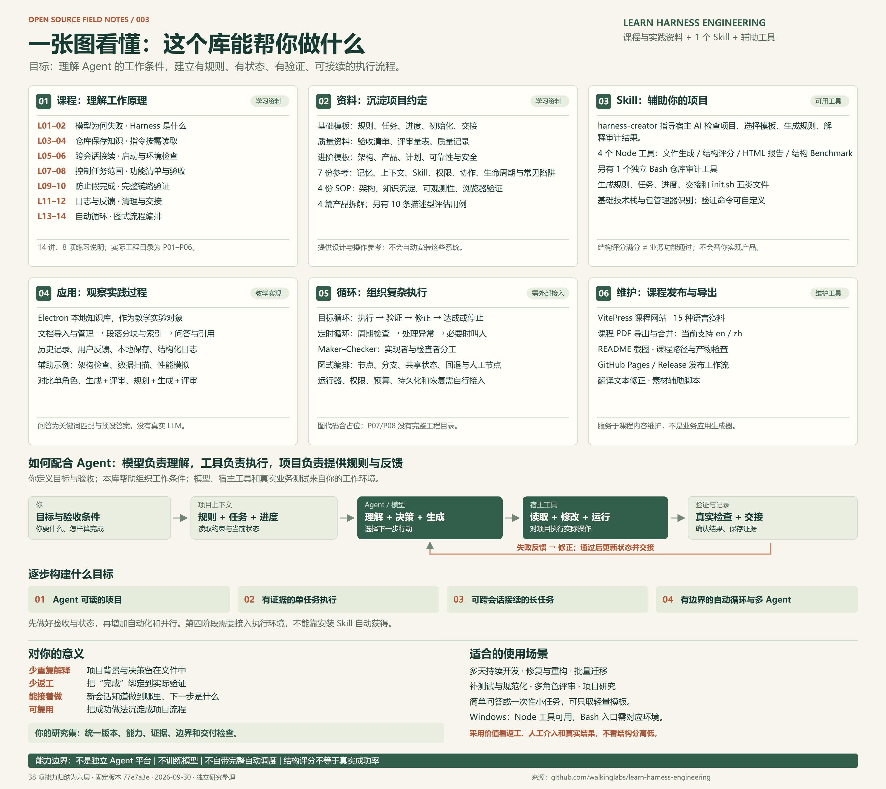
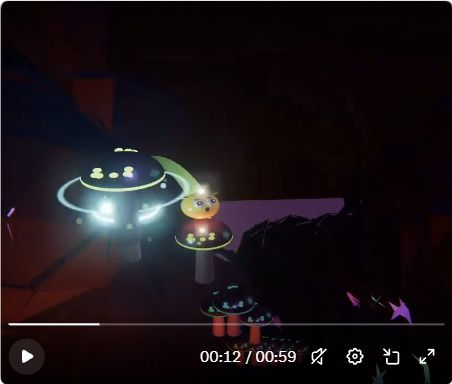
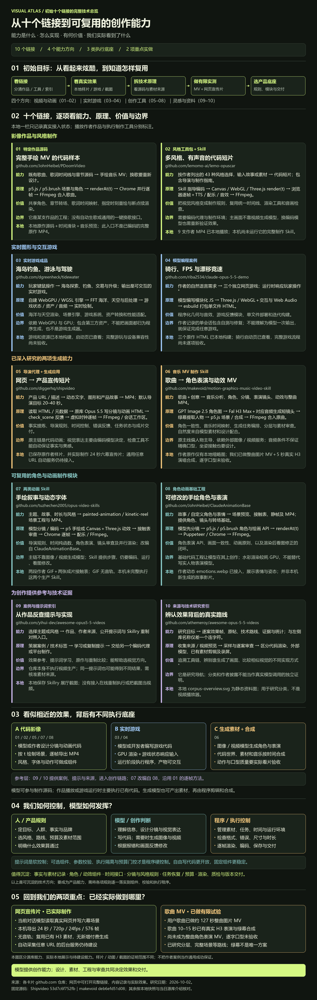
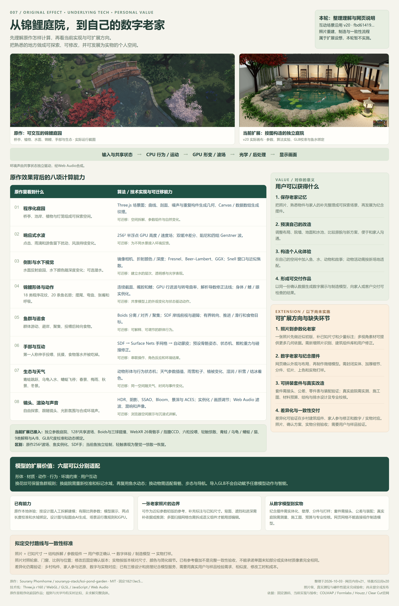
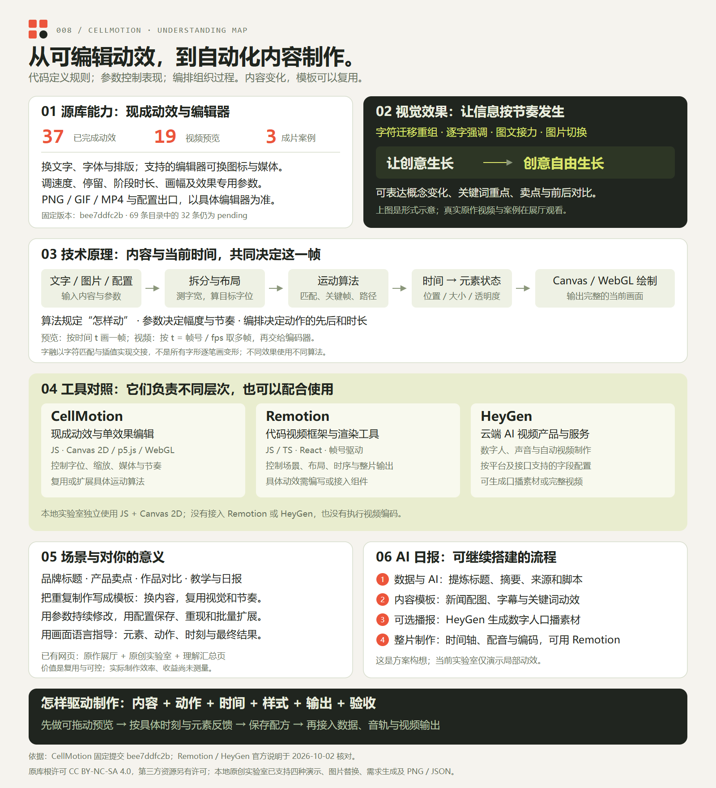
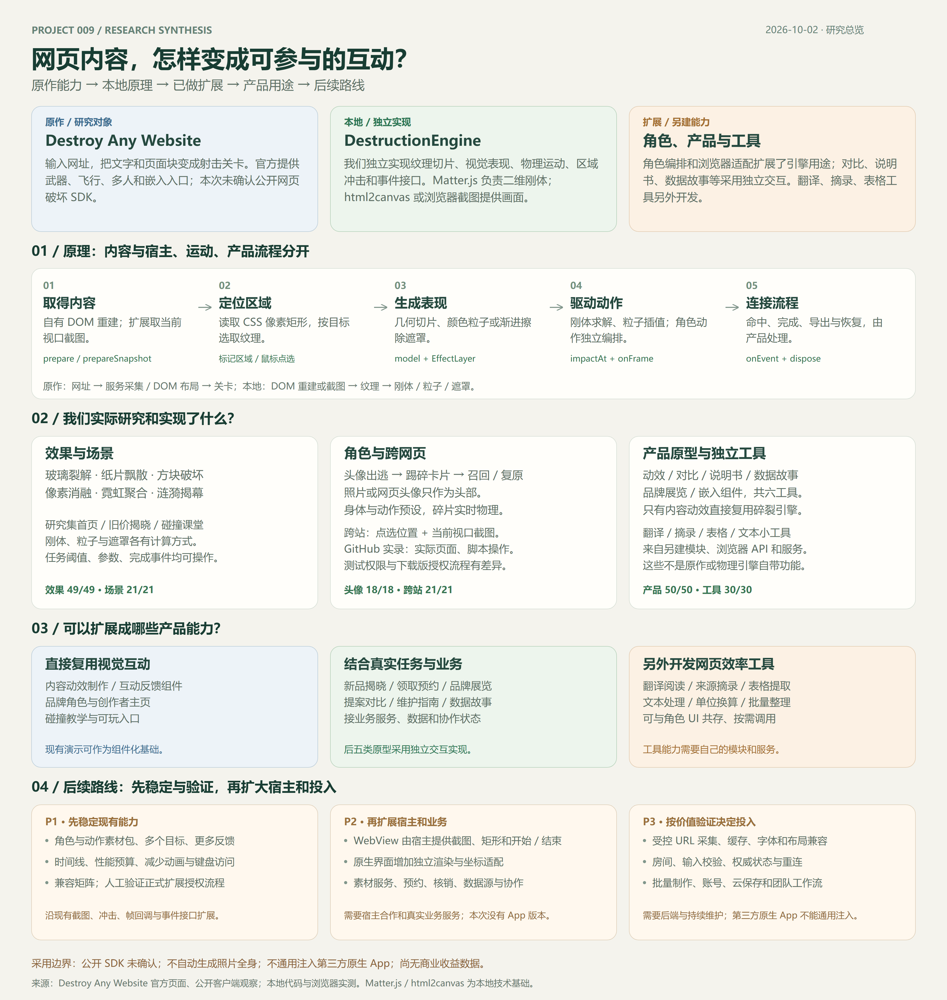
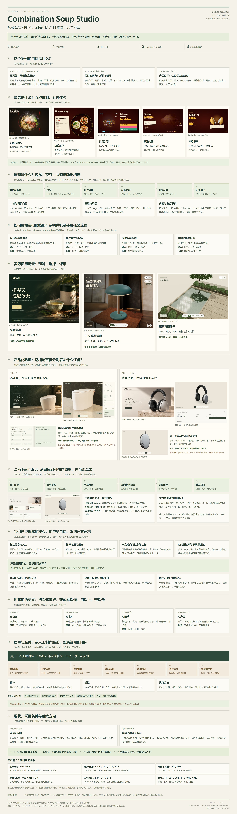

# GitHub 项目研究集

[011 完整交互研究与产品展示](https://yydshly.github.io/0930_codex_project/projects/011-combination-soup-studio/) · [全景理解图](https://yydshly.github.io/0930_codex_project/projects/011-combination-soup-studio/understanding-map.html) · [文字理解汇总](https://yydshly.github.io/0930_codex_project/projects/011-combination-soup-studio/understanding.html)：原站效果、技能、业务场景、马桶与耳机、制作及交付工作台共用完整入口。

持续收录值得研究的开源项目，记录它们解决的问题、核心设计、运行过程和可复用的经验。每个子项目独立整理研究笔记、界面截图与演示，首页只保留摘要和入口。

这里的研究关注七个问题：**能做什么、底层怎么做、如何运行、支持什么系统、适合哪些场景、对我们有何价值、后续怎样扩展**。索引中的“源库”使用原仓库名称，研究文档与教学网页则由本项目整理。先看引导图建立整体理解，再用网页验证自己的理解；模拟演示不等于上游程序的实机测试。

首个研究项目 **witr** 用于追溯进程、端口、文件与容器的运行来源。它组合已有系统数据、原生接口和命令，自动关联父进程链与项目上下文，主要价值是减少手工排障。对于已经具备系统采集能力的工具链，它的新增底层能力有限，更适合作为便捷诊断工具和跨平台整合样本。下方项目介绍使用本次生成的全景理解图作为引导。

## 项目索引

按固定编号升序展示；编号一经分配即保留，暂停或归档的项目也不重新编号。

<!-- PROJECT_INDEX:START -->

| 编号 | 项目 / 研究文档 | 能力、原理与使用摘要 | 状态 | 来源 / 技术 | 演示 |
| --- | --- | --- | --- | --- | --- |
| 001 | [witr · 运行来源诊断](projects/001-witr/README.md) | **能力：** 追溯进程、端口、文件与容器来源<br>**原理：** 系统数据/API/命令采集，加父进程链与来源规则<br>**运行：** CLI、TUI、JSON<br>**平台：** Linux、Windows、macOS、FreeBSD<br>**场景：** 端口冲突、残留服务、文件占用<br>**价值：** 减少手工关联，新增底层能力有限<br>**扩展：** JSON 集成、本地 Web/MCP、定制规则与独立历史采集。 | 已完成 | [pranshuparmar/witr](https://github.com/pranshuparmar/witr) | [在线演示](https://yydshly.github.io/0930_codex_project/projects/001-witr/) |
| 002 | [Huashu Design · 设计能力研究](projects/002-huashu-design/README.md) | **能力：** 设计探索、原型、幻灯片、信息图、动画、声音与检查<br>**产物：** HTML、PDF、可编辑 PPTX、MP4 等<br>**原理：** Skill 与参考指导模型，浏览器渲染，组件/脚本执行<br>**场景：** 研究、评审、汇报、培训与传播<br>**价值：** 复用制作经验<br>**扩展：** 品牌、模板、数据、导出和验收。 | 已完成 | [alchaincyf/huashu-design](https://github.com/alchaincyf/huashu-design) | [在线演示](https://yydshly.github.io/0930_codex_project/projects/002-huashu-design/) |
| 003 | [Learn Harness Engineering · AI 工作流程研究](projects/003-learn-harness-engineering/README.md) | **定位：** 学习 AI Agent 工作流程的课程与实践资料<br>**内容：** 14 讲课程、8 项练习说明、规则/任务/进度/验收模板，附 1 个 Skill、生成与检查脚本和教学示例<br>**用途：** 理解 Agent、组织持续开发与跨会话任务<br>**价值：** 少重复解释、少返工、凭证据验收<br>**扩展：** 领域模板、真实测试、状态恢复及自动循环/多 Agent，需自行接入执行环境。 | 已完成 | [walkinglabs/learn-harness-engineering](https://github.com/walkinglabs/learn-harness-engineering) | [在线演示](https://yydshly.github.io/0930_codex_project/projects/003-learn-harness-engineering/) |
| 004 | [Rhythm Drop · 音乐型声音与视听体验研究](projects/004-rhythm-drop/README.md) | **目标：** 研究音乐型声音如何驱动视觉、故事与互动<br>**来源：** Gorden Sun 的 X 音乐动画展示<br>**实验：** 场景叙事、声音身份、花园创造与漂流、儿童游戏、原创回声小队和复杂情绪<br>**结论：** 声音主导，角色驱动系列，故事与表演共同设计<br>**制作：** 参考图、程序化模型与声音时钟驱动实时动画<br>**状态：** 研究原型，产品价值尚未验证。 | 已归档 | [Gorden Sun · 原网页音乐效果](https://x.com/Gorden_Sun/status/2105302007896797351)<br>技术：[mrdoob/three.js](https://github.com/mrdoob/three.js) | [在线演示](https://yydshly.github.io/0930_codex_project/projects/004-rhythm-drop/) |
| 005 | [Plush Lab · 毛绒实验室](projects/005-plush-lab/README.md) | **背景：** 从舒适自然的毛绒质感出发，积累创作、互动与研究<br>**能力：** 绒毛剪染卷梳、随机搭配、小世界、陪伴笔记、页面提醒、固定任务及完整原作高斯展示<br>**原理：** Three.js 程序纤维与表面场、Spark 高斯渲染、状态机与本机存储<br>**场景：** 自由设计、网页角色、技术学习与生活记录<br>**价值：** 保留你的作品和方法积累，为陪伴与 Agent 可视化提供基础<br>**边界：** 研究原型，真实 AI 与后台提醒待接入，自制质感尚未达到参考。 | 研究中 | [mrdoob/three.js](https://github.com/mrdoob/three.js) | [在线演示](https://yydshly.github.io/0930_codex_project/projects/005-plush-lab/) |
| 006 | [AI Visual Atlas · 视觉创作能力图谱](projects/006-ai-visual-atlas/README.md) | **范围：** 研究十个视觉创作链接，区分作品源码、风格 Skill、游戏成品、生成工具与资料索引<br>**原理：** 模型理解与创作，代码逐帧渲染、实时游戏，以及生成素材和合成，各项目分别核对<br>**场景：** 音乐 MV、产品宣传、角色动画、游戏体验与风格研究<br>**实测：** 整曲图片 MV、5 秒 H3 演唱与绿幕合成、24 秒六幕网页宣传片<br>**意义：** 理解可复用的时间线、模型调度、素材一致性、检查与交付<br>**边界：** 全曲真实演唱、逐字口型验收和任意 URL 自动服务未完成，部分原作仅本地研究，完整游戏游玩未验收。 | 已完成 | [鸟哥 · 十个视觉创作项目汇总](https://x.com/NFTCPS/status/2105493719931826452)<br>资料索引：[yihui-dev/awesome-opus5-5-videos](https://github.com/yihui-dev/awesome-opus5-5-videos)<br>[十项目源库列表](projects/006-ai-visual-atlas/publication/index.html#library) | [在线演示](https://yydshly.github.io/0930_codex_project/projects/006-ai-visual-atlas/) |
| 007 | [Koi Scene Lab · 庭院效果与实景构造](projects/007-koi-scene-lab/README.md) | **能力：** 原作体验、按图三维庭院、投喂与惊散、生态动物、GLB 导入与尺寸校准<br>**原理：** 程序化建模、GPU 水波与反射折射、Boids 群游、骨骼动画与状态机<br>**场景：** 互动展示、庭院预演、已有模型核对与技术学习<br>**价值：** 保存场景体验和可复用方法，为数字老家与个性化作品建立基础<br>**扩展：** 照片参数化、纪念摆件、实物交付与一致性核验，均需继续建设<br>**边界：** 研究原型，未做现场测绘，尚无照片自动建模和制造输出。 | 研究中 | [souranyp-stack/koi-pond-garden](https://github.com/souranyp-stack/koi-pond-garden) | [在线演示](https://yydshly.github.io/0930_codex_project/projects/007-koi-scene-lab/) |
| 008 | [CellMotion · 可编辑动效研究](projects/008-cellmotion/README.md) | **定位：** 可编辑动效与代码驱动内容制作研究<br>**能力：** 固定版本37个已完成动效、19项原作视频和3支成片案例<br>**效果：** 字符重组、逐字强调、图文接力、图片对比与切换<br>**原理：** JS算法与时间计算元素状态，Canvas/WebGL绘制及逐帧编码<br>**场景：** 品牌标题、产品说明、作品对比、课程章节与日报模板<br>**价值：** 用画面语言指导制作，把内容、视觉与节奏保存为可复用配方<br>**比较：** CellMotion提供具体动效，Remotion组织代码视频，HeyGen提供AI视频服务<br>**扩展：** 四种原创演示、图片替换、需求生成、PNG/JSON保存与完整理解总览<br>**边界：** 实验室未接入AI、音轨或视频编码，自动日报尚未实现，原作媒体需联网。 | 已完成 | [opc8838-hub/font-animation](https://github.com/opc8838-hub/font-animation) | [在线演示](https://yydshly.github.io/0930_codex_project/projects/008-cellmotion/) |
| 009 | [Sprite Destruction Lab · 网页破坏交互研究](projects/009-sprite-destruction-lab/README.md) | **定位：** 从 Destroy Any Website 游戏出发研究网页内容互动，原作公开破坏 SDK 未确认<br>**能力：** 六种效果、三个场景、头像出逃与可安装跨站扩展，保留真实 GitHub 录像<br>**产物：** 动效 PNG/WebM、对比报告、维护记录、CSV 故事、品牌作品册、嵌入组件，以及独立翻译/摘录/表格工具<br>**原理：** DOM 重建或视口截图、纹理切片、二维刚体/粒子/遮罩、角色编排与事件<br>**场景：** 内容制作、品牌角色、可玩展示、碰撞教学和网页效率<br>**价值：** 复用现有内容与交互接口，明确区分效果能力、产品任务和另建工具<br>**扩展：** 角色素材、时间线、组件化、自有 WebView 与业务接入<br>**边界：** 身体动作预设，仅当前视口；App、多人和营销后端待开发，翻译依赖外部服务，尚无商业收益验证。 | 已完成 | [Destroy Any Website · 原作游戏](https://destroy.spritefusion.com/)<br>技术：[liabru/matter-js](https://github.com/liabru/matter-js) | — |
| 010 | [Dumpling Style Lab · 游戏方向与参与形式研究](projects/010-dumpling-style-lab/README.md) | **定位：** 从 Dumpling Dell 出发，研究让玩家愿意参与的游戏方向、视角、操作与展现形式<br>**能力：** 107 种形式样例与原有九款短篇，共 116 个展示入口，15 个独立方向另列<br>**展示：** 六类主入口、代表性实机截图、原作体验、20 种早期材质、3 段小体验和历史画风版本<br>**原理：** Canvas 2D、Three.js 真实三维、规则与状态机、碰撞与车辆物理、浏览器独立存档<br>**参考：** 开源游戏分类目录与官方作品体验，用于发现方向、比较质量和筛选可复用源码<br>**价值：** 积累可运行样例、参与方式对照、素材与技术路径，帮助后续选题和原型验证<br>**扩展：** 12 项后续方向已记录，当前暂停新增试玩<br>**边界：** 现有内容为研究样例，画面质量和游戏深度不等于商业成品，多人房间与异步接力仍需本机后端，存档不会自动迁移到公网。 | 已归档 | [Dumpling Dell · 原作网页](https://dumpling-dell.pages.dev/)<br>公开仓库未确认 | [在线演示](https://yydshly.github.io/0930_codex_project/projects/010-dumpling-style-lab/) |
| 011 | [Combination Soup Studio · 交互展示与业务价值](projects/011-combination-soup-studio/README.md) | **定位：** 以交互官网为参考，拆解效果并沉淀可复用的产品体验与交付方法<br>**能力：** 五项效果、四类技能、三类业务场景，马桶与耳机完整产品页、目标及交付工作台<br>**原理：** 素材与浏览器事件驱动画面和状态，Canvas与Three.js/WebGL承担二维及三维，配置贯穿PNG、JSON、简报和ZIP<br>**场景：** 品牌活动、产品解释与选配、区域服务查询、庭院方案评审<br>**价值：** 帮助理解、比较和保留选择，便于团队复用与继续制作<br>**扩展：** 按新品类补齐事实、视觉标杆、资产、交互和验收，逐步建立质量修正闭环<br>**边界：** 原站开源许可未确认，当前为概念原型，在线模型与任意产品自动交付未验收，商业收益未实测。 | 已完成 | [Combination Soup Studio · 官网案例](https://combinationsoupstudio.com.au/)<br>公开仓库未确认 | [在线演示](https://yydshly.github.io/0930_codex_project/projects/011-combination-soup-studio/) |

<!-- PROJECT_INDEX:END -->

## 项目预览

每项研究先说明能力与采用价值，再展示引导图，并提供源库、详细研究和已验证的网页入口。

<!-- PROJECT_PREVIEWS:START -->

### 001 · witr · 运行来源诊断

- **能力：** 追溯进程、端口、文件与容器来源
- **原理：** 系统数据/API/命令采集，加父进程链与来源规则
- **运行：** CLI、TUI、JSON
- **平台：** Linux、Windows、macOS、FreeBSD
- **场景：** 端口冲突、残留服务、文件占用
- **价值：** 减少手工关联，新增底层能力有限
- **扩展：** JSON 集成、本地 Web/MCP、定制规则与独立历史采集。

源库：[pranshuparmar/witr](https://github.com/pranshuparmar/witr)。先阅读下方引导图，再进入研究文档与交互演示。



[研究详情](projects/001-witr/README.md) · [在线演示](https://yydshly.github.io/0930_codex_project/projects/001-witr/)

### 002 · Huashu Design · 设计能力研究

- **能力：** 设计探索、原型、幻灯片、信息图、动画、声音与检查
- **产物：** HTML、PDF、可编辑 PPTX、MP4 等
- **原理：** Skill 与参考指导模型，浏览器渲染，组件/脚本执行
- **场景：** 研究、评审、汇报、培训与传播
- **价值：** 复用制作经验
- **扩展：** 品牌、模板、数据、导出和验收。

源库：[alchaincyf/huashu-design](https://github.com/alchaincyf/huashu-design)。先阅读下方引导图，再进入研究文档与交互演示。



[研究详情](projects/002-huashu-design/README.md) · [在线演示](https://yydshly.github.io/0930_codex_project/projects/002-huashu-design/)

### 003 · Learn Harness Engineering · AI 工作流程研究

- **定位：** 学习 AI Agent 工作流程的课程与实践资料
- **内容：** 14 讲课程、8 项练习说明、规则/任务/进度/验收模板，附 1 个 Skill、生成与检查脚本和教学示例
- **用途：** 理解 Agent、组织持续开发与跨会话任务
- **价值：** 少重复解释、少返工、凭证据验收
- **扩展：** 领域模板、真实测试、状态恢复及自动循环/多 Agent，需自行接入执行环境。

源库：[walkinglabs/learn-harness-engineering](https://github.com/walkinglabs/learn-harness-engineering)。先阅读下方引导图，再进入研究文档与交互演示。



[研究详情](projects/003-learn-harness-engineering/README.md) · [在线演示](https://yydshly.github.io/0930_codex_project/projects/003-learn-harness-engineering/)

### 004 · Rhythm Drop · 音乐型声音与视听体验研究

- **目标：** 研究音乐型声音如何驱动视觉、故事与互动
- **来源：** Gorden Sun 的 X 音乐动画展示
- **实验：** 场景叙事、声音身份、花园创造与漂流、儿童游戏、原创回声小队和复杂情绪
- **结论：** 声音主导，角色驱动系列，故事与表演共同设计
- **制作：** 参考图、程序化模型与声音时钟驱动实时动画
- **状态：** 研究原型，产品价值尚未验证。

效果来源：[Gorden Sun · 原网页音乐效果](https://x.com/Gorden_Sun/status/2105302007896797351)。技术基础：[mrdoob/three.js](https://github.com/mrdoob/three.js)。先阅读下方引导图，再进入研究文档与交互演示。



[研究详情](projects/004-rhythm-drop/README.md) · [在线演示](https://yydshly.github.io/0930_codex_project/projects/004-rhythm-drop/)

### 005 · Plush Lab · 毛绒实验室

- **背景：** 从舒适自然的毛绒质感出发，积累创作、互动与研究
- **能力：** 绒毛剪染卷梳、随机搭配、小世界、陪伴笔记、页面提醒、固定任务及完整原作高斯展示
- **原理：** Three.js 程序纤维与表面场、Spark 高斯渲染、状态机与本机存储
- **场景：** 自由设计、网页角色、技术学习与生活记录
- **价值：** 保留你的作品和方法积累，为陪伴与 Agent 可视化提供基础
- **边界：** 研究原型，真实 AI 与后台提醒待接入，自制质感尚未达到参考。

源库：[mrdoob/three.js](https://github.com/mrdoob/three.js)。先阅读下方引导图，再进入研究文档与交互演示。


[研究详情](projects/005-plush-lab/README.md) · [在线演示](https://yydshly.github.io/0930_codex_project/projects/005-plush-lab/)

### 006 · AI Visual Atlas · 视觉创作能力图谱

- **范围：** 研究十个视觉创作链接，区分作品源码、风格 Skill、游戏成品、生成工具与资料索引
- **原理：** 模型理解与创作，代码逐帧渲染、实时游戏，以及生成素材和合成，各项目分别核对
- **场景：** 音乐 MV、产品宣传、角色动画、游戏体验与风格研究
- **实测：** 整曲图片 MV、5 秒 H3 演唱与绿幕合成、24 秒六幕网页宣传片
- **意义：** 理解可复用的时间线、模型调度、素材一致性、检查与交付
- **边界：** 全曲真实演唱、逐字口型验收和任意 URL 自动服务未完成，部分原作仅本地研究，完整游戏游玩未验收。

最初来源：[鸟哥 · 十个视觉创作项目汇总](https://x.com/NFTCPS/status/2105493719931826452)。资料索引：[yihui-dev/awesome-opus5-5-videos](https://github.com/yihui-dev/awesome-opus5-5-videos)（其中一个资料项目）。[十项目源库列表](projects/006-ai-visual-atlas/publication/index.html#library)。我们的十项目能力与技术总览。先阅读下方引导图，再进入研究文档与交互演示。



[研究详情](projects/006-ai-visual-atlas/README.md) · [在线演示](https://yydshly.github.io/0930_codex_project/projects/006-ai-visual-atlas/)

### 007 · Koi Scene Lab · 庭院效果与实景构造

- **能力：** 原作体验、按图三维庭院、投喂与惊散、生态动物、GLB 导入与尺寸校准
- **原理：** 程序化建模、GPU 水波与反射折射、Boids 群游、骨骼动画与状态机
- **场景：** 互动展示、庭院预演、已有模型核对与技术学习
- **价值：** 保存场景体验和可复用方法，为数字老家与个性化作品建立基础
- **扩展：** 照片参数化、纪念摆件、实物交付与一致性核验，均需继续建设
- **边界：** 研究原型，未做现场测绘，尚无照片自动建模和制造输出。

源库：[souranyp-stack/koi-pond-garden](https://github.com/souranyp-stack/koi-pond-garden)。先阅读下方引导图，再进入研究文档与交互演示。



[研究详情](projects/007-koi-scene-lab/README.md) · [在线演示](https://yydshly.github.io/0930_codex_project/projects/007-koi-scene-lab/)

### 008 · CellMotion · 可编辑动效研究

- **定位：** 可编辑动效与代码驱动内容制作研究
- **能力：** 固定版本37个已完成动效、19项原作视频和3支成片案例
- **效果：** 字符重组、逐字强调、图文接力、图片对比与切换
- **原理：** JS算法与时间计算元素状态，Canvas/WebGL绘制及逐帧编码
- **场景：** 品牌标题、产品说明、作品对比、课程章节与日报模板
- **价值：** 用画面语言指导制作，把内容、视觉与节奏保存为可复用配方
- **比较：** CellMotion提供具体动效，Remotion组织代码视频，HeyGen提供AI视频服务
- **扩展：** 四种原创演示、图片替换、需求生成、PNG/JSON保存与完整理解总览
- **边界：** 实验室未接入AI、音轨或视频编码，自动日报尚未实现，原作媒体需联网。

源库：[opc8838-hub/font-animation](https://github.com/opc8838-hub/font-animation)。先阅读下方引导图，再进入研究文档与交互演示。



[研究详情](projects/008-cellmotion/README.md) · [在线演示](https://yydshly.github.io/0930_codex_project/projects/008-cellmotion/)

### 009 · Sprite Destruction Lab · 网页破坏交互研究

- **定位：** 从 Destroy Any Website 游戏出发研究网页内容互动，原作公开破坏 SDK 未确认
- **能力：** 六种效果、三个场景、头像出逃与可安装跨站扩展，保留真实 GitHub 录像
- **产物：** 动效 PNG/WebM、对比报告、维护记录、CSV 故事、品牌作品册、嵌入组件，以及独立翻译/摘录/表格工具
- **原理：** DOM 重建或视口截图、纹理切片、二维刚体/粒子/遮罩、角色编排与事件
- **场景：** 内容制作、品牌角色、可玩展示、碰撞教学和网页效率
- **价值：** 复用现有内容与交互接口，明确区分效果能力、产品任务和另建工具
- **扩展：** 角色素材、时间线、组件化、自有 WebView 与业务接入
- **边界：** 身体动作预设，仅当前视口；App、多人和营销后端待开发，翻译依赖外部服务，尚无商业收益验证。

效果来源：[Destroy Any Website · 原作游戏](https://destroy.spritefusion.com/)。技术基础：[liabru/matter-js](https://github.com/liabru/matter-js)。先阅读下方引导图，再进入研究文档与交互演示。



[研究详情](projects/009-sprite-destruction-lab/README.md)

### 010 · Dumpling Style Lab · 游戏方向与参与形式研究

- **定位：** 从 Dumpling Dell 出发，研究让玩家愿意参与的游戏方向、视角、操作与展现形式
- **能力：** 107 种形式样例与原有九款短篇，共 116 个展示入口，15 个独立方向另列
- **展示：** 六类主入口、代表性实机截图、原作体验、20 种早期材质、3 段小体验和历史画风版本
- **原理：** Canvas 2D、Three.js 真实三维、规则与状态机、碰撞与车辆物理、浏览器独立存档
- **参考：** 开源游戏分类目录与官方作品体验，用于发现方向、比较质量和筛选可复用源码
- **价值：** 积累可运行样例、参与方式对照、素材与技术路径，帮助后续选题和原型验证
- **扩展：** 12 项后续方向已记录，当前暂停新增试玩
- **边界：** 现有内容为研究样例，画面质量和游戏深度不等于商业成品，多人房间与异步接力仍需本机后端，存档不会自动迁移到公网。

效果来源：[Dumpling Dell · 原作网页](https://dumpling-dell.pages.dev/)。公开仓库未确认，按公开网页进行研究。先阅读下方引导图，再进入研究文档与交互演示。


[研究详情](projects/010-dumpling-style-lab/README.md) · [在线演示](https://yydshly.github.io/0930_codex_project/projects/010-dumpling-style-lab/)

### 011 · Combination Soup Studio · 交互展示与业务价值

- **定位：** 以交互官网为参考，拆解效果并沉淀可复用的产品体验与交付方法
- **能力：** 五项效果、四类技能、三类业务场景，马桶与耳机完整产品页、目标及交付工作台
- **原理：** 素材与浏览器事件驱动画面和状态，Canvas与Three.js/WebGL承担二维及三维，配置贯穿PNG、JSON、简报和ZIP
- **场景：** 品牌活动、产品解释与选配、区域服务查询、庭院方案评审
- **价值：** 帮助理解、比较和保留选择，便于团队复用与继续制作
- **扩展：** 按新品类补齐事实、视觉标杆、资产、交互和验收，逐步建立质量修正闭环
- **边界：** 原站开源许可未确认，当前为概念原型，在线模型与任意产品自动交付未验收，商业收益未实测。

效果来源：[Combination Soup Studio · 官网案例](https://combinationsoupstudio.com.au/)。公开仓库未确认，按公开网页进行研究。先阅读下方引导图，再进入研究文档与交互演示。



[研究详情](projects/011-combination-soup-studio/README.md) · [在线演示](https://yydshly.github.io/0930_codex_project/projects/011-combination-soup-studio/)

<!-- PROJECT_PREVIEWS:END -->

## 新增一项研究

需要 Python 3.10 或更高版本，无第三方依赖。在仓库根目录执行，替换示例中的仓库与描述：

```powershell
python scripts/projects.py add --slug example-repo --name "项目名称" --repo "https://github.com/owner/repo" --summary "一句话说明研究价值"
```

命令会分配下一个编号、创建子项目目录、登记清单并更新首页。例如第一个子项目位于 `projects/001-example-repo/`。

1. 在子项目 `README.md` 中补充研究结论、运行方法和图片说明。
2. 将截图放入子项目 `assets/`，在 `projects.json` 的 `cover` 中填入 `assets/overview.png`；未添加真实图片时保持空字符串。
3. 在 `projects.json` 中更新摘要、状态与 `demo` 演示地址。
4. 执行 `python scripts/projects.py render` 同步首页。
5. 执行 `python scripts/projects.py check` 检查清单、目录、图片和首页是否一致。

## 仓库布局

```text
projects.json                 # 子项目清单：索引与图片预览的数据来源
projects/                     # 001-xxx、002-xxx……独立研究目录
templates/project/            # 新建子项目时复制的标准模板
scripts/projects.py           # 新建项目、生成索引、检查一致性
docs/CONVENTIONS.md            # 编号、内容和图片管理约定
docs/DEPLOYMENT.md             # 多个 Web 演示的部署方案
.github/workflows/check.yml   # 提交与 PR 的自动检查
```

## 研究与演示约定

- 先记录来源与研究目标，再补充可复现步骤、结论和局限。
- 每个子项目保留上游仓库链接、研究版本及许可证信息；本仓库不批量复制上游源码。
- 主 README 中展示摘要、索引和代表性图片，详细内容进入对应子项目。
- 多个静态 Web 演示预留独立路径；需要服务端的项目单独部署，并在索引中记录实际地址。
- 具体规范见 [内容约定](docs/CONVENTIONS.md) 和 [部署说明](docs/DEPLOYMENT.md)。

## 许可与来源

各上游项目及其代码、截图、商标等素材遵循各自的许可与使用要求，并在对应研究文档中注明来源。本仓库尚未为原创内容选择统一开源许可证。
