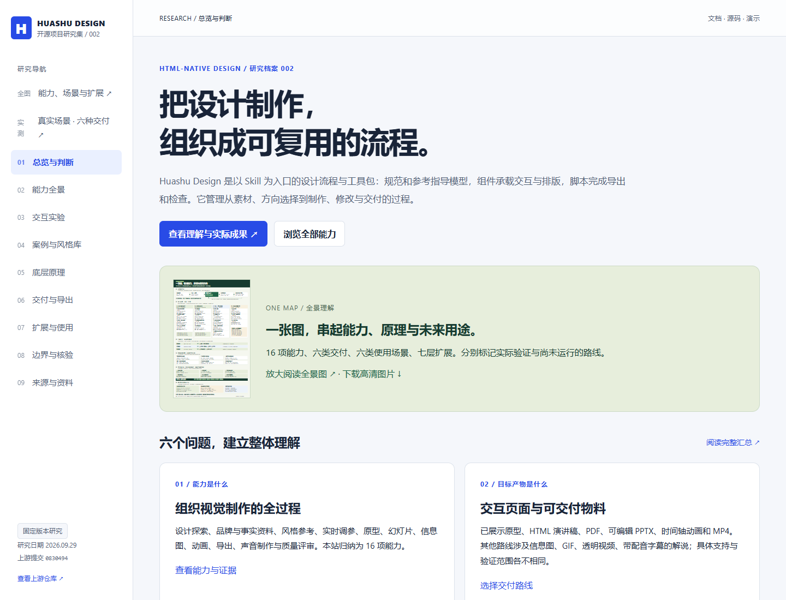
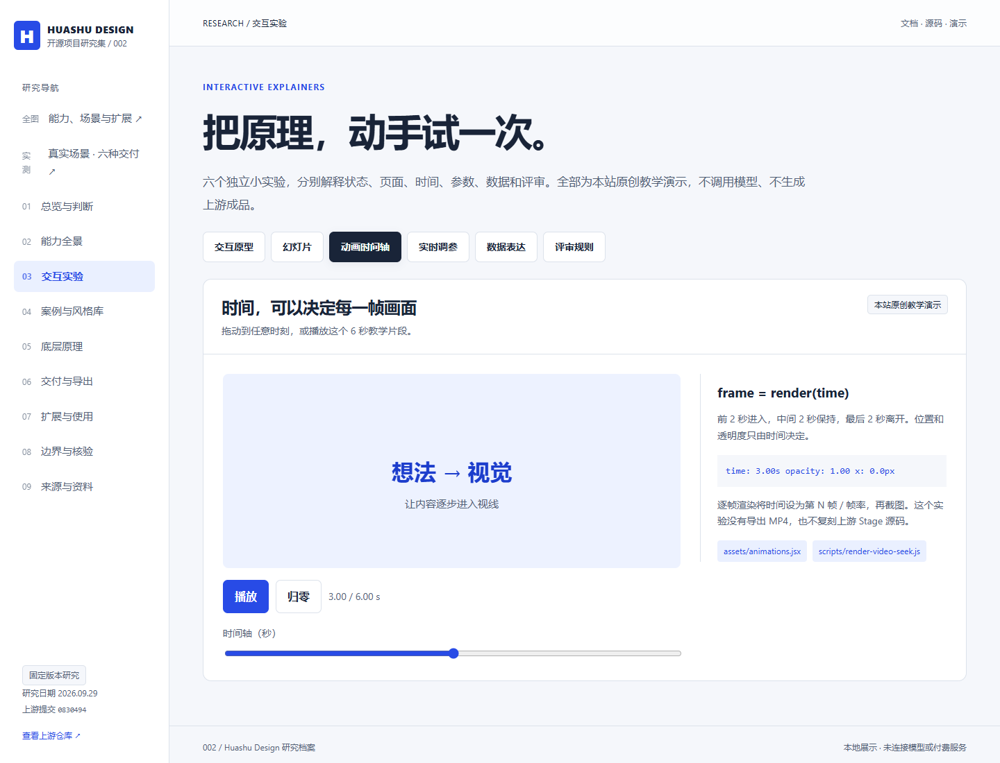
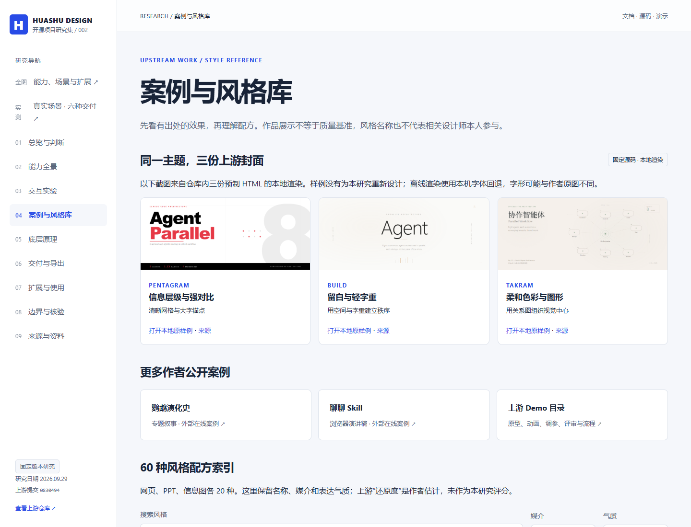

# 002 · Huashu Design · 设计能力研究

> 以 Skill 为入口的设计制作流程与工具包：模型理解并生成内容，规范与参考指导制作，组件和脚本承担展示、导出与检查。

[在线放大阅读全景图](https://yydshly.github.io/0930_codex_project/projects/002-huashu-design/capability-map.html) · [矢量 SVG](web/images/huashu-capability-map.svg) · [六类真实成果](web/cases/research-desk/index.html)

## 我们的理解汇总

| 问题 | 结论 |
| --- | --- |
| 能力是什么 | 将设计探索、品牌与事实整理、风格参考、实时调参、原型/幻灯片/信息图/动画、格式导出、声音制作和评审检查组织成流程；本研究归纳为 16 项。 |
| 目标产物是什么 | 交互网页、浏览器演讲稿、信息图、PDF、可编辑 PPTX、时间轴动画和视频；另有配音字幕、GIF、透明输出等路线。本次已有六类真实成果，其他路线未全测。 |
| 使用场景是什么 | 开源研究与选型、产品需求评审、业务汇报、课程培训、产品介绍与品牌传播，以及重复任务的模板复用。 |
| 底层原理是什么 | 宿主模型理解资料并编写 HTML/CSS/JavaScript；浏览器渲染；组件提供设备框、演讲与时间轴；脚本打印 PDF、映射 PPT 对象、逐帧渲染及编码视频。 |
| 可扩展方向是什么 | 内容任务、品牌资产、页面镜头组件、真实数据、导出与服务、验收检查六层；账户、权限、存储、队列和协作属于额外的平台工程。 |
| 对我的意义是什么 | 把研究资料做成可展示、可讨论、可修改、可归档的成果；长期积累个人规范和组件。采用价值需结合任务频率、返工及维护成本判断。 |

“Skill 控制合集”是一个接近本质的概括：它管理制作流程、内容与设计要求，同时复用实际组件和执行工具。Skill 指令由模型理解并遵守；程序行为由组件、转换脚本和检查工具执行。两种约束的强度不同，质量仍需验收。

对软件，产物通常用于验证前端流程；对汇报、归档和传播，PDF、PPT 或视频可以直接成为最终物料。它的价值主要在规范、参考、资产和制作流程的复用。

以下研究以固定版本与具体实测为依据，未证明完整 Skill 的自动生成成功率、普遍质量提升或量化效率收益。

## 研究信息

| 信息 | 内容 |
| --- | --- |
| 上游仓库 | [alchaincyf/huashu-design](https://github.com/alchaincyf/huashu-design) |
| 研究日期 | 2026-09-29 |
| 固定研究版本 | [0830494ecb1c117e25b313a8114fe55a6bf2b125](https://github.com/alchaincyf/huashu-design/commit/0830494ecb1c117e25b313a8114fe55a6bf2b125)，提交日期 2026-09-22 |
| 状态 | 已完成研究、教学展示与真实场景六类交付；其余云服务与后端未全部实测 |
| 上游许可 | [MIT](web/upstream/LICENSE) |
| 一图总览 | [放大阅读](web/capability-map.html) · [高清 PNG](web/images/huashu-capability-map.png) · [矢量 SVG](web/images/huashu-capability-map.svg) |
| 本地展示 | [能力研究室](web/index.html) |
| 真实场景 | [研选展厅](web/cases/research-desk/index.html)：可点击原型、六页幻灯片、PDF、PPTX、时间轴与 MP4 |
| 可浏览资料 | [完整研究手册](web/reference.html)，汇总十份资料并支持打印 |
| 在线部署 | [能力研究室](https://yydshly.github.io/0930_codex_project/projects/002-huashu-design/) · [六类真实成果](https://yydshly.github.io/0930_codex_project/projects/002-huashu-design/cases/research-desk/)；2026-10-01 公网 40 项检查通过 |

## 阅读入口

| 主题 | 资料 |
| --- | --- |
| 对定位、完成度、价值与采用方式的总结 | [我们的理解](notes/understanding.md) |
| 六类实际成果、操作路线、结果与兼容适配 | [真实场景实测报告](notes/real-case.md) |
| 定位、原理、效果、价值、边界 | [详细研究报告](notes/research.md) |
| 输入、产物、机制、边界、验收与来源 | [16 项能力矩阵](notes/capability-matrix.md) |
| 20 个脚本、33 份专项文档、完整目录 | [源码导航](notes/source-map.md) |
| 60 种风格、24 份预制样例 | [风格与案例目录](notes/styles-and-cases.md) |
| HTML / PDF / PPTX / 视频的选择 | [导出路线指南](notes/export-guide.md) |
| 品牌、模板、组件、数据与平台扩展 | [扩展实践指南](notes/extension-guide.md) |
| 如何表达真实任务 | [任务说明示例](notes/task-examples.md) |
| 实测范围、环境与可复现步骤 | [复现与验证记录](notes/reproduction.md) |
| 公网发布与原件一致性 | [部署检查记录](notes/deployment-checks.json) |
| 展示的运行与维护 | [Web 说明](web/README.md) |

## 核心结论

1. 这是设计工作流与工具包，没有训练新的设计模型；理解、审美与代码生成来自宿主模型。
2. HTML/CSS/JavaScript 是主要中间产物，浏览器负责渲染，脚本负责转换。
3. 对软件，它主要提供视觉和可交互原型；对幻灯片、信息图和视频，它可能直接完成最终物料。
4. 质量依赖真实内容、素材、方向选择、检查和迭代；宣传耗时、主观评分和还原度不是稳定承诺。
5. 最新实现与 README、旧测试案例存在差异，本研究单独记录这些差异。

## 展示覆盖

- 真实场景“研选”：5 页可点击原型、手机设备框、6 页 HTML/PDF/PPTX、20 秒时间轴与 MP4，83 项检查通过。
- 展厅新增理解总结、按目标选择交付形式，以及 PDF/PPT 网页阅读器；原文件内容保持不变。
- 9 个章节与 16 项能力详情，支持搜索、筛选和证据跳转。
- 6 个原创教学实验：收藏原型、三页幻灯片、时间轴、持久化调参、数据图表、评审规则。
- 3 份上游封面源码本地复现，保留原文与许可。
- 60 种风格配方、24 份预制样例与 191 个上游文件索引。
- 导出路线选择、格式对照、扩展建议、任务说明和局限。

## 图片与说明

本站原创研究展示的本地浏览器截图。

本站原创时间函数实验。真实上游 MP4 渲染成果另见研选展厅。

三个预制封面来自固定版本上游源码，离线渲染时使用本机字体回退。样例数字与宣传文字属于上游内容，不是本项目性能结论。

## 本地运行

展示无需安装前端依赖或配置密钥，可直接双击 web/index.html。为稳定访问资料和浏览器存储，建议在仓库根目录执行：

~~~powershell
python -m http.server 8766 --bind 127.0.0.1 --directory projects/002-huashu-design
~~~

访问 [本地研究室](http://127.0.0.1:8766/web/)。在对应终端按 Ctrl+C 停止服务。

## 复现与维护

~~~powershell
python projects/002-huashu-design/scripts/check_demo.py
node projects/002-huashu-design/scripts/generate-reference.cjs
python scripts/projects.py check
~~~

浏览器检查需要 Python Playwright 和 Chromium/Chrome/Edge。HUASHU_BROWSER 可指定浏览器路径。本轮 61 项检查通过，范围涵盖本地展示和三个原样例；详细记录见 [demo-checks.json](notes/demo-checks.json)。

## 来源与许可

上游链接固定到研究版本；索引包含路径、大小、Git blob SHA 和阅读范围。本目录随附三份封面、真实场景使用的少量组件/脚本和 MIT 许可，未复制整个上游仓库。场景浏览器依赖附有 React 许可。原创研究内容与教学实验遵循本仓库的许可约定；当前尚未选定统一原创许可。

本次研究没有安装该 Skill，没有将其主文档当作本次执行指令，没有调用 TTS、生成模型或付费看片服务。

---

[返回总索引](../../README.md#项目索引)
