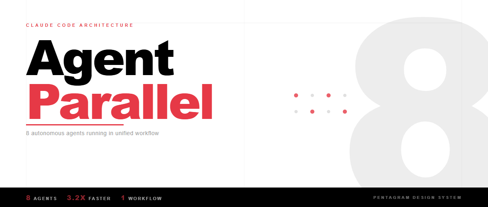
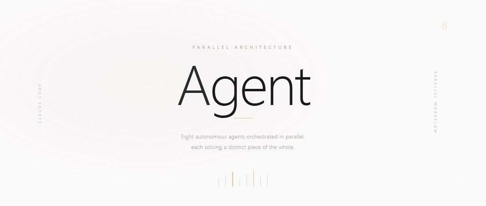
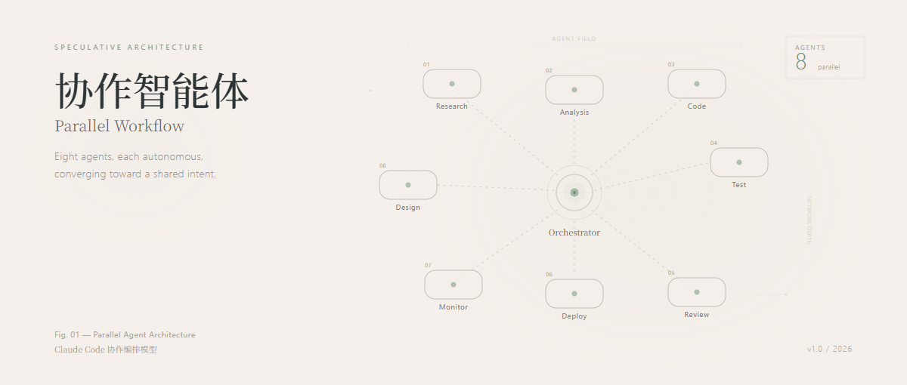

# 风格与案例目录

来源：[references/design-styles.md](https://github.com/alchaincyf/huashu-design/blob/0830494ecb1c117e25b313a8114fe55a6bf2b125/references/design-styles.md) 与 [assets/showcases/INDEX.md](https://github.com/alchaincyf/huashu-design/blob/0830494ecb1c117e25b313a8114fe55a6bf2b125/assets/showcases/INDEX.md)。这里的名称是上游参考体系，不代表相关品牌/设计师参与或背书；风格还原度百分比是作者估计，未作为本研究测评分数。

## 网页：20 种

| 序号 | 配方名称 | 气质 |
| --- | --- | --- |
| 1 | 媒体级粗野主义 Editorial Brutalism（巨号Helvetica压小正文） | 大胆 |
| 2 | 新粗野主义撞色信息流 Neo-Brutalism（粗黑描边卡片+高饱和撞色） | 大胆 |
| 3 | 孟菲斯复古拼贴最大化 Memphis Maximalism（撞色块+错位叠放+复古字体） | 大胆 |
| 4 | 糖果色凸起立体按钮游戏化 Friendly Geometric Candy | 大胆 |
| 5 | 纯CSS几何插画+响应式变形彩蛋 Pure-CSS Art | 大胆 |
| 6 | 巨型字黑白高对比时装大字报 Bold Big-Type Editorial | 大胆 |
| 7 | 复古未来太空图录 Cosmic Retro-Futurism | 大胆 |
| 8 | 电影感声波可视化 Cinematic Sound-Viz Dark | 大胆 |
| 9 | 像素游戏横版叙事 Pixel-Game Side-Scroller | 大胆 |
| 10 | 包豪斯几何标志+扁平插画系统 Bauhaus Geometric | 中性 |
| 11 | 暗色双色侧栏开发者作品集 Dark Editorial（深底+单荧光accent+等宽字） | 中性 |
| 12 | 暖色出版物 Warm Editorial（奶油纸底+赤陶橙+衬线无衬线混排） | 中性 |
| 13 | Linear暗色发光+Bento网格 Glassmorphism Bento | 中性 |
| 14 | 斜切流体渐变带 Angled Fluid Gradient | 中性 |
| 15 | 实用主义彩虹分类文档 Utility-First Colorful Docs | 中性 |
| 16 | 终端核软未来 Terminal-Core Soft-Futurism（等宽字+等距立方） | 中性 |
| 17 | 功能主义网格社区 Functional Brutalism（灰线分割+系统字+蓝链接） | 安静 |
| 18 | 深色画廊裱框 Gallery Dark（深黑负空间+单列大图+EXIF小字） | 安静 |
| 19 | Swiss极致黑白 Swiss Monochrome（Vercel式纯黑白+Geist+锐利边角） | 安静 |
| 20 | 日式留白白盒画廊 Kenya Hara White Gallery | 安静 |

## PPT：20 种

| 序号 | 配方名称 | 气质 |
| --- | --- | --- |
| 1 | 新瑞士大字报 / Neo-Swiss Billboard Editorial | 大胆 |
| 2 | 黑底巨型数字剧场 / Black Big-Number Stage | 大胆 |
| 3 | 高饱和单色品牌撞色海报 / Mono-Brand Type-as-Hero | 大胆 |
| 4 | 全幅渐变宣言版式 / Full-Bleed Gradient Manifesto | 大胆 |
| 5 | CS50单概念糖果舞台 / Candy-Color Lecture Stage | 大胆 |
| 6 | 玩味手绘极简 / Playful Maximalist Editorial (Collins式) | 大胆 |
| 7 | 不羁玩梗流行版 / Irreverent Pop (Reddit式) | 大胆 |
| 8 | Y2K膨胀大字 / Maximalist 3D-Type (Wrapped式) | 大胆 |
| 9 | Bento便当格模块网格 / Bento Grid | 中性 |
| 10 | Neo-Swiss暗色终端美学 / Dark Hairline Terminal | 中性 |
| 11 | 双字体咨询版 / Two-Font Consulting (Bower式) | 中性 |
| 12 | 图谱箭头企业版 / Diagram-Driven Isotype | 中性 |
| 13 | 单图母图概念图解 / Diagrammatic Minimalism | 中性 |
| 14 | Sparkline叙事波形 / Narrative Sparkline (Duarte式) | 中性 |
| 15 | 断言-证据 / Tufte信息设计 | 安静 |
| 16 | 瑞士机构极简 / Institutional Swiss Minimal | 安静 |
| 17 | 杂志编辑长文流 / Editorial Longform | 安静 |
| 18 | 人文圆角卡片 / Humanist Rounded Cards (Khan式) | 安静 |
| 19 | 研报密集图表 / Dense Research Report (Meeker式) | 安静 |
| 20 | 纯文字宣言备忘录 / All-Text Manifesto (Netflix/Amazon式) | 安静 |

## 信息图：20 种

| 序号 | 配方名称 | 气质 |
| --- | --- | --- |
| 1 | 个人数据印刷年报 / Personal Annual Report（Feltron式） | 大胆 |
| 2 | 解释性图解 / Explanation Graphics（Nigel Holmes式） | 大胆 |
| 3 | 巨幅剖面手绘 / Cross-Section Epic（SCMP Arranz式） | 大胆 |
| 4 | 杂志撞色数据页 / Magazine Pop Data（Businessweek式） | 大胆 |
| 5 | ISOTYPE图形统计 / Neurath–Arntz | 大胆 |
| 6 | 数据人文主义手绘图谱 / Data Humanism（Lupi式） | 大胆 |
| 7 | 滚动叙事数据长卷 / Scrollytelling（The Pudding式） | 大胆 |
| 8 | 地图即主角 / Cartographic Lead（Stamen式） | 大胆 |
| 9 | 数据新闻图表规范 / Newsroom Chart System（FT式） | 中性 |
| 10 | 计算式数据肖像 / Computational Portrait（Fathom式） | 中性 |
| 11 | 美丽信息 / Beautiful Information（McCandless式） | 中性 |
| 12 | 学术开放数据 / Open Research Data（Our World in Data式） | 中性 |
| 13 | 东方思辨科技图 / Speculative Tech Diagram（Takram式） | 中性 |
| 14 | 系统图标化图解 / Pictogram System（Otl Aicher式） | 中性 |
| 15 | Tufte小倍数矩阵 / Small Multiples | 安静 |
| 16 | 拓扑简化路网图 / Topological Transit Map（Beck/Vignelli式） | 安静 |
| 17 | 白之留白信息图 / Ma & Emptiness（原研哉式） | 安静 |
| 18 | 书籍级信息排印 / Bookcraft Data（Irma Boom式） | 安静 |
| 19 | 科学期刊图版 / Scientific Figure Plate | 安静 |
| 20 | 瑞士网格年报 / Swiss Grid Report（Müller-Brockmann式） | 安静 |

## 24 份上游预制样例

8 个场景 × 3 种风格，每个都有 HTML 与 PNG。本项目只随附三份封面用于本地复现，其余提供固定版本链接。样例数字是样例内容，不是本研究核验过的事实或性能结果。

| HTML | 作者截图 |
| --- | --- |
| [assets/showcases/cover/cover-build.html](https://github.com/alchaincyf/huashu-design/blob/0830494ecb1c117e25b313a8114fe55a6bf2b125/assets/showcases/cover/cover-build.html) | [assets/showcases/cover/cover-build.png](https://github.com/alchaincyf/huashu-design/blob/0830494ecb1c117e25b313a8114fe55a6bf2b125/assets/showcases/cover/cover-build.png) |
| [assets/showcases/cover/cover-pentagram.html](https://github.com/alchaincyf/huashu-design/blob/0830494ecb1c117e25b313a8114fe55a6bf2b125/assets/showcases/cover/cover-pentagram.html) | [assets/showcases/cover/cover-pentagram.png](https://github.com/alchaincyf/huashu-design/blob/0830494ecb1c117e25b313a8114fe55a6bf2b125/assets/showcases/cover/cover-pentagram.png) |
| [assets/showcases/cover/cover-takram.html](https://github.com/alchaincyf/huashu-design/blob/0830494ecb1c117e25b313a8114fe55a6bf2b125/assets/showcases/cover/cover-takram.html) | [assets/showcases/cover/cover-takram.png](https://github.com/alchaincyf/huashu-design/blob/0830494ecb1c117e25b313a8114fe55a6bf2b125/assets/showcases/cover/cover-takram.png) |
| [assets/showcases/infographic/infographic-build.html](https://github.com/alchaincyf/huashu-design/blob/0830494ecb1c117e25b313a8114fe55a6bf2b125/assets/showcases/infographic/infographic-build.html) | [assets/showcases/infographic/infographic-build.png](https://github.com/alchaincyf/huashu-design/blob/0830494ecb1c117e25b313a8114fe55a6bf2b125/assets/showcases/infographic/infographic-build.png) |
| [assets/showcases/infographic/infographic-pentagram.html](https://github.com/alchaincyf/huashu-design/blob/0830494ecb1c117e25b313a8114fe55a6bf2b125/assets/showcases/infographic/infographic-pentagram.html) | [assets/showcases/infographic/infographic-pentagram.png](https://github.com/alchaincyf/huashu-design/blob/0830494ecb1c117e25b313a8114fe55a6bf2b125/assets/showcases/infographic/infographic-pentagram.png) |
| [assets/showcases/infographic/infographic-takram.html](https://github.com/alchaincyf/huashu-design/blob/0830494ecb1c117e25b313a8114fe55a6bf2b125/assets/showcases/infographic/infographic-takram.html) | [assets/showcases/infographic/infographic-takram.png](https://github.com/alchaincyf/huashu-design/blob/0830494ecb1c117e25b313a8114fe55a6bf2b125/assets/showcases/infographic/infographic-takram.png) |
| [assets/showcases/ppt/ppt-build.html](https://github.com/alchaincyf/huashu-design/blob/0830494ecb1c117e25b313a8114fe55a6bf2b125/assets/showcases/ppt/ppt-build.html) | [assets/showcases/ppt/ppt-build.png](https://github.com/alchaincyf/huashu-design/blob/0830494ecb1c117e25b313a8114fe55a6bf2b125/assets/showcases/ppt/ppt-build.png) |
| [assets/showcases/ppt/ppt-pentagram.html](https://github.com/alchaincyf/huashu-design/blob/0830494ecb1c117e25b313a8114fe55a6bf2b125/assets/showcases/ppt/ppt-pentagram.html) | [assets/showcases/ppt/ppt-pentagram.png](https://github.com/alchaincyf/huashu-design/blob/0830494ecb1c117e25b313a8114fe55a6bf2b125/assets/showcases/ppt/ppt-pentagram.png) |
| [assets/showcases/ppt/ppt-takram.html](https://github.com/alchaincyf/huashu-design/blob/0830494ecb1c117e25b313a8114fe55a6bf2b125/assets/showcases/ppt/ppt-takram.html) | [assets/showcases/ppt/ppt-takram.png](https://github.com/alchaincyf/huashu-design/blob/0830494ecb1c117e25b313a8114fe55a6bf2b125/assets/showcases/ppt/ppt-takram.png) |
| [assets/showcases/website-ai-nav/ainav-build.html](https://github.com/alchaincyf/huashu-design/blob/0830494ecb1c117e25b313a8114fe55a6bf2b125/assets/showcases/website-ai-nav/ainav-build.html) | [assets/showcases/website-ai-nav/ainav-build.png](https://github.com/alchaincyf/huashu-design/blob/0830494ecb1c117e25b313a8114fe55a6bf2b125/assets/showcases/website-ai-nav/ainav-build.png) |
| [assets/showcases/website-ai-nav/ainav-pentagram.html](https://github.com/alchaincyf/huashu-design/blob/0830494ecb1c117e25b313a8114fe55a6bf2b125/assets/showcases/website-ai-nav/ainav-pentagram.html) | [assets/showcases/website-ai-nav/ainav-pentagram.png](https://github.com/alchaincyf/huashu-design/blob/0830494ecb1c117e25b313a8114fe55a6bf2b125/assets/showcases/website-ai-nav/ainav-pentagram.png) |
| [assets/showcases/website-ai-nav/ainav-takram.html](https://github.com/alchaincyf/huashu-design/blob/0830494ecb1c117e25b313a8114fe55a6bf2b125/assets/showcases/website-ai-nav/ainav-takram.html) | [assets/showcases/website-ai-nav/ainav-takram.png](https://github.com/alchaincyf/huashu-design/blob/0830494ecb1c117e25b313a8114fe55a6bf2b125/assets/showcases/website-ai-nav/ainav-takram.png) |
| [assets/showcases/website-ai-writing/aiwriting-build.html](https://github.com/alchaincyf/huashu-design/blob/0830494ecb1c117e25b313a8114fe55a6bf2b125/assets/showcases/website-ai-writing/aiwriting-build.html) | [assets/showcases/website-ai-writing/aiwriting-build.png](https://github.com/alchaincyf/huashu-design/blob/0830494ecb1c117e25b313a8114fe55a6bf2b125/assets/showcases/website-ai-writing/aiwriting-build.png) |
| [assets/showcases/website-ai-writing/aiwriting-pentagram.html](https://github.com/alchaincyf/huashu-design/blob/0830494ecb1c117e25b313a8114fe55a6bf2b125/assets/showcases/website-ai-writing/aiwriting-pentagram.html) | [assets/showcases/website-ai-writing/aiwriting-pentagram.png](https://github.com/alchaincyf/huashu-design/blob/0830494ecb1c117e25b313a8114fe55a6bf2b125/assets/showcases/website-ai-writing/aiwriting-pentagram.png) |
| [assets/showcases/website-ai-writing/aiwriting-takram.html](https://github.com/alchaincyf/huashu-design/blob/0830494ecb1c117e25b313a8114fe55a6bf2b125/assets/showcases/website-ai-writing/aiwriting-takram.html) | [assets/showcases/website-ai-writing/aiwriting-takram.png](https://github.com/alchaincyf/huashu-design/blob/0830494ecb1c117e25b313a8114fe55a6bf2b125/assets/showcases/website-ai-writing/aiwriting-takram.png) |
| [assets/showcases/website-devdocs/devdocs-build.html](https://github.com/alchaincyf/huashu-design/blob/0830494ecb1c117e25b313a8114fe55a6bf2b125/assets/showcases/website-devdocs/devdocs-build.html) | [assets/showcases/website-devdocs/devdocs-build.png](https://github.com/alchaincyf/huashu-design/blob/0830494ecb1c117e25b313a8114fe55a6bf2b125/assets/showcases/website-devdocs/devdocs-build.png) |
| [assets/showcases/website-devdocs/devdocs-pentagram.html](https://github.com/alchaincyf/huashu-design/blob/0830494ecb1c117e25b313a8114fe55a6bf2b125/assets/showcases/website-devdocs/devdocs-pentagram.html) | [assets/showcases/website-devdocs/devdocs-pentagram.png](https://github.com/alchaincyf/huashu-design/blob/0830494ecb1c117e25b313a8114fe55a6bf2b125/assets/showcases/website-devdocs/devdocs-pentagram.png) |
| [assets/showcases/website-devdocs/devdocs-takram.html](https://github.com/alchaincyf/huashu-design/blob/0830494ecb1c117e25b313a8114fe55a6bf2b125/assets/showcases/website-devdocs/devdocs-takram.html) | [assets/showcases/website-devdocs/devdocs-takram.png](https://github.com/alchaincyf/huashu-design/blob/0830494ecb1c117e25b313a8114fe55a6bf2b125/assets/showcases/website-devdocs/devdocs-takram.png) |
| [assets/showcases/website-homepage/homepage-build.html](https://github.com/alchaincyf/huashu-design/blob/0830494ecb1c117e25b313a8114fe55a6bf2b125/assets/showcases/website-homepage/homepage-build.html) | [assets/showcases/website-homepage/homepage-build.png](https://github.com/alchaincyf/huashu-design/blob/0830494ecb1c117e25b313a8114fe55a6bf2b125/assets/showcases/website-homepage/homepage-build.png) |
| [assets/showcases/website-homepage/homepage-pentagram.html](https://github.com/alchaincyf/huashu-design/blob/0830494ecb1c117e25b313a8114fe55a6bf2b125/assets/showcases/website-homepage/homepage-pentagram.html) | [assets/showcases/website-homepage/homepage-pentagram.png](https://github.com/alchaincyf/huashu-design/blob/0830494ecb1c117e25b313a8114fe55a6bf2b125/assets/showcases/website-homepage/homepage-pentagram.png) |
| [assets/showcases/website-homepage/homepage-takram.html](https://github.com/alchaincyf/huashu-design/blob/0830494ecb1c117e25b313a8114fe55a6bf2b125/assets/showcases/website-homepage/homepage-takram.html) | [assets/showcases/website-homepage/homepage-takram.png](https://github.com/alchaincyf/huashu-design/blob/0830494ecb1c117e25b313a8114fe55a6bf2b125/assets/showcases/website-homepage/homepage-takram.png) |
| [assets/showcases/website-saas/saas-build.html](https://github.com/alchaincyf/huashu-design/blob/0830494ecb1c117e25b313a8114fe55a6bf2b125/assets/showcases/website-saas/saas-build.html) | [assets/showcases/website-saas/saas-build.png](https://github.com/alchaincyf/huashu-design/blob/0830494ecb1c117e25b313a8114fe55a6bf2b125/assets/showcases/website-saas/saas-build.png) |
| [assets/showcases/website-saas/saas-pentagram.html](https://github.com/alchaincyf/huashu-design/blob/0830494ecb1c117e25b313a8114fe55a6bf2b125/assets/showcases/website-saas/saas-pentagram.html) | [assets/showcases/website-saas/saas-pentagram.png](https://github.com/alchaincyf/huashu-design/blob/0830494ecb1c117e25b313a8114fe55a6bf2b125/assets/showcases/website-saas/saas-pentagram.png) |
| [assets/showcases/website-saas/saas-takram.html](https://github.com/alchaincyf/huashu-design/blob/0830494ecb1c117e25b313a8114fe55a6bf2b125/assets/showcases/website-saas/saas-takram.html) | [assets/showcases/website-saas/saas-takram.png](https://github.com/alchaincyf/huashu-design/blob/0830494ecb1c117e25b313a8114fe55a6bf2b125/assets/showcases/website-saas/saas-takram.png) |

## 上游 Demo

能力演示和流程演示以 c*/w* 文件组织，另有解说动画；中英文版本不要重复计算为独立能力。

- [demos/c1-ios-prototype-en.html](https://github.com/alchaincyf/huashu-design/blob/0830494ecb1c117e25b313a8114fe55a6bf2b125/demos/c1-ios-prototype-en.html)
- [demos/c1-ios-prototype.html](https://github.com/alchaincyf/huashu-design/blob/0830494ecb1c117e25b313a8114fe55a6bf2b125/demos/c1-ios-prototype.html)
- [demos/c2-slides-pptx-en.html](https://github.com/alchaincyf/huashu-design/blob/0830494ecb1c117e25b313a8114fe55a6bf2b125/demos/c2-slides-pptx-en.html)
- [demos/c2-slides-pptx.html](https://github.com/alchaincyf/huashu-design/blob/0830494ecb1c117e25b313a8114fe55a6bf2b125/demos/c2-slides-pptx.html)
- [demos/c3-motion-design-en.html](https://github.com/alchaincyf/huashu-design/blob/0830494ecb1c117e25b313a8114fe55a6bf2b125/demos/c3-motion-design-en.html)
- [demos/c3-motion-design.html](https://github.com/alchaincyf/huashu-design/blob/0830494ecb1c117e25b313a8114fe55a6bf2b125/demos/c3-motion-design.html)
- [demos/c4-tweaks-en.html](https://github.com/alchaincyf/huashu-design/blob/0830494ecb1c117e25b313a8114fe55a6bf2b125/demos/c4-tweaks-en.html)
- [demos/c4-tweaks.html](https://github.com/alchaincyf/huashu-design/blob/0830494ecb1c117e25b313a8114fe55a6bf2b125/demos/c4-tweaks.html)
- [demos/c5-infographic-en.html](https://github.com/alchaincyf/huashu-design/blob/0830494ecb1c117e25b313a8114fe55a6bf2b125/demos/c5-infographic-en.html)
- [demos/c5-infographic.html](https://github.com/alchaincyf/huashu-design/blob/0830494ecb1c117e25b313a8114fe55a6bf2b125/demos/c5-infographic.html)
- [demos/c6-expert-review-en.html](https://github.com/alchaincyf/huashu-design/blob/0830494ecb1c117e25b313a8114fe55a6bf2b125/demos/c6-expert-review-en.html)
- [demos/c6-expert-review.html](https://github.com/alchaincyf/huashu-design/blob/0830494ecb1c117e25b313a8114fe55a6bf2b125/demos/c6-expert-review.html)
- [demos/hero-animation-v10-en.html](https://github.com/alchaincyf/huashu-design/blob/0830494ecb1c117e25b313a8114fe55a6bf2b125/demos/hero-animation-v10-en.html)
- [demos/md-html-narration/md-html-demo.html](https://github.com/alchaincyf/huashu-design/blob/0830494ecb1c117e25b313a8114fe55a6bf2b125/demos/md-html-narration/md-html-demo.html)
- [demos/voiceover-demo/什么是token.html](https://github.com/alchaincyf/huashu-design/blob/0830494ecb1c117e25b313a8114fe55a6bf2b125/demos/voiceover-demo/什么是token.html)
- [demos/w1-brand-protocol-en.html](https://github.com/alchaincyf/huashu-design/blob/0830494ecb1c117e25b313a8114fe55a6bf2b125/demos/w1-brand-protocol-en.html)
- [demos/w1-brand-protocol.html](https://github.com/alchaincyf/huashu-design/blob/0830494ecb1c117e25b313a8114fe55a6bf2b125/demos/w1-brand-protocol.html)
- [demos/w2-junior-designer-en.html](https://github.com/alchaincyf/huashu-design/blob/0830494ecb1c117e25b313a8114fe55a6bf2b125/demos/w2-junior-designer-en.html)
- [demos/w2-junior-designer.html](https://github.com/alchaincyf/huashu-design/blob/0830494ecb1c117e25b313a8114fe55a6bf2b125/demos/w2-junior-designer.html)
- [demos/w3-fallback-advisor-en.html](https://github.com/alchaincyf/huashu-design/blob/0830494ecb1c117e25b313a8114fe55a6bf2b125/demos/w3-fallback-advisor-en.html)
- [demos/w3-fallback-advisor.html](https://github.com/alchaincyf/huashu-design/blob/0830494ecb1c117e25b313a8114fe55a6bf2b125/demos/w3-fallback-advisor.html)

## 本轮复现

原文源码随附于 web/upstream；远程字体被阻止，使用本机回退。截图不证明完整 Skill 的生成质量。

[返回研究入口](../README.md)

