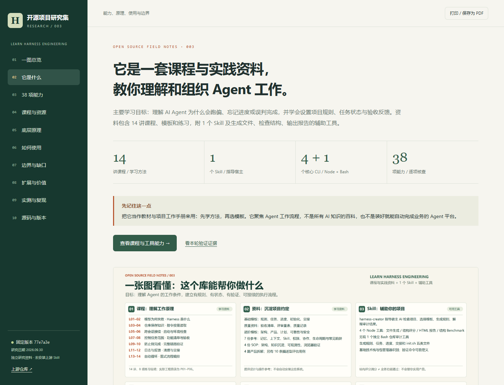

# 003 · Learn Harness Engineering · AI 工作流程研究

> 这是一套学习 AI Agent 工作流程的课程与实践资料，帮助你理解 Agent，并学会用规则、任务清单、进度和验收证据组织它的工作。包含 14 讲课程与 8 项练习说明，附 1 个 Skill、4 个 Node 辅助工具、1 个独立 Bash 审计工具和教学应用。最适合持续开发、跨会话任务和减少返工；可扩展领域模板、真实验证与自动化，但不独立提供模型或自动调度平台。

| 信息 | 内容 |
| --- | --- |
| 上游仓库 | [walkinglabs/learn-harness-engineering](https://github.com/walkinglabs/learn-harness-engineering) |
| 研究日期 | 2026-09-30 |
| 固定研究版本 | [77e7a3e21469dcbece2558086c8d91657abeaa40](https://github.com/walkinglabs/learn-harness-engineering/commit/77e7a3e21469dcbece2558086c8d91657abeaa40) |
| 上游提交时间 | 2026-08-26 01:08:58 UTC |
| 上游许可 | [MIT，Copyright (c) 2025 WalkingLab](https://github.com/walkinglabs/learn-harness-engineering/blob/77e7a3e21469dcbece2558086c8d91657abeaa40/LICENSE) |
| 研究状态 | 本轮能力全量分类、源码核查及限定范围实测已完成 |
| 阅读网页 | [本地能力手册](web/index.html)，支持能力搜索、筛选、课程导航、阅读全部笔记和打印 |
| 在线部署 | 已接入研究集 GitHub Pages 发布流程；本次部署验证完成后登记公开入口 |
| 核查边界 | 2,478 个文件完整索引与哈希校验；按独立功能研究，未逐句审校全部翻译 |

## 我们的理解

主体是有结构的课程和资料，主要用途是学习与借鉴；配套 Skill 和脚本把部分方法变成文件生成与结构检查工具。38 项能力是本研究的内容与功能分类，不是 38 个自动执行的 AI 技能。

- **学什么**：Agent 工作条件、上下文与规则、任务拆解、真实验收、进度交接，以及自动循环和协作思路。
- **何时用**：学习 Agent 工作原理，启动长期项目，或解决反复解释背景、进度丢失、假完成和返工问题。
- **对我有什么用**：为当前研究集统一来源、版本、能力、证据、边界和交付检查，换会话也能继续。
- **如何扩展**：先做领域模板和真实测试，再接准确状态、中断恢复、自动循环与多 Agent。扩展不是仓库现成能力。

## 先看一张图

先看 [能力全景图](assets/harness-capability-map.png)，把课程、Skill、工具、Agent 工作流程、构建目标与使用场景放在一起理解。

[查看原尺寸图片](assets/harness-capability-map.png) · [网页一图总览](web/index.html#map) · [图中六个板块与 38 项能力的对应关系](notes/capability-map.md)

## 再用一个例子理解

假设你让 AI 给网站增加登录功能。这个仓库提供的工具可以帮项目建立：

1. 工作规则：先检查环境，一次只处理一个明确任务。
2. 任务清单：登录页、接口、错误提示分别做到哪一步。
3. 进度与交接：今天改了什么，明天从哪里继续。
4. 检查入口：调用你项目已有的测试与构建命令。
5. 结构报告：告诉你上述文件和规则是否齐全。

生成登录代码仍需要你的编程 Agent；判断登录是否真的可用，需要实际验收。**复制模板、安装 Skill、结构评分满分，都不等于完成产品开发。**

## 按问题阅读

| 你想知道什么 | 入口 |
| --- | --- |
| 到底是课程、资料还是 Skill？对我有什么用？ | [定位、能力与采用判断](notes/research.md) |
| 每项具体能做什么、输入什么、得到什么？ | [38 项能力矩阵](notes/capability-matrix.md) |
| 14 讲、8 项练习、模板和参考文档分别教什么？ | [课程与资源地图](notes/course-map.md) |
| 生成器、评分器、验证和状态的底层原理 | [架构与机制](notes/architecture.md) |
| 如何使用，Windows 能不能运行？ | [使用与平台指南](notes/usage-guide.md) |
| 哪些宣传/文档与实际实现有差异？ | [能力边界与缺口](notes/limitations.md) |
| 如何扩展、先做什么、如何衡量收益？ | [扩展与落地建议](notes/extension-guide.md) |
| 本轮实际运行过哪些内容？ | [复现与验证记录](notes/reproduction.md) |
| 全部目录、脚本、源码和固定版本证据 | [源码导航](notes/source-map.md) · [机器可读全量文件清单](notes/upstream-inventory.json) |

## 最重要的核查结果

- **课程与软件分开看**：实际包含 14 讲、8 项项目说明；独立工程目录只有 P01–P06，P07/P08 没有相应 starter/solution 工程。
- **可直接用的核心**：最小工作文件生成、结构审计、HTML 报告、结构 benchmark。
- **满分的含义有限**：本轮生成的空业务样例结构评分为 100，但它没有实际测试文件；评分器没有运行测试。
- **知识库问答为教学模拟**：P06 使用关键词匹配、预设答案和固定置信度，不含真实模型调用。
- **自动循环和多 Agent 需要另行接入**：课程提供流程与提示模板，图示例中模型、测试、合并均未完成生产实现。
- **检查脚本也需要检查**：数据扫描器可能报告缺失文件后仍汇总 CLEAN；架构检查可在源码目录缺失时通过。详见复现记录。

## 本地阅读与复现

直接打开 [web/index.html](web/index.html) 即可阅读，页面无外部运行依赖。也可在研究集根目录启动：

~~~powershell
python -m http.server 8767 --bind 127.0.0.1 --directory projects/003-learn-harness-engineering/web
~~~

访问 [本地能力手册](http://127.0.0.1:8767/)。页面属于本研究整理的资料，不是上游 Agent 产品的运行界面。

维护命令与环境说明见 [复现记录](notes/reproduction.md)。原始上游源码仅放在被 Git 忽略的 `.cache/`，本子项目保留索引、研究文档、验证记录和原创阅读页；未安装上游 Skill，未更改当前项目的 Agent 工作规则。

## 图片

上图是本研究阅读页截图，不是上游应用截图，也不代表真实 AI 任务成功率。

## 来源与许可

上游事实链接固定到研究提交；所有工具行为与限制标明“实测”“源码核对”或“建议”。四篇外部产品拆解仅作为仓库包含的资料登记，不视为那些产品的当前官方说明。上游 MIT 许可不自动决定本研究原创内容的许可；本研究集尚未指定统一原创许可。

[返回研究集](../../README.md#项目索引)
