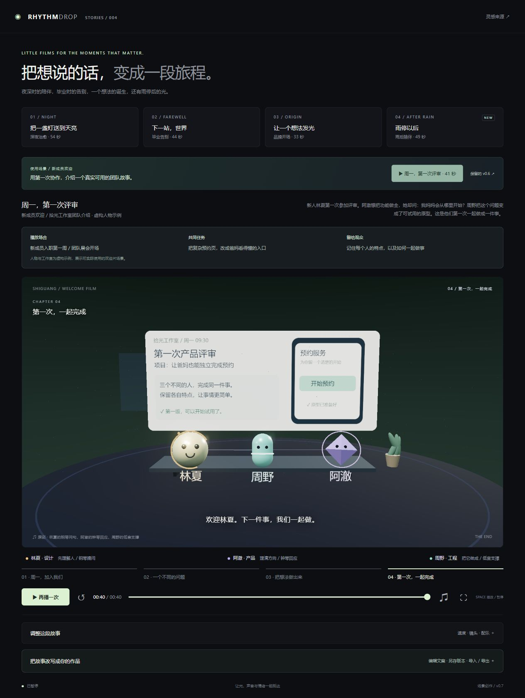
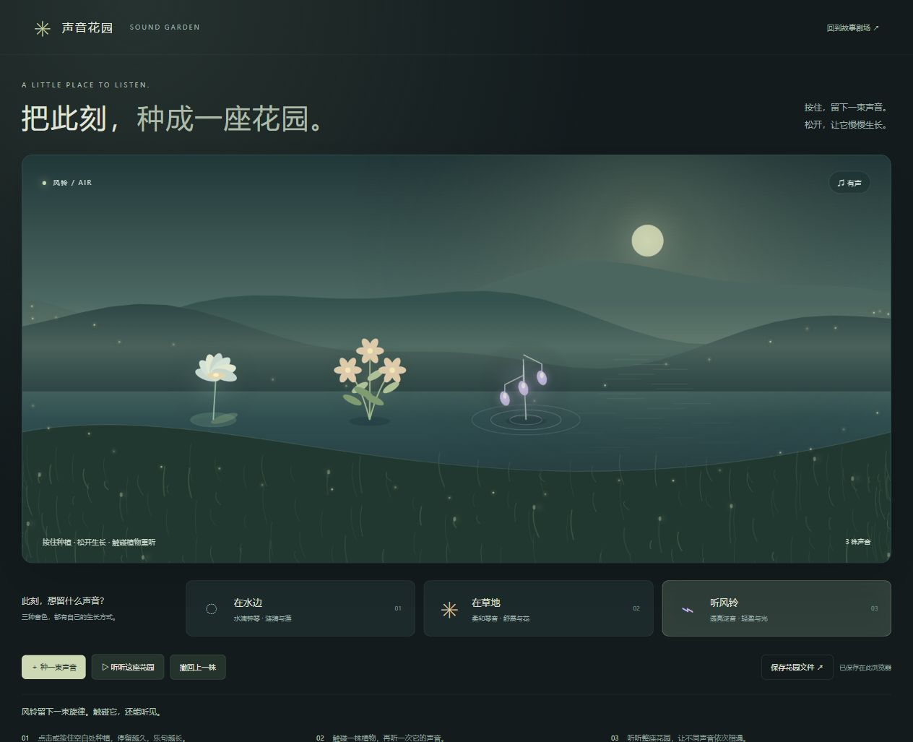
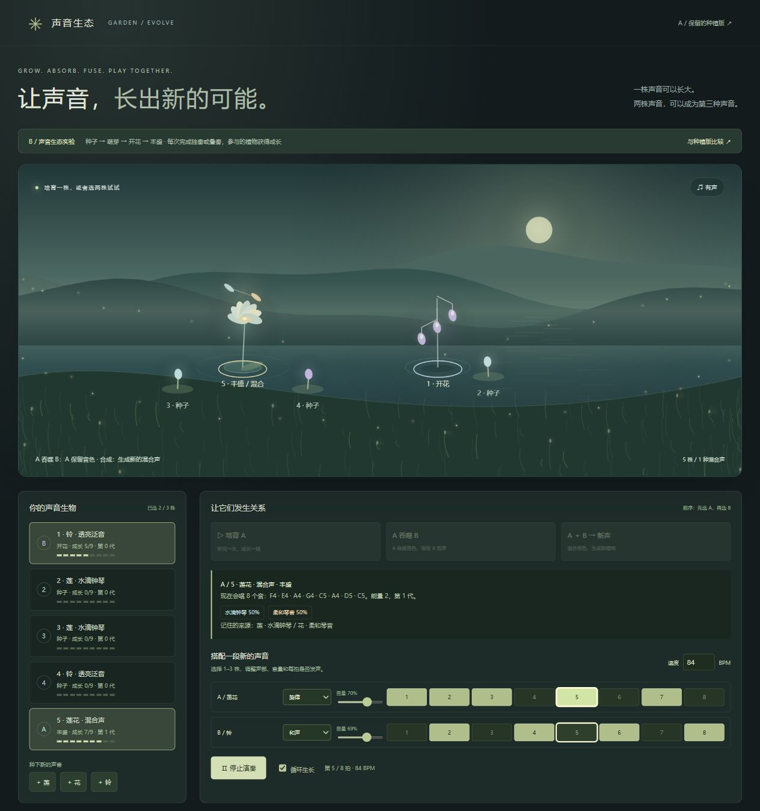
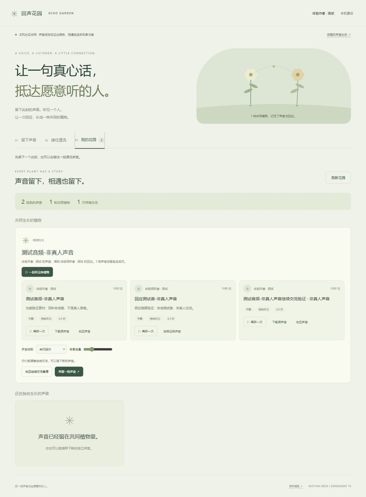
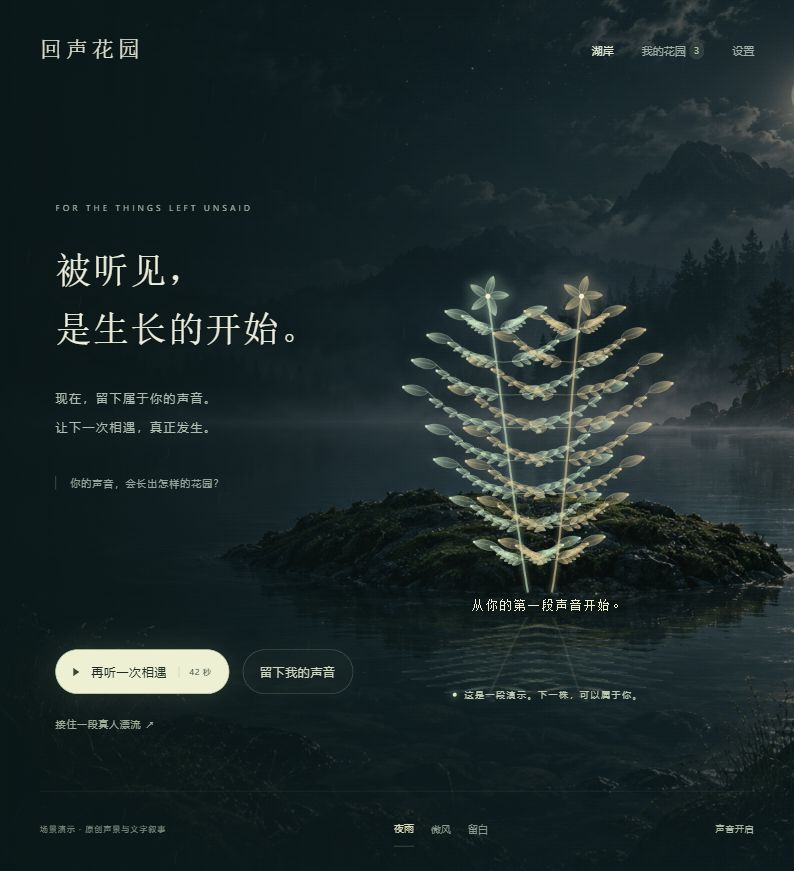
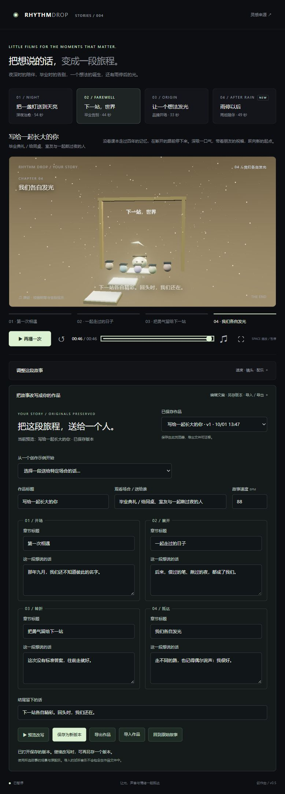
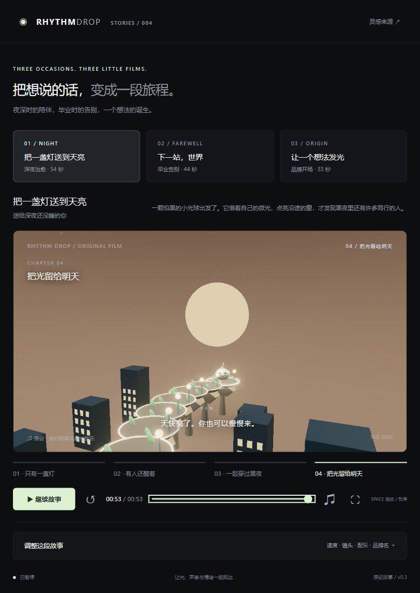
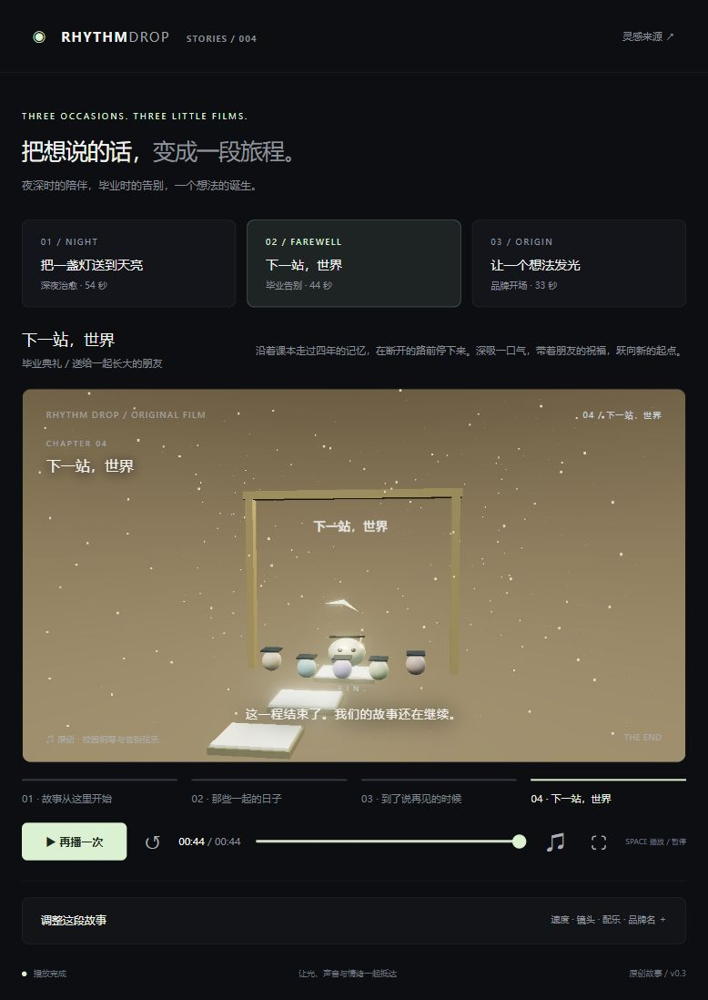
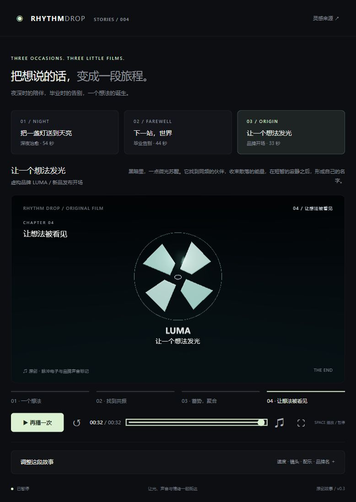
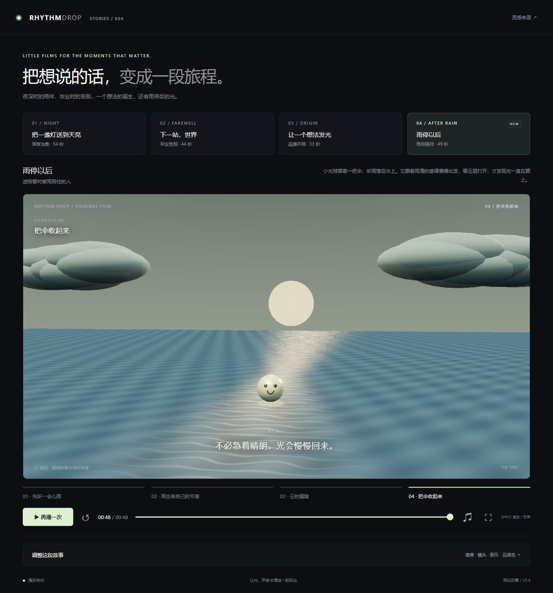

# 004 · Rhythm Drop · 音乐型声音与视听体验研究

[公开研究摘要与实验演示](https://yydshly.github.io/0930_codex_project/projects/004-rhythm-drop/) · [线上验证记录](notes/deployment-checks.json)

**初始目标是研究音乐型声音**：音乐如何驱动视觉节奏、角色动作与空间变化，怎样进一步与具体场合、故事和交互结合。来源是 [Gorden Sun 在 X 的音乐动画效果展示](https://x.com/Gorden_Sun/status/2105302007896797351)，其中的 3D 弹跳、随音乐发光与场景变化构成最早的研究引导。参考帖的工具说明是作者自述；本项目没有检查其源码，也不据此评价模型能力。


上图为原网页视频效果的截图，权利归原作者，用于说明研究来源；**不是我们实现的效果**。原帖上下文保留在 [来源截图](assets/source-post-context.jpg)。我们的场景、故事、轨迹和合成配乐独立编写。Three.js 是技术基础，与效果来源分别标注。

## 研究摘要

研究从音乐同步弹跳出发，经过具体场合的故事片、声音身份与团队协作，扩展到声音种植、成长、吞噬、合成和多声部创造，最后探索将真实录音与人关联的漂流与回应。完整取舍见 [研究沿革](notes/research-map.md)。

- **声音主导，设计配合**：先建立音乐动机、音色、强弱、密度、停顿与发展；视觉的动作、光、镜头和环境承接这些事件。
- **故事有观看对象与场合**：送给谁、何时看、希望留下什么情绪，决定配乐、场景与结尾。字幕不能替代实际发生的故事。
- **球形不代表通用性格**：它是可塑的基础形态。稳定的声音特点、外形细节、行为习惯与回应方式，才让角色有记忆点。
- **种植只是开始**：成长、吞噬、合成要改变实际可听见的乐句与音色；多声部搭配可能让花园成为创作工具。
- **真实声音与人是价值假设**：表达被听见、得到回应、留下共同记忆，可能比单纯种植更有意义；仍需真实参与者证明。
- **功能闭环不等于情绪体验**：用户多轮反馈仍认为缺少故事感、效果差。本机社区流程可运行，但音乐感染力、人物可信度和持续使用价值尚未成立。

当前定位为**研究归档与原型合集，v0.1–v0.11**。公开页提供研究摘要和静态视听演示；真实录音社区保留为本机服务，不把它写成已经上线的真人社区。没有心理治疗、人格判断或用户价值验证结论。

静态入口为 `web/index.html`；原故事剧场完整保留为 `web/stories.html`，原 `?story=…` / `?work=…` 入口会跳转并保留参数。公开回声花园可听 42 秒原创音乐与文字故事，不请求社区 API 或展示无法使用的真人投放入口。

## 演示与研究路径

## 四个独立演示

| 场合 | 故事 | 音乐发展 | 关键画面 | 本地入口 |
| --- | --- | --- | --- | --- |
| 深夜陪伴 | 把一盏灯送到天亮 | 76 BPM；稀疏钢琴动机 → 和声回应 → 弦乐增强 → 安静落地 | 路灯和窗户逐步点亮，微光连成路，终章太阳升起 | [深夜治愈](http://127.0.0.1:8940/?story=night) |
| 毕业典礼 / 告别朋友 | 下一站，世界 | 92 BPM；校园钢琴 → 暖色回忆 → 跨越前留白 → 告别弦乐与终止和弦 | 课本轨道、毕业帽、纸飞机、断路跨越、毕业门与纸屑 | [毕业告别](http://127.0.0.1:8940/?story=graduation) |
| 新品发布开场 | 让一个想法发光 | 124 BPM；单音火花 → 脉冲 → 密集聚合 → 品牌声音标记 | 光点逐渐汇聚、主角融入标识、品牌文字出现 | [品牌开场](http://127.0.0.1:8940/?story=brand) |
| 雨后陪伴 | 雨停以后 | 84 BPM；稀疏雨滴钟琴 → 钟琴与和声 → 四拍留白 → 雨后钢琴 | 雨中撑伞、落音涟漪、云层打开、水面晨光、收伞 | [雨停以后](http://127.0.0.1:8940/?story=rain) |

品牌片使用虚构名称 LUMA，可以在面板中改名。四段故事各为 68 拍，原始速度下约 54、44、33、49 秒；末尾 4 拍留给结尾画面与和弦衰减。

## 品牌片 A/B 实验

当前品牌片保留为 A，新增独立的 B「先听见自己」。在品牌片下方选择版本，或直接打开 [实验 B](http://127.0.0.1:8940/?story=identity)。B 使用新的 96 BPM 原创编曲：微光的钢琴动机、回声在留白处的钟琴回应、稳稳的低音支撑，各自保持外形与声音特点，最终组成新的星座。

[完整保留的 v0.5 页面](http://127.0.0.1:8940/versions/v0.5/?story=brand)已经独立保存，与改动前文件逐字节一致。新版仍可改写和保存作品；旧页使用原档案，新页读取旧记录后写入独立档案。详见 [实验分镜与比较方法](notes/identity-experiment.md)。


## 具体使用场景：新成员欢迎

v0.7 新增 [周一，第一次评审](http://127.0.0.1:8940/?story=team)，约 41 秒。新人林夏想到妈妈如何使用预约页，产品同事阿澈接住建议，工程师周野把想法做成原型。会议白板和手机草图从三个入口简化为一个按钮；钢琴提问、钟琴回应、低音支撑对应实际协作，结尾欢迎新人一起完成下一件事。

人物与工作室均为虚构示例，用于展示可实际使用的晨会欢迎片场景。对白为字幕，没有人声配音。角色姓名、白板与音乐暂为固定素材，创作台支持标题、四章文案、速度、结尾改写与 JSON 作品保存；尚无视频导出。详见 [场景分镜与产品试验](notes/team-scene.md)。

[完整 v0.6](http://127.0.0.1:8940/versions/v0.6/?story=identity)独立保留，旧页面文件逐字节校验。新版保存档案使用 v3，读取已有 v2/v1，不修改旧档案。



## 声音与视觉共创：声音花园

v0.8 新增 [声音花园](http://127.0.0.1:8940/garden/)，作为独立体验。按住留下声音，松开长成植物；水滴钟琴、柔和琴音、风铃泛音对应不同形态。触碰植物重听，整座花园可依次合奏。支持本机保存、撤回与恢复、追加花园档案、JSON 导入与导出；当前没有音频或视频导出。详见 [体验说明与边界](notes/sound-garden.md)。

完整 v0.7 故事页保留在 [旧版入口](http://127.0.0.1:8940/versions/v0.7/?story=team)，当前剧场新增花园入口，其余故事机制保留。



## 声音生态：成长、吞噬、合成、叠奏

v0.9 新增独立 [声音生态 B 版](http://127.0.0.1:8940/garden/ecosystem/)。完成乐句让种子成长，吞噬吸收另一株的音序，合成按能量比例混合实际音色；选 1–3 株安排旋律、和声、点拍，调整八拍节奏、音量与速度，创作一段声音。变化可完整撤回、重做，成长与编排可导出为 JSON。

[原种植 A 版](http://127.0.0.1:8940/garden/)逐字节保留；生态使用独立本机档案，首次复制旧声音而不修改原版。详见 [机制、价值假设与保存规则](notes/sound-ecosystem.md)。当前没有录音导出、云分享或 AI 音乐生成。



## 回声花园：真实声音与社区相遇

v0.10 新增独立 [回声花园](http://127.0.0.1:8941/garden/drift/)。录音或导入声音、只保留给自己或投放漂流、另一身份听完后回应、共同植物重听与声景搭配、双方同意后的持续声音留言，构成可操作的本机产品流程。真实音频、漂流与关系通过 Python / SQLite 服务保存；不是静态页面伪装的真人社区。原声音可以下载与收回。

```powershell
python projects/004-rhythm-drop/server/drift_server.py
```

v0.11 已重做同一入口的体验：月夜湖岸、42 秒原创音乐与文字故事、由音频驱动的植物与涟漪、听完与回应后的生长。先点击“听一段相遇”；再打开“留下我的声音”或接住真人漂流。演示故事不会进入社区，没有人声配音。

右上角“设置 → 本机试用与版本记录”可切换双角色试用；演示身份及测试音明确标注。[完整保留的 v0.10](http://127.0.0.1:8941/garden/drift/versions/v0.10/)仍可运行。麦克风需要浏览器授权；声音文件导入与交换已经验证。公开社区尚未部署，账号恢复、生产转码与运营待下一阶段完成。详见 [产品体验、闭环与保存](notes/echo-garden.md)。





## 观看方式（故事剧场）

v0.6 使用横向影院构图，调整参数收进下方的折叠面板。先选择故事，再点击画面上的“观看短片”。建议戴耳机从头看一遍，而不是只跳看终章；每段的音乐动机、视觉积累和情绪转折需要时间建立。下面的四个章节按钮可跳转对比关键段落。

新增导演动作时间轴与近景、侧面跨越、全景揭示镜头；夜景先停留六拍，再点亮沿途灯窗。配乐增加立体声、混响、滤波包络和品牌鼓点。

保留播放、暂停续播、重播、进度、音量、静音、节奏速度、弹跳高度、手动镜头与全屏入口。默认由剧情控制镜头，手动切换镜头后可重新打开自动运镜。

## 把原作改写成自己的作品

展开“把故事改写成你的作品”，先选择创作示例，也可以修改当前故事的标题、观看场合、四章标题与字幕、结尾和 BPM。点击“预览改写”应用到影片；“保存为新版本”在本机新增记录，刷新后可从作品列表恢复。原始四个故事独立保留，可随时切回。

四份示例是「给凌晨还醒着的你」「写给一起长大的你」「今天先照顾好自己」「此刻，向前」。它们使用原场景和乐谱，通过具体的观看对象与四段文案重写表达，没有另外生成四首音乐。



本机作品依赖当前浏览器及网页地址；要迁移或长期留存，使用“导出作品”获取 JSON 文件或复制作品文本。点击“导入作品”可以重新载入，并追加保存为新版本。重要作品文件放入项目目录后，可用快照脚本一起备份。内置示例的独立文件和格式说明见 [works/](works/README.md)。

## 原始故事画面

### 深夜治愈



亮过的路灯与窗户保留光芒，让每一次落下都给故事留下结果。

### 毕业告别



断路前停住两拍，用四拍完成跨越；课本成为落脚处，末段朋友们在毕业门前迎接，毕业帽抛起。

### 品牌开场



品牌片使用独立舞台。微光苏醒、伙伴共振、粒子收束，在两拍留白后，四块光刃拼合为原创光圈标志；声音动机随亮相展开，最终保留品牌名称。

### 雨停以后



雨滴钟琴与水面涟漪使用同一份乐谱事件，包含半拍落音；雨势渐弱与四拍留白之后，云层打开、伞收起，暖色钢琴与水面光带接管画面。故事时间与所有场景状态可直接跳转复现，不依赖累计播放。

这里是原创乐谱驱动画面；导入任意音乐仍按时长映射剧情，不自动分析音符或节拍。

## 本地运行与构建

已经包含自包含脚本，不依赖远程 CDN、字体、图片或音乐文件。在仓库根目录运行：

```powershell
python -m http.server 8940 --bind 127.0.0.1 --directory projects/004-rhythm-drop/web
```

访问 http://127.0.0.1:8940/。需要支持 WebGL2 和 Web Audio 的现代浏览器。声音需要点击播放后启动。

修改源码后：

```powershell
cd projects/004-rhythm-drop/tooling
npm ci
npm run build
npm test
```

固定 Three.js 0.180.0 和 esbuild 0.25.10；依赖锁定在 `tooling/package-lock.json`。源码在 `src/`，静态产物在 `web/`，兼容现有仓库的子路径打包。

## 实现与边界

故事由场合、角色目标、四个章节、叙事节点、轨道、配乐和结尾共同组成。每个章节不是简单换色；深夜故事保留亮灯结果，毕业故事改变轨道并安排音乐停顿，品牌故事让粒子汇聚并让角色退场。详见 [故事分镜](notes/story-direction.md) 和 [实现记录](notes/research.md)。

时间轴、故事、动作、落音同步、角色回应、作品格式、种植与生态机制测试，以及社区服务测试保留在 `tests/`。历史验收包含改写预览、另存不覆盖、刷新恢复、文件导入、错误文件保护、章节跳转和手机布局。早期下载完成事件在内置浏览器中未得到确认，当时已验证可复制文本保存为 JSON 并重新导入；后续能力按版本记录。详见 [验收记录](notes/validation.md)。测试通过只证明对应机制，不能替代对作品感染力的判断。

配乐是本项目原创的 Web Audio 合成编曲，用谐波模拟钢琴、柔和持续音和电子脉冲，属于配乐原型，不是专业录制、混音或母带成品。现阶段的故事主要依靠角色动作、环境变化、字幕和音乐共同表达；尚未达到完整角色表演或专业动画短片的精细程度。

故事页导入音频只在本机解码，单次限制 80 MB；自定义试听会按音频时长展开故事，并锁定 BPM 控件，**不承诺自动卡点**。故事原配乐可以一键恢复。支持作品文案和速度保存；尚未实现任意歌曲节拍检测、完整音乐事件与镜头编排、完整场景工程保存，以及带声音的视频导出。社区录音另有限制，见回声花园说明。

若重新启动，优先选一个具体场合，用一段高质量配乐完成可完整观看的作品，再验证听众感受；社区方向先验证真实表达与回应的价值，避免继续用功能数量代替体验。

## 研究保留

[研究沿革与创作原则](notes/research-map.md)整理 v0.1–v0.11 的关键取舍。[全仓保存索引](../../docs/RESEARCH_ARCHIVE.md)说明快照位置与恢复方式；保存脚本对 ZIP 做 CRC 和逐文件 SHA-256 校验。v0.5、v0.6、v0.7 与 v0.10 具备冻结页面；较早版本保留说明、机制与截图，不声称每版都有完整独立运行快照。本机快照不含私有录音、社区数据库或浏览器身份。

## 来源与许可

效果参考：[Gorden Sun 的 X 演示](https://x.com/Gorden_Sun/status/2105302007896797351)。原网页效果截图仅作注明来源的研究引导，未复制整段视频、原音轨或动画源码。

Three.js 基础库：[mrdoob/three.js](https://github.com/mrdoob/three.js)，MIT；保留 [许可证](web/THREE-LICENSE.txt)及打包声明。原创故事、几何模型、界面与合成配乐在本项目中编写；仓库尚未选择原创内容统一许可证。湖岸背景的生成记录见 [素材记录](notes/drift-assets.json)。

[返回总索引](../../README.md#项目索引)
