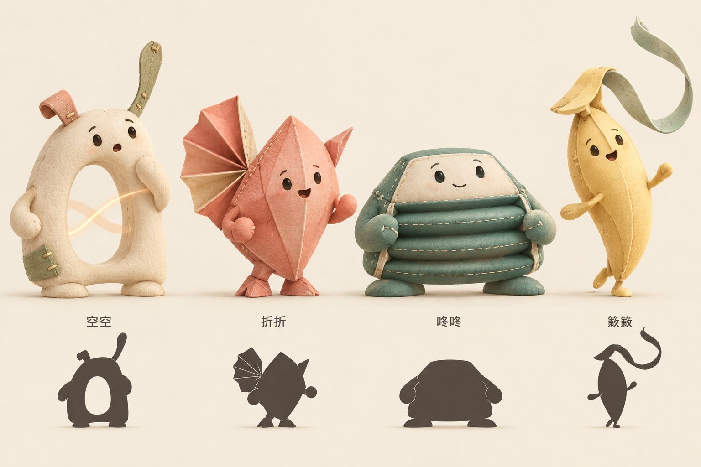

# 回声小队 · 原创角色概念 v1

2026-10-02。根据用户反馈“人物形象太大众，需要创作自己的特殊角色驱动系列”，新增一组原创形象探索。名称、外形和故事为本轮提案，尚未锁定为最终制作标准，也未替换现有游戏。

后续推进：用户已确认该原创方向。新增 [空空角色标准参考](../assets/echo-crew/kongkong-standard-v1.png) 和 [独立新版制作记录](echo-implementation.md)，已实现四位基础模型、十秒试演与第一集流程。下面保留初次提案内容作为设计沿革；后续集数仍待制作。

概念图使用内置 image_gen 生成并检查，已保存到项目。完整生成提示词见 [concept-lineup-v1.prompt.txt](../assets/echo-crew/concept-lineup-v1.prompt.txt)。图中角色用于视觉探索，尚非可直接使用的三维模型、完整转面图或动画资产。

## 创作中心

暂名“回声小队”。四个小伙伴是生活在声谷里的回声生物，身体由柔软的布、折面和空气共同构成。每个人以不同方式发声、聆听和行动。现实生活中的表达、等待、误解、合作，通过这些具体能力发生在故事里。

主体辨识来自空腔、折耳、风箱和风尾四种结构。面孔、手脚和温暖材质让它们具备可亲近的社会行为。主要识别特征属于身体本身，服装、帽子和颜色可以辅助，但不承担角色身份的全部。

空空是系列主角，另外三位各有自己的愿望和中心故事。先让观众记住空空的一次问候，再逐步看见伙伴，而非第一集同时讲完四份人物介绍。

## 身体、声音、动作与性格

| 角色 | 身体的标志结构 | 声音与动作 | 愿望与局限 | 可以长出的故事 |
| --- | --- | --- | --- | --- |
| 空空 | 米白色不对称拱形身体，胸口真实贯通的空腔；一短一长的听声布片，侧边鼠尾草色补丁 | 柔和气声与细小钢琴颗粒；听见声音时空腔边缘振动，回送短句时波纹穿过身体；起跳前轻轻收拢外沿 | 想向朋友说出自己的问候；能清楚留住最近一小句，声音叠得太满会混在一起 | 听懂别人、选择如何回答、发现自己的节拍；空腔是能力，也能给声音留出空间 |
| 折折 | 珊瑚色菱形折面身体，一侧多层扇形折耳，另一侧短折角；折纸式脚掌 | 纸片轻响与清脆短音；折耳开合控制聆听范围和声音强弱，转身带出扇形弧线 | 好奇别人正在说什么；紧张或受风吹时折耳容易合上，需要请伙伴再说一次 | 没听完整时愿意询问，逐步把自信的折耳打开；误会有具体可见的来由 |
| 咚咚 | 苔绿色宽矮梯形身体，三层可压缩风箱腹部，宽脚、低重心，无额外头饰 | 温暖低音与软鼓点；压缩、回弹和换气对应强拍、弱拍与休止，落地带出低而宽的波纹 | 想稳稳托住大家；连续支撑后需要换气，不能独自维持所有节拍 | 愿意提出“换你来一下”，发现伙伴的接力；休止也能成为共同音乐的一部分 |
| 簌簌 | 蜜黄色细长种荚身体，偏侧折瓣与长长的鼠尾草色风尾，轻巧的小脚 | 轻风声与细小高音；风尾显示气流方向，短风带小跳、长风带蓄力；兴奋时尾巴先动 | 想看看下一阵风会带来什么；冲得太快时会离开伙伴的节奏，需要转身确认 | 借风前进、学会收住动作、回头等待；身体结构直接生成路上的玩法 |

角色有特长，也有当下需要解决的困难。身体差异不代表固定的好坏、等级或人格测评结果。每个人会帮忙，也会请求帮助；成长体现在新的选择和回应方式。

“用空气和身体发声”是幻想世界的设定。未来音源可继续用原创合成与拟音设计，不把上述形容当成已实现的声学模拟。

## 第一季 · 一句问候的旅程

共同目标：空空想在声谷入口留下一段欢迎曲。它先尝试独自说一句问候，沿途认识伙伴，最后发现大家可以各自保留特点，合成一段为后来者留有回应空间的音乐。

| 集数 | 情节焦点 | 从角色结构生成的互动 | 音乐与关系的变化 |
| --- | --- | --- | --- |
| 01《空空的一句问候》 | 空空听见树洞里传出三个音，想回应，却把收到的声音全挤在了一起 | 听完一小句、留出停顿，再借空腔回送；折折在结尾接住问候 | 柔和独奏 → 混杂 → 留白后的清楚回应；建立主角与首位伙伴 |
| 02《折折没听完》 | 一阵风合上折耳，折折只听到朋友说的一半 | 让折耳慢慢打开，听见完整短句，再决定怎么回应 | 缺失半句 → 请求重复 → 完整接唱；建立询问和信任 |
| 03《咚咚要换气》 | 咚咚稳稳为小桥打着拍子，撑到一半需要停一拍 | 在低音休止时由伙伴接力，把过桥的脚步接下去 | 规律低音 → 留出换气 → 多声部接力；让提出帮助有实际作用 |
| 04《簌簌借来的风》 | 簌簌借一阵风跑到前面，回头才发现大家停在了水洼边 | 从风尾听见风的长短，选择小跳与蓄力，并等待下一位伙伴 | 快速高音 → 收住动作 → 同步落地；等待发生在行为中 |
| 05《留给你的那一拍》 | 四位回到谷口，准备把欢迎曲送给下一位朋友 | 编排各自熟悉的短句，让空腔、折耳、风箱和风尾先后加入，最后留一拍让新声音回答 | 四个角色动机 → 彼此承接的合奏 → 最后的回应空间；完成第一季目标 |

以上为系列故事提案，各集尚未制作。原人类儿童版本作为早期视听与玩法研究继续保留，不将这些未制作的内容写成已上线选集。

## 形象初稿检查

本轮概念图已体现四个身体结构和对应黑色剪影：空空的空腔是真实贯通的留空；折折的单侧折耳可辨；咚咚的横向风箱层次清楚；簌簌的细长身体与风尾区别于其他三位。图中同时保持柔软材质、缝线和小手小脚的家族共性。

仍需细化：空空拱形在侧面是否保持留空；折耳的收折关节与可重复动画；咚咚压缩时的面部稳定性；簌簌风尾的长度、摆动范围和遮挡；四位缩到手机尺寸后的脸部识别。当前图不提供这些问题已解决的证据。

## 继续开发的顺序

1. 先围绕空空完成正面、侧面、背面、比例、表情与动作设计，把空腔和听声布片作为固定结构。
2. 为它做约四秒的声音短句及“听完—留白—回应”的十秒动作试演，检查静止、运动和声音三个层面的辨识。
3. 以同样标准完善另外三位，统一材质与比例，并明确每种结构的活动边界。
4. 制作第一集短关卡，用角色能力承接剧情，再决定后续关卡的实现方式。

当前能力、性格、名称与第一季均可修订。修订应围绕这一套人物系统推进，并保留之前的图和设定，便于比较创作方向。
