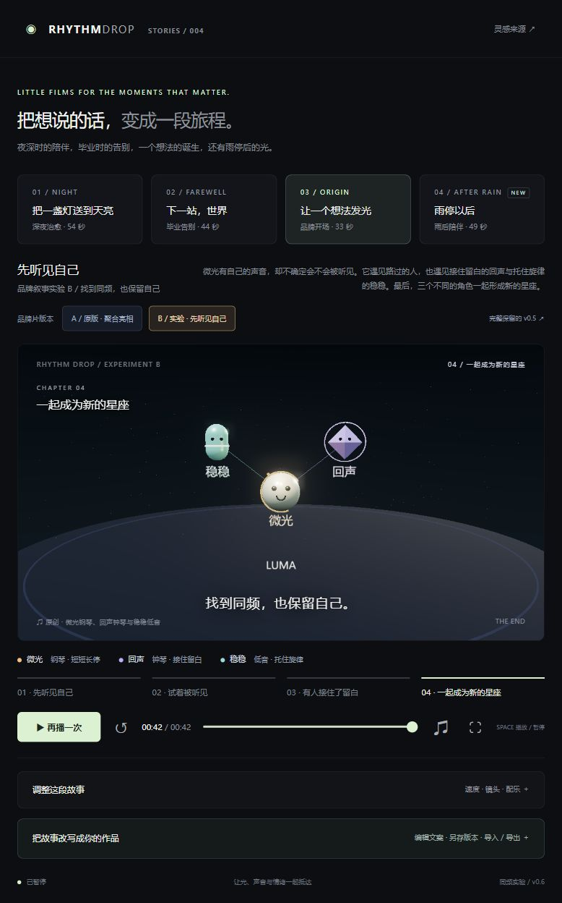

# v0.6 · 先听见自己 · 品牌叙事实验 B

目的：在找到同频的人之前，先建立主角的特点。球形作为基础外形，性格由稳定的声音动机、辨识标记、行为和关系形成。

## 比较入口与版本保留

- A 原品牌片：[聚合亮相](http://127.0.0.1:8940/?story=brand)，保持 124 BPM 的原配乐、光点聚合与四刃标识。
- B 实验片：[先听见自己](http://127.0.0.1:8940/?story=identity)，96 BPM、68 拍，约 42.5 秒。
- 完整 v0.5：[保留页面](http://127.0.0.1:8940/versions/v0.5/?story=brand)。对应 `web/versions/v0.5/` 的五个页面文件，与改动前 ZIP 逐字节一致。
- 改动前快照：`build/research-archives/research-20261001-141102-176171.zip`，257 文件，CRC 与 SHA-256 通过。完成后另做快照，旧文件保留。

当前主页面品牌片增加 A/B 选择；其余三个故事入口仍保持原样。实验 B 是独立故事 ID 与独立场景、乐谱，不覆盖 A。保存作品使用 `rhythm-drop.library.v2`，首次读取 v1 旧记录，写入 v2；完整 v0.5 页面继续使用 v1，避免新故事导致旧页无法读取档案。作品 JSON 结构仍为 v1；旧页不支持 `storyId: identity`，应在新版导入。

## 三个角色

| 角色 | 外观 | 声音 | 行为 |
| --- | --- | --- | --- |
| 微光 | 珍珠色球体、琥珀色偏心光纹与双点记号 | 钢琴 C5–D5–G5，短、短、长、停 | 先独奏；靠近半步，再退回一点；被回应之后恢复微笑 |
| 回声 | 紫色八面体、细环、独立名字 | 钟琴在主角第四拍的留白中回应 | 第 27 拍首次回应，之后加入问答 |
| 稳稳 | 青绿色胶囊体、腰间横环 | 低音与持续和声 | 第 35 拍回应，后来提供底部和声 |

一名蓝色旅人有自己的半拍短句，从画面后方经过，不加入最终关系。不是所有相遇都需要成为伙伴。结尾三个角色保持各自造型与标记，通过连线形成星座，LUMA 在下方出现。

## 分镜与声音事件

| 拍数 | 音乐与动作 |
| --- | --- |
| 0–15 | 微光独奏；镜头近看表情与偏心光纹，四拍动机反复出现 |
| 16–26 | 镜头拉开；旅人经过，回声靠近，微光试探、犹豫，嘴角收敛 |
| 27–43 | 钟琴先接住留白，低音随后托住旋律；角色亮度与扩散圈来自各自的乐谱 onset |
| 44–47 | 不安排新的音符，留给已有声音衰减与彼此停留 |
| 48–63 | 三角色形成新的构图；乐器继续保持区别，品牌名称逐渐出现 |
| 64–68 | 终止和弦衰减，角色与场景状态冻结 |

纯模块 `identity-cues.mjs` 定义带角色的乐谱、光纹脉冲、onset 扩散圈和确定性动作；`identity-world.js` 提供场景。原有四个故事的元数据、272 拍乐谱、1108 个采样姿态与路径已和改前源码比对一致。

## 需要观众判断的事

从头戴耳机观看，比较是否能记住微光的声音与记号、是否能听出第一次回应、是否能理解三者各有特点却可以合作。自动测试只能验证时序与保存规则，不能证明故事已经具有感染力。此次是角色身份与声部关系的第一版试验，音色仍是 Web Audio 合成原型。

