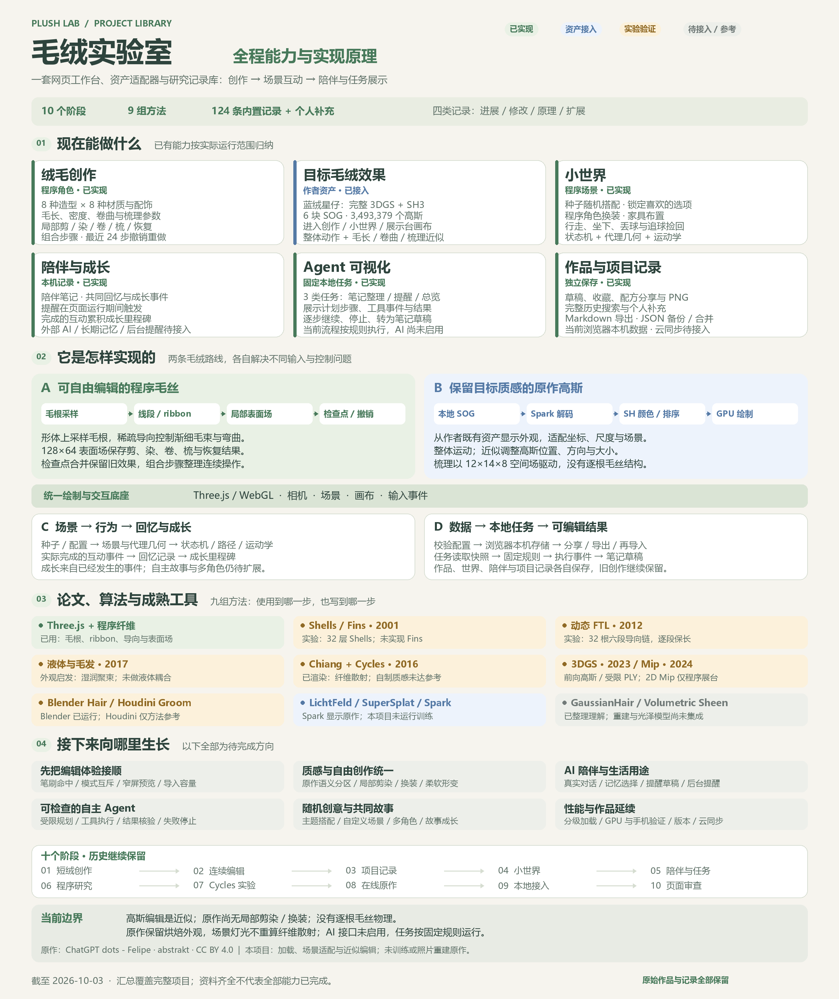
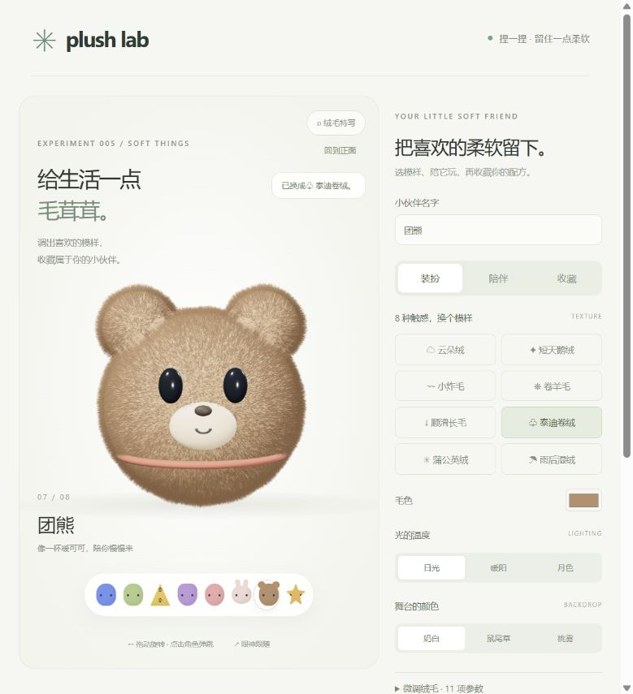
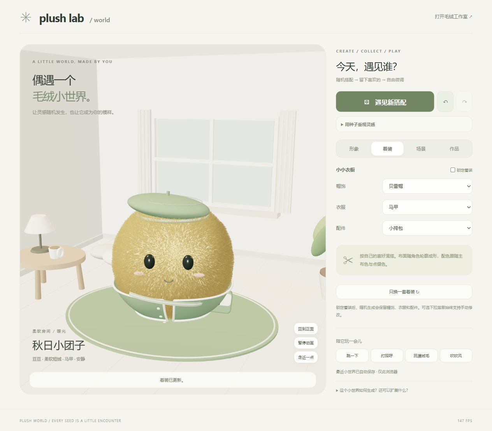
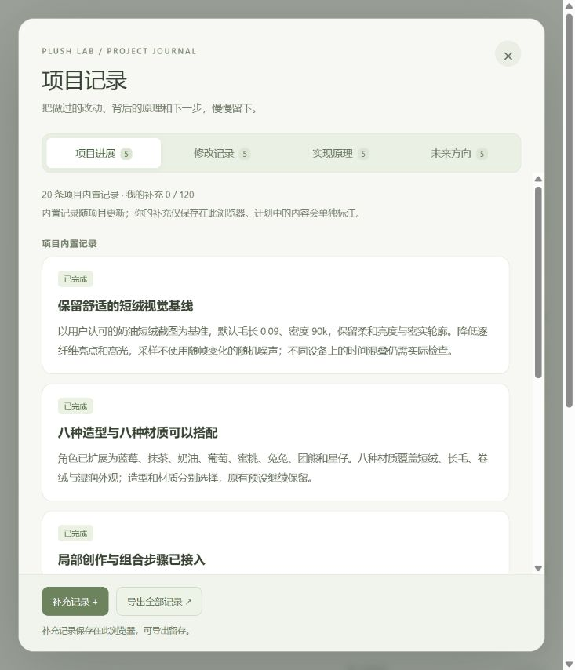
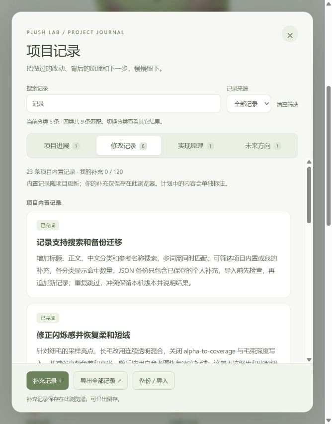
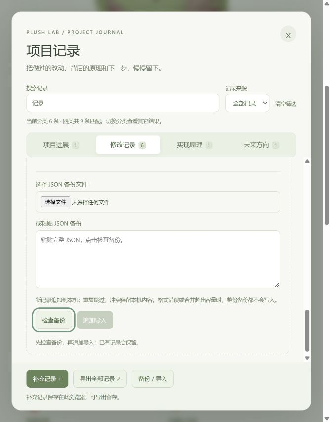
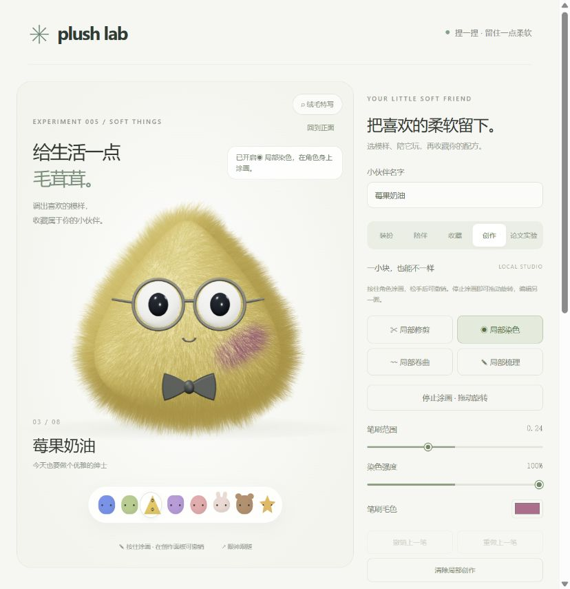
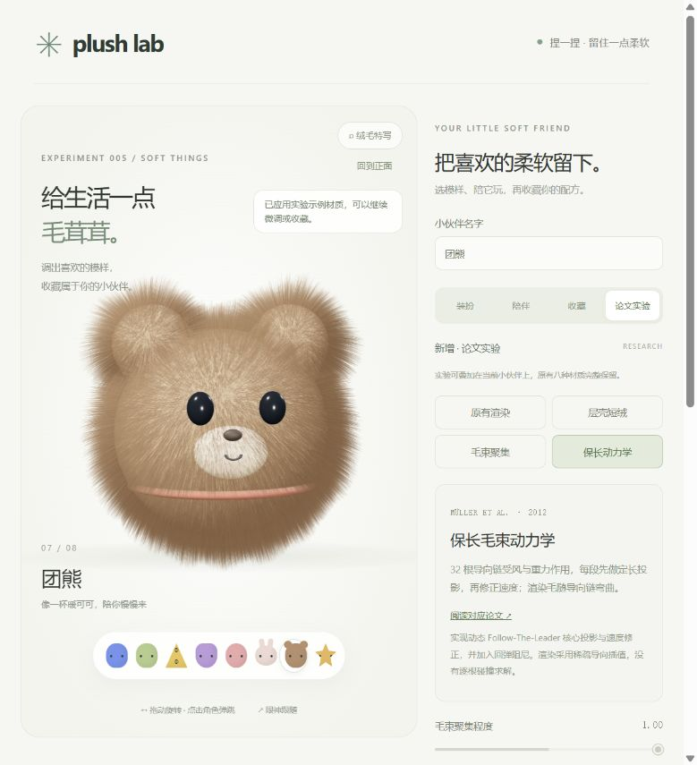

# 005 · Plush Lab · 毛绒实验室

**一套把毛绒形象创作、场景互动、生活记录与图形研究连接起来的网页工作台。** 你可以编辑程序毛丝、连续剪染梳理、按种子搭配角色与着装，在可布置的小世界里行走、坐下和玩球，也可以保存笔记、页面提醒与真实互动产生的成长记录。项目把每次进展、修改、方法选择和未完成方向一起保存，形成能继续积累的个人创作与研究空间。

[打开公开项目全景](https://yydshly.github.io/0930_codex_project/projects/005-plush-lab/web/project.html) · [直接创作](web/index.html) · [小世界](web/world.html) · [陪伴工作室](web/studio.html) · [完整理解](notes/public-understanding.md)



*引导图生成于 2026-10-03；以下当前说明于 2026-10-08 按源码与记录复核。本轮整理发布入口与文档，不代表新增了图中待实现的功能。*

## 背景与目标

我们最初要实现的是一种舒适、细密、自然卷绒的毛绒质感，并让它成为能调节、创作和互动的角色。路线从 Three.js 程序纤维，发展到论文实验、Blender 原生毛发与 Cycles 样片，再找到截图对应的公开原作 **ChatGPT dots - Felipe**。当前已把原作者 **abstrakt** 的完整许可高斯资产接入绒毛创作、小世界和展示台的既有画布。

因此项目同时保留两条路线：程序纤维提供清楚的毛根和剪染梳理语义；原作高斯提供可直接观察的目标质感，并支持显示层的近似调节。自制离线候选仍未获得参考质感的视觉认可；原作由作者制作，我们完成加载、适配和互动，没有宣称自行生成或训练了它。

## 当前能做什么，以及怎样实现

| 能力 | 可以直接使用的内容 | 实现原理与边界 |
| --- | --- | --- |
| 绒毛创作 | 八种造型、八种材质、配饰、参数、风吹、触碰；修剪、染色、卷曲、恢复、梳理；组合步骤与最近 24 步撤销 | Three.js / WebGL 绘制线段与渐细毛束，稀疏导向驱动形变；128×64 表面场和无损检查点保存局部效果。512 是近期笔触缓存阈值，合并后可继续编辑，并非总创作上限 |
| 目标蓝绒星仔 | 三个工作台同画布观察、整体动作、色调、大小、PNG；相对毛长、附加卷曲、连续梳理与撤销保存 | Spark 读取六块本地 SOG，保留 3,493,379 个高斯及 SH3，进行排序与球谐颜色求值。毛长 0.65–1.65 倍、附加卷曲 0–100%、12×14×8 梳理场是高斯显示近似，未建立真实毛根、单根受力、局部剪染或换装 |
| 搭配与小世界 | 种子随机搭配、选项锁定、程序角色换装、家具布置、行走、坐沙发、丢球、弹跳、追球、拾回 | 配置生成场景，状态机、代理几何、路径与运动学负责交互。球有三次衰减弹跳及滚动，落稳后再拾取；尚无完整刚体、骨骼或衣服模拟 |
| 陪伴与成长 | 本机笔记的编辑检索、页面提醒、共同回忆、实际事件成长、JSON / Markdown 导出 | 当前浏览器保存独立记录；提醒在页面运行期间检查，回忆与里程碑由真实操作事件触发。关页后推送、跨设备同步与陪伴备份导入尚未实现 |
| Agent 可视化 | 整理笔记、检查提醒、生成工作室概览三个固定任务；步骤继续、暂停停止、工具事件与可编辑结果 | 本地规则读取快照并产出草稿，界面表达实际执行状态。外部模型尚未启用，也没有自主规划或多 Agent 后台执行 |
| 研究与保存 | 层壳短绒、稀疏 FTL、湿毛聚束外观、程序高斯及受限 PLY 交换；Blender / Cycles 样片；草稿、收藏、配方、PNG 和四类项目记录 | 论文、算法、成熟工具各解决不同问题，采用范围有明确记录。没有本项目的多视图训练器、任意模型兼容或通用 SDK 承诺 |

**真实 AI 当前未开通。** 接口明确返回待接入状态，不用固定规则冒充模型回复。现有笔记、提醒、事件与草稿流程可以作为后续 AI 接入的基础：由用户选择分享的内容，让模型提出笔记、提醒或行动草稿，再把经过核验的执行结果显示到伙伴身上。

## 适合哪些场景，对我的意义是什么

- **自由创作与审美试验：**选择毛料和配色，做连续局部编辑，把喜欢的样式保存为作品；在同一处比较程序控制与目标原作的质感。
- **个人生活记录：**和伙伴一起留下笔记、当天提醒与共同回忆。现在可以使用本地记录；长期对话、故事和养成需要后续真实 AI 与记忆设计。
- **学习与复盘：**把论文公式、工具适用范围、生成参数、失败候选和实际样片连起来，理解为什么某种方法适合显示，另一种更适合编辑或模拟。
- **Agent 的可视化工作台：**先观察固定任务的真实步骤、工具结果、失败和停止状态，之后再扩展模型规划与受限执行。

这个项目对我们的价值，是让创作、理解和生活记录可以持续积累：喜欢的形象能保留，失败的方法可复查，后续尝试有来源和依据，已有作品也能继续打开。毛绒角色为这些活动提供一个柔和、可互动的入口；它最终是否有陪伴价值，还要靠可靠的记录与行动能力逐步实现。

## 从哪里开始

1. 打开[公开项目全景](https://yydshly.github.io/0930_codex_project/projects/005-plush-lab/web/project.html)，先看引导图、当前能力与原作实时预览。
2. 在[绒毛创作](web/index.html)编辑程序角色；进入[蓝绒星仔](web/index.html?plushView=reference)体验原作相对毛长、附加卷曲与梳理，注意两条路线的工具范围不同。
3. 到[小世界](web/world.html)生成搭配、布置家具、走动、坐下和玩球；到[陪伴工作室](web/studio.html)写笔记、设置页面提醒或运行固定任务。
4. 用收藏、配方与导出保留结果；用项目记录留下进展、修改、原理和扩展想法，再到样片与研究文档复查方法。

公网部署保持原来的 `/projects/005-plush-lab/web/` 路径与相对资源结构。**localhost、127.0.0.1 与公网地址是不同浏览器来源，已有作品和笔记不会自动迁移。** 旧作品仍在原来源；请按各模块现有能力导出或分享，再在新来源导入支持的作品格式。陪伴记录目前可导出，尚无恢复导入或云同步。

## 所有网页与资料入口

| 网页 | 用途 |
| --- | --- |
| [项目全景](web/project.html) | 本文理解、能力总图、原作实时预览、10 个阶段、9 组方法、124 条内置记录与个人补充 |
| [绒毛创作](web/index.html) | 程序纤维编辑、组合步骤、草稿与收藏；另有本地蓝绒星仔模式 |
| [毛绒小世界](web/world.html) | 随机搭配、场景布置与互动；另有本地蓝绒星仔模式 |
| [陪伴工作室](web/studio.html) | 笔记、页面提醒、回忆、成长与固定任务；保留历史官方原作查看器 |
| [高斯展示台](web/splat.html) | 程序高斯、受限 PLY 与本地完整原作展示 |
| [原作毛绒展台](web/reference-plush.html) | 保留的官方在线查看入口，依赖网络与原站 |
| [Cycles 毛料与角色研究](artifacts/cycles-material-study.html) | 历轮实际样片、制作参数与渲染证据 |
| [参考效果对照](artifacts/reference-comparison.html) | 保留早期程序效果与参考的比较，不能作为当前原作接入结果 |
| [小世界页面审查](artifacts/world-page-audit-20261003/report.html) | 九张截图及状态、反馈、窄屏、模式冲突、导入边界问题 |
| [原作来源说明](artifacts/source-viewer-public.html) | 原作出处、许可与项目接入职责 |
| [工程与公开材料说明](web/engineering.html) | 54 个大型 `.blend` 工程约 3.6 GB 在本机完整保留；公网提供参数、脚本、样片与日志，不提供真实工程下载 |

[完整公开理解](notes/public-understanding.md)进一步说明两条毛绒路线、论文采用范围、数据与任务设计以及后续方向；下方历史全文完整保留。公网展示的工程说明不会把说明页或空文件当成 `.blend` 下载。

## 方法、来源与未完成方向

毛绒质感由毛束结构、纤维散射、明暗遮蔽、轮廓及观看条件共同决定。代码是实现载体，论文和成熟工具帮助选择表示与算法，合格资产决定能否呈现目标细节；单独加入 Three.js、3DGS 或某个节点名称都不能保证参考质感。

当前参考与使用范围包括 [Lengyel 的 Shells / Fins](https://www.hhoppe.com/proj/fur/)（采用层壳部分）、[Müller 的动态 FTL](https://matthias-research.github.io/pages/publications/FTLHairFur.pdf)（稀疏导向链核心）、[Fei 的液体毛发](https://www.cs.columbia.edu/cg/liquidhair/)（仅外观启发）、[Chiang 的纤维散射](https://www.disneyanimation.com/publications/a-practical-and-controllable-hair-and-fur-model-for-production-path-tracing/)（通过 Cycles 实际运行）、[Kerbl 的 3DGS](https://repo-sam.inria.fr/fungraph/3d-gaussian-splatting/)（前向实验与既有资产显示）和 [Mip-Splatting](https://www.cvlibs.net/publications/Yu2024CVPR.pdf)（程序高斯的二维过滤部分）。Blender Hair Nodes 已实际使用；Houdini Groom、GaussianHair、体积 Sheen 为研究候选。具体公式、输入、实现范围与限制见[研究理解](notes/gaussian-splatting.md)、[方法选型](notes/plush-method-selection.md)及[Cycles 记录](notes/cycles-material-study.md)。

原作 **Felipe / abstrakt** 的[公开场景](https://superspl.at/scene/ca6a4c9b)、[CC BY 4.0](https://creativecommons.org/licenses/by/4.0/) 与[本地资产清单](web/assets/reference-plush/manifest.json)随发布保留。原作外观包含烘焙信息与随视角变化的球谐颜色，家具灯光不会重新计算它的纤维物理散射。完整六块资产约 66.9 MB，首次加载、排序与显存有成本；历史桌面帧率不代表其他 GPU 或真实手机。

下一步先修复页面审查中已确认的流程问题，补充笔刷范围、命中和窄屏反馈；再依次研究原作语义分区、局部剪染、换装与柔软形变、真实 AI 草稿与长期记忆、可核验的 Agent 执行、主题故事和多角色玩法、性能与跨设备作品管理。它们作为待完成方向保留。

历史测试数量与截图只证明对应轮次；公开文档复核不能视为重新验收了全部旧功能，也不能视为自制毛料已获外观认可。

## 本地运行与开发

网页包含本地打包文件，原作模式使用仓库内的许可资产。需要现代浏览器、WebGL 与硬件加速。从仓库根目录运行：

```powershell
python -m http.server 8875 --bind 127.0.0.1
```

打开 `http://127.0.0.1:8875/projects/005-plush-lab/web/project.html`。官方在线原作查看页仍需网络；固定使用原有浏览器来源可继续读取此前数据。源码、构建命令和功能入口见[网页说明](web/README.md)，AI 待接入状态见[接口说明](server/README.md)。

<details>
<summary><strong>展开完整历史文档：全部原始进展、修改、验证、实验与扩展记录</strong></summary>

以下正文按原文保留，其中历史轮次状态以本页上方的当前说明为准。工程链接记录原本的本地文件位置，公网材料范围见工程说明。

### 原始项目说明

可装扮、陪伴、收藏与导出的本地毛绒小伙伴工作室，现有「装扮 / 陪伴 / 收藏 / 创作 / 论文实验」五个面板，侧边栏另有独立「项目记录」入口。新增独立的 `world.html` 毛绒小世界第一版，可按种子生成形象、着装与场景。局部创作支持无损检查点与组合步骤，可持续叠加修剪、染色、卷曲、恢复与梳理，并保留自动草稿、毛流随动和简化身体/配饰接触。默认保持用户认可的密实短绒与原有八种材质；原有工作室页面参考 Dot 演示的视觉方向，采用原创中文界面和程序化造型，没有复制参考网站源码或模型；新增「蓝绒星仔」则使用已署名的公开许可高斯资产，接入既有场景。



## 运行

网页已包含本地 Three.js 打包文件，无须安装依赖或访问 CDN。从仓库根目录运行：

```powershell
python -m http.server 8875 --bind 127.0.0.1
```

打开 [毛绒工作室](http://127.0.0.1:8875/projects/005-plush-lab/web/)、[毛绒小世界](http://127.0.0.1:8875/projects/005-plush-lab/web/world.html)、[陪伴工作室](http://127.0.0.1:8875/projects/005-plush-lab/web/studio.html)、[高斯毛绒展台](http://127.0.0.1:8875/projects/005-plush-lab/web/splat.html) 或新增[原作毛绒展台](http://127.0.0.1:8875/projects/005-plush-lab/web/reference-plush.html)。需要现代浏览器、WebGL 与硬件加速；绒毛创作、小世界和展示台中的「蓝绒星仔」使用本地资产，可由本地服务器加载。独立原作展台及陪伴工作室保留的历史官方查看器仍需网络。端口占用时更换端口；继续使用原来保存作品的 localhost 或 127.0.0.1 来源，两者的浏览器存储相互独立。

重新构建源码（Node.js 22 或兼容版本）：

```powershell
cd projects/005-plush-lab/tooling
npm ci
npm run build
```

## 新增：完整项目全景与目标毛绒

打开 [项目全景](http://localhost:8875/projects/005-plush-lab/web/project.html)，统一查看从绒毛创作、组合笔刷、小世界、陪伴与 Agent，到论文方法、Cycles 实验、原作资产与最近页面审查的完整发展过程。总览包含 10 个阶段、9 组方法和 6 个后续方向；完整保留 124 条内置记录，并只读呈现同一浏览器来源下的个人补充，支持关键词与类型检索、展开原文。历史状态和测试数量按当时记录保留，当前能力及未实现方向另外注明。旧工作台、作品与存储不迁移、不重写。

总览中的「目标毛绒」进入视野后加载同一份本地完整 Felipe 资产：6 个 SOG 分块、3,493,379 个高斯及 SH3，直接在本页画布显示，可旋转、缩放、弹跳、调整相对毛长和附加卷曲。临时控制只影响总览预览；下方可进入绒毛创作、小世界和展示台中已接入的实际编辑入口。保留 abstrakt 署名、原作链接与 CC BY 4.0 许可；高斯近似编辑和实际毛丝模拟的边界见页面说明。项目记录、四个工作台及旧审查报告均新增总览入口，原有资料继续保留。

「[能力总图](http://localhost:8875/projects/005-plush-lab/web/project.html#system-map)」用一张中文图汇总创作、目标资产、小世界、陪伴、Agent 与作品记录，并对应程序纤维、高斯显示、状态机和本机数据的实现原理。图内区分已有能力、研究实验及待完成方向；附原尺寸图片、保存入口和可展开的文字说明。它是当前项目的能力概览，不承诺通用 SDK 或全部目标已完成。页面另补列作品与记录能力，来源与记录数量按当前状态修正；早期轮次仍保留当时说明。

本轮总览已通过实际浏览器核验：完整记录检索、类型筛选、原文展开，目标毛绒旋转、毛长 / 卷曲调节与恢复原作，以及 390×844 窄屏中预览和滑杆同时可见。构建成功，现有 442 项测试全部通过；没有重新验收全部历史功能或测量真实手机性能。查看[总览核验记录](artifacts/project-overview-20261003/validation.json)与[目标毛绒实图](artifacts/project-overview-20261003/target-desktop.png)。

## 当前：完整本地高斯角色进入三个工作台

2026-10-03 按用户要求，将作者 **abstrakt** 的 [ChatGPT dots - Felipe](https://superspl.at/scene/ca6a4c9b) 完整公开高斯数据保存到本地，并接入绒毛创作、小世界与展示台的既有 Three.js 场景、相机和画布。三个页面顶部的「蓝绒星仔」现在加载本地资产，在同一画布内接受操作；来源与 [CC BY 4.0 许可](https://creativecommons.org/licenses/by/4.0/) 保留。这份角色由原作者制作，本项目新增资产接入与互动适配，没有重新生成毛绒、重建或训练原作。

| 本地角色入口 | 已接入的操作流程 | 保留的原有功能 |
| --- | --- | --- |
| [绒毛创作](http://localhost:8875/projects/005-plush-lab/web/index.html?plushView=reference) | 环绕、缩放、正面复位、转台、弹跳、整体色调、大小、PNG 照片 | 程序毛绒笔刷、组合步骤、配方与收藏 |
| [小世界](http://localhost:8875/projects/005-plush-lab/web/world.html?plushView=reference) | 同场景家具布置、角色行走、坐沙发与捡球流程，以及观察、整体色调、大小和 PNG | 随机形象、原有衣橱、场景及存档 |
| [展示台](http://localhost:8875/projects/005-plush-lab/web/splat.html?plushView=reference) | 环绕、缩放、正面复位、转台、弹跳、整体色调、大小、PNG 照片 | 程序生成参数、旧 PLY 导入、作品保存与导出 |

本轮新增「绒毛编辑」：毛长以原作高斯绒毛为相对基准，可调 **0.65–1.65 倍**；「增加卷曲」可调 **0–100%**，在原作卷绒外观上叠加，0% 保留原卷度。开启梳理后拖动身体，方向持续混入固定 **12×14×8** 空间场，不按总笔触数截断；一次滑杆调整或一次梳理拖动各记为一步，可撤销、重做或清除梳理。绒毛创作与展示台各自保存独立本机原作样式；小世界的 `actorFur` 随草稿、收藏及 `#world=` 分享保存，随机换景保留，旧作品自动补上中性默认值。这是原有绒毛高斯在显示时的位置、朝向与尺度近似调整；本地源资产、作者署名与许可保留，没有重建真实毛根或单根毛丝动力学，绒毛及配饰选择依赖原始颜色与空间范围。

**本轮三页毛发控件已实际验收：**通过 UI 调整毛长 65% / 165% 和增加卷曲 0% / 100%，身体拖动产生可见绒毛变化；整次拖动的撤销、重做和刷新保持已验。小世界第二次拖动可继续梳理，布局与姿态保留，URL 与草稿保留 `actorFur`。三页各有 1 个画布、0 个 iframe，未见 GPU 错误，完整 **3,493,379 个高斯与 SH3** 保留。本轮 **442 项回归测试全部通过**，项目记录只新增本轮一条，旧 123 条正文不改，当前共 124 条。查看[本轮毛发控件核验](artifacts/reference-fur-controls-validation.json)、[创作控件实图](artifacts/reference-fur-controls-creation.png)、创作[梳理前](artifacts/reference-fur-creation-before.png) / [梳理后](artifacts/reference-fur-creation-after.png)，以及展示台[梳理前](artifacts/reference-fur-splat-before.png) / [梳理后](artifacts/reference-fur-splat-after.png)。

**上一轮原生接入的本机桌面浏览器验收已通过：三个入口都在一个现有画布内显示完整角色，页面 iframe 数量均为 0。** 绒毛创作与展示台的正面复位、转台、弹跳、整体色调、大小、恢复和 PNG 导出已实际核验；小世界已实际完成坐沙发及追球、拾球、送回流程，导出的 PNG 同时包含本地角色与家具。三个页面的实际 PNG 文件均已检查。当前桌面观察到创作 53–76 FPS、小世界 64–88 FPS；这是运行时观察，属于 53–88 FPS 的已见范围，并非标准性能基准；移动设备、显存峰值和首次加载成本尚未测量。该轮 418 项测试全部通过，其中 411 个顶层测试；本地六块资产的数量、SHA-256、ZIP 内容与 CRC 校验再次通过。查看[上一轮集成核验](artifacts/reference-native-integration-validation.json)、[绒毛创作实图](artifacts/reference-native-creation.png)、[小世界坐沙发实图](artifacts/reference-native-world-seated.png)与[展示台实图](artifacts/reference-native-splat.png)。历史 iframe 截图不作为该轮凭证。原有作品、草稿、收藏、个人记录及 Cycles 工程继续保留。模式切换保留已有 `#recipe=`、`#world=` 和 `#splat=` 作品片段；原作色调与大小使用独立或新增兼容字段保存，不覆盖旧毛绒配方。该轮项目记录在旧 119 条前新增进展、修改、原理与未来方向四条，共 123 条。

本地 [资产清单](web/assets/reference-plush/manifest.json) 包含六个 SOG 分块，总计 **3,493,379 个高斯、三阶球谐（SH3）**，没有抽点或降为恒定颜色。`src/reference-plush-asset.js` 使用 Spark 2.3.1 顺序解码、GPU 球谐求值与 worker 排序，逐块检查数量与球谐数据；使用扩展精度高斯数据，避免旧程序展示台的 CPU 排序与低容量 PLY 管线处理完整原作。固定 X 轴 π 旋转完成坐标转换，再居中并归一到 2.2 场景单位高度；共享解码源供角色实例使用，整体变换负责位置、朝向、缩放与弹跳。

当前边界：色调使用 RGB 乘色，大小为 0.65–1.35 倍；弹跳、行走与坐下使用整个角色的变换和既有运动学流程，没有骨骼、可变形高斯训练、逐根毛丝动力学或衣服模拟。角色保留资产中的烘焙外观与随视角变化的球谐颜色，同场景的灯光可以照亮家具，但不会重新计算原作纤维的物理散射。原作模式暂不提供局部毛发修剪染色、换装、吹动单根毛丝或旧 PLY 模型导出；PNG 是当前画布的照片。六个本地数据文件合计 66,929,437 字节（约 66.9 MB），完整 SH3 解码与排序仍有显存和首次加载成本；上述桌面帧率不能代表其他 GPU 或移动设备。

后续扩展：当前桌面已经核验三个入口的真实画面、动作和模式切回；继续补充家具遮挡的边界场景、照片与存档往返覆盖，并测不同桌面 GPU 和移动设备的加载时间、显存与帧率。分区染色需建立角色区域或语义遮罩；换装需适配衣服尺寸与遮挡；柔软形变需单独选择骨骼绑定、可变形高斯或实时毛发方案。AI 陪伴和 Agent 可视化应绑定经过验证的动作状态，不能把文本状态变化当成角色已经执行动作。

**历史状态说明：**下方「原作接入绒毛创作、小世界与展示台」及相关 iframe 记录保留当时的实现与核验结果；这三个入口已经由本节的本地原生实现替代。陪伴工作室与独立官方查看页仍按各自说明保留，全部旧实验和历史正文不删除。

## 新增：原作接入绒毛创作、小世界与展示台

2026-10-03 按用户明确的入口要求，原作三维展示已加入现有三个页面，各页舞台顶部可以直接选择「原作展示」，不需要先跳转到独立展台或陪伴工作室：

| 原作入口 | 切回后继续使用的原有功能 |
| --- | --- |
| [绒毛创作中的原作](http://localhost:8875/projects/005-plush-lab/web/index.html?plushView=reference) | 梳理、修剪、染色、组合步骤、配方与收藏 |
| [小世界中的原作](http://localhost:8875/projects/005-plush-lab/web/world.html?plushView=reference) | 随机搭配、着装、场景布置、行走与捡球 |
| [展示台中的原作](http://localhost:8875/projects/005-plush-lab/web/splat.html?plushView=reference) | 自制高斯参数搭配、作品导入与导出 |

三个入口共用 `src/plush-reference-view.js` 与 `web/plush-reference.css`。原作模式首次选择时才加载作者的官方 iframe，页面内提供来源署名、操作说明、全屏、重新加载和其他工作台入口。显示模式使用 `?plushView=reference`，保留已有 `#recipe=`、`#world=` 或 `#splat=` 作品片段；切换不重建原有画布，不写入创作存储。原作显示期间隐藏并停用自制角色的编辑与动作控件、暂停其渲染和运动计算，切回后恢复原有画面。陪伴工作室使用的 `world.html?companion=1` 保持既有同源互动连接。

这轮接入的是**各页面内的原作三维查看模式**。作者仍为 **abstrakt**，场景为 **ChatGPT dots - Felipe**，许可为 **CC BY 4.0**；本项目没有下载或导入原作资产，没有取得可编辑源文件，也没有制作或训练这份原作资产。原作可以三维观察，不能使用本项目的毛绒笔刷、换装、行走、捡球或本地照片与模型导出。小世界原作展示也没有把它合并到已有家具场景。已保存作品、草稿、收藏、旧实验及历史记录继续保留；本轮在原有 115 条项目记录前新增四条，当前共 119 条。

本机浏览器已实际显示三个页面内的蓝色卷绒星仔。切回原有模式后，绒毛创作与小世界的名字、毛色和画布尺寸保持，展示台的 seed、颜色、质量和画布尺寸保持；小世界「打招呼」、展示台「弹一下」仍正常。页内原作全屏与退出已实测，三页在 390×844 窄屏下均为 `clientWidth / scrollWidth = 375 / 375`，没有横向溢出。178 项相关测试与统一构建通过，共享查看组件的 11 项检查在最终修改后再次通过。新嵌入 iframe 的环绕拖动尚未独立实测，官方原页此前已验证环绕、缩放与复位。[集成核验记录](artifacts/reference-workbench-integration-validation.json)与[绒毛创作实图](artifacts/cycles-study/reference-integration-creation.png)、[小世界实图](artifacts/cycles-study/reference-integration-world.png)、[展示台实图](artifacts/cycles-study/reference-integration-splat.png)已保存。

后续若要让同质感角色真正进入可布置的小世界并自由创作，需要先核实源资产许可和可访问性，取得适合编辑的模型或自行制作对应资产，再建立本地导入、坐标与尺度转换、场景合成及编辑管线。动作、换装、毛绒编辑与网页性能分别验收；这些仍是计划中的扩展，当前官方 iframe 不提供该能力。

## 已保留：陪伴工作室内查看原作毛绒

打开[工作台中的原作毛绒](http://localhost:8875/projects/005-plush-lab/web/studio.html#reference)，或在陪伴工作室角色卡片上选择「原作毛绒」。工作台提供「我的伙伴 / 原作毛绒」两个展示模式：我的伙伴继续使用已有小世界与换装、挥手、跳跃、捡球；原作模式嵌入 abstrakt 的官方公开三维查看器，提供全屏、重载与独立展台入口，并标注 **ChatGPT dots - Felipe / abstrakt / CC BY 4.0**。第一次选择原作时才开始加载约 114 MB 的远程场景，默认伙伴模式不预载它。切换模式保留两个 iframe，不主动重载原有小世界。

原作模式下，右侧笔记、提醒和本地 Agent 任务可以继续使用；伙伴身体动作暂时禁用，切回「我的伙伴」并完成连接后可恢复。**接入查看器不等于取得原作可编辑资产**：它仍依赖网络及 SuperSplat 服务，不能直接用我们的毛发笔刷、衣橱、身体动作或 AI 表情控制。已有创作、收藏、草稿、陪伴记录及全部旧工程保留。本轮在原有 111 条项目记录前新增四类说明，现有 115 条；历史条目保留当时的实现状态。

本轮实际核验：内置浏览器直接进入 `#reference` 已真实显示原作；五个身体动作在原作模式下持续禁用，包括小世界稍后完成握手的情况，切回伙伴后恢复。切换后原作地址、聊天草稿与选中的 Agent 桌面页保留；全屏进入、退出及全屏作者署名已验证。390×844 窄屏的文档宽为 375，没有横向溢出。65 项相关测试通过，其中六项为新增双视图检查。[查看工作台实图](artifacts/cycles-study/studio-reference-integration.jpg)及[集成核验记录](artifacts/studio-reference-integration-validation.json)。

## 新增：原作者的 3DGS 毛绒参考场景

2026-10-03 路线调整：找到作者 **abstrakt** 公开的 [ChatGPT dots - Felipe 原始场景](https://superspl.at/scene/ca6a4c9b)，已在官方浏览器直接核对蓝色卷绒星仔、黑贝雷帽和亮黑眼睛，与用户截图中的角色对应。新增独立[原作毛绒展台](http://localhost:8875/projects/005-plush-lab/web/reference-plush.html)，采用 [SuperSplat 官方公开 Embed](https://superspl.at/s?id=ca6a4c9b)，标注原作标题、作者、CC BY 4.0 许可及来源。本机内置浏览器已真实显示原作，外层全屏进入与 Escape 退出已验，[全屏实图](artifacts/cycles-study/reference-original-local-fullscreen.jpg)已保存；环绕拖动、滚轮缩放和 R 复位在官方原页已验，本机 iframe 拖动未独立实测。场景页面标示 3,493,379 splats（约 3.5M）/ 113.59 MB，官方下载要求登录，当前提供的是远程嵌入查看，未保存可离线加载的本地原作模型文件。[来源与实际核验](artifacts/reference-source-verification.json)记录了观察。**这份资产由原作者制作，本项目没有生成、重建或训练它；显示依赖网络与官方服务。**

用户反馈 V15 的球团、羊羔绒颗粒仍不符合参考质感。V16 转向低矮、细密、连续的短卷绒，已保存 [完整工程](artifacts/cycles-study/character-reference-continuous-pile-v16.blend)、[制作源](artifacts/cycles-study/character-reference-continuous-pile-v16.source.py)、[配方报告](artifacts/cycles-study/character-reference-continuous-pile-v16.groom.json)和[实际预览](artifacts/cycles-study/character-reference-continuous-pile-v16.preview.png)，仅作为实验保留，没有高清成片，也未获外观认可。当前直接使用原作建立可见基准，旧 107 条项目记录、全部网页、工程和个人创作继续保留；只新增四类说明，该轮记录总数为 111。原作嵌入展台尚未接入本项目的换装、局部创作或陪伴状态。

## 新增：原生毛丝与 Cycles 离线样片

2026-10-03 上一轮 V15 交付：重做完整浅蓝星仔的厚卷绒，真实 1536×1536 / 256 样本 Cycles 高清图已完成，GPU 渲染 49.40 秒。[第一屏直接比较参考与实际成片](artifacts/cycles-material-study.html#character-v15-delivery)，[展开制作过程、首稿与可编辑工程](artifacts/cycles-material-study.html#character-v15-making)。6,400 主卷团首稿颗粒偏粗，最终细化为 10,800 主卷团、604,800 根外绒，另配短底绒与散毛，混合长度、卷径和方向，中段松聚、末端散开。帽眼为真实几何，使用原生毛丝与 Chiang 纤维散射。此前管线和球形样片尚未交付目标外观，该轮以完整成片供判断，未宣称完全一致或已经验收。所有旧作品、首稿及个人创作保留；该轮交付是静态渲染与工程，网页实时角色尚未替换。该轮项目记录新增四类说明，共 107 条。

上一轮 GN14 新增两套完整浅蓝星仔与真实 1536×1536 / 256 样本 Cycles 渲染，查看[参考、旧 v6 与新完整候选](artifacts/cycles-material-study.html#character-fine-bundle-study)。细束版减少长丝棉絮，撑开版增加实际毛层高度、放松束尾并补下前柔光；新图能看见细小回卷，底部更柔和，仍缺参考的松厚、不规则卷团，未标为达标。两套可编辑工程、制作源、实际渲染凭证及全部历史作品保留。当轮两完整工程共 36 项独立检查及全项目 380 项测试通过，对照页与当时的 103 条项目记录入口已检查；工程通过不代替外观判断。

2026-10-02 方法路线已开始落地：使用 Blender 5.2.2 LTS 原生毛丝、Chiang 纤维散射与 Cycles 路径追踪，生成四组局部毛料、完整蓝色星仔正面及 25° 侧面。随后新增同条件 A/B/C/D 导向毛束实验、E 弧长归一样片与完整 v4/v5/v6。v6 保存 669,000 条身体毛丝、90,000 条黑帽短纤维及 10,000 条隐藏导向，实际生成与渲染共 124.65 秒；中段成束、末端放松，并对混合后的外绒弧长作几何归一。保存可编辑 `.blend`、PNG、实际参数、基础生成源与导向逻辑两种快照。查看[参考与实际样片对照](artifacts/cycles-material-study.html)及[制作方法、论文依据与差距](notes/cycles-material-study.md)。旧页面、旧工程和创作数据继续保留。

当前是离线质量母版候选，尚未达到参考的小卷束自然度、光色分布和帽冠形态。A/B/C/D 的导向混合改变实际毛丝弧长；E/v6 用毛根固定的整根曲线缩放恢复基线弧长，属于几何修正，未实现分段约束或物理动力学。表层更紧凑，但外观改善有限。这组历史隐藏导向是生成时的资产记录，修改它不会自动重梳外绒。没有完成高斯训练或网页动态转换。网页对照显示真实渲染图片，原 Three.js 创作入口继续独立使用。先验收原始毛料，再决定静态高斯拟合或可交互实时毛发方案。

随后新增 GN1/GN2 毛料小样：实际连接 Blender 官方 Curl、Clump、Restore Curve Segment Length 和 Set Hair Curve Profile，2,657 根导向驱动 85,000 根外绒，修改导向会自动更新对应毛丝。两张实际 GPU 渲染分别为 15.28 / 18.35 秒；GN2 改为开放 C/C/S 导向、加大卷曲尺度并修正 12 个非单位法向，独立保留工程、图片、真实节点报告与源快照。实际外观仍偏均匀短毡，没有将节点联动通过写成视觉达标，也未应用到完整 v6。官方段长恢复与 E/v6 的样条弧长归一是不同口径。对照页新增并排小样与下载，项目记录同步说明使用的方法、实测结果和差距。

[只读毛层诊断](artifacts/cycles-study/gn-layer-geometry-diagnostic-1.json)进一步定位到外绒高度低于底绒、局部入模和分组范围过宽：GN2 正面毛冠高度中位数 0.01135，底绒 0.01454；原分组毛根切向 RMS 0.03182，导向最近邻间距 0.01720。这些是已保存曲线的几何近似指标，不能当作逐像素遮挡率。后续用保留灯光、材质和其他毛层的单变量样片验证结构，视觉验收仍以真实渲染对照为准。

GN3 已实际完成最近毛根映射的单变量对照，GPU 生成与渲染 17.94 秒；根到导向的空间距离 RMS 由 0.03261 降到 0.01746，其他毛层和渲染条件保持。独立保存工程检查 120 项通过，14 个输入哈希不变。真实画面出现更多可辨毛束，仍偏细薄；正面毛冠仍有 75.04% 低于局部底绒 P95 包络。

GN4 随后只将保存底绒围绕固定毛根缩至 0.35 倍，实际 GPU 渲染 11.68 秒；独立检查 147 项通过，15 个输入哈希不变。外绒高于局部底绒 P95 的平均弧长比例由 6.39% 升到 55.15%，这是几何近似，不是逐像素可见率。真实图中毛束稍清楚，整体仍薄碎，尚未达到参考。CPU 预检报告保持 `rendered:false`，实际完成记录在独立 GPU 凭证，历史工程与预检原样保留。

GN5 逐节点检查发现，外接 Restore 使用直毛 rest 段长，会把已经卷曲成束的毛丝重新压低。仅将这一节点 Factor 从 1 改为 0，保留 Clump 内部 Preserve Length、全部原生毛层和渲染控制；实际 GPU 渲染 10.19 秒，独立检查 132 项通过，17 个输入哈希不变。真实图中卷束更独立、表面下陷减少，但仍偏薄，参考外观尚未达标。沿长半径计算随变形发生变化，最终样条弧长相对原 rest 的绝对漂移 P95 为 41.61%，不能称原长度保持。查看[GN4→GN5 实际对照与原因](artifacts/cycles-material-study.html#restore-study)。

GN6 新增两张实际样片，只将 Clump 的末端散开幅度 Tip Spread 从 0.003 改为 0.006 / 0.009，其他原生数据与场景保持。实际 GPU 渲染分别为 7.03 / 14.24 秒，768×768、96 样本。更大的末端散开使几何横截面代理更饱满，但真实图整体变化小，卷束主体仍偏薄，0.009 还增加了下陷；均未达到参考外观。已排除渲染忽略修改器的疑点，下一步集中制作三维回弯导向和自然结簇。查看[三张等尺寸对照与完整资产](artifacts/cycles-material-study.html#bundle-volume-study)及[独立保存文件检查](artifacts/cycles-study/hair-nodes-render-validation-v6.json)。项目记录新增本轮进展、修改、原理和下一步，原 71 条内容与顺序继续保留。

GN7 已新增两张三维回弯导向样片：毛束先立起再回弯，通过已有官方毛发节点带动外绒；只改可编辑导向的非根位置，材质、灯光、毛量和其他原生数据保持。实际 GPU 渲染 15.50 / 14.89 秒。并排看图，小团起伏更明显、薄卷片感减少；两种幅度差别小，下半部仍有细亮丝和密集暗部，参考外观仍待验收。新增[GN5→GN7 实际三图对照](artifacts/cycles-material-study.html#structural-groom-study)，测量与完整工程收在展开区。具体导向形态是本项目制作选择；Blender 官方节点和 Cycles 纤维散射实际运行，Houdini 的层级结簇方法只作参考。全部旧创作保留。

GN8 新增四张毛层隔离实际图，确认轮廓上突出的长亮丝主要来自飞毛；仅隐藏飞毛后轮廓更干净，外绒自身仍偏尖、薄、密。四组仅改变三层对象的可见性，原生和求值几何、节点、材质、镜头与灯光保持；实际 GPU 渲染 6.37 / 3.88 / 3.79 / 6.26 秒。不同毛量的单层图只用于来源诊断，不代表等密度质量比较。[GN7 与隐藏飞毛前后图、分层诊断](artifacts/cycles-material-study.html#layer-source-study)，以及[独立检查 132 项 / 42 个输入哈希保持](artifacts/cycles-study/hair-layer-validation-v8.json)均已保存。飞毛没有删除，参考毛料仍未验收。

GN9 新增两张层级毛束实际图与可编辑工程：900 条父导向 → 2,657 条 fine guide → 85,000 根外绒。非父导向固定根缩至 0.72 倍，官方 Clump 进行父级预处理，比较 0.40 / 0.65 强度；原末级节点、底绒、隐藏飞毛与场景保持，实际 GPU 渲染 8.94 / 8.68 秒。[GN8 与两张 GN9 真实对照](artifacts/cycles-material-study.html#short-bundle-study)。[独立检查 141 项 / 28 个输入哈希保持](artifacts/cycles-study/hair-hierarchy-validation-v9-r2.json)通过。导向层级确实联动，但画面变化很小，仍未形成参考的圆润蓬松短卷绒；实际几何检查发现，整体缩短也使毛冠近似高度降低约 21% / 24%。下一步通过紧凑三维回卷与端点回收收拢毛形，同时保留冠高，随后隔离末级收拢。该制作方案借鉴成熟工具的层级思路，尚未运行 Houdini，未复现其宽度感知结簇。旧创作、工程和记录继续保留。

GN10 已新增两张三维回卷实际图，比较同一导向在末级 Clump 0.88 / 0 下的效果，实际 GPU 渲染 7.55 / 9.77 秒。[GN8→GN10 三张真实对照](artifacts/cycles-material-study.html#compact-coil-study)。开启聚拢时小团更圆、边缘锯齿减少，但最终毛冠代理高度下降约 21%；关闭时毛层增高，却露出粗钩圈，参考的细密柔软卷绒仍未达到。只保留原生导向采样冠高，未保留路径弧长，也没有物理接触或 Houdini 宽度感知结簇。[独立检查 174 项 / 32 个输入哈希保持](artifacts/cycles-study/hair-compact-coil-validation-v10.json)通过。完整工程、来源、实测和失败证据另存；原作品、旧 v6 和全部记录继续保留。

GN11 在 GN10 回卷上实际新增沿长 Clump 控制，保持其余条件，GPU 渲染 12.42 秒。[整体聚拢→沿长控制→完全放开的真实三图](artifacts/cycles-material-study.html#clump-profile-study)显示轮廓稍高、粗钩更收敛，但正面扇状毛束仍偏粗，参考细密卷绒尚未达标。实际冠高代理提高约 21%，中段横向展开却收窄，输入松紧不能代替最终束体积与视觉判断。新增工程、来源、方法记录与证据，下一项聚焦束内分布和子丝相位；所有旧作品和记录保留。

GN12 新增两张同条件的 Curl 束内相位对照：全部曲线偏移 / 仅子毛偏移，实际 GPU 渲染 9.00 / 8.79 秒，保留 GN11 回卷与沿长控制。[GN11→两组相位实图](artifacts/cycles-material-study.html#curl-variation-study)显示局部排列有变化，但粗扇簇与横向层纹仍明显，尚未达到参考毛料；仅子毛组的 Curl 后导向逐位保持。工程、来源与四类记录已新增，下一轮转向更小的空间毛束、长度错开和导向重梳，全部旧作品与历史保留。

GN13 新增整条导向回卷绕毛根法线独立转向的实际样片，保持毛量、最近根映射、GN11 沿长控制、镜头、灯光及材质，真实 GPU 渲染 10.35 秒。[GN11→GN13 同条件实图](artifacts/cycles-material-study.html#coil-orientation-study)中局部卷向改变，宽扇簇与横向层纹仍在，尚未达到参考毛料。导向的刚性旋转保持自身长度，曲面冠高和下游子毛长度仍会变化，不能据此保证柔软感。[独立 119 项检查 / 75 个输入 SHA 保持](artifacts/cycles-study/hair-guide-azimuth-validation-v13.json)通过。下一项实际细化空间毛束及其回卷尺度，随后再比较长度错开；新工程、来源和四类记录均追加，全部旧作品继续保留。

## 新增：Gaussian Splatting 毛绒展台

2026-10-02 第一阶段方法选型：优先通过成熟 groom 工具与纤维散射建立高质量毛料基准，再决定网页使用高斯拟合或实时毛发。论文、Blender/Cycles、Houdini、LichtFeld 与 SuperSplat 的适用范围、输入和验收条件见[舒适毛绒效果的方法与制作路线](notes/plush-method-selection.md)。该阶段只完成研究与记录；后续新增的离线工程见上节，原高斯页面仍未达到参考毛料要求。

`web/splat.html` 是新增的第四个入口，原创作、小世界、陪伴工作室及其收藏与记录继续保留。默认展示蓝色星形毛绒、贝雷帽和亮眼睛，支持星仔 / 云团 / 团子、自由毛色、毛簇蓬松度、帽饰以及 18,000 / 32,000 / 50,000 / 80,000 个高斯的精细度。种子与参数相同会重现同一资产，随机按钮更换种子，参数改变直接重新生成。

拖动环绕、滚轮或双指缩放，点击角色或「弹一下」触发整体弹跳；另有转台、回到正面和 PNG 照片下载。方向键旋转、加减键缩放、空格弹跳，减少动态效果偏好下用静态招呼反馈。「看高斯结构」显示投影椭圆，「换成深色展台」便于检查轮廓。手机取景会按介绍与角色标签之间的可用空间适配。

角色本体、眼睛与帽子由三维高斯构成。每个高斯保存位置、轴向尺度、四元数旋转、透明度与线性 RGB；渲染器以 `R diag(s²) Rᵀ` 构造协方差，经过视图变换与透视 Jacobian 投影成二维椭圆，再按高斯权重和深度顺序混合。Three.js 提供相机、WebGL 与交互，新的表示与渲染算法位于 `src/gaussian-plush.js`、`src/gaussian-splat-math.js` 与 `src/gaussian-splat-renderer.js`。

这次实现的是**程序化三维高斯资产与前向绘制**。尚未包含从照片训练、增密剪枝、反向传播、原论文 CUDA tile 栅格器或高阶球谐方向颜色。整体弹跳也不等于骨骼绑定、局部毛发动力学或高斯编辑。CPU 排序与透明混合是当前实现的性能边界，未宣称达到原论文性能或参考视频画质。

当前外观采用有体积暗芯和多条弯曲细绒组成的不规则短卷毛团，固定种子打散尺度、根点、曲率与下垂方向；双肩、圆臂、圆腹、左偏垂坠的黑贝雷帽和亮眼睛按用户截图调整。「参考图样式 · 蓝色卷绒星仔」一键恢复参考搭配与特写，不自动覆盖已存作品。默认深灰背景；「回到正面」恢复完整取景。这些明暗与反光生成后保存在常数颜色中，目前不能重光照，眼睛高光也不会随观察方向重新计算。渲染借鉴 [Mip-Splatting §5.2](https://www.cvlibs.net/publications/Yu2024CVPR.pdf) 的二维像素过滤与透明度补偿，并在线性离屏目标中合成实际展台背景，经 `OutputPass` 输出 sRGB；支持时使用半浮点，其他设备回退到 8 位。只实现了论文的二维过滤部分。80,000 档用于特写，首次窄屏访问使用 32,000 档；已有保存或分享参数优先。表示形式和点数本身不能保证照片级真实感，原理与验证办法见 [按参考图对齐外观](notes/gaussian-splatting.md#按参考图对齐外观--2026-10-02)。

可导出标准未压缩二进制小端 3DGS PLY，包含 SH 常数颜色、log 尺度、logit 透明度与 WXYZ 旋转。导入支持 ASCII / 二进制小端、最多 120,000 个高斯与 32 MiB；高阶球谐字段经校验后忽略，压缩 PLY 与普通点云暂不支持。导入资产仅在本页暂存，可以再次导出；「记住 / 分享」仅用于可重建的程序搭配，保存键为独立的 `plush-gaussian-lab-v1`。

「项目记录」收录高斯相关进展、修改、原理与路线记录，以及 3DGS、Shell、FTL、湿毛聚束及 Mip-Splatting 的理解、当前实现范围和作者来源；本轮追加毛流与帽底收拢的两条记录。阅读 [Gaussian Splatting 与毛绒研究理解](notes/gaussian-splatting.md) 和 [原毛绒方法研究记录](notes/research.md)，或在展台点击「阅读论文理解与实现范围」。3DGS、Shell、FTL 和湿毛聚束对应不同表示或模拟问题；记录明确区分已经实现的部分、现象启发与未来完整系统。

2026-10-02：372 项自动测试通过，Chromium / SwiftShader 中 21 组页面流程验证通过，并检查 1440px 与 390px 布局。实际像素检查覆盖环绕、缩放、弹跳和转台；下载的 PLY 已重新解析，旧存储未被展台修改。验证边界与证据见 [本轮研究验证](notes/gaussian-splatting.md#本轮验证记录--2026-10-02)。软件 GPU 检查不代表真实手机性能。

同日外观细化复查：**379 项自动测试、22 组浏览器流程通过**。新增过滤透明度补偿、毛簇材质尺度和 80,000 档测试；实际特写、旋转、四档精细度、保存分享、PLY 往返和旧存储保留均通过。实际 WebGL 双色高斯正反深度的像素读回与线性合成预期完全一致。证据与软件 GPU 限制见 [细化验证记录](notes/gaussian-splatting.md#外观细化验证记录--2026-10-02)，当前仍未达到参考截图的真实材质感。

同日按参考图对齐：重做双肩、圆侧臂、宽圆腹与无嘴亮眼睛，帽子左偏、左沿垂坠并修复穿毛，毛料改为暗芯与不规则下垂细绒。**380 项自动测试、23 组浏览器流程通过**。原入口与用户存储继续保留。本轮先聚焦外观，不新增故事、着装或 AI 扩展；保留 [参考与实际画布并排对照](artifacts/reference-comparison.html)。当前与单帧参考仍有毛团自然度、帽褶和光照差异，没有宣称一比一复现；见 [本轮记录](notes/gaussian-splatting.md#按参考图对齐外观--2026-10-02)。

同日继续对照（v4）：细化下垂卷绒和末端，帽底向内收拢并压短帽下蓝毛，减弱硬卷边；集中侧臂、收窄下腹并补出臂下软凹入。重新验证 **380 项自动测试、23 组浏览器流程通过**，并更新正面、侧面、32,000 档与窄屏截图及并排对照。原有三轮截图、四个入口和用户存储继续保留。当前仍有毛料自然度、帽褶与光照差异；见 [继续对照记录](notes/gaussian-splatting.md#毛流与帽沿进一步对照--2026-10-02)。

## 当前产品流程

- **装扮**：选择八种角色和八种材质，起名、调毛色、灯光与背景。高级参数默认折叠，共十一项；短绒固定宽度和哑光，长毛可调粗细和粗糙度。精细度选择改变渲染像素数，保留材质配方。
- **陪伴**：风、拨毛、按压、抖毛、招呼、小憩、转台和特写，并增加梳顺毛流、吹干蓬松与雨后贴伏。舞台显示操作与结束反馈，按压有位置圆环和力度读数。手机触发互动时自动滚动到舞台。
- **收藏**：六份灵感配方，本地最多 12 份收藏，可应用、移除与撤销。保存角色、名字、毛色、完整材质、灯光、背景与视角，包括梳理度 `groom`、湿润度 `wetness`、实验设置 `experiment`、局部毛流 `field`、局部检查点 `coat` 与近期笔触 `edits`、接触和毛流随动开关。刷新后保留收藏，多个页面通过 storage 事件同步，写入前读取最新集合。
- **创作**：选择修剪、染色、卷曲、恢复或梳理笔刷；停止涂画后可旋转到另一面。默认一次拖动为一步，开启「组合步骤」可将多次操作合成一步撤销/重做，最近最多 24 步。局部效果通过无损检查点持续累积；清除局部创作和清除梳理也可撤销。提供可选毛流随动、身体与配饰接触和演示。
- **论文实验**：独立选择原有渲染、层壳短绒、毛束聚集或保长动力学，查看对应来源、实现范围与示例。实验选择不删除或替换八种材质；也可随时切回原有渲染。
- **草稿**：编辑后约 450 ms 保存最近作品，松手与页面离开时刷新保存。刷新同一配方链接恢复未收藏的变化，新配方链接优先；无链接启动恢复最近草稿。名字旁显示保存/恢复状态，清除草稿保留当前作品与收藏。撤销历史仅保留在本次编辑中。
- **项目记录**：侧边栏独立按钮打开项目进展、修改记录、实现原理与未来方向，可查看 124 条内置记录，按关键词与来源筛选，手动补充或编辑本机记录，并导出 Markdown、备份或追加导入个人记录 JSON。
- **带走**：生成包含外观参数的配方链接，支持链接或代码导入；导出透明 PNG 或 1280 × 1600 的名字卡片。长名字会自动适应卡片宽度。

收藏仅存当前浏览器，无账号或云同步。当前 localhost 链接只适用于本机；其他设备可在部署后的同一站点使用链接，也可在自己的预览里导入配方代码。生成链接不会发布作品或发送给其他人。PNG 预览生成已验证，自动下载是否落盘取决于宿主浏览器；提供可再次点击保存的预览链接。

## 新增：独立的毛绒小世界第一版



`web/world.html` 是独立入口，包含「形象 / 着装 / 场景 / 作品」四个面板。点击「遇见新搭配」生成新组合，或输入最多 40 个字符的种子重现灵感；相同种子、锁定分组与锁定内容产生相同外观，现有名字会保留。六组锁定分别为造型、毛料、配色、着装、场景和性格，其中场景锁定同时保留灯光，着装锁定同时保留帽饰、衣服和配件。也可只随机更换着装并保留当前种子，确保至少一个着装项发生变化。名字按 Enter 保存，颜色选择过程合为一次可撤销修改。

| 可选择内容 | 当前范围 |
| --- | --- |
| 造型 | 梨梨、豆豆、奶油、桃心、蛋仔、兔兔、团熊、星仔，共 8 种 |
| 毛料 | 柔软短绒、细密丝绒、蓬松卷绒，共 3 种 |
| 配色 | 奶油草地、抹茶晨光、晴空奶蓝、葡萄云朵、蜜桃花园、可可燕麦，共 6 组；毛色、主布色和点缀色也可手动调整 |
| 帽饰 | 贝雷帽、针织帽、蝴蝶结，以及不戴帽子 |
| 着装 | 围巾、披肩、马甲，以及不穿外搭 |
| 配件 | 圆眼镜、小挎包，以及不带配饰 |
| 场景 | 柔软房间、花园角落、小小展厅，共 3 种 |
| 灯光 | 日光、暖光、月光，共 3 种 |
| 性格 | 安静、好奇、活泼，共 3 种，影响程序化陪伴动作 |

随机生成依据场景和性格选择协调的配色与着装；兔兔、团熊的随机搭配避开遮住高耳朵的帽子，手动选择仍可使用全部帽饰。角色支持拖动旋转、点击弹跳、打招呼、抚摸绒毛与吹风，另有回正、暂停和近景切换。场景物件可以在画面中点击，也可通过场景面板的同名按钮触发；小灯切换暖光与月光，花丛和蘑菇触发角色弹跳，其他物件给出好奇动作与文字反馈。

小世界最多保存 8 件本机收藏，配置修改支持最近 20 步撤销/重做；历史只存在于本次页面，不含瞬时弹跳、抚摸或镜头姿态。最近草稿使用 `plush-world-draft-v1`，收藏使用 `plush-world-collection-v1`，均独立于原工作室的作品与创作数据。收藏写入前重读最新集合，双页面通过 storage 事件同步列表，并保留尚未提交的名字输入；损坏数据会阻止覆盖并给出提示。无分享链接启动时读取最近草稿；`#world=` 链接优先，编辑后同步当前 URL 与本机草稿。锁定状态、撤销历史和瞬时运动不进入分享内容。存储失败时会提示使用链接保留当前配置。

「生成小世界链接」把版本、种子、名字、造型、毛料、三种颜色、帽饰、着装、配件、场景、灯光和性格编码为 UTF-8 Base64URL 短代码，支持链接或代码导入。本轮为家具布局、角色位置和座位新增字段，接受上限扩展到 16,384 字符；旧版小世界代码仍可读取。它与工作室 `recipe` 分享格式独立，不能互相导入。localhost 链接仍仅用于本机，没有云同步或发布步骤。「拍一张场景照片」生成当前镜头的 PNG 并显示下载入口，包含角色、着装与场景；是否写入下载目录取决于宿主浏览器，生成入口不代表文件已经落盘。

新增模块接口：

| 模块 | 接口与职责 |
| --- | --- |
| `src/world-config.js` | `defaultWorld(seed)`、`sanitizeWorld(input)`、`generateWorld(seed, current, locks)` 与 `encodeWorld` / `decodeWorld`，提供目录、确定生成、字段校验及分享往返 |
| `src/world-wardrobe.js` | `buildWardrobe(config, {surface, normalAt, bounds})` 返回随角色移动的 Three.js 着装 Group；`disposeObject(object)` 释放几何与材质 |
| `src/world-scene.js` | `buildWorldScene(config)` 返回 `group`、`floorY`、`target`、`background`、`description`、`interactables` 与 `update(t, dt)`；地面高度为 −1.1，场景灯光由入口管理，物件摆动使用固定正弦 |
| `src/world-layout.js` | 家具目录、每场景 8 件上限、布局与姿态校验、地面范围及摆放间距；旧版缺失布局时采用空布局 |
| `src/world-furniture.js` | `buildFurniture(items, {floorY, accentColor, secondaryColor})` 返回家具 `group`、`interactables`、`obstacles` 和沙发 `seats`，坐位与接近点按旋转变换到世界坐标 |
| `src/world-actor.js` | `createActor`、`walkActor`、`stepActor`、`standActor` 与 `restoreActorPose` 管理路径移动、坐下/起身过渡及保存姿态恢复 |
| `src/world-fetch.js` | `createFetchGame`、`startFetchGame`、`stepFetchGame`、`cancelFetchGame` 与 `isFetchBusy` 管理页面临时的抛球、追球、拾取、返回与回应状态 |
| `src/world-main.js` | 连接控件、角色与场景渲染、本机草稿、8 件收藏、20 步历史、分享导入和 PNG 生成 |

衣服是按造型曲面生成的静态几何，作为角色子节点整体跟随；尚无真实布料求解、布料与绒毛碰撞或随动作独立飘动。三种性格是有限程序化动作差异，场景物件动作反馈也采用简化联动，没有家具物理、任务系统或自主行为。单场景仅有一个角色；家具布置进入本轮新增流程，多角色陪伴、服装物理、与工作室局部创作互通和轻任务仍为待实现方向。

第一版轮次全部 196 项自动测试通过，包括原有 186 项与新增小世界配置 10 项；当轮新增测试覆盖确定种子、锁定分组、目录与字段校验、中文分享往返和无效代码处理。当时小世界构建包约 609.2 KB，原工作室加入四条小世界记录后的构建包约 682.2 KB；这些数值不是本轮家具扩展的验证结果。

真实浏览器已检查 8 种形体、3 种毛料、3 个场景及衣帽配件，确认种子按同一 URL 确定重现、锁定形体保留、只换衣保留种子。有效衣服修改的撤销与重做精确恢复 URL；中文名字按 Enter 保存，分享导入完整恢复，无效代码保留原状态。双页面收藏同步且未提交名字输入保留；互动按钮状态、键盘 Enter、暂停与近景也已检查。390 × 844 视口没有横向溢出，控制台没有警告或错误。这是桌面浏览器及窄屏视口检查，尚未验证真实设备的持续性能。

PNG 已确认生成可见下载入口和正确中文文件名；下载工具未返回文件路径，因此尚未确认实际写入下载目录。原工作室局部创作互通和服装物理仍未实现，这次外观及控件检查不代表真实布料或物理接触验证。

## 新增：自由布置与沙发互动

本轮目标是打通一个完整体验：**设计角色 → 布置房间 → 点击沙发让角色走过去坐下 → 保存整个小世界**。新增能力继续位于独立 `world.html`，原工作室、所有旧角色与材质、局部创作、收藏、草稿和第一版小世界均保留。新增家具作为独立层加入，不替换房间、花园、展厅原有的布景。

新增家具包含小沙发、小圆桌、落地灯、绿植和软垫。房间、花园、展厅分别保存自己的布局，每个场景最多 8 件。家具编辑支持拖动摆放、箭头微调、每次旋转 45°、改变颜色和删除；这些配置修改进入小世界撤销/重做。摆放需在地面范围内并保留物件间距，无法放置时提供具体原因。离开编辑模式后，角色模式点击沙发触发移动与坐下；起身后可以继续活动。

草稿、收藏及分享新增保存三场景布局、角色地面位置和座位 ID。旧代码和旧收藏缺失字段时，以空布局、原点站立作为新增字段默认值，原有外观参数继续保留。锁定与随机搭配用于形象创作，不清空已布置的家具；浏览器已确认三场景布局彼此独立，刷新能够恢复已保存坐姿。

家具采用原创程序几何、稳定法线和哑光材质。沙发带圆角座面、扶手与两只抱枕；坐位和接近点随物件一起旋转。角色沿避开家具的二维路径移动，再用状态机和插值平滑坐下/起身。当前走路、坐姿和家具柔软度是程序化近似，尚无腿部骨骼与关节坐姿、沙发软体变形、真实布料求解或自主行为系统。

本轮全部 233 项自动测试通过；其中家具模块 5 项检查覆盖五类尺寸与落地、任意旋转的坐位/接近点、递归射线识别、有限顶点和共享资源释放。真实浏览器已验证三场景独立布置、沙发步行入座/起身、撤销重做及刷新恢复坐姿；在画布上将圆桌从 (-2.1,-2.1) 拖至 (1.78,0.52)，一次撤销返回原位置，一次重做恢复拖动结果，确认整次拖动作为一步保存。控制台没有警告或错误。小世界构建已更新，包体积随功能和构建变化，不采用第一版历史大小作为本轮指标。

后续优先增加更多场景物件行为，再考虑多角色陪伴、家具缩放与布局模板、原工作室局部创作互通、骨骼动画和布料接触。上述方向维持计划状态，实际完成并验证后再追加实现记录。

## 新增：丢球、追球与捡回

本轮在原有小世界上追加 **丢球 → 追球 → 拾取 → 返回投球起点 → 回应** 的完整玩耍流程。原工作室、局部创作、角色和材质、家具布置、沙发入座、草稿与收藏继续保留。房间、花园和展厅均纳入本轮玩法范围，现有玩法入口继续可用。

在「陪伴」模式点击「丢球给它」，选择一个角色能够走到的随机地面落点；点击「自己选落点」后，在画面地面上点选目标。球沿抛物线飞向落点，角色绕开场景物件与新增家具追过去，拾取球后返回投球时的位置，再通过动作和文字回应。「收起玩具」用于取消当前玩法；未命中地面或不能走到的位置会显示具体提示，并保留选择模式。暂停同时冻结球、角色和任务进度。

修改布局、切换场景、种子、造型或毛料、应用作品，以及撤销/重做，均取消当前任务并清理瞬时球和路线。切换「陪伴 / 布置」模式或开启抚摸也会取消玩球；点击地面走路、坐下或手动跳跃时，先结束旧任务再执行新动作。普通换装、毛色和灯光调整不改变障碍，可以继续玩球。开始时处于沙发坐姿的角色先起身，再以可达的地面位置作为返回点；起身途中取消仍会平稳站到沙发前的安全入口。

游戏进度、小球和本次页面捡回次数是临时状态，不进入草稿、分享代码或收藏；形象、家具和最终角色位置仍按原方式保存。旧版空家具布局也能启动玩法，展厅在玩球期间临时增加连续地板；完成捡球后球与地板继续留在画面中，收起玩具或取消时恢复，不修改保存的配方。

本轮全部 253 项自动测试通过，包括原有 233 项与新增玩法 20 项。真实浏览器已完成自动和手动选落点各一轮：角色完成往返，本次捡回计数依次变为 1 和 2，最终位置回到投球起点；误点角色会提示并保留选择模式，收起玩具后可以再次选择落点。暂停数十秒后阶段和计数保持，显示「已暂停」，任务期间丢球与选择落点按钮禁用。玩球中切到展厅会即时清理任务，收起按钮禁用、次数不变；恢复原花园、月光和角色位置后还能完成一轮，未观察到控制台警告或错误。

浏览器另验证花园沙发坐姿投球：角色先起身走到安全入口，再完成捡回与回应，该次独立检查计数为 1。起身途中立即按 Esc 会提示「先平稳站到沙发前」，站到安全入口后不新增计数。390 × 844 窄屏下五步骤和三按钮完整可见，页面内容宽度与滚动宽度均为 375，没有横向溢出；本轮窄屏检查覆盖响应式布局，未覆盖真实手机完整触摸操作或持续性能。

球使用按时间推进的抛物线，角色沿二维路径移动，玩法由投球、追赶、拾取、携带返回和回应等状态连接。当前球运动、拾取和携带是运动学动画，尚无球与家具的刚体碰撞、腿部骨骼、关节拾取、软体或真实布料求解。

后续优先在同一状态与取消规则下扩展投喂、喝水、睡觉和醒来，再考虑自主活动、多角色追逐、不同玩具和轻任务。局部创作互通、骨骼动画、布料接触与真实手机持续性能继续列为独立扩展方向。

## 修复：小球触地弹跳与滚动

用户指出小球不会弹动。原因是上一版抛物线飞行结束后直接把球放到最终落点，后续追球阶段没有球的地面运动。本轮在既有玩法中追加 **抛球 → 弹跳落地 → 追球 → 拾取 → 返回 → 回应** 的六步骤反馈，保留此前自动投球、自选落点、坐姿起身和返回规则。

球先落到出发路径的最后一段、距目标最多 0.4 场景单位的位置，再在约 1.42 秒内做三次高度递减的弹跳和末段滚动，最终停在原定落点。角色在第一次触地时开始追球；球停稳且角色走到球旁后才进入拾取。飞行时旋转按时间增量推进，滚动时绕 X/Z 轴的旋转按位移累计，停稳后不再旋转。暂停统一冻结球与角色的时间推进，收起玩具、Esc 或切换场景等操作继续沿用原取消与清理规则。

弹跳高度、水平位移和滚动使用确定的运动学曲线与状态机；尚无真实刚体碰撞、摩擦求解或球与家具的物理反弹。玩法阶段、旋转和计数仍为本次页面临时状态，不写入小世界配方、草稿或收藏。

本轮全部 260 项自动测试通过，包括旧版 253 项与新增弹跳检查 7 项。真实浏览器完成自动投球和自选前方落点各一轮，捡回计数依次为 1 和 2；两次都捕获到弹跳阶段，小球离地时地面投影可见。弹跳时暂停的截图像素保持一致，恢复后继续完成；弹跳阶段按 Esc 取消后，丢球按钮恢复可用、收起按钮禁用，计数仍为 2。控制台没有警告或错误。

390 × 844 窄屏下内容宽 375，六步骤位于横向 38 至 337 像素内，控件完整可见且没有横向溢出；本次检查覆盖浏览器窄屏布局与截图，未验证真实手机持续性能。效果截图保存在 `artifacts/world-ball-bounce-proof.png`。上节 253 项测试及五步骤的窄屏结果继续作为上一版历史验证保留。

## 项目记录：查看、补充与维护

工作室侧边栏的「项目记录」按钮打开独立面板，四个分类为「项目进展 / 修改记录 / 实现原理 / 未来方向」，目前共 124 条项目内置记录。内置条目带有实现状态，研究方法附参考链接；未来方向明确标为计划中，阅读时可以区分已经实现的能力与后续工作。早期 31 条记录与 4 条丢球玩法记录曾合计 35 条，随后追加 3 条触地弹跳修复记录成为 38 条；当时完成 260 项测试与浏览器检查后标为已完成。后续每轮追加的研究及创作记录继续保留当时的实现范围和测试数量，当前新增结果以最新条目为准；V15 只在旧 103 条前追加四类说明。原作展台轮次在旧 107 条前新增来源接入、修改、方法边界和后续方向四条；陪伴工作室接入在旧 111 条前追加四条，绒毛创作、小世界与展示台接入在旧 115 条前追加四条，随后补入本地接入与绒毛编辑记录，历史条目内容及顺序保持。

「搜索记录」匹配标题、正文、状态、中文分类与参考名称，英文不区分大小写，空格分开的多个词需要同时命中。「记录来源」可选择全部记录、项目内置或我的补充；四个分类显示各自命中数量，提示同时显示当前分类与四类总数，可切换分类查看结果。没有命中时显示空态，「清空筛选」恢复全部内容。筛选只影响查看，Markdown 仍导出全部记录，JSON 仍备份全部已保存个人补充。

「补充记录 +」用于记录自己的观察、调整原因或试验计划，选择分类并填写标题与正文后点「保存补充」。本机最多保存 120 条，标题最多 100 个字符、正文最多 4,000 个字符；已保存记录可以点击「编辑这条记录」再保存修改，刷新页面后仍可查看。达到 120 条时可以更新已有记录，新增会显示未保存提示；存储权限、空间或损坏数据问题也会显示明确状态，保存失败保留当前输入。

关闭面板或按 Escape 后再打开，未保存输入仍保留在本次页面。打开记录、更新列表或接收另一页面的已保存记录时不会覆盖当前标题和正文；如果当前文本尚未保存，点击另一条的编辑按钮会提示先保存或取消。未保存输入没有自动草稿，页面重载前需要手动保存或复制留存。「取消修改」保留原记录，「清空未保存输入」只清除表单。

点击「导出全部记录」会生成 Markdown 正文预览和「下载 Markdown」入口，正文包含四类内置内容、状态与来源，以及「我的补充」和明确标注的未来计划；也可以从预览直接复制。默认文件名为 `plush-lab-project-journal.md`。项目记录初次加入的轮次已确认内容预览和下载入口生成，宿主没有返回下载路径，因此没有确认文件已经写入下载目录。

「备份 / 导入」打开 JSON 工具。「生成 JSON 备份」只包含已保存的「我的补充」，提供正文复制与 `plush-lab-journal-backup.json` 下载入口；内置记录、未保存表单、配方、笔触和作品草稿不进入备份。JSON 用于迁移个人记录，Markdown 用于阅读与留存项目说明。

选择 JSON 文件或粘贴完整备份后，先检查格式与记录数量，再点「追加导入」。检查不会写入本机，备份内容变更后需要重新检查。新 ID 追加；同 ID、同内容的记录跳过，仅更新时间不同也视为重复；同 ID 内容冲突时保留本机版本，并报告新增、重复和冲突数量。导入后保留备份原文，便于处理被跳过的冲突。

导入上限为 2 MiB 的 UTF-8 JSON，标题、正文和时间等字段必须完整有效，超长文本不会被静默截断。包内同 ID 不同内容、任一损坏条目或合并后超过 120 条都会拒绝整个包，不部分写入，也不删除或覆盖旧记录。合并前重新读取本机最新集合，只写入一次；读取或保存失败时保留原记录并显示失败原因。

补充记录独立保存在 `plush-lab-project-journal-v1`，不进入角色配方、笔刷撤销历史或毛绒自动草稿。记录更新会先读取本机最新集合，保留另一页面已新增的记录。损坏数据保留警告和可读取内容，保存不会自动覆盖损坏的原始记录。

内置记录由工程维护者在 [src/project-journal-data.js](src/project-journal-data.js) 中人工维护，并随构建发布。后续每轮实质改动追加对应条目，说明修改原因、最终结果、验证方式和已知边界；同步更新状态与相关文档。未来方向维持计划状态，实际完成并验证后再新增实现记录，不能把 roadmap 条目直接当作已经完成。用户的本机补充保持独立，源码更新不替代这些记录。







## 角色、材质与新增效果

角色从蓝莓、抹茶、奶油、葡萄、蜜桃扩展到八个，新增兔兔、团熊与星仔。角色选择改变程序化身体与配饰；材质选择改变同一角色的绒毛，所以可以组合使用。默认仍是用户认可的奶油角色与密实短绒。

| 材质 | 视觉方向 |
| --- | --- |
| 云朵绒 | 默认密实短绒、柔和轮廓 |
| 短天鹅绒 | 更短、更平整的细绒 |
| 小炸毛 | 较长、散开的毛束 |
| 卷羊毛 | 明显卷曲的毛束 |
| 顺滑长毛 | 有统一走向的长毛 |
| 泰迪卷绒 | 柔软的卷绒造型 |
| 蒲公英绒 | 轻盈、散开的绒毛轮廓 |
| 雨后湿绒 | 颜色变深、毛流贴伏的湿润外观 |

| 新增操作 | 使用方式与结果 |
| --- | --- |
| 梳顺 | 增加整体梳理度，让毛流更有方向；可在高级参数中继续调整 |
| 吹干蓬松 | 降低湿润度，恢复干燥、蓬松的外观 |
| 雨后贴伏 | 增加湿润度，观察颜色与毛束贴伏变化 |
| 灵感配方 | 一键应用六份搭配，再改名字、颜色与材质，保存成自己的作品 |

十一项高级参数为毛长、密度、粗细、卷曲、重力垂落、蓬松、弯曲刚度、粗糙度、亮度、梳理度与湿润度。`groom` 与 `wetness` 均为 0–1 的相对系数；旧版配方缺失这两个字段时默认采用 0，已有收藏与分享代码继续兼容。

原有雨后湿绒是毛束贴伏方向、宽度与颜色的实时近似，没有液体模拟或纤维真实结团。曲线仍沿归一化方向保长积分，湿润度不会直接缩短纤维。新增毛束聚集实验进一步改变毛尖聚拢方向，仍不是完整湿毛物理模拟。

## 新增：连续创作、组合步骤和最近草稿

局部恢复是可撤销的编辑工具，以当前整体材质为原始外观。恢复毛长不改染色，恢复颜色同步降低线性预乘 RGB 与染色覆盖，恢复卷度回到当前材质卷度；全部外观恢复这三项，梳理方向保留。笔刷继续使用固定表面纹理与三维作用范围，接近 identity 的残留归零，未变化不占笔触，不增加随帧噪声或高光。

修剪、染色、卷曲、恢复、梳理、清除创作和清除梳理使用同一套最多 24 步的编辑历史，保存局部检查点、近期笔触与毛流状态。默认每次拖动单独记一步；开启「组合步骤 · 多次操作一起撤销」后，可以切换笔刷、连续涂画、停止涂画并旋转到另一面，再点「完成组合」将整组记成一步。组合内的清除操作也一起撤销。空白或无变化操作不清除重做；拖动中离开表面或取消时保留已修改部分；触控以 pointerId 区分当前指针。历史不改变整体材质，刷新后草稿恢复作品但不恢复撤销历史。

草稿独立保存在 `plush-lab-draft-v1`，最多一个最近作品，收藏仍使用旧键与 12 件上限。来源配方 token 随草稿保存：同链接刷新恢复草稿，不同分享链接显示新配方；无分享链接可恢复最近草稿。多个页面不自动替换当前画面，其他页面写草稿时显示提示；未编辑的闲置页面不重复保存。存储失败有明确状态，并在后续编辑或离开页面时重试。清除草稿不会清空当前角色或收藏。

近期笔触缓存累计到 512 条实际变化时，将当前 128 × 64 表面场保存为无损 Float32 检查点并清空近期缓存，继续创作。检查点保留毛长、卷度、染色覆盖和线性预乘 RGB 的原值，不量化，也不删除此前效果；旧 64/256/512 条作品完整兼容。未变化或无效操作不增加记录、不触发合并。最近 24 步撤销包含检查点状态，可以跨合并前后恢复。

分享代码上限 524,288 字符、收藏 JSON 上限 6,000,000 字符、草稿上限 1,048,576 字符，仍最多 12 件收藏和一个最近草稿。测试覆盖密集检查点、近期恢复笔触、32 点毛流、中文名称、来源 token 与 12 件收藏往返。这些是数据格式的接受范围；浏览器实际存储空间还受宿主、配额与已有数据影响，写入失败会显示保存失败状态。连续编辑不再受总笔触数限制，撤销与本地存储仍有上述边界。

本轮浏览器实测将旧 512 条配方继续修剪，生成检查点与 11 条近期记录；一次撤销精确恢复旧 512 条，重做完整恢复检查点和近期记录。修剪、染色、梳理三次操作组合后，一次撤销恢复全部局部外观和毛流，重做完整恢复；整体毛流随动开关保持独立。空组合保留重做，组合内修改后清除而无净变化时不会出现无效撤销按钮。检查点还通过导入、收藏、同链接草稿刷新、清除后撤销、层壳返回及仅有检查点而无近期笔触的 GPU 显示检查。用户原有 256 条采样与 26 个梳理区域逐项保留。390 × 844 窄屏新控件无横向溢出，两个验证页面控制台无警告或错误；这是桌面视口检查。当前预览见 `assets/continuous-editing.png`。

历史局部恢复轮次的浏览器检查覆盖只恢复毛长保留染色、只恢复毛色、恢复撤销/重做、梳理撤销、清除梳理撤销、同链接刷新恢复、新链接优先，以及清除草稿保留当前作品。该轮用户页面的 256 条笔触与 26 个梳理区域完整保留，当时显示 256/512。390 × 844 下没有横向溢出，这是桌面窄屏检查。该轮预览见 `assets/local-recovery.jpg` 与 `assets/local-recovery-mobile.jpg`。原有默认短绒、材质和渲染分支保留。

## 新增：局部创作与毛流运动

创作面板提供修剪、染色、卷曲、恢复与梳理五种笔刷，作用于刷过的纤维，保留整体角色和材质。短绒修剪可以在绒毛特写中观察，较长材质更容易看出长度与卷度差异。

| 工具 | 操作与效果 |
| --- | --- |
| 局部修剪 | 调整保留原毛长（8%–100%）并操作。比例越低剪得越短，同一比例不会重复缩短。只缩短已剪区域，较轻的后续修剪不会让毛长回；局部恢复笔刷、撤销或清除恢复原毛长 |
| 局部染色 | 设置笔刷毛色和染色强度，对局部纤维渐变染色，身体底色与全局毛色设置保留 |
| 局部卷曲 | 调整 −1 至 +1 的局部卷曲变化，叠加到当前材质卷度后限制在有效范围，可增加或减小卷度 |
| 局部恢复 | 选择原毛长、原毛色、原卷度或全部局部外观，按 0–100% 力度局部恢复；梳理方向保留 |
| 局部梳理 | 按住身体拖动，方向成为持久毛流；可按笔撤销或单独清除 |
| 组合步骤 | 开启后可连续换笔刷、多次操作或旋转到另一面，完成后将整组记为一步 |
| 撤销 / 重做 | 默认一次拖动一步，组合完成后整组恢复；最多 24 步，包含检查点、近期笔触与梳理，不改整体材质 |

笔刷用 128 × 64 表面场记录长度比例、卷度变化和染色覆盖，颜色采用线性预乘混合；影响依据静止曲面上的三维距离计算，避免仅凭相邻 UV 涂到背面，并保持经线接缝与极点附近的连续性。一次拖动可以包含多个采样，512 条是近期重放缓存的合并阈值。配方保存固定分辨率的无损检查点与近期笔触，加载时先重建检查点再顺序重放；合并不改变当前纹理，后续修剪、染色、恢复与梳理可以继续叠加。

「停止涂画 · 拖动旋转」结束笔刷模式，再拖动角色可以编辑另一面。「恢复平静」只停当前运动，保留局部创作和毛流；「清除局部创作」清除检查点与近期笔触且可以撤销，专门清除毛流或全重置则清除对应记录。切换角色会清空当前局部编辑、毛流和撤销历史，避免把表面记录错投射到不同身体；已收藏作品仍保留，可应用恢复。

「毛流随动」将整体梳理方向与已记录的局部毛流纳入导向链的静止形态和回弹目标，风、触碰和重力作用后向梳过的方向恢复。开关默认关闭，不改变旧配方。局部修剪与卷曲也参与附近导向的形态近似；它仍采用 32 根导向链插值，并非每根纤维单独计算真实弹性杆。

「身体与配饰接触」默认关闭，开启后使用毛根附近的局部表面与配饰的椭球/胶囊简化形体限制导向链，再以渲染阶段近似避让减少明显穿入。眼镜、帽子、耳机等配饰使用粗代理体，长毛与吹风下更容易看出差异。「应用接触示例 · 吹风观察」会修改当前材质并开启接触与毛流随动，可重新选择原有预设。尚无精确网格碰撞、逐根碰撞、毛发之间的碰撞或真实软体/填充物求解；复杂凹面与约束冲突不能保证完全消除穿插。

层壳 `shell` 本轮明确禁用局部编辑、毛流随动和接触，继续使用原有层壳剪切响应；已有局部笔触和毛流在切换实验时保留，回到纤维渲染可继续使用。其余纤维模式可选开启这些能力，不替换原有八种角色、八种材质或三项论文实验。

配方保存 `experiment.coat`、`experiment.edits`、`experiment.collision` 和 `experiment.groomDynamics`。`coat` 为 `lc1:` 格式的检查点，未编辑时为空字符串；`edits` 保存近期采样笔触。旧版配方缺失 `coat` 时从原表面开始重放已有笔触，缺失两个开关时默认关闭；新配方收藏、导入和分享会恢复局部编辑、毛流与开关。导入校验检查点字节长度、递增纹理索引、有限 Float32 通道范围，以及笔触类型、中心、半径、参数与数量；字段不直接作为任意渲染状态使用。

当前 186 项 CPU 测试通过。创作功能轮次的浏览器检查覆盖三种笔刷、整笔撤销/重做、梳理保存、暂停更新、收藏/链接恢复、层壳禁用与返回、完整重置；该轮 390 × 844 窄屏五个面板和笔刷控件无横向溢出，开启接触后未出现新的着色器警告或控制台错误。历史修剪修复的独立浏览器回归记录见下节。窄屏记录是桌面浏览器的视口检查，不代表真实手机性能。



### 历史：修剪与提示修复（64 → 256 条）

用户实测时已达到原来的 64 条采样上限，新的修剪被拒绝，但 pointerdown / pointerup 无条件提示正在创作和已成功；空白处和已剪到目标的区域也会误报。该轮将容量增至 256，按实际 Float32 场变化决定是否保存，重复无变化不占记录。按下、拖动、松手分别依据同一笔结果报告实际工具、未命中、没有新变化或容量已满；该轮满容量消息不会被成功消息覆盖。导入配方没有撤销历史时，提示只推荐可用的清除操作。当前版本已改为无损检查点，运行中不再以总笔触数拒绝新增。

修剪、染色、卷曲和梳理工具重复点击保持选中，停止由明确的停止按钮完成；各工具保留调整后的强度。跨面板梳理同步显示方向控制，笔刷圈反映命中状态；可通过毛绒轮廓附近的毛尖选择相邻可见毛根，圈会显示实际落点。原 64 条作品、旧配方和既有渲染继续兼容。

该轮浏览器复现并验证了原 64 条作品继续修剪、默认短绒与长毛修剪、空白操作、重复 8% 修剪不占记录、整笔撤销、256 条满容量松手保持拒绝提示、三种工具名称一致以及跨面板梳理状态。历史验证截图见 `assets/trim-fix.jpg`、`assets/trim-short-before.jpg`、`assets/trim-short-after.jpg` 和 `assets/trim-capacity-fix.jpg`。

## 上轮新增：论文实验与持久梳理

上一轮增加第四个面板「论文实验」，将研究方法作为可选功能加入工作室；本轮加入创作面板后，论文实验成为第五个并列面板。模式 `off` 使用原有线段短绒和 ribbon 毛束，是首次打开和旧配方的默认值；`shell`、`bundles`、`ftl` 是三项独立实验模式，当前一次选择一种。八种角色、八种材质和已有互动、收藏、导出功能继续保留。

| 实验模式 | 本轮支持 | 来源与实现边界 |
| --- | --- | --- |
| 层壳短绒 `shell` | 32 层实例化曲面、固定体纹理截面、根部深度遮蔽，支持风吹剪切与共享按压形变 | 参考 [Lengyel 等，Real-Time Fur over Arbitrary Surfaces（2001）](https://www.hhoppe.com/fur.pdf) 的层壳部分；没有 lapped textures 或轮廓 fins，长毛轮廓可能出现层间间隙 |
| 毛束聚集 `bundles` | 邻近毛尖朝固定毛束中心聚拢，提供聚集强度与根部遮蔽参数；可配合湿润外观 | 参考 [Fei 等湿毛研究（2017）](https://www.cs.columbia.edu/cg/liquidhair/) 中的聚集现象与 [Houdini 导向毛制作教程](https://www.sidefx.com/docs/houdini/fur/teddybear.html)；当前采用几何聚拢和深度遮蔽近似，没有复现液桥、液体耦合或论文的完整模拟 |
| 保长动力学 `ftl` | 32 根六段导向链，固定毛根、逐段定长投影与速度修正；渲染毛沿归一化方向积分，插值跟随导向链 | 参考 [Müller 等，Fast Simulation of Inextensible Hair and Fur（2012）](https://matthias-research.github.io/pages/publications/FTLHairFur.pdf) 的动态 Follow-The-Leader；采用式（9）的速度修正，附加静止形态吸引与阻尼为本项目简化，没有逐根碰撞与毛发间相互作用 |

切换实验先作用于当前角色和材质。「应用本实验示例」会调整当前材质参数，便于看出该方法的差异；示例不是新的替代预设，可以回到「装扮」重新选择八种材质或继续微调。「吹风与回弹演示」用于观察受力与恢复；实验面板展示对应参考链接与限制。层壳模式的密度代表纹理采样密度，粗细与粗糙度固定，不能把 32 层壳称作几十万根显式纤维。

在毛束聚集或保长动力学模式下开启「记录梳理轨迹」，按住角色拖动可留下局部毛流。场由 32 个导向点方向向量组成，插值驱动附近毛束，属于稀疏方向场而非逐根纤维轨迹。停止记录或「恢复平静」只清理瞬时运动，保留已有毛流；「清除局部毛流」或全重置清除记录。切换角色时也会清除局部场，避免将一种身体表面的方向错投射到另一种形状。实验关闭时保留记录，重新开启支持梳理的模式后可继续使用。

配方保存 `experiment.mode`、聚集/遮蔽系数以及 `experiment.field`。旧版 version 1 配方默认 `mode: 'off'`、空毛流场，继续以原有外观打开；新配方可以收藏、链接分享与导入恢复实验和局部毛流。所有实验仍使用相对或场景单位，不宣称实测材料参数或完整光学散射。



该轮 55 项测试通过：9 项原有物理与形变、8 项形状、18 项配方、9 项毛流场、3 项层壳采样与 8 项导向链动力学。毛流回归测试采样八种身体前侧共 36,867 笔，覆盖奶油肚子、兔耳和熊耳的导向空洞；修复了普通拨毛与持久记录的开启状态冲突，以及按压演示残留记录提示的问题。

该轮浏览器检查了三种实验的实际 GPU 画面、风吹与停风反馈、拖动留下毛流、普通拨毛/按压模式切换、收藏刷新恢复、实验链接导入与旧收藏默认原有渲染。层壳曾因过早均值预滤而变成平滑外壳，调整纹理频率和滤波阈值后恢复可辨认的纤维截面。390 × 844 下当时的四个面板标签与八个角色按钮完整显示，没有横向溢出，实验演示能返回舞台。未观察到控制台或着色器错误；这些验证不代表逐根物理、真实液体耦合或所有设备均无时间混叠。

## 按钮问题修复

| 触发条件 | 之前的问题 | 当前行为 |
| --- | --- | --- |
| 蓝莓、抹茶等角色点眼镜避让 | 能点但没有作用 | 禁用并说明只适用于奶油 |
| 开启拨毛后暂停，再拖动角色 | 开启状态不响应 | 接触时继续动画并报告拨毛状态 |
| 抖毛、转台或拖动中重置 | 遗留动作与视角 | 清除动作计时、指针状态、弹簧与导向点，直接恢复正面 |
| 暂停状态重置 | 只更新一帧，残留旋转 | 正面立即恢复，暂停状态保留 |
| 背对镜头时轻按演示 | 凹陷落在看不到的一面 | 先回正面，标出触碰位置与力度 |
| 手机上点短暂动作 | 角色在屏幕外 | 自动将舞台滚入视野 |
| 转一圈按钮 | 实际无限旋转，含义不一致 | 改为自动转台，明确再点停止 |
| 风力调到零后点吹吹风 | 按钮高亮但实际无风 | 开启时恢复 0.50 风力，同步滑杆与数值 |

身体凹陷同步毛根，毛束方向和宽区域光照按局部法线近似调整，使按压位置可见。默认没有压力时不改变短绒外观。

## 上轮验证：八种角色与材质

29 项测试全部通过：9 项物理与形变、12 项配方、8 项形状检查。覆盖保长弯曲、配方序列化与范围约束，并新增团熊圆耳轮廓检查。新增兼容检查覆盖角色 5–7 的分享往返、旧版配方中新参数的默认值，以及梳理度和湿润度的非法值处理。

本轮浏览器检查三种新造型、四种新材质、梳顺/湿润/吹干的外观与参数联动、星形湿绒配方的收藏和链接恢复、旧收藏兼容。390 × 844 下八个角色按钮完整显示，无横向溢出；未观察到控制台或着色器错误。湿绒的 GPU 外观通过视觉检查，未作为 CPU 物理测试结果声明。

此前产品轮次已检查收藏刷新恢复、双页面同步、移除撤销、无效配方反馈、中文链接导入、链接直接打开、卡片 1280 × 1600 像素预览，以及暂停拨毛、重置、长毛眼镜避让和精细度切换。390 × 844 检查无横向溢出，手机演示能回到舞台并显示位置圆环。这些浏览器记录属于对应轮次，不能替代真实手机长期性能测试。

后续优先：收藏缩略图和配方更新、局部毛流的更高分辨率与可视化编辑、真实填充物与精确配饰碰撞、动画导出、真实设备长时间性能。整体梳理度、湿润外观、局部持久毛流和实验配方保存已实现。

## 历史：第二版的纤维与受力响应

- 保留五种角色与配饰，增加云朵绒、短天鹅绒、小炸毛、卷羊毛四种材质预设。
- 25,000–120,000 根六段纤维，短绒以细线、长毛以渐细毛束显示。按参考图恢复均匀的密实短绒分布，曲面面积加权采样让密度更均匀。
- 长度、密度、粗细、卷曲、重力垂落、蓬松、弯曲刚度、粗糙度、亮度共九项参数。
- 风场、局部拨毛、抖毛、自动旋转与绒毛特写；保留追视、眨眼、弹跳、暂停和重置。
- 弹跳使用重力积分，碰地后损失能量；身体压缩用阻尼弹簧，横向尺寸补偿竖向压缩以近似保持体积。

## 渲染与性能

原有渲染以用户提供的第一版截图为视觉基准：短绒、密实轮廓、柔和亮度。云朵绒和短天鹅绒使用实例化 LineSegments 的细绒绘制；其他长毛、卷绒与湿绒风格使用 ribbon 毛束。两种绘制共享 GPU 曲线与风场/拨毛/回弹导向点；新的层壳组件独立于 `FurCoat`，仅在选择该实验时使用。

默认参数恢复为 0.09 毛长与 90k 密度，取消逐纤维亮点高光与明显根尖亮度分层，使用平缓的整体方向光，避免长毛边圈。短绒线宽由 WebGL 实现决定，因此短绒预设的粗细滑块显示“固定”；长毛预设支持粗细调节。ribbon 毛束保留连续透明混合和亚像素宽度补偿。毛发模型综述见 [PBRT](https://www.pbr-book.org/4ed/Reflection_Models/Further_Reading)，当前视觉不是完整物理散射模型。

长度、粗细、弯曲、粗糙度、梳理度和湿润度等参数直接更新 uniform，不再每次生成整份毛发顶点；原有毛束模式的密度、角色和绘制拓扑变化时重建对应几何数据。历史基础实例属性在 100k 根毛发时约 5.2 MB（不含后来增加的分束属性、表面 UV 和驱动开销），六段拓扑由所有实例共享。局部编辑通过固定 128 × 64 场纹理更新，不为每笔重建全部毛发。层壳使用固定 32 层与固定种子截面纹理，以局部坐标绑定采样，覆盖预滤不使用随帧变化的噪声。重建时释放旧 GPU 几何、材质及实验纹理。暂停并且没有视角或参数变化时停止重复绘制。

## 物理近似与边界

`src/physics.js` 和 `src/fur.js` 使用 32 个空间导向点，插值驱动纤维。导向点受风与局部触碰作用，以固定 1/120 秒步长计算弹簧阻尼响应；较长、较软的纤维更容易弯曲。毛根始终固定在身体表面，沿归一化方向积分毛束，使弯曲时每段长度保持。重力按世界方向转换到角色局部空间，旋转角色后下垂方向仍保持一致。

新增保长动力学模式用 32 根六段导向链替代单点弹簧导向，执行固定时间步动态 FTL 投影与速度修正；毛流随动可把梳理场纳入静止形态，简化接触增加局部表面与配饰代理体约束。渲染毛仍采用稀疏导向插值与归一化积分，并以接触近似减少穿插。毛束聚集使用固定分束中心与深度遮蔽，层壳使用曲面剪切且本轮不支持局部创作、毛流随动或接触，这些方法分别有不同的近似边界。

这是网页实时物理近似，不是逐根求解真实弹性杆。刚度与重力等参数为场景单位或相对系数，并非实测毫米、牛顿或真实材料常数。已有可选身体局部表面与配饰简化接触，尚无逐根碰撞、毛发之间的碰撞、精确网格碰撞、完整多重散射和真实自阴影；根部深度遮蔽不能视为真实光传输或阴影求解。地面是渐变软阴影与近似着地高度。曲面身体没有采用原演示的 SDF。高密度与高像素比的性能依赖实际 GPU，未做真实手机长时间性能测试。

## 验证

```powershell
cd projects/005-plush-lab/tooling
npm test
```

当前共 186 项通过：原物理与变形 9 项、梳理场 9 项、局部编辑场 23 项、检查点编码 8 项、配方 26 项、编辑反馈 12 项、编辑历史 9 项、草稿 15 项、项目记录存储与导出 15 项、记录搜索 9 项、JSON 备份与合并 19 项、造型 8 项、层壳 3 项、接触 11 项、保长链 10 项。新增检查包括搜索范围、多词与来源筛选、中文多行备份往返、重复导入、冲突保留、整包损坏拒绝、容量原子失败、UTF-8 输入大小边界和保存异常。项目记录原有字段校验、损坏数据警告、120 条容量、同 ID 更新、跨页面读取最新集合、排序和 Markdown 分类导出检查继续通过。已有跨两次 512 条缓存合并的混合工具 Float32 精确一致、密集/稀疏检查点往返、恶意输入不部分修改场、旧 64/256/512 条作品继续编辑、跨检查点和组合步骤撤销，以及最大分享代码、密集检查点加近期笔触的 12 件收藏与草稿往返检查继续通过。局部作用范围、线性预乘染色、接缝与极点连续、恢复通道隔离、同链接草稿恢复与新链接优先，以及整段接触、薄配饰、摩擦、强载荷、固定毛根、精确保长与不可行接触上报检查也继续通过。当前构建包约 677.1 KB，仓库六个项目的元数据校验通过。CPU 算法检查与浏览器视觉检查互补，自动测试不直接验证 GPU 像素输出；旧轮 55 项等历史记录仍保留在对应章节。

新增项目记录后，真实作品的 276 条近期笔触、171,156 字符检查点和 26 个毛流区域在浏览器刷新前后 JSON 完全一致。项目记录独立于作品数据，未改变该作品的恢复结果。浏览器另检查了保存与编辑后的刷新恢复、Esc 焦点返回、未保存输入与分类保护、四类筛选、论文来源及导出正文；390 × 844 视口下没有横向溢出，页面没有控制台错误。

本轮继续检查搜索与来源筛选后的四类命中数、空结果和清空筛选、JSON 全部个人记录备份、粘贴与文件导入、重复跳过、冲突保留本机、无效条目整包拒绝以及修改 JSON 后必须重新检查。搜索、备份和导入没有覆盖未保存的输入；双页面更新后旧 JSON 下载与正文预览失效。创建时间晚于本机时钟的合法记录导入后仍能编辑保存。390 × 844 下搜索工具栏、分类、备份正文和操作区无横向溢出。主页面更新前后完整作品 JSON 再次一致，未观察到控制台警告或错误。界面验证截图见 `assets/project-journal-search.png` 和 `assets/project-journal-backup.png`；备份下载提供链接与可复制正文，未将宿主下载反馈视为已写入下载目录。

历史第二版浏览器检查覆盖当时的五种角色、四种预设、灯光、拨毛拖动、吹风、抖毛、旋转、特写、弹跳、暂停和重置，并检查极限长度、密度、刚度；当时未观察到控制台或着色器错误。390 × 844 手机视口检查无横向溢出，修复了舞台宽度问题和细毛覆盖不足的问题；另检查了窄桌面与 1280 × 900 宽屏布局。

本轮创作截图位于 `assets/local-studio.jpg`，窄屏控件检查位于 `assets/local-studio-mobile.jpg`。用户给出的视觉参考保存在 `assets/reference-user.png`。论文实验截图位于 `assets/paper-experiments.jpg` 与 `assets/paper-mobile.jpg`；上轮八种角色与材质截图位于 `assets/effects-expanded.jpg`。历次截图包括 `assets/product.jpg`、`assets/overview.jpg`、`assets/closeup.jpg` 与 `assets/mobile.jpg`，第一版截图保留在 `assets/overview-v1.jpg`。

## 源码入口

| 文件 | 作用 |
| --- | --- |
| [src/main.js](src/main.js) | 面板、笔刷、组合步骤、互动与作品流程 |
| [src/fur.js](src/fur.js) | 纤维绘制、局部纹理、毛流与稀疏动力学联动 |
| [src/local-coat-field.js](src/local-coat-field.js) | 128 × 64 局部编辑场、恢复笔刷、近期缓存与状态重放 |
| [src/local-coat-snapshot.js](src/local-coat-snapshot.js) | 六通道 Float32 的 `lc1:` 稀疏无损编码、规范化与安全解码 |
| [src/edit-history.js](src/edit-history.js) | 最多 24 步的编辑事务与撤销/重做，支持组合和检查点状态 |
| [src/recipes.js](src/recipes.js)、[src/draft.js](src/draft.js) | 配方校验、分享/收藏与来源关联的最近草稿 |
| [src/project-journal-data.js](src/project-journal-data.js) | 四类项目内置记录、实现状态、参考与未来方向，随工程人工维护 |
| [src/project-journal.js](src/project-journal.js) | 独立项目记录面板、补充编辑、未保存输入保护和 Markdown 预览/下载入口 |
| [src/project-journal-store.js](src/project-journal-store.js) | 独立本机存储、120 条记录校验与更新、损坏数据反馈及 Markdown 格式化 |
| [src/project-journal-search.js](src/project-journal-search.js) | 可见文字的多词搜索、来源筛选与分类命中结果 |
| [src/project-journal-backup.js](src/project-journal-backup.js) | 个人记录 JSON 编码、整包严格检查与保留本机冲突的原子追加 |
| [src/project-journal-transfer.js](src/project-journal-transfer.js) | JSON 正文预览、文件读取、检查后追加导入和下载入口 |
| [tests](https://github.com/yydshly/0930_codex_project/tree/main/projects/005-plush-lab/tests) | CPU 算法、状态兼容、容量边界与重放回归检查 |

## 毛绒陪伴工作室（新增）

打开 [web/studio.html](web/studio.html)，从原有创作页和小世界的导航也可进入；[studio.html#reference](web/studio.html#reference) 直接显示新增原作毛绒模式。工作室复用最近的小世界，保留全部原有绒毛创作与作品收藏；新增记录使用独立的 `plush-companion-studio-v1` 浏览器存储键。

- **展示切换**：「我的伙伴」使用现有小世界，支持换装和互动；「原作毛绒」按需加载作者的三维查看器并显示来源署名，支持全屏与重载，身体动作禁用。切换保留原有小世界和所有记录。
- **陪伴笔记**：新建、编辑、搜索、删除；每页可单独勾选未来供 AI 参考，默认不共享。保存编辑前检查同条记录是否已在另一页修改或删除，冲突时保留表单输入，可另存为新记录。
- **小提醒**：选择设备本地时间或快捷时间，支持改标题、改时间、延后十分钟、完成和再次安排。网页可见时每 15 秒检查，回到页面立即补查；关闭网页后没有后台推送。到期横幅会保留未完成事项，关闭横幅只影响当前会话。
- **角色与回忆**：挥手、跳跃、捡球沿用现有小世界；实际挥手、捡回球、首次保存一页笔记、完成提醒后记录回忆。回忆可删除，成长依照三个真实里程碑，不因离开而扣进度。
- **导出**：JSON 包含笔记、提醒、对话、回忆；Markdown 包含笔记、提醒和回忆。当前仅提供导出，恢复导入待开发。下载是否落盘由浏览器决定。
- **创作保护**：同源 iframe 接收有限互动指令；嵌入页与独立小世界同时打开时，若另一个页面更新了最近草稿，工作室不再覆盖新创作，并提示重新打开。旧配方和收藏不进入 AI 上下文。
- **Agent 展示**：新增独立面板，实际运行整理笔记、检查提醒和工作室概览三个本地任务。展示读取、整理、生成结果三个步骤及具体工具调用，支持逐步继续、停止和自动执行。角色卡片同步显示任务状态；结果为可编辑笔记草稿，可单独导出，记录变化后提示重新运行。

`src/companion-studio.js` 管理界面，`src/companion-store.js` 管理独立数据，`src/companion-ui-utils.js` 管理时间与有限上下文，`src/companion-bridge.js` 校验角色消息。界面用户内容用文本节点渲染，保存前重读本机数据，损坏数据或写入失败不覆盖原始记录。

`src/studio-agent.js` 执行固定流程的本地任务，`src/studio-agent-panel.js` 负责步骤、工具轨迹和结果展示。默认逐步查看，在完成一个步骤后等待用户继续；取消会终止后续步骤。任务开始读取一份本机快照，到期提醒的“已提示”与“已完成”分别统计，生成结果不会自动修改任何记录。此模块不调用外部模型，不进行自然语言规划，不展示模型内部推理；现在可验证的是执行展示与本地工具闭环。

Agent 扩展方向：用自然语言描述目标 → 模型选择受限工具 → 毛绒角色展示工作、等待确认、完成和失败状态 → 用户检查结果并决定保存。后续可以为整理、创作、提醒配置不同角色，按共同的执行事件展示多个 Agent 协作；实际模型接入、后台任务与多 Agent 调度尚未实现。

真实 AI 尚未启用。已提供无第三方依赖的 [本地接口](server/README.md)，启动 `node projects/005-plush-lab/server/companion-server.mjs` 后，`/api/status` 明确返回 `ready: false`；本版本不读取密钥，不向外部服务发送对话或笔记。未来模型建议以可编辑草稿交给用户确认，不会自动创建提醒。

后续扩展顺序：明确授权提供方与数据范围 → 真实 AI 对话和草稿建议 → 可管理长期记忆、语音和表情 → 目标陪伴与分支故事 → 后台提醒和跨设备同步 → 局部绒毛创作导入小世界。各项都继续以新增模块实现。

本次全部 345 项自动测试通过，包括独立记录、跨页编辑冲突、提醒时间精度、实际角色握手、本地 HTTP 契约、嵌入草稿竞争保护与本地 Agent 任务的快照、步骤等待、取消和草稿限制。页面构建、静态资源与工作室 80 个固定元素引用、五个面板关联检查通过。浏览器自动化工具启动失败，因此工作室的实际浏览器布局、WebGL 和下载落盘仍需人工检查，不复用旧轮次截图作为本次验证。

## 来源与许可

- 原作来源：[ChatGPT dots - Felipe](https://superspl.at/scene/ca6a4c9b)，作者 abstrakt，场景页面标注 [CC BY 4.0](https://creativecommons.org/licenses/by/4.0/)。早期以官方公开 iframe 展示；当前绒毛创作、小世界和展示台保存并加载六块本地 SOG，独立展台及陪伴工作室中的历史查看器继续保留。本项目没有制作或训练原作模型，负责加载、场景和互动适配；本地资产与来源见 `web/assets/reference-plush/manifest.json`。
- 视觉参考：[作者帖子](https://x.com/shi_jinwei/status/2105509106479985118)、[参考演示](https://three-fur-test.vercel.app/)，查看于 2026-10-01。
- 渲染依赖：[mrdoob/three.js](https://github.com/mrdoob/three.js)，版本 0.180.0，MIT，声明保留在 `web/THREE-LICENSE.txt`。
- 构建工具：esbuild 0.25.10。原创实现没有引入参考网站源码、模型或贴图。
- 层壳参考：[Lengyel 等作者项目页](https://www.hhoppe.com/proj/fur/)、[论文 PDF](https://www.hhoppe.com/fur.pdf)。本轮仅实现层壳部分。
- 保长动力学参考：[Müller 等论文 PDF](https://matthias-research.github.io/pages/publications/FTLHairFur.pdf)。本轮实现动态 FTL 核心投影与式（9）速度修正，并采用稀疏导向链。
- 毛束聚集启发：[Fei 等湿毛研究与源码](https://www.cs.columbia.edu/cg/liquidhair/)、[SideFX 泰迪熊毛发教程](https://www.sidefx.com/docs/houdini/fur/teddybear.html)。本项目没有引入这些项目的源码，也没有完整复现液体-毛发耦合模拟。

[返回项目索引](../../README.md)

## 新增互动与使用说明

保留用户认可的默认密实短绒，新增效果均由按钮开启：

| 效果 | 操作与表现 | 实现边界 |
| --- | --- | --- |
| 捏捏团子 | 开启后按住并滑动，松手恢复；也可点击轻按演示 | 局部高斯凹陷、弹簧回弹，毛根同步；尚无填充物挤开 |
| 打个招呼 | 轻摇身体约两秒，唤醒小憩状态 | 程序化姿态动画 |
| 小憩一下 | 闭眼、慢呼吸，再点一次醒来 | 视觉呼吸与眼睛缩放 |
| 恢复平静 | 停风、停止抖毛并清除导向点速度 | 清理瞬时运动，保留整体梳理度和已经记录的局部毛流 |
| 自定义毛色 | 颜色选择器同步身体与纤维 | 切换角色恢复对应角色颜色 |
| 三种背景 | 奶白、鼠尾草、桃雾 | 背景不参与灯光求解 |
| 保存 PNG | 生成透明角色与软阴影图，提供下载与预览 | 不包含界面与舞台背景；浏览器自动下载受宿主支持影响 |

页面内有可展开的「怎么玩 · 效果说明」，底部有明确标注尚未实现的扩展方向。

## 推荐扩展顺序

1. **更可信的局部触感与碰撞**：已有局部高斯按压、毛根跟随形变、毛根附近局部表面与眼镜/帽子等配饰代理体接触。下一步用软体网格或位置约束传递压力，并研究精确网格和逐根接触。难点是保持体积，并让毛根、法线与配饰位置一致。
2. **可编辑毛流与更真实材质**：整体梳理度、湿润外观、32 点局部毛流、局部修剪/染色/卷曲/恢复、无损连续创作、组合步骤、毛流随动、层壳和毛束聚集实验已实现。下一步增加毛流与局部编辑分辨率和可视化编辑，研究毛束间的受力、碰撞、自阴影与散射；加入轮廓 fins 改善层壳边缘。真实湿毛需要束间关系、液桥和弯曲状态的联合求解，不能仅靠调深颜色或聚拢系数。
3. **行为系统**：统一清醒、小憩、被摸、受惊等状态，之后加入多角色轻碰和追随；优先避免状态冲突，再做复杂表情。
4. **作品管理与真实设备性能**：配方、姿态、梳理度、湿润度、实验选择、局部毛流、创作检查点与近期笔触、可选接触/随动开关已经能保存与分享，已有自动草稿、局部恢复、梳理撤销与组合编辑，下一步补收藏缩略图、原位更新与动画导出；增加自适应密度和远近细节，测试真实手机的帧时间、温度和持续运行。优先维持稳定毛色与轮廓，避免再次引入闪烁高光。

历史互动扩展轮次浏览器检查了小憩、打招呼、颜色、背景、轻捏拖动、拨毛互斥、平复、重置与 PNG 预览；预览生成了有效像素图像。未把宿主浏览器的自动下载反馈视为已成功写入用户下载目录。

## 历史：局部按压与眼镜避让更新

按压改为局部表面形变。`deformation.js` 定义局部高斯凹陷，身体顶点和 GPU 毛根使用同一公式；压力深度以固定步长弹簧求解。按住滑动可以移动作用位置，松手恢复。轻按演示提供不用拖动的体验。

该轮眼镜避让默认关闭，仅针对奶油眼镜附近做渐变短毛区，降低长毛遮挡；当时没有眼镜实体碰撞、真实软体体积守恒、填充物传力或变形后毛束法线完整重建。其余角色不受该区域影响。本轮的身体与配饰接触新增眼镜代理体，精确网格和逐根碰撞仍未实现。

新增两项形变测试，连同原有测试共九项通过。浏览器检查局部按压拖动、长毛眼镜避让与渲染控制台。

</details>
