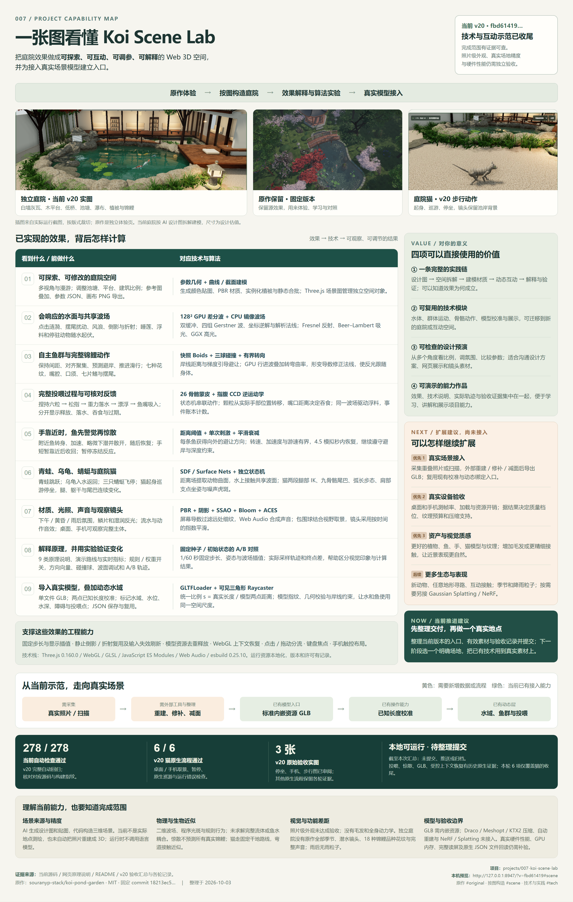

# 项目能力总览 · v20

整理于 2026-10-03。当前运行构建为 `fbd61419d326470cdd2a69f4f44bf06fad42c4faa8020e478b1f3f9fd0046b36`。

[单张高清总览图](../assets/project-overview-v20.png) · [可编辑排版源](../assets/project-overview-v20.html) · [本机预览](http://127.0.0.1:8947/?v=fbd61419#scene)



## 结论与使用价值

项目已形成可探索、可互动、可调参、可解释的 Web 3D 庭院示范。三个网页入口分别为原作体验、按图构造、技术与实践。对于用户，它提供了设计图到三维空间的实践链、可复用的水体与角色行为模块、可检查的设计预演，以及带实验和验收证据的能力作品。

当前可以收尾技术与互动示范。下一阶段建议选一个真实地点，采集照片或扫描、在外部工具重建并整理成标准 GLB，使用已有的尺寸校准和动态水域绑定入口。真实硬件测试与高质量资产可随后按用途推进；新动物、寻路、季节天气和 NeRF / Gaussian Splatting 属于扩展建议，不是已完成能力。

## 图中信息与依据

| 图中模块 | 主要依据 |
| --- | --- |
| 原作保留、来源、固定版本与许可 | [README](../README.md)、[上游锁定记录](upstream-lock.json)、`web/upstream/` |
| 参数空间、材质、植被与展示 | `src/config.js`、`geometry.js`、`materials.js`、`vegetation.js`、`scene.js` |
| GPU / CPU 波场、风浪、反射折射与浮料 | `src/ripples.js`、`ripple-field.js`、`water-motion.js`、`water.js` |
| 鱼群、解剖、嘴口、形变与材质 | `src/fish-steering.js`、`fish.js`、`koi-anatomy.js`、`koi-motion.js`、`koi-material.js` |
| 手部、六粒投喂、动作和事件计数 | `src/hand-rig.js`、`interaction.js`、`feed-ledger.js`、`feeding-status.js` |
| 鱼群警觉、惊散与恢复 | `src/fish-startle.js`、`fish.js`、[v19 行为记录](wildlife-v19.md)、[v19 原生结果](browser-v19-final-validation.json) |
| 动物与猫的当前自然感、坐姿、步态与镜头 | `src/animals.js`、`animal-anatomy.js`、`cat.js`、`cat-anatomy.js`、`cat-motion.js`、`cat-view.js`、[v20 技术说明](cat-refinement-v20.md) |
| 网页 9 类说明、价值、验证入口与 A/B | `src/principles.js`、`principle-learning.js`、`experiment.js`、`experiment-config.js`、`web/index.html` |
| GLB 导入、统一尺度、动态绑定与 JSON | `src/scene-binding.js`、`calibration-ui.js`、`habitat-geometry.js`、`scene-json-ui.js`、`scene.js` |
| 工程能力、暂停缓存、上下文与手势 | `src/simulation-clock.js`、`pose-history.js`、`water-pass-policy.js`、`scene.js`、`canvas-gestures.js`、`scene-keyboard.js`；README v17 / v18 记录 |
| 278 / 278 自动、6 / 6 猫原生、3 张当前验收实图 | [v20 汇总](v20-validation-summary.json)、[自动检查](numerical-v20-result.json)、[原生流程](browser-v20-validation.json)、[三图清单](v20-capture-manifest.json) |

网页 9 类主题与总览图的 9 行是两种汇总方式，数量相同不表示逐行使用相同分类：图将鱼群与鱼体合并，并单独列出空间展示。原作所有效果仍在独立体验页；独立庭院没有全部迁移原作的季节、潜水镜头、18 种锦鲤品种花纹和完整声音。

## 图像与验收范围

- 庭院全景：本次在相同 v20 构建中通过本地隔离浏览器打开默认参考视角，用原生空格键暂停后直接捕获画布。实际 HTTP 指纹匹配当前构建，页面 / console 错误和外部资源请求均 0。[捕获记录](overview-capture-v20.json)。这是展示截图，没有新增完整功能或性能验收。
- 原作图：已有固定版本 `assets/original.png`，作为原作体验插图。
- 猫步行图：已有 v20 原生验收原图 `assets/cat-walk-v20.jpg`，来源与 SHA-256 见 v20 捕获清单。
- 图由 HTML / CSS 排版，插图仅按版式裁切。文本可编辑，使用本地 Chromium 输出单张 PNG；没有生成或改绘运行效果。[排版检查与文件指纹](overview-render-v20.json)。
- 278 项是当前全套自动检查；6 项当前原生检查只覆盖猫的收尾。投喂、惊散、GLB 与一次受控 WebGL 恢复保留各轮原生证据，不能合并成当前构建的全面原生通过。
- 照片级外观、实际地点测量精度、真实设备性能、GPU 内存、完整读屏与原生 JSON 文件回读没有完整验收。水体、动物、接触、光照包含明确的实时近似。
- 截至本次整理尚未提交、推送或归档。总览图和文档新增不改动场景源码、JS 构建或原有验收记录。

## 重现总览图

`tooling/capture-overview-v20.mjs` 可在本机预览服务运行时重新捕获默认庭院画布；它依赖本任务主机配置的 Playwright 路径。`tooling/render-overview-v20.mjs` 读取 HTML 和本地插图，检查图片完整加载、9 行映射、无横向溢出并重新输出 PNG；换机器时需调整 Playwright 位置和安装中文字体。

```powershell
node projects/007-koi-scene-lab/tooling/render-overview-v20.mjs
```
