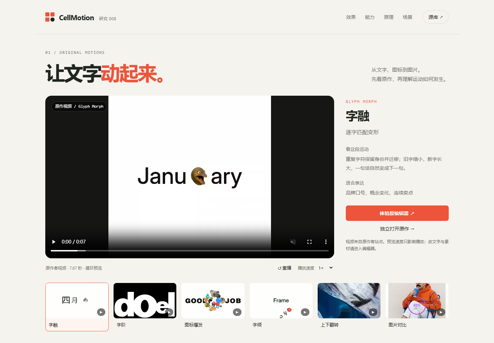
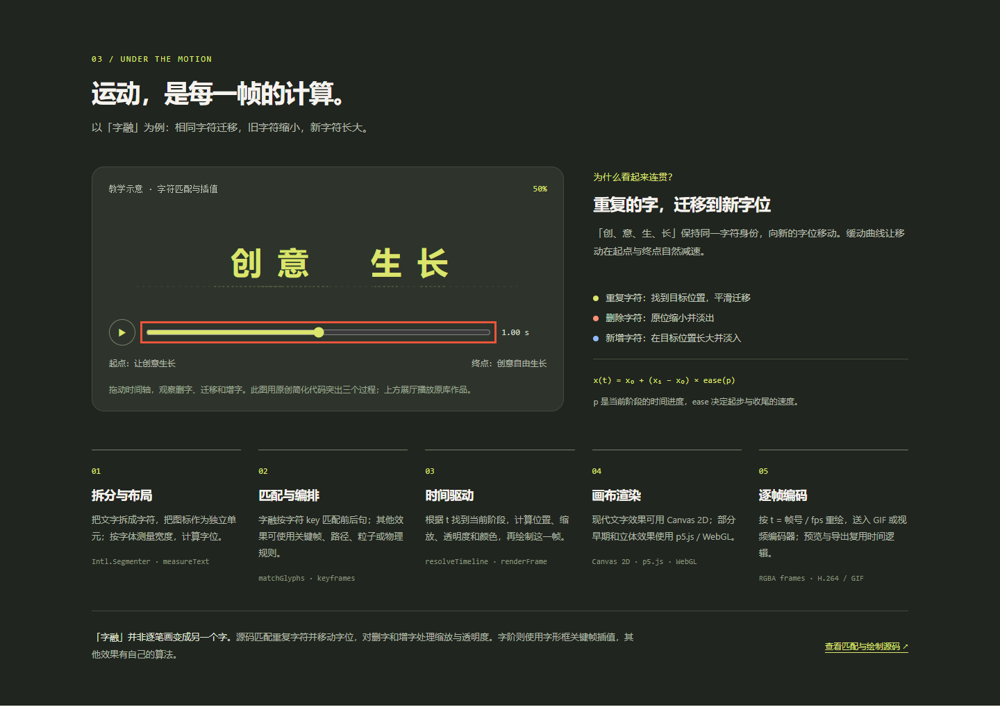
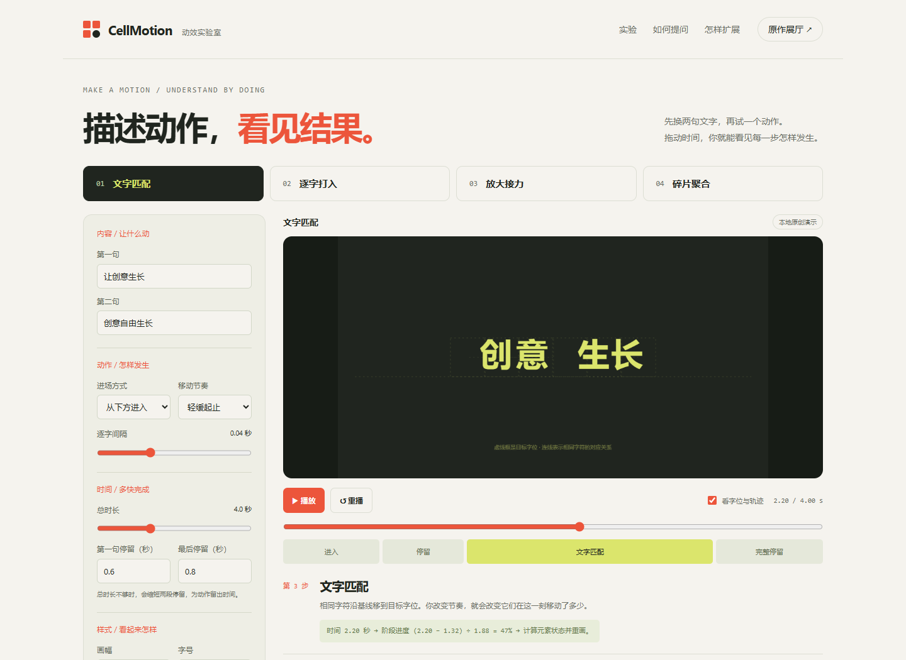

# 008 · CellMotion · 可编辑动效研究

先看原作动效和成片，再理解可编辑能力、实现原理和使用场景。

[完整在线入口与原作展厅](https://yydshly.github.io/0930_codex_project/projects/008-cellmotion/) · [动手实验室](https://yydshly.github.io/0930_codex_project/projects/008-cellmotion/workshop.html) · [理解总览与引导图](https://yydshly.github.io/0930_codex_project/projects/008-cellmotion/summary.html) · [3 支原作成片](https://yydshly.github.io/0930_codex_project/projects/008-cellmotion/#stories) · [全部动效目录](https://yydshly.github.io/0930_codex_project/projects/008-cellmotion/#motion-index)

[全部理解汇总](notes/understanding-summary.md) · [怎样提问和扩展](notes/workshop.md) · [深入研究](notes/research.md) · [原库](https://github.com/opc8838-hub/font-animation) · [原作者官网](https://opc8838-hub.github.io/font-animation/cellmotion.html#stories)

| 信息 | 内容 |
| --- | --- |
| 研究日期 | 2026-10-02（Asia/Shanghai） |
| 上游版本 | [bee7ddfc2b](https://github.com/opc8838-hub/font-animation/commit/bee7ddfc2b1f487e08aa79a3b91af7628f040eb1) |
| 目录范围 | 69 条记录：37 个 ready、32 个 pending；19 个已完成动效有原作视频预览 |
| 根许可证 | [CC BY-NC-SA 4.0](https://github.com/opc8838-hub/font-animation/blob/bee7ddfc2b1f487e08aa79a3b91af7628f040eb1/LICENSE)；各第三方资源另有许可 |
| 演示方式 | 原作者在线媒体、按需嵌入的原编辑器、本地原创原理示意 |
| 在线发布 | 2026-10-08 已通过 GitHub Pages 发布；3 个页面、15 个公共文件内容及 42 项线上浏览器检查通过 |

## 完整网站与主要入口

网站同时提供原作展厅、原创动效实验室和理解总览三个页面。展厅开头的入口区直接连接四种可编辑演示、总览图、全部动效目录、三支原作成片、AI 日报扩展方案、原作者网站和完整研究资料；仓库研究集首页也提供这些入口。摘要按定位、能力、效果、原理、场景、价值、工具比较、扩展和边界逐项说明。

本次发布沿用上方已生成的理解总览图，PNG 内容不变。原作视频、封面和编辑器仍由原作者网站提供，原创实验室与理解总览由本站完整发布。源库能力采用 2026-10-02 固定提交的研究范围，发布验证另行记录。

首次内容发布提交为 [643537e2](https://github.com/yydshly/0930_codex_project/commit/643537e2ac736866bfa2700ae05fd78307cd6137)，[Pages 构建与部署](https://github.com/yydshly/0930_codex_project/actions/runs/37734271754)成功。公网核对全部 15 个文件的 HTTP 200 与 SHA-256，42 项浏览器交互检查通过；13 个研究入口和既有项目链接可访问。PNG 原图校验值为 `d982837123f17f1f83e9e7a664f9e31cbedf6d5d603553b8f874b21b5d822ffe`。实测包含原作视频、三支成片播放、原编辑器打开、实验室导出与恢复、原图下载、内部锚点和手机布局；没有以访问检查替代所有编辑器功能实测。

## 一张图整理所有理解


代码定义运动规则，参数控制表现，编排组织过程。CellMotion 提供具体动效；Remotion 提供 React 视频框架与渲染；HeyGen 提供 AI 视频服务。三者可配合，当前原创实验室独立使用 JS + Canvas 2D。

[总览页](web/summary.html) 同时盘点原作展厅、原创实验室、已完成能力与后续扩展。[完整汇总](notes/understanding-summary.md) 包含源库证据、比较表、个人价值与 AI 日报制作方案。总览图可下载为 [PNG](assets/understanding-map.png) 或 [SVG](web/assets/understanding-map.svg)。自动日报、音轨、整片与批量视频尚未实现。

## 先看效果



页面开头直接展示原库视频。六个快速入口是字融、字阶、图标爆发、字倾、上下翻转、图片对比。完整目录可按文字、图标、媒体、流动、空间、物理六类浏览，待上新条目不混入已完成能力。无视频的条目明确显示静态封面，可进入原编辑器查看运动。

下方接入官网三支成片案例，说明独立动效组合后的视觉表达。视频与封面由原作者站点加载，不下载或重新分发原作媒体。目录固定为本次提交快照，在线媒体与编辑器仍可能随上游网站更新。

## 能做什么

- 编辑中文与多语种文字，调整字体、字号、字距、对齐、位置和逐行内容。
- 在支持的工作台中插入内置图标、图片和 GIF；部分工作台支持视频与逐段背景、媒体裁剪。
- 修改速度、停留和阶段时长，以及所选效果的独立参数。
- 设置画幅，预览并导出 PNG、GIF 或 MP4；实际支持项以各编辑器为准。
- 部分编辑器可复制 AI 提示词、配置代码与组件 JSON，描述当前内容与样式，供接入已有运行时。

目前以单动效编辑为主，站内视频拼接器尚未开放。官网把通用网页组件标为规划中；部分源码已有 player / iframe 配置出口，不能据此把所有条目视为成熟通用组件或自动视频生成接口。

## 底层怎么做

核心是把内容拆成设计单元，根据时间计算状态，再绘制当前帧。

1. 字符与图标拆分、字体测量和字位布局。
2. 按效果建立字符匹配、关键帧、路径或物理规则。
3. 根据当前时间定位阶段，计算位置、缩放、透明度和颜色。
4. Canvas 2D 或 p5.js / WebGL 绘制结果。
5. 导出时按「时间 = 帧号 / fps」重绘，把像素送入 GIF / H.264 MP4 编码器。

字融的 matchGlyphs 按 token key 查找未被占用的目标字符。重复字符移动到新位置，删除字符缩小并淡出，新增字符长大并淡入；并非所有字形逐笔画相互变形。字阶采用字形边框关键帧与分阶段插值，其他效果有独立算法。



本地时间轴示意使用原创简化代码，并把删字、迁移、增字分开以便观察。它解释匹配与插值，不冒充原库渲染，也不在本页执行原库视频导出。详见 [源码证据与边界](notes/research.md)。

## 动手理解，怎样提出制作需求

新增 [原创动效实验室](web/workshop.html)：换自己的两句文字，比较文字匹配、逐字打入、放大接力、碎片聚合四种运动。支持调整进场、缓动、逐字间隔、停留、总时长、画幅、字号、颜色，并用本地图片替换一个字位。



拖动时间轴，会显示当前阶段、进度算式与正在计算的属性。将用途和交付形式补齐后，页面生成可复制的需求，包含内容、动作、时间、样式、输出和验收。可以保存当前帧 PNG，保存/载入带素材的 JSON 配方。

这是独立编写的 JavaScript + Canvas 2D 教学扩展，与展厅中的原作效果分别注明来源。实验室未接入 AI 或视频编码。音轨、长片、批量视频与 3D 是明确列出的后续扩展方向。具体提问示例、修改反馈、计算原理及扩展模块见 [操作与原理说明](notes/workshop.md)。

## 怎么运行，支持什么系统

本研究展厅是静态 HTML/CSS/JavaScript，无构建或第三方运行依赖。直接打开 web/index.html，或在仓库根目录运行：

```powershell
python -m http.server 8958 --bind 127.0.0.1 --directory projects/008-cellmotion/web
```

访问 http://127.0.0.1:8958/ ，实验室入口为 http://127.0.0.1:8958/workshop.html ，理解总览为 http://127.0.0.1:8958/summary.html 。文字原理示意、实验室与总览本地运行；原作视频、封面和原编辑器需要联网。支持现代桌面与移动浏览器，本轮在 Windows / Chrome 验证；没有声称完成 Safari、Firefox 或所有手机机型测试。

原库本身为静态站，HTTP 服务即可启动。p5.js 字体读取等操作不适合直接用 file:// 打开原编辑器；CDN、字体、媒体加载及视频编码也会影响环境要求。

## 适合哪些场景

| 目标 | 可选效果 | 使用方式 |
| --- | --- | --- |
| 品牌口号与活动标题 | 字融、字芽、字阶 | 用字符交接表达概念变化，用逐字放大强调关键词 |
| 产品功能与搜索流程 | 搜写、图标爆发、字标接力 | 逐次展示功能，让文字与图标配合传达卖点 |
| 修图前后与作品对比 | 图片对比、快门对比 | 固定对比关系，再用明确的切换节拍突出结果 |
| 商品与照片展示 | 无重力翻转、上下翻转 | 把图片切换编排为空间运动或转场 |
| 短视频与教学内容 | 字倾、轨书、速序轮播 | 制作章节标题、开场署名与关键词片段，导出后剪辑 |

这些是根据效果形式推导的使用建议，不是用户转化、制作效率或商业收益实测结论。商业项目需核对对应效果和素材的授权；仓库根许可包含非商业限制。

## 对我们有何价值，怎样扩展

主要价值是复用已有运动编排和编辑器框架，把创作精力放在文案、素材、节奏和视觉一致性上。它提供从设计参数到浏览器绘制、再到确定性逐帧导出的具体实现样本。

原创实验室已实现自己的配方保存与恢复、四种算法示例和制作需求生成。可继续研究原库的统一组件 Schema、设计 token、长片片段拼接、音轨、导出性能和浏览器兼容性；这些更广泛的模块仍属于后续方向。

## 验证与保存

- [浏览器验证记录](notes/verification.json)：视频播放、目录筛选、静态封面标识、原理时间轴、真实编辑器与响应式布局。
- [补充布局验证](notes/layout-verification.json)：手机标题、原理中间帧与实际导出图展示；两次浏览器检查共 32 项通过。
- [原创实验室验证](notes/workshop-verification.json)：四种中间帧与共同终点、确定性跳转、播放暂停、素材恢复、PNG/JSON、需求复制、无效输入与移动布局。
- [理解总览验证](notes/summary-verification.json)：16 项检查通过，包括总览图、PNG/SVG 下载、页面导航、手机图表滚动及无脚本错误。
- [原站资源检查](notes/resource-checks.json)：原作媒体和编辑器入口的访问记录。
- [版本与范围](notes/source-lock.json)：源库 commit、研究日期和引用方式。
- [网站发布清单](notes/publication-manifest.json)：三个网页及全部静态文件、沿用原图的 SHA-256、外部媒体范围。
- [本机发布检查](notes/publication-browser-local.json)：42 项实际播放、原编辑器、跨页导航、全部内部链接、PNG/JSON 保存与恢复、原图下载、桌面与手机布局检查通过。
- [线上发布检查](notes/deployment-checks.json)与[线上浏览器验证](notes/publication-browser-online.json)：全部 15 个公共文件内容及 42 项浏览器检查通过，无脚本错误或访客本机服务请求。
- [相关入口核对](notes/publication-entries.json)与[发布记录](notes/deployment-summary.json)：研究集首页、原站、研究文档及既有公开项目地址均可访问。
- [发布前原站地址检查](notes/publication-upstream-checks.json)：2026-10-08 的 99 个媒体、封面与编辑器地址 HEAD 检查通过；只证明可访问，不代表全部编辑器功能实测。
- [验证脚本](tooling/verify.cjs)：使用本机已有 Playwright / Chrome。
- 页面的目录、文案、样式、交互、截图和研究文档均在本子项目内，总清单通过 scripts/projects.py 管理。

本轮实测字融编辑器的中文修改、画布重绘与 PNG 导出，实际结果见 [1080 × 1080 PNG](assets/edited-export.png)。99 个原站资源入口通过 HEAD 检查。HEAD 只确认访问状态，不证明全部编辑器功能；本轮没有执行 GIF / MP4 导出或完整 AI 组件接入。

## 来源与许可

创意与原作效果来自 CellMotion / opc8838-hub。部分早期效果源自 Kiel Mutschelknaus 的 Space Type Generator；逐字形变参考 LTMorphingLabel。字体和图标按上游对应许可使用。

本页说明、布局与教学示意独立编写，没有批量复制上游源码或媒体。截图包含注明来源的原作预览与原编辑器，用于本次研究。代码证据链接固定到上述提交，在线媒体和工作台链接指向作者当前站点。

[返回总索引](../../README.md#项目索引)
