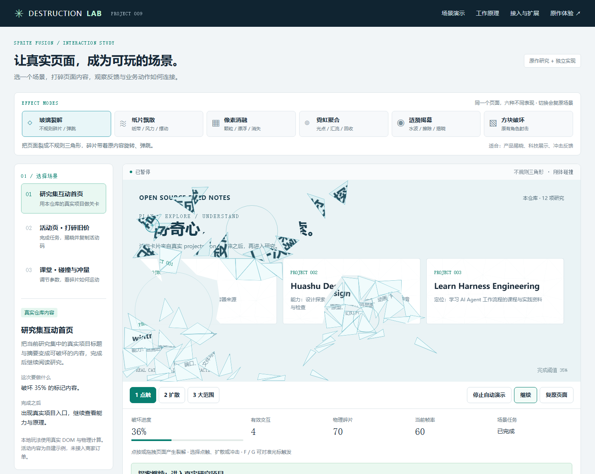
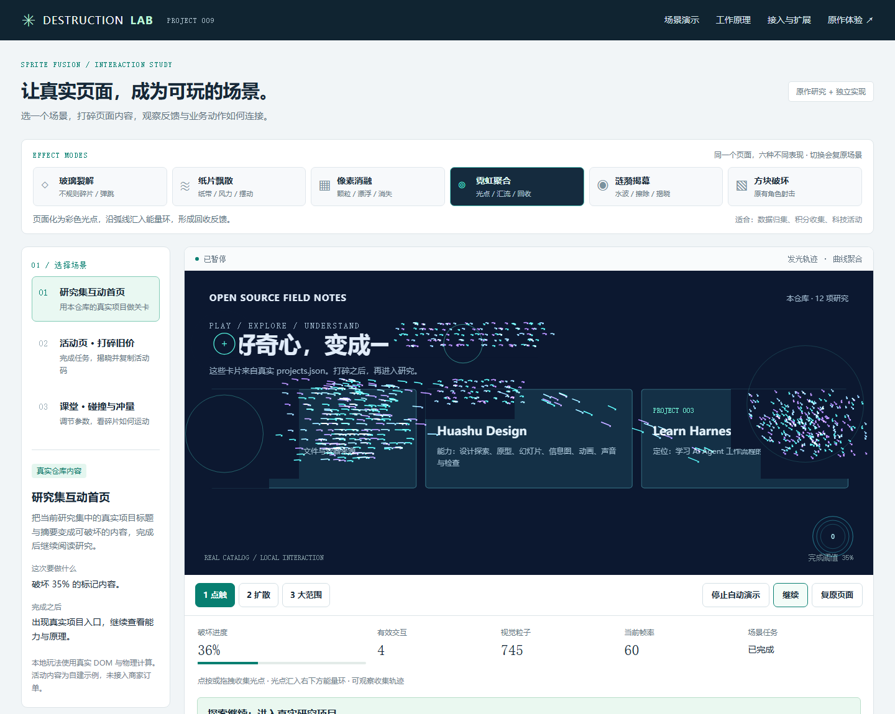
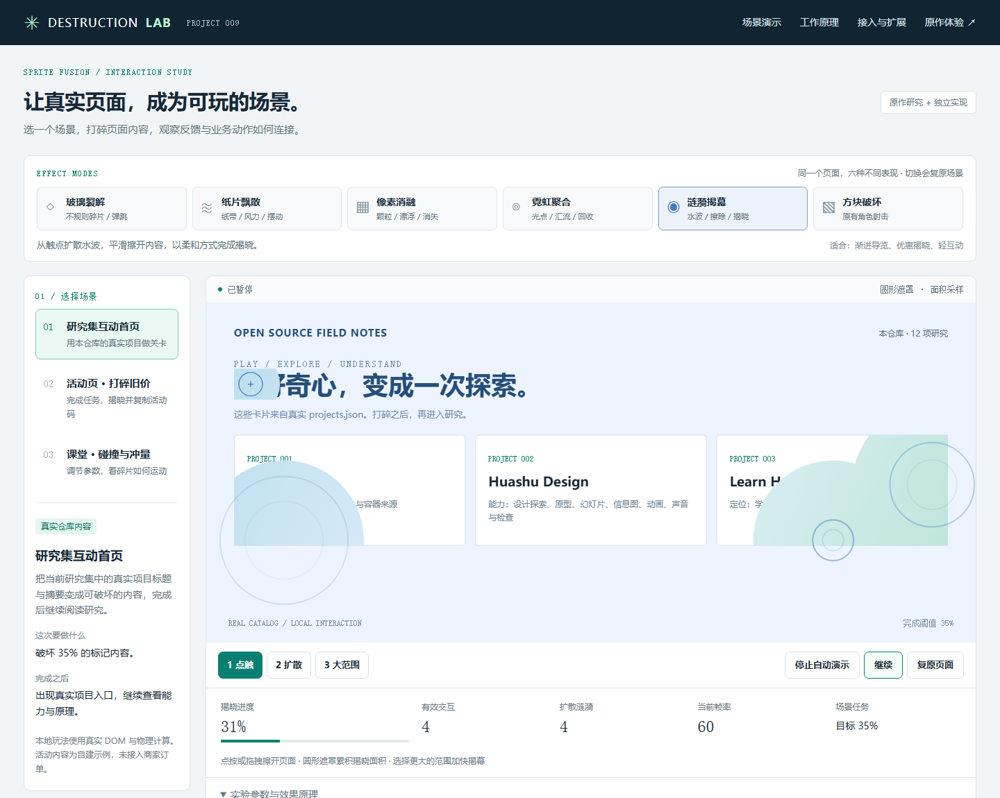
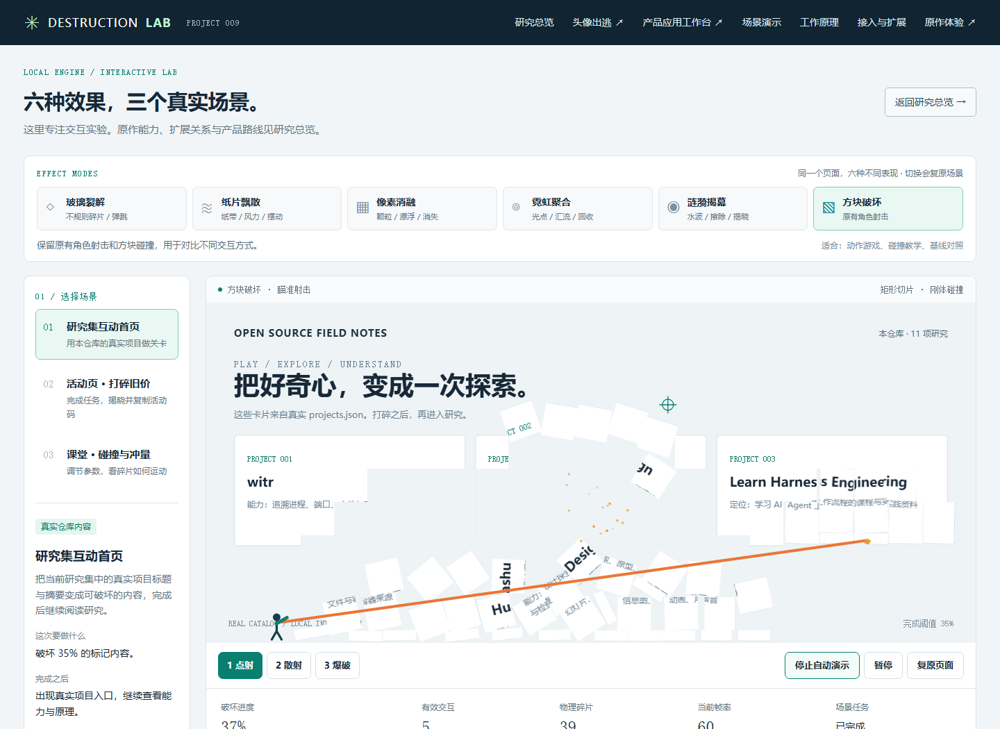
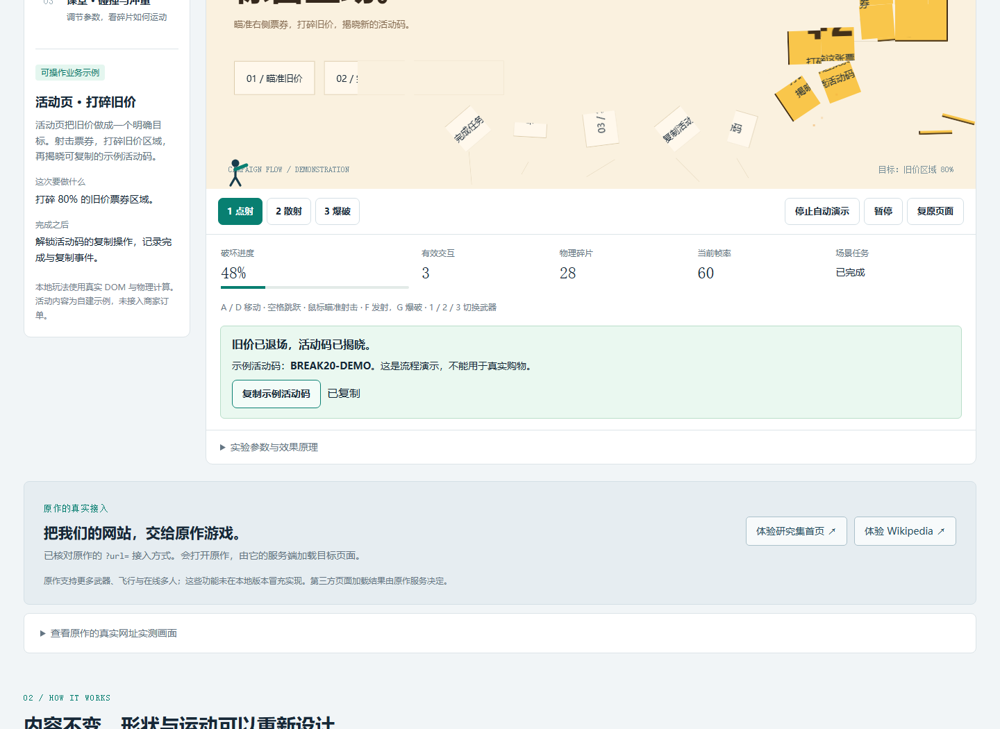
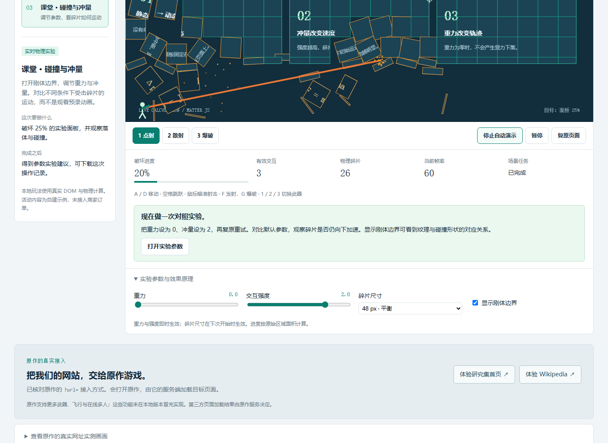
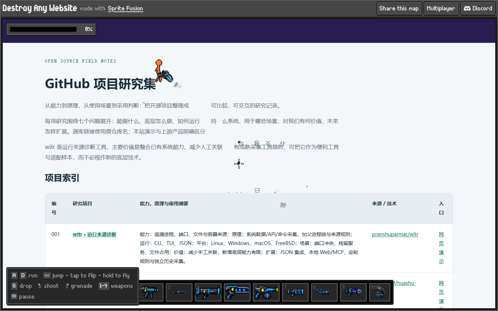

# 009 · Sprite Destruction Lab · 网页破坏交互研究

[研究总览网页](https://yydshly.github.io/0930_codex_project/projects/009-sprite-destruction-lab/) · [完整研究汇总](notes/research-summary.md) · [一图总览 SVG](web/research/overview.svg) · [高清 PNG](web/research/overview.png)

研究起点是 Destroy Any Website 网页游戏；未确认公开网页破坏 SDK 或服务端源码。本地 DestructionEngine 为独立实现，Matter.js 0.20.0 与 html2canvas 1.4.1 是本地技术基础，不能据此认定原作用了这些库。

核心结论：现有网页内容可作为视觉输入；效果层负责运动与反馈，产品仍需自己的任务、数据和业务服务。角色与截图宿主能扩展玩法，翻译、摘录、表格及其他任务工具另有实现。

## 研究入口与能力归属

| 研究入口 | 与核心的关系 | 说明 |
| --- | --- | --- |
| [六效果与三场景](https://yydshly.github.io/0930_codex_project/projects/009-sprite-destruction-lab/lab.html) | 直接复用引擎 | 刚体、粒子、遮罩、阈值与事件 |
| [头像出逃](https://yydshly.github.io/0930_codex_project/projects/009-sprite-destruction-lab/avatar/) | 引擎 + 角色层 | 预设身体与动作、静态头像头部、踢击 / 召回 / 恢复 |
| [跨站头像扩展与实录](https://yydshly.github.io/0930_codex_project/projects/009-sprite-destruction-lab/avatar-anywhere/#proof) | 引擎 + 浏览器宿主 | 当前视口纹理、选中元素、独立 Chrome / Edge 扩展 |
| [六工具产品工作台](https://yydshly.github.io/0930_codex_project/projects/009-sprite-destruction-lab/products/) | 动效复用；其余独立交互 | PNG / WebM、报告、维护记录、CSV 故事、作品册和组件 |
| [网页工具箱](https://yydshly.github.io/0930_codex_project/projects/009-sprite-destruction-lab/toolbox/#tables) | 另外开发 | 外部翻译服务、DOM 采集、笔记、表格、文本工具与独立扩展 |

角色不自动从照片生成全身或骨骼；工具箱不来自碎裂引擎。GitHub 15.48 秒为真实浏览器录制，操作由脚本完成；临时测试扩展放开截图权限，下载版人工授权步骤未在录像验证。翻译曾成功且真实遇到 HTTP 429。

发布范围与当前验收见 [2026-10-08 发布记录](notes/publication-20261008.md)。

详细资料：[原作研究](notes/research.md) · [效果模式](notes/effect-modes.md) · [角色原理](notes/avatar-mischief.md) · [跨站扩展](notes/avatar-anywhere.md) · [产品工作台](notes/product-workbench.md) · [工具箱](notes/web-toolbox.md)。后续扩展与采用判断见完整研究汇总。

## 能力展示

| 能力 | 原作 | 本地演示 |
| --- | --- | --- |
| 网站关卡 | 输入网址，由原作服务取得页面 | 自有 DOM，真实仓库项目清单 |
| 角色操控 | 移动、跳跃、飞行 | 移动、跳跃、键盘与触屏 |
| 破坏效果 | 文字、页面块、武器与手雷 | 网格纹理、重力、旋转与真实刚体碰撞 |
| 武器 | 官方介绍列出七种武器 | 角色点射、散射、爆破；五种新模式直接点击或拖拽 |
| 多人 | 房间、邀请与比分 | 未实现，提供原作入口和扩展说明 |
| 业务动作 | 分享、嵌入、制作工具入口 | 进入真实研究、示例活动码复制、事件下载 |
| 原理观察 | 公开客户端代码核对 | 边界线、实时重力与强度、切片尺寸 |

## 六种效果模式

模式与三个真实场景分开选择：同一个页面可以使用玻璃裂解、纸片飘散、像素消融、霓虹聚合、涟漪揭幕或原有方块破坏。五种新模式支持直接点击与拖拽；不需要角色射击。切换时复原页面，默认打开玻璃模式。

| 模式 | 实际差异 | 适合用途 |
| --- | --- | --- |
| 玻璃裂解 | 不规则三角片、旋转与弹跳 | 产品揭晓、科技展示 |
| 纸片飘散 | 细长纸带、轻风与摆动 | 编辑内容、邀请函、节庆 |
| 像素消融 | 真实纹理颜色、颗粒漂浮与消失 | 游戏入口、数字转场 |
| 霓虹聚合 | 彩色光流、能量环回收 | 数据归集、积分反馈 |
| 涟漪揭幕 | 水波扩散、圆形渐进擦除 | 导览、轻互动、活动揭晓 |
| 方块破坏 | 原有角色射击与矩形刚体 | 动作游戏、对比基线 |







玻璃、纸片与方块使用 Matter 刚体；像素和霓虹采用粒子动画，涟漪采用遮罩和面积采样。不同模式的输入提示、参数和统计随之变化。接口支持 effect 参数：glass、paper、pixels、neon、ripple、classic。原有外部接入的构造默认仍为 classic。

详见 [模式原理与扩展](notes/effect-modes.md) 和 [49 项模式验证](notes/effects-checks.json)。模式验证 49 / 49、原有浏览器 21 / 21、几何与物理测试 8 / 8 全部通过；没有据此宣称像素动画具有真实碰撞或揭幕进度达到像素精度。

## 三个可操作场景

### 1. 研究集互动首页

tooling/prepare.mjs 从根目录 projects.json 读取真实研究清单，前三项真实项目成为关卡内容。破坏 **35%** 标记区域后，解锁真实研究网页入口。自动演示调用与人工操作相同的射击和物理逻辑，不是预录视频。

操作：开始 → 瞄准卡片射击 → 观察碎片与进度 → 完成后进入研究。用途是检验可玩入口是否促进阅读；没有线上阅读转化数据，不能声称已证明增长。



### 2. 活动页：打碎旧价，揭晓活动码

自建活动页含真实 DOM 票券。任务只统计 **旧价票券**，达到 **80%** 后解锁 BREAK20-DEMO。按钮实际写入剪贴板；不可用时展示手动复制文本。开始、命中、完成与复制事件真实记录。

这是可操作流程示例，商品、价格与活动码不具有交易或核销效力。真实优惠券需要服务端资格校验、发放和核销接口。



### 3. 课堂：碰撞与冲量

打开边界线 → 射击面板 → 观察解除固定、旋转与碰撞 → 重力设为 0、强度设为 2 → 复原重试并对比。

重力和强度即时生效，切片尺寸在下次开始时生效。Matter.js 为近似二维刚体求解，适合教学，不作为工程精度测量。攻击强度映射为初始速度变化，公式解释动量、冲量与重力。



## 原作的真实网址场景

- [原作加载本研究集首页](https://destroy.spritefusion.com/?url=https%3A%2F%2Fyydshly.github.io%2F0930_codex_project%2F)
- [原作加载 Wikipedia 的 Stick figure 页面](https://destroy.spritefusion.com/?url=https%3A%2F%2Fen.wikipedia.org%2Fwiki%2FStick_figure)

两个网址均已在本次 Chromium 实测中进入游戏关卡；代理页面返回 HTTP 200。原作处理真实研究集的中文文字，射击截图可见字符碎片。初次可见性判断误用固定定位元素的 offsetParent，已修正后重测。两秒射击后整数进度仍为 0%，不把此结果当作全关卡破坏率测量。



来源：Destroy Any Website / Hugo Duprez · Sprite Fusion。截图用于注明来源的研究说明，未复制游戏程序。详细代理响应、客户端脚本哈希和结果见 [上游实测记录](notes/upstream-checks.json)。两个案例不能证明所有网站兼容；本次未验证多人。

## 工作原理

**原作已核对的客户端：** 静态路径请求 /api/page?url=… 取得 HTML，脚本路径使用 /p/{protocol}/{host}… 代理；受限 iframe 中采集元素矩形、计算样式、文字和绘制信息，再转换成关卡。房间使用 WebSocket，关卡数据有压缩传输路径。未取得服务端源码，不能推定代理内部处理、权威机制或完整同步算法。

**本地 DOM 实验实现（快照输入与角色接口见完整研究汇总）：**

1. html2canvas 根据自有 DOM 和支持的 CSS 重建图像，并非浏览器原生截图。
2. data-destructible 标记区域，data-tag 为目标分组，按 36 / 48 / 64 px 网格切片。
3. 每片保留原始图像坐标，创建有限质量和惯量的动态 Matter 刚体，再将其固定。
4. Matter.Query.ray 找到第一个未破坏块，命中后解除固定并赋予初始速度；散射和爆破改变命中范围。
5. 刚体进入重力与碰撞求解，Canvas 纹理跟随位置和角度绘制。
6. 按原始面积统计进度，任务可只统计指定标签；完成事件交给场景业务处理。

游戏期间源 DOM 隐藏并设为 inert，避免误操作不可见内容。复原销毁物理世界、动画和监听器；窗口尺寸变化会复原并提示重新开始，避免纹理与坐标不一致。

详见 [研究笔记](notes/research.md)。

## 如何运行、支持什么系统

网页无需密钥或在线 CDN。需要支持 ES Modules 和 Canvas 的现代浏览器；手机支持点按射击和移动按钮。本次实测 Chromium 与 390 px 手机尺寸，尚未逐项验证 Safari / Firefox。

仓库根目录：

```powershell
cd projects/009-sprite-destruction-lab/tooling
npm ci --ignore-scripts
npm run prepare
cd ../../..
python scripts/projects.py check
python scripts/build_site.py
python -m http.server 8949 --bind 127.0.0.1 --directory _site
```

研究首页：https://yydshly.github.io/0930_codex_project/projects/009-sprite-destruction-lab/ 。原可玩实验移到同目录 `lab.html`，其余产品、头像和工具入口保留。仅看已有网页时直接启动最后一行；依赖或清单变更后重跑 prepare 和构建。必须通过 HTTP 提供页面，不用双击 HTML。

`lab.html` 控制：A / D 移动、空格跳跃、鼠标瞄准和按住射击、F 发射、G 爆破、1 / 2 / 3 切换武器。另有自动演示、暂停、复原和触屏按钮。研究总览图支持放大、缩放及 SVG / PNG 下载。

## 对我们的价值

- **可玩展示：** 实际体验说明能力，任务完成后接入阅读或业务动作。
- **内容复用：** 自有网页、真实清单成为输入，场景变化不必重写运动系统。
- **可观察流程：** 下载真实事件，复盘开始、命中、完成、进入研究或复制活动码。
- **采用边界：** 底层来自成熟网页与物理库；新增价值是适配、交互和流程整合，没有独占物理能力。
- **成本判断：** 先验证自有页面的参与和后续动作，再决定采集服务与多人服务器投入。当前无留存、付费或运营成效数据。

## 可扩展性

| 扩展点 | 当前接口 | 后续工作 |
| --- | --- | --- |
| 新场景 | scenes.js：HTML、阈值、标签、结果 | 接入自有内容与业务动作 |
| 物理与效果 | setOptions()，构造时选切片尺寸 | 新武器、细粒度碎裂、音效和材质 |
| 页面接入 | canvas、source、onEvent | 布局、字体、图片适配，避免嵌套标记 |
| 任务与统计 | 全局面积、指定标签、complete 事件 | 会话去重、漏斗和埋点接口 |
| 真实营销 | 当前只有示例活动码 | 服务端资格校验、发放、核销和防重领 |
| 第三方网页 / 网址 | 扩展支持当前视口截图，按 URL 整页采集未实现 | 受控采集后端、缓存和兼容测试 |
| 多人 | 本地无联机服务器 | 权威状态、房间、输入校验、序号和重连 |

最小接入：

```js
import { DestructionEngine } from './engine.js';
const lab = new DestructionEngine({
  canvas: document.querySelector('canvas'),
  source: document.querySelector('.content'),
  threshold: 0.35,
  onEvent: event => { if (event.type === 'complete') revealNextStep(); }
});
await lab.prepare();
lab.start();
// 先加载 Matter.js 与 html2canvas；可破坏元素标记 data-destructible。
// 组件卸载时调用 lab.dispose()。
```

边界：二维近似刚体、粒子与遮罩并存；未破坏块采用射线命中或区域冲击。没有柔性材料、字符级破坏、真实子弹穿透、三维和多人同步。html2canvas CSS 支持有限，跨域图片需兼容 CORS；扩展截图只覆盖当前视口。GitHub Pages 不能承担采集、营销或联机后端。

## 验证与文件

- [研究图验证](notes/summary-image-checks.json)与[研究首页验证](notes/summary-checks.json)：文字边界、高清 PNG、放大 / 缩放、分类、真实入口、来源归属与 375 px 布局；脚本 `tooling/summary-qa.mjs`。
- [浏览器验证](notes/browser-checks.json)：21 项检查，三个场景、操作、完成与复制、暂停恢复、复原、参数、有限物理坐标、日志下载和移动尺寸。
- [真实事件样本](notes/sample-events.json)：浏览器实际产生，非人工填充统计。
- tests/physics.test.mjs：8 项面积、目标、射线、三角/条带和实际物理测试。
- tooling/qa.mjs：本地检查与截图；tooling/official-qa.mjs：两个上游网址实测。
- web/engine.js：引擎；web/scenes.js：场景；web/app.js：界面与业务动作。

在 tooling 执行 npm test。网页 QA 使用 Playwright，本机脚本读取工作区运行时路径；其他机器需替换脚本顶部路径。

## 来源与许可

- [原作](https://destroy.spritefusion.com/) 与 [官方介绍](https://www.spritefusion.com/games/destroy-any-website)。
- [核对的客户端脚本](https://destroy.spritefusion.com/_app/chunk-y5pn82dx.js)：URL 随发布变化；SHA-256 见上游记录，未取得开源许可，不分发原作程序。
- [Matter.js 文档](https://brm.io/matter-js/docs/) 与 [MIT 许可](https://github.com/liabru/matter-js/blob/master/LICENSE)。
- [html2canvas 原理与限制](https://html2canvas.hertzen.com/documentation) 与 [MIT 许可](https://github.com/niklasvh/html2canvas/blob/master/LICENSE)。
- [随网页提供的完整许可](web/licenses.html)。原创研究遵循根目录许可说明。

[返回总索引](../../README.md#项目索引)
