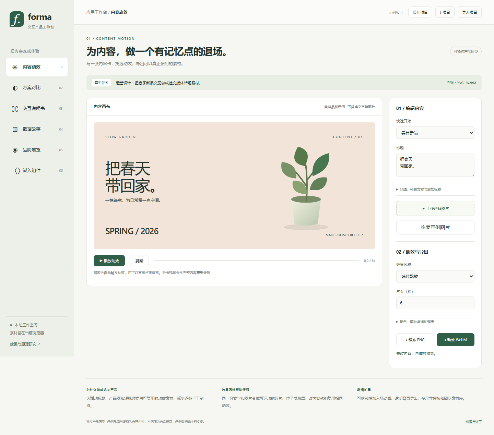
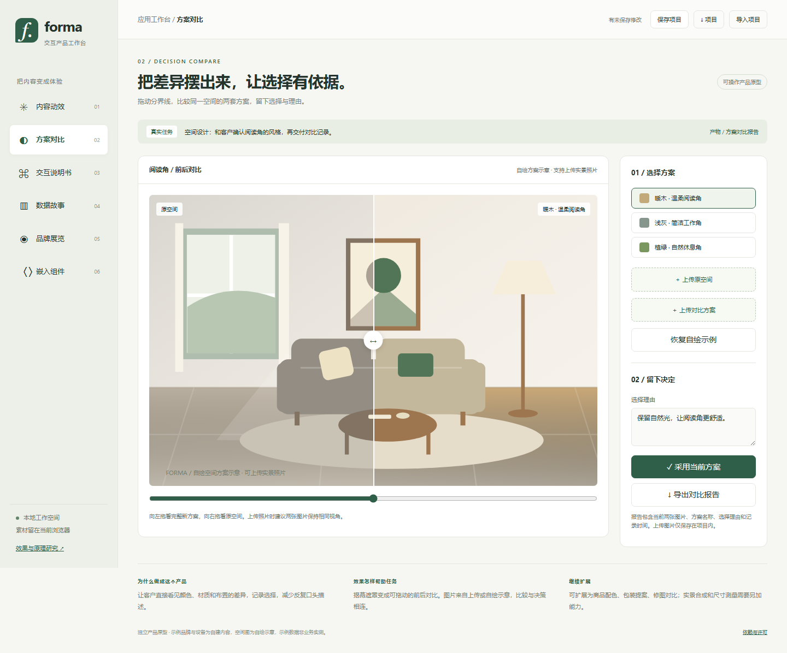
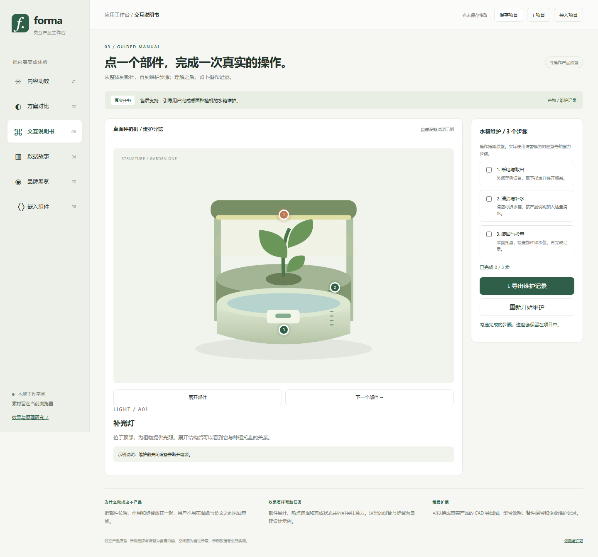
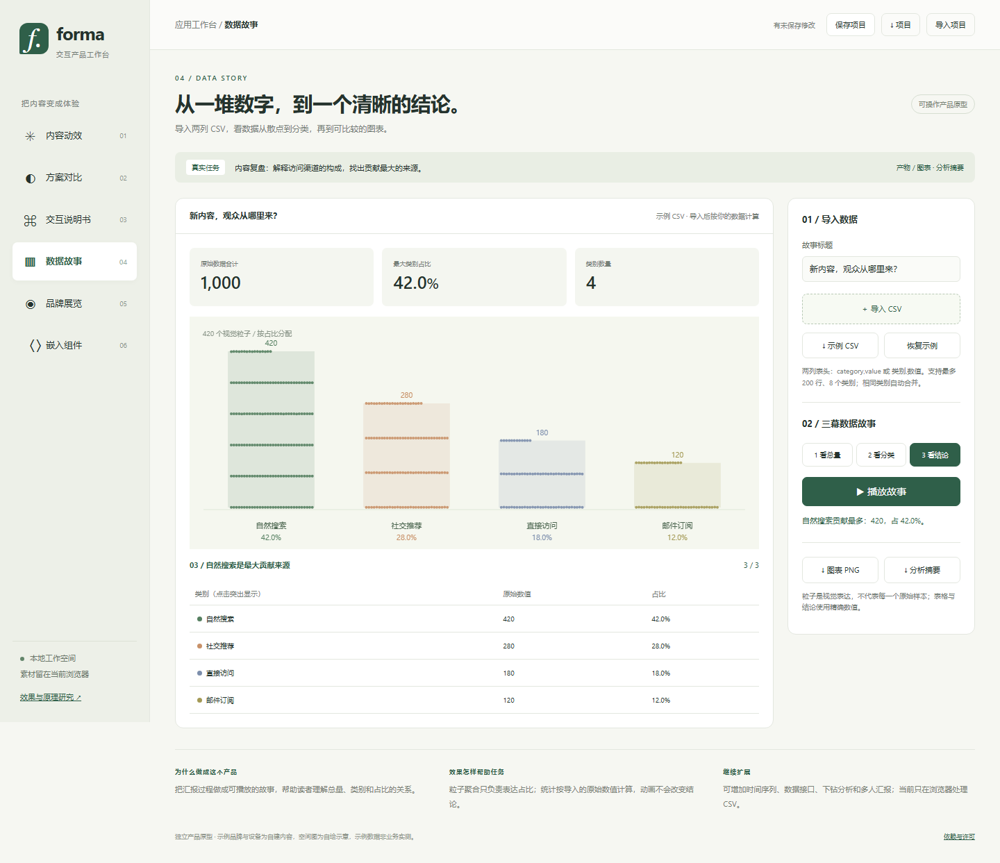
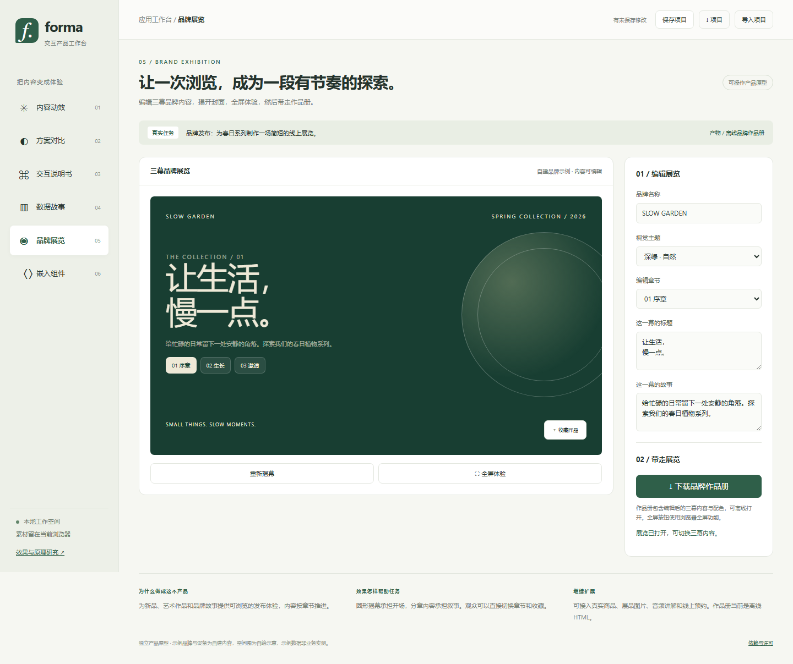
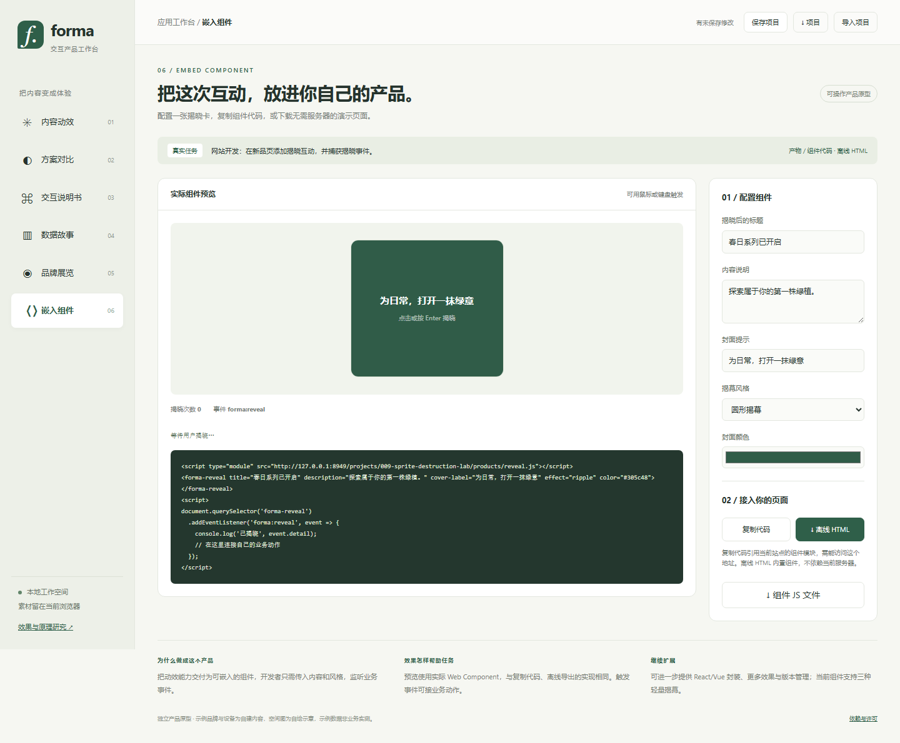

# Forma · 六种产品应用原型

用户需要直接体验非游戏产品的用途，因此在项目 009 内新增 `web/products/`。原来的六种效果研究与三个场景保留，新入口从研究页导航与首屏横幅进入。

[打开工作台](http://127.0.0.1:8949/projects/009-sprite-destruction-lab/products/#compare)

## 已实现的产品流程

| 工具 | 用户任务与输入 | 实际操作 | 可带走的产物 |
| --- | --- | --- | --- |
| 内容动效 | 运营制作活动或新品素材；文字与本地图片 | 模板、文字、图片上传，五种动效、强度、粒度、片长，播放/暂停/复原 | 当前画面 PNG、3–10 秒 WebM 视频 |
| 方案对比 | 设计提案确认；示例方案或两张实景照片 | 切换三套自绘风格、直接拖动图片分界线或滑块、填写理由并采用 | 含当前两张图片、方案、理由的离线 HTML 报告 |
| 交互说明书 | 售后维护指导；自建种植机说明示例 | 点击三个部件、展开/收起结构、逐步勾选维护进度 | 按实际勾选结果生成 Markdown 维护记录 |
| 数据故事 | 内容复盘；用户 CSV | 真实解析、类别合并、总量/分类/结论三幕播放、类别突出显示 | 当前图表 PNG、精确数值分析摘要、示例 CSV |
| 品牌展览 | 新品发布；可编辑的三幕品牌内容 | 开场揭幕、三幕导航、配色、收藏、浏览器全屏 | 内嵌编辑内容和主题的离线 HTML 作品册 |
| 嵌入组件 | 网站开发；内容、封面、颜色和风格 | 实际 Web Component 预览，三种揭幕、事件记录、代码复制 | 组件 JS、引用代码、无需本地服务器的 HTML 演示 |

六种工具共用版本化项目设置。保存使用当前浏览器的 localStorage；项目 JSON 可下载、校验后导入，包含用户上传的图片。保存失败（例如容量不足）会提示下载项目。没有账号、云存储、订单、消息或企业业务服务。

## 从效果到产品的变化

研究引擎负责“内容如何运动”；产品负责“用户输入什么、完成什么任务、带走什么结果”。内容动效直接复用 `DestructionEngine`，其余工具采用更适合各任务的遮罩、SVG 部件、Canvas 数据布局和 Web Component。原网页是创意研究来源；这些产品是本地新增实现，不是 Sprite Fusion 官方 SDK 或官方产品。

- 内容动效：将真实 DOM 内容渲染到 Canvas，按选定效果自动触发，录制 canvas.captureStream 的画面；上传图像进入相同纹理管线。暂停、复原、切换工具都会停止相应动画与监听。
- 对比：两张图片保持相同容器尺寸，CSS clip-path 随指针或滑块变化。更换待选方案会清除旧采用状态，防止将旧决定和新图片混在报告里。
- 说明书：每个热点与实际 SVG 部件、说明文本对应；结构展开改变部件位置，维护复选框与记录共用状态。设备、部件编号和维护说明为自建示例，不能替代真实型号说明。
- 数据故事：CSV 支持 BOM、CRLF、带逗号/转义引号的字段和小数；支持非负数、合计上限 1,000,000、最多 200 行与 8 类，相同类别合并。420 个粒子使用最大余数法分配，图表和结论使用原始数值，不将粒子当成样本个数。第三幕同时显示按数值比例绘制的柱形背景和准确数值。
- 品牌：三幕内容独立编辑；封面与正文交互状态隔离，揭幕后正文才可被键盘访问。作品册内置内容与样式，可离线阅读。
- 组件：`forma-reveal` 使用 Shadow DOM，内容通过 textContent 写入；圆形、纸片、光晕三种效果；支持鼠标、Enter/Space、重复体验和减少动画偏好。`forma:reveal` 事件携带风格、次数与时间；预览与下载使用同一个安装函数。

浏览器流式 WebM 可能缺少时长元数据。`webm.js` 按 [Matroska 元素规范](https://www.matroska.org/technical/elements.html) 为已验证的 Chrome 无索引流写入 `Info/Duration`，按 TimestampScale 换算；不改视频帧。遇到其他布局会保留原始视频并说明流式时长。导出期间页面转入后台会取消录制，避免暂停后一直等待。

## 素材、运行与界限

- 植物、空间方案、设备结构由 `art.js` 生成自绘 SVG，没有使用商家图片或上游源代码。品牌与数据默认值为示例；用户可上传 PNG/JPEG/WebP（每张最多 2 MB）和 CSV（最多 1 MB）。
- 在仓库根目录执行 `python scripts/build_site.py`，复用端口 8949 的静态服务器。新增路由为 `/projects/009-sprite-destruction-lab/products/`；子路径部署无需硬编码域名。
- 视频需浏览器支持 MediaRecorder、Canvas captureStream 和 WebM 编码，当前 Chromium 实测可用；没有宣称所有浏览器兼容，也未实现 MP4/GIF、透明导出或视频剪辑。
- 对比不会自动生成装修实景、校准镜头或测量尺寸；用户应提供同视角图片。品牌导出为三幕阅读作品册，完整交互组件单独由嵌入工具导出。
- 组件复制代码引用当前站点的 `reveal.js`，跨站使用需要托管此文件或下载后自行部署。离线 HTML 将组件内嵌，已用 file:// 打开并触发验证。

## 验证与证据

`tooling/products-qa.mjs` 在实际浏览器中操作工具、上传生成的 PNG、导入 CSV、保存下载产物、检查视频元数据、离线打开组件、恢复项目并检查移动布局。结果见 [products-checks.json](products-checks.json)。测试产物放在忽略的 `.cache/forma-qa/`，不把测试视频提交为网页素材。CSV 与导出边界补充测试见 `tests/products.test.mjs`。

最终结果：产品浏览器 **50/50**，原研究页回归 **21/21**，几何/物理/产品数据测试 **14/14**，仓库测试 **10/10**，清单检查通过。验证包括解码尚未完成时切换工具和取消导出、后台取消录制，以及 `0.0000001` 保存/刷新后仍保留且显示为非零值。截图经过实际页面检查，默认素材和用户导入内容分别验证。

## 下一步可以交付什么

1. 内容动效：预设画幅、入场/退场时间线、批量内容生成、更多编码格式。
2. 方案对比：真实项目与版本、多人批注、电子确认记录、企业素材连接。
3. 说明书：型号资料导入、实物图片热点、备件列表、维护历史与工单。
4. 数据故事：时间字段、真实接口、筛选下钻、分享与权限管理。
5. 品牌展览：真实作品图片、媒体内容、商品详情与预约动作。
6. 嵌入组件：更多效果、框架适配包、主题规范、自动化可访问性验证。

这些扩展未在本次原型中冒充完成。现有流程的输入、状态和导出接口可作为后续实现基础。
