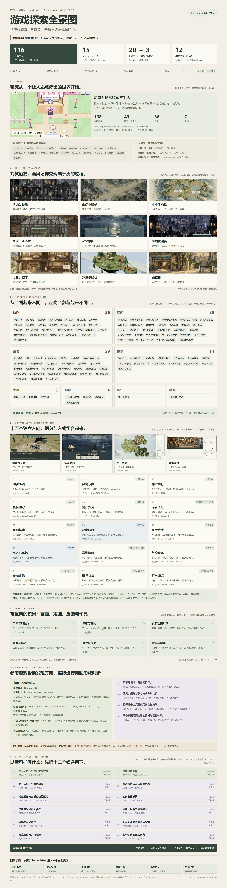
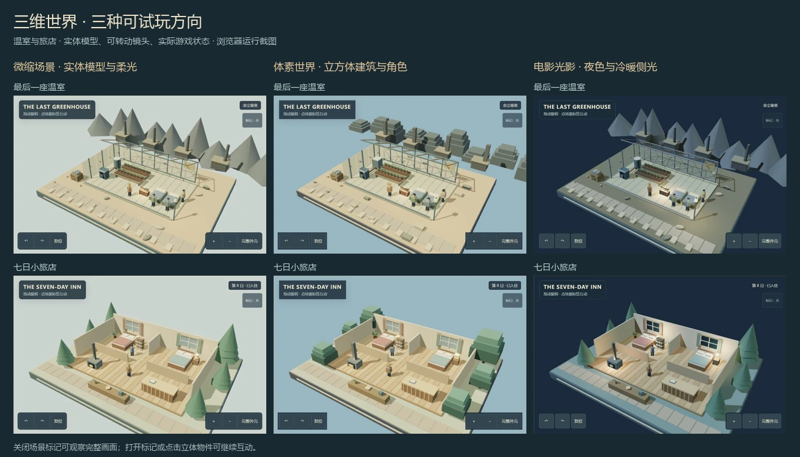
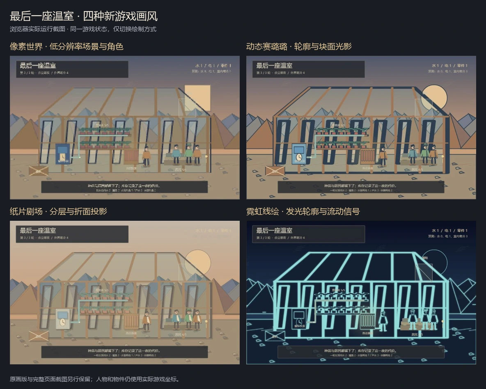
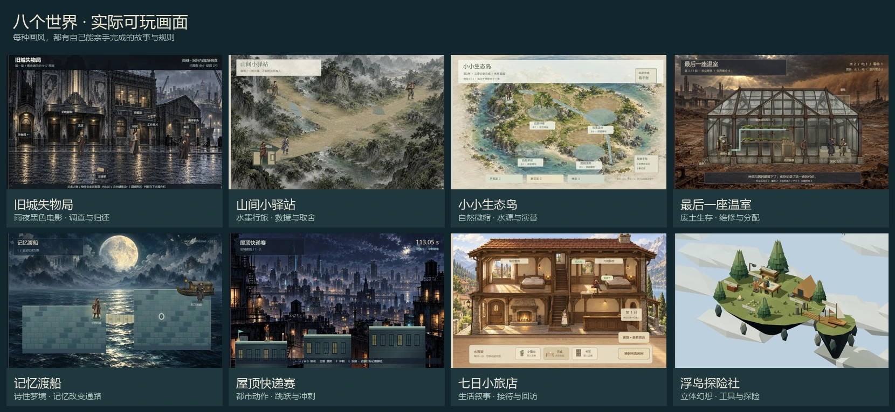
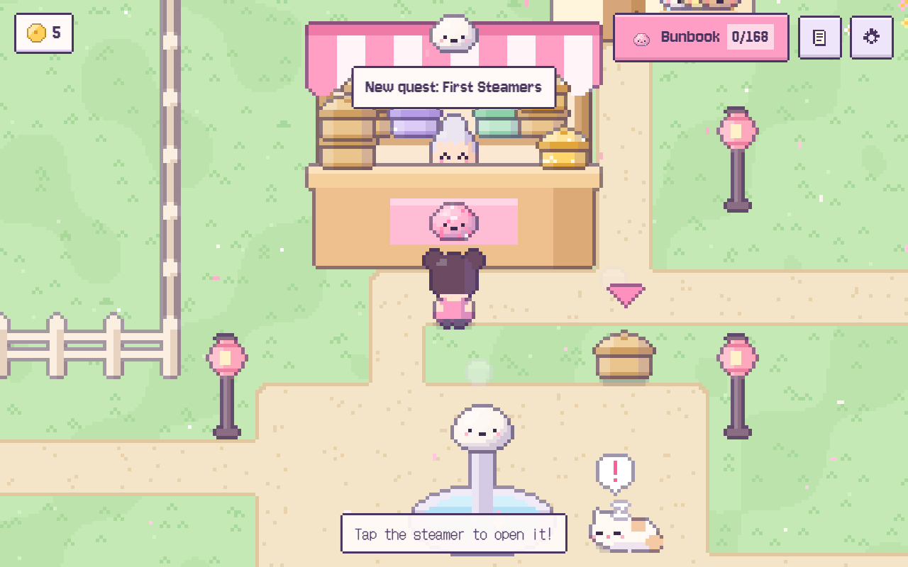
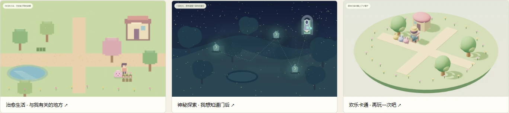
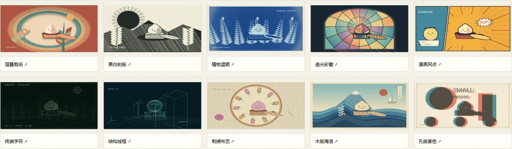

# Dumpling Style Lab · 游戏方向与体验研究

从 [Dumpling Dell 原作](https://dumpling-dell.pages.dev/) 出发，比较游戏的画面语言、规则类型、镜头、操作和玩家参与方式，把讨论落实为可以亲手操作的短样例。我们关注的“有感觉”，是现实玩家愿意进入、行动和继续玩的情绪价值；后来的探索也包括《超级玛丽》和《魂斗罗》这样在规则、节奏与展现形式上有明显差异的方向。

**2026-10-08 发布整理：当前阶段为沉淀整理，暂停新增试玩和继续探测玩法深度。** 本轮集中说明已有能力、入口、真实效果和后续记录。既有游戏、原画版本、研究附录与历史验收资料继续保留。

[完整在线首页（已验证）](https://yydshly.github.io/0930_codex_project/projects/010-dumpling-style-lab/) · [网页说明](web/README.md) · [阶段沉淀](web/research.html) · [完整高清引导图](web/assets/project-overview-20261006.jpg)

[](web/assets/project-overview-20261006.jpg)

引导图沿用 2026-10-06 的 **2400 × 9344** 全景长图，以十四份原作截图、本站浏览器截图或项目封面预览唤起项目记忆；图中按来源分别标注。中文目录来自项目数据，完整图源与导出记录保存在 [notes/project-overview](notes/project-overview/)。建议打开原图放大阅读。

## 已经积累了什么

| 积累 | 当前范围 | 应怎样理解 |
| --- | --- | --- |
| 原作案例 | 外部原站试玩、截图、运行观察和技术笔记 | 原作来自独立站点；本站没有把它打包为本地开源库 |
| 材质与视觉实验 | 20 种，含 17 种二维与 3 种 WebGL 三维 | 比较绘制、纹理与表现，不等于 20 个独立游戏类型 |
| 早期情绪体验 | 治愈生活、神秘探索、欢乐卡通共 3 段 | 比较进入动机、动作回应与短任务 |
| 保留的早期游戏 | 9 款原创固定短章或短关 | 有各自的规则、完成反馈和本地存档；原画快照仍可回看 |
| 形式对照 | 107 个形式样例 | 规则、视角和参与方式可交叉；其中服务实验在公网按预览范围展示 |
| 原展厅 | 116 个展示入口 | **107 个形式样例 + 9 款早期游戏**，与上两行重叠；每项按实际试玩或预览范围展示 |
| 独立方向研究 | 15 个原创可玩方向 | 另列于展厅统计之外，更集中观察系统和参与方式 |
| 后续扩展 | 12 项记录，全部未启动 | 有差异目标、已有基础与重启条件，不计入已实现数量 |

107 项目录在全景图和 [形式对照](web/forms.html#compare) 中完整列出；按当前展厅标签分为动作 26、空间 29、策略 29、故事 14、生活 3、解谜 4、感知 1、模拟 1。这是本项目的检索分组，不是游戏行业的完备分类。

## 从首页进入全部内容

| 首页入口 | 用途 | 展示与操作 |
| --- | --- | --- |
| [方向地图](web/directions.html#directions) | 看 15 个独立方向的差异 | 各方向有独立试玩页，可运行示范或亲自操作 |
| [形式对照](web/forms.html#compare) | 比较 107 项的类型、镜头和操作 | 左右选两种形式并列观察，进入实际样例 |
| [全部试玩](web/showcase.html#collection) | 搜索、筛选 116 个展示入口 | 项目画面预览、范围说明、实际试玩与本机服务实验的公开预览 |
| [原有九款](web/games.html?game=inn#game-view) | 回看故事短章与既有画风 | 可切换游戏、画风、全屏，保留各自进度 |
| [参考汇总](web/references.html) | 查原作、开源目录与官方体验 | 来源、可学习之处、本站对应方向与许可提示 |
| [探索沉淀](web/research.html) | 读结论、实现边界和后续设想 | 当前能力、12 项未启动记录与后续质量判断 |

[首页](web/index.html#site-hub) 同时直达十五个方向、外部原作、[九款原画历史版](web/versions/painted-20261002/games.html?game=inn#game-view)、[当时的研究首页](web/versions/painted-20261002/index.html#prototypes)、九款画风选择、三维微缩样板、早期三段体验和二十种材质附录。部分样例还有精修前版本；保留范围以各入口实际标注为准。

九款为旧城失物局、山间小驿站、小小生态岛、最后一座温室、记忆渡船、屋顶快递赛、七日小旅店、浮岛探险社、搬家日。它们分别围绕调查、救援、生态布局、物资维护、空间机关、连续配送、接待经营、通路探索与货物搬运组织行动，不能只凭人物图片判断其规则相同。

## 本机服务实验的公开展示

展厅中的 [深蓝议会 · 社交推理](web/showcase.html?play=assembly#play) 与 [月湾接力 · 异步路线](web/showcase.html?play=postway#play) 保留原有本机服务能力，并在公开静态页明确标出范围：深蓝议会提供社交推理场景预览；月湾接力保留路线预览及真实路线制图。房间同步、角色分配、提名投票和接棒服务需要启动本机后端，当前没有发布为公网联机服务。具体功能以对应页面的公开模式与本地运行说明为准。

这两项继续包含在 107 个形式样例及 116 个展示入口中，不增加数量，也不把公开预览计为完整线上多人试玩。

## 十五个独立方向的能力与边界

| 方向与入口 | 玩家真正改变什么 | 当前表现体系与范围 |
| --- | --- | --- |
| [铜谷防线](web/directions.html?demo=1#play) | 建设施、连产线、配弹药，让生产支撑防守 | Canvas 俯视二维，固定小地图与三波进攻 |
| [风湾乐园](web/direction-park.html?demo=1#play) | 建设施和道路，观察游客寻路、排队与评价 | Canvas 等距二维，有限地图和营业日 |
| [雾岭同行](web/direction-coop.html?demo=1#play) | 两角色独立操作、压板与接应，编辑和分享关卡文件 | Canvas 横版二维；该独立方向采用本地同屏或切换角色，没有在线联机 |
| [夜航值守](web/direction-shift.html?demo=1#play) | 在工程、医护、调度职责间安排并行任务 | Canvas 俯视二维，一人控制三角色的有限救援流程 |
| [湾岸货运](web/direction-freight.html?demo=1#play) | 连路建桥、设运输线路，观察装卸加工和中转 | Canvas 俯视二维，六站公路短局 |
| [深岩堡垒](web/direction-dungeon.html?demo=1#play) | 挖掘建房、安排岗位、防守，再附身守卫 | 二维管理与 2.5D 纹理射线附身，共用地下城状态 |
| [月影档案](web/direction-stealth.html?demo=1#play) | 根据巡逻、光照和声音灭灯、绕行、引诱与脱身 | Canvas 俯视二维，有限宅邸关卡与守卫行为 |
| [星潮航路](web/direction-space.html?demo=1#play) | 驾驶飞船，运输、贸易、扫描并切换观察镜头 | Three.js 真实三维，有限航区，规则运动位于 x/z 平面 |
| [雨后余生](web/direction-survival.html?demo=1#play) | 采集制作、搭营地，安排身体需求与天气变化 | Canvas 俯视二维，有限地图；暂停、暂离和离线时停止 |
| [岚谷试车场](web/direction-vehicle.html?demo=1#play) | 实际驾驶、调悬架、装卸与交付，观察四轮接地和载重 | Three.js 真实三维，四角弹簧阻尼与简化车身姿态 |
| [雾海牌航](web/direction-deck.html?demo=1#play) | 读敌方意图、分配能量、出牌、修补和永久升级 | HTML/CSS 与位图牌面，三场固定遭遇的有限构筑短局 |
| [芦湾观鸟](web/direction-wildlife.html?demo=1#play) | 移动取景、调焦、稳定镜头，实际拍照和下载 | Canvas 二维投影，三种动物；照片取自当时真实画面 |
| [夜港来信](web/direction-investigation.html?demo=1#play) | 找线索、提出推断、引用证据、检验并决定收尾 | 原生 HTML 热点，三地点、九线索、三事实与两结局 |
| [溪丘拼境](web/direction-landscape.html?demo=1#play) | 旋转、放置和撤回地块，实际邻接决定群落与得分 | Canvas 六边地块，固定十八块的景观短局 |
| [灯市译语](web/direction-language.html?demo=1#play) | 从情境提出词义假设，交叉验证并完成交流 | 二维场景与原生词典，三地点、六符号和预设语义 |

这些方向是本项目原创的有限样例。参考原作的参与机制和效果标准，不表示移植上游源码、美术、角色或完整战役，也不表示已经达到商业游戏规模。

## 我们形成的理解

**玩家情绪价值要由行动兑现。** 可爱或精致画面会邀请进入；发现、控制、困难修正、角色回应和自己的成果，才提供继续玩的具体理由。工程测试证明操作和状态成立，真人是否有感觉仍要由真人体验验证。

**游戏风格要沿不同维度比较。** 像素、写实、手绘属于画面语言；平台、跑射、牌组构筑属于规则；第一人称、同屏合作、系统调度属于镜头与参与形式。它们可以组合，不能把换滤镜的数量当作游戏方向的覆盖。

**大量样例相似，来自反复使用的制作路线。** 精绘背景、人物贴图、局部动画和侧栏按钮，有利于快速验证题材与有限规则，也容易让不同游戏仍呈现相近的镜头和节奏。固定整图不能自然提供连续动作、自由镜头和可改造空间；图片质量提升也不能自动弥补这些差异。

**动态表现需要素材与运行体系一起选择。** 持续运动依赖逐帧或骨骼动作、空间模型、碰撞、物理、材质、灯光、镜头与声音。生图适合概念、纹理、道具和局部美术；程序实时渲染可承担精致空间与动态表现。以后先选想让玩家经历的过程，再选择对应体系和资源。

## 技术原理与可复用能力

| 能力 | 本项目中的实现方式 | 可扩展价值 |
| --- | --- | --- |
| 实时规则 | 状态、更新、合法指令、目标与反馈分层，Canvas/HTML/Three.js 呈现同一状态 | 可换内容和呈现，同时保持规则结果可验证 |
| 二维与界面表现 | Canvas2D 位图采样、透明角色图集、热点、卡面和原生文字 | 支撑叙事、棋盘、调度、构筑、摄影与语义实验 |
| 三维与空间表现 | 本地 Three.js、GLB 模型、镜头、光照与拾取；部分样例使用 cannon-es | 支撑真实空间、自由观察、驾驶与物理机关 |
| 动作与反馈 | 独立运动、碰撞、动画、粒子、声音时钟与 Web Audio | 让操作节奏和状态变化在运行中可被感知 |
| 进度与恢复 | 按游戏隔离的 localStorage，摄影另用 IndexedDB；部分方向以合法行动重放校验 | 保留各自选择，验证恢复与暂停，避免不同方向互相覆盖 |
| 展示与研究 | 搜索筛选、左右对照、完整示范、全屏、真实截图、质量范围与历史快照 | 将候选方向变成可回忆、可比较、可审阅的依据 |

具体实现因游戏而异，不能把某一款的物理、存档重放或三维能力推给所有样例。本站主要为静态前端，可本地运行或以子路径静态发布；外部原作、官方参考体验仍需要联网，浏览器进度没有账户或云端同步。深蓝议会与月湾接力是另行保留的本机后端实验，公开页只提供上文列出的预览或制图范围。

原作技术事实来自 **2026-10-01** 的运行和前端源码观察：Canvas2D 程序绘制、网格寻路、加权收藏抽取、弹簧阻尼形变、Web Audio 合成、localStorage 和版本化离线缓存。原作当时包含 168 个收藏角色、43 个场景、36 个任务、7 种小游戏；这些是该次观察的口径。详见 [原作与早期研究笔记](notes/research.md)，不能据此将外部原作称为可安装 SDK；原作使用 Three.js 或运行时 AI 的说法也不在已取得证据之内。

## 参考资料的价值

[bobeff/open-source-games](https://github.com/bobeff/open-source-games) 是寻找开源游戏与引擎的目录入口。对本项目的价值是扩大发现范围、找到真实成品效果、观察玩家如何参与，以及在选定方向后查具体项目的架构与许可。目录本身不提供统一游戏引擎，也不统一授权其收录项目的代码和美术。

[参考汇总](web/references.html) 保留官方来源和体验路径；[方向地图](web/directions.html#directions) 对应原创短样例。开源项目、商业类型参照和本站原创分别标注。已引入的 Kenney CC0 模型、Three.js/cannon-es 等运行模块的来源与许可随项目资源保存；原作没有经本站确认的再分发许可，继续使用外部入口和观察资料。

## 后续可扩展方向：仅记录，全部未启动

| 记录 | 以后要验证的差异 |
| --- | --- |
| 第一人称小型三维空间交互（优先候选） | 尺度、近距离操作、灯光遮挡与机械响应 |
| 连续横版动作（优先候选） | 完整跑跳受击动作、滚屏视差与运动反馈 |
| 第三人称三维角色动作 | 绑定角色、动作过渡、镜头遮挡与自由操控 |
| 可改造的体素与物理世界 | 挖掘搭建、通行变化、碰撞更新与持续保存 |
| 抽象图形与音乐驱动的运动 | 图形形变、拍点、声音与低延迟输入同步 |
| 实时群体系统 | 少量指令下的寻路、分工、避让与大数量可读性 |
| 信息不对称真人合作 | 两人不同信息、真实沟通与两端共享状态 |
| 消息、通话与桌面叙事 | 界面变化、信息顺序、声音和选择的实际后果 |
| 电影式互动短片 | 连续人物表演、实际视频分支与剪辑衔接 |
| 知识驱动的时间循环探索 | 同一规律下的事件重置与玩家知识保留 |
| 玩家协商与共同治理 | 真人利益差异、承诺、谈判和共同决定 |
| 教导同伴的自主行为 | 示范修正与可持续、可解释的自主行为改变 |

[阶段沉淀页](web/research.html#backlog) 逐项给出已有基础和重启条件。现有“相近样例”只说明可用基础，不代表该条扩展已经完成；当前保持暂停新增的安排。

以后判断质量时，依次检查动态差异、连续素材、合法操作与状态、存档恢复、小屏和性能，然后让真人判断理解、吸引力与继续意愿。现有检查和截图不替代长期性能、真机覆盖、商业成熟度或留存测量。

## 本轮提交范围与素材档案

本轮提交完整的 `web/` 运行资源、两份 README、`notes/`、`tooling/`，以及文档引用的原始证据图与来源记录。网页图片、模型、纹理、声音、模块、许可、历史版和引导图不因提交整理而缩减。

未被文档引用的原始模型下载、完整素材包和渲染中间文件继续保存在本机 `assets/`。它们属于生产档案，不是网页必需资源；网页实际使用的对应资源仍随完整 `web/` 提交。[本轮原素材范围清单](notes/publication-source-scope-20261008.json) 记录原素材路径、大小、SHA-256 与提交或本机保留范围，供以后复查来源和还原生产过程。

## 本地运行与静态发布

在仓库根目录运行：

```powershell
python -m http.server 8962 --bind 127.0.0.1 --directory projects/010-dumpling-style-lab/web
```

打开 [本地首页](http://127.0.0.1:8962/index.html)。静态站点构建从仓库根目录执行 `python scripts/build_site.py`，本项目输出到 `_site/projects/010-dumpling-style-lab/`。构建应携带运行时资源、来源许可、引导图、当前页面与保留的历史版本，并验证相对链接适用于项目子路径。

正式发布入口为 [GitHub Pages 项目首页](https://yydshly.github.io/0930_codex_project/projects/010-dumpling-style-lab/)，已通过完整文件与代表性浏览器验收。

## 正式发布与验收 · 2026-10-08

[完整在线首页](https://yydshly.github.io/0930_codex_project/projects/010-dumpling-style-lab/) · [研究集总入口](https://yydshly.github.io/0930_codex_project/) · [本次 Pages 部署](https://github.com/yydshly/0930_codex_project/actions/runs/37740060422)。23 个当前与历史 HTML 页面、2,686 个运行文件（285,083,336 字节）已完整上线；全部公网文件的大小与 SHA-256、公开清单及既有引导图一致。首页直接关联全部相关页面，显著提供六类入口、四张实机预览、十五个方向和原有版本。

247 个运行脚本语法与 71 套既有回归在 Linux CI 中通过；21 项代表性公网浏览器检查覆盖总目录跳转、桌面与手机首页、实机预览、三维驾驶、横版移动、路线制图与撤销、服务范围和原作在线入口。该范围不等于每款游戏全部流程或商业质量验收。清单生成已统一为跨平台的大小写敏感路径分量排序。

[发布摘要](notes/deployment-summary.json) · [全部文件核对](notes/publication-online-checks-20261008.json) · [浏览器与截图记录](notes/publication-online-browser-20261008.json)。两项服务实验保留公开预览或制图，房间同步和接棒需要本机后端；旧域名存档不会自动迁移。

## 历史实现与验收记录（原文保留）

以下旧日期、数量与本地网址描述各自轮次；当前统计和阶段以上文为准。历史中的“未公开部署”“尚未制作”等语句保留当时的语境。

---

2026-10-06 项目一图总览：完成单张2400×9344高清全景长图 `web/assets/project-overview-20261006.jpg`，包含十四份原作浏览器截图、本站浏览器截图或项目封面预览；按来源分别标注。图中完整列出107形式、原有九款、十五方向、二十材质、三段早期体验、十二项未启动记录，整理技术能力、参考来源、探索转折、质量边界与六类网页入口。使用原始位图原样嵌入的HTML/CSS排版与原生浏览器导出，中文目录直接来自项目数据；ImageGen尝试因网络错误没有产出，因此最终图未使用生成替代截图。排版源、完整目录、图源哈希与浏览器检查存于 `notes/project-overview/`。首页已增加一图回顾入口；旧游戏、美术、历史快照与存档逻辑继续保留。

以下逐字保留此前记录。

2026-10-06 首页入口关联：将研究首页整理为六个主要页面入口（方向地图、形式对照、全部试玩、原有九款、参考汇总、探索沉淀），直接列出十五个独立方向。首页同时关联原作、九款原画历史快照、画风选择、真实三维微缩、早期三段体验、二十种材质附录与部分精修前版本。其余十九个当前游戏相关页面添加“探索首页”返回链接，沉淀页返回入口同步更新；二十三个当前与历史 HTML 页面均可从首页进入。早期附录点击和刷新时展开正确折叠区，并处理旧嵌入试玩延迟增高后的落点。桌面六入口完整显示，手机采用单列入口与两行导航；旧游戏代码、美术、历史快照与存档键未改动。本轮只完善索引，暂停新增游戏的阶段安排保留。

以下逐字保留此前实现与验收记录。

2026-10-06 阶段沉淀：根据用户要求暂停新增游戏与继续探测玩法深度，整理现有积累。[探索沉淀与后续记录](http://127.0.0.1:8962/research.html) 汇总十五个独立方向、107 种形式与116个原展厅入口的不同统计口径，逐项记录参与方式、渲染类型和实现边界。阶段结论保留玩家情绪价值、类型与呈现的区别、图像合成路线的限制，以及连续动作、真实空间和运行反馈的质量判断。十二项扩展设想均标为“未启动”，包含已有基础、目标差异及以后重新启动的条件，不增加当前已完成数量。首页、方向地图、参考汇总、形式对照、展厅及既有游戏导航已接入沉淀入口。旧网页内容、游戏代码、美术和存档键继续保留。

以下保留此前实现与验收记录。

2026-10-06 新增第十五方向 [灯市译语 · 陌生语言解读](http://127.0.0.1:8962/direction-language.html?demo=1#play)。在市集、水门与灯塔观察十二段实际情境，为六个原创符号建立可修改的词义假设。验证至少需要两个不同观察记录；错误验证保留原假设，反馈不直接给出答案。读懂请求后选择物品或操作，真实交流结果打开下一处地点；三段交流完成后由玩家明确结束。完整示范调用同样的观察、猜测、验证和交流动作，未预先注入已理解状态。独立保存键 `world-play-direction-language-v1`，返回恢复后暂停。

此前十四方向、首批十条开源参考与旧 107 种形态／116 个入口保留。[Heaven’s Vault · inkle 官方介绍](https://www.inklestudios.com/heavensvault/) 用作语言解读参与方式的商业类型参照，与开源参考目录分别标注。本站符号、剧情、场景及规则原创，未移植原作代码或美术。

三处港城背景及透明角色道具图集采用内置 ImageGen，原样复制到项目中：[市集](web/assets/directions/language/market.png)、[水门](web/assets/directions/language/harbor.png)、[灯塔](web/assets/directions/language/lighthouse.png)、[透明图集](web/assets/directions/language/props.png)、[完整提示词与源路径](assets/directions/language-generation-20261006.json)。图集按实际原始尺寸取八个等分框，运行时保持比例。新增规则 54 项及生产控制器 42 项通过；旧十四方向 28 个脚本的 720 项实际重跑通过。[浏览器验收](notes/direction-language-browser-20261006.json) 含 22 项真实操作和 4 张原生截图；[质量范围](notes/direction-language-quality-20261006.json) 与 [构建保留检查](notes/direction-language-package-20261006.json) 保存证据。

这是固定六个符号与三个地点的有限二维短局。真人留存、商业成熟度和广泛兼容尚未测量。此前 README 全部 95606 字节及 2659 个受保护网页文件保留。

以下逐字保留此前实现与验收记录。

2026-10-06 新增第十四方向 [溪丘拼境 · 地景拼片与邻接连缀](http://127.0.0.1:8962/direction-landscape.html?demo=1#play)。旋转并预览十八块原创六边形地形，将其放到真实相邻位置；水道只能与水道相接，其他陆地边的匹配影响得分。连续林地、村落和水道按实际接壤边计算，撤回会真正恢复上一块、得分和目标。十八块用尽后由玩家明确完成，结算反映实际景观。完整示范调用同样的合法旋转、选择与放置，不提前注入成品或成功。独立保存键 `world-play-direction-landscape-v1`，恢复后暂停。

原有十三个方向、首批十条开源参考与 107 种形态／116 个入口保留。新增研究参考 [Dorfromantik · Toukana 官方介绍](https://www.toukana.com/dorfromantik) 的地块拼景参与方式，商业参照与原先开源目录分别记录。本站原创短样例不移植原作代码、美术或完整游戏。

两份原创位图使用内置 ImageGen，原样保存：[地形图集](web/assets/directions/landscape/terrain-atlas.png)、[晨雾背景](web/assets/directions/landscape/backdrop.png)、[完整提示词与源路径](assets/directions/landscape-generation-20261006.json)。实际图集 1536×1024，四个矩形区取中央 512×512 源框，避免拉伸；地形边缘与水道由实际旋转数据绘制。新增规则 39 项、生产控制器 31 项通过，旧十三方向 26 脚本的 650 项实际重跑通过。[浏览器验收](notes/direction-landscape-browser-20261006.json) 含 15 项真实操作与 3 张原生截图；[质量范围](notes/direction-landscape-quality-20261006.json) 与 [构建和保留检查](notes/direction-landscape-package-20261006.json) 提供证据。

当前是固定十八块的二维景观拼接体验。真人留存、商业成熟度、长期性能和广泛兼容未测量。此前 README 全部 93593 字节与 2653 个受保护网页文件保留。

以下逐字保留此前实现与验收记录。

2026-10-05 本轮新增 [夜港来信 · 环境调查与证据重构](http://127.0.0.1:8962/direction-investigation.html?demo=1#play)。方向试玩现在共 **13 个**：首批十条开源参考完成后的扩展为雾海牌航、芦湾观鸟、夜港来信；原有 107 种形态与 116 个入口分别保留。原创单案发生在雨后夜港：一只空邮袋送回了，临时改道的送信记录却缺了一段。玩家在车站、邮务室与栈桥检查九处线索，判断邮袋由谁安排改道、经哪条路线、到了哪里。三项推断各需实际找到两条支持证据，显式检验后才能完成；错误假设和不一致证据可以修正，修改已验证的推断会撤销验证。

场景是三张原创位图，地点、热点和调查册由原生 HTML 提供。线索正文、候选、证据、验证反馈和结局是实际可操作的游戏内容。完整示范使用与手动相同的合法检查、选择、引用证据与验证步骤，支持暂停、速度切换和途中接管；不会提前注入全部线索或成功状态。三项事实与原信成立后，选择正式归档或给来信人回信，两种收尾都有独立叙事。独立键 `world-play-direction-investigation-v1` 保存真实发现和推断；存档通过完整合法行动重放校验，恢复后暂停。

三份原创场景由内置 ImageGen 生成并原样复制：[车站](web/assets/directions/investigation/station.png)、[邮务室](web/assets/directions/investigation/office.png)、[栈桥](web/assets/directions/investigation/quay.png)；[完整提示词、生成模式与源路径](assets/directions/investigation-generation-20261005.json) 与 [实际图像尺寸及热点检查](notes/investigation-art-inspection-20261005.json) 保存。线索文字使用原生中文，不依赖图像里的文字辨认。

新增 33 项实际规则与 30 项生产控制器回调通过；旧 12 个方向的 24 个脚本重新运行，587 项继续通过，合计 **650 项**。[规则](notes/direction-investigation-rules-20261005.json) · [控制器](notes/direction-investigation-controller-20261005.json) · [旧方向实际回归](notes/direction-investigation-regressions-20261005.json)。[真实浏览器记录](notes/direction-investigation-browser-20261005.json) 包含 20 项验收与 4 张接受截图，截图像素与 CSS 视口分别记录。[质量与范围](notes/direction-investigation-quality-20261005.json) 与 [交付及保留检查](notes/direction-investigation-package-20261005.json) 保存证据。此前 2647 个受保护网页文件与 README 全部 90389 字节历史逐字保留。

类型参照 [The Case of the Golden Idol 正式产品介绍](https://store.steampowered.com/app/1677770/The_Case_of_the_Golden_Idol/) 的场景调查与事件重构参与方式；此商业参考与原先开源目录分开记录。本站的港口、人物、事件、场景和结局均为原创，不移植原作代码或资源。本轮是固定三地点的有限二维调查样例，没有完整长篇侦探战役、自由漫游或 AI 推理。真人继续意愿、商业产品成熟度、持续性能、广泛兼容未测量。

以下逐字保留此前实现与验收记录。

2026-10-05 本轮新增 [芦湾观鸟 · 自然摄影与野外观察](http://127.0.0.1:8962/direction-wildlife.html?demo=1#play)。方向试玩现在共 **12 个**：首批十条开源参考完成后的扩展分别为雾海牌航、芦湾观鸟；原有 107 种形态与 116 个入口继续分别保留。新样例在一片原创湿地里观察苍鹭、翠鸟和林鹿，移动取景、调整焦距，稳定镜头后拍照。动物活动与相机位置共同决定实际画面，入框、占比、构图与稳定性决定每次快门的评分，三种动物各有一幅合格照片后暂停并完成。

摄影画面为 Canvas2D，场景、动物与计分共用引擎投影。快门从当时实际渲染取得 PNG 画面，照片与合法快门记录的编号一一绑定，再进入图鉴；不是提前制作的成功照片。可以重拍、检查照片、下载实际成片，示范与手动调用相同摄影规则。独立键 `world-play-direction-wildlife-v1` 保存状态；照片档案使用独立 IndexedDB，恢复后暂停。储存失败时应明确说明照片是否仅在本轮保留，禁止制造丢失的旧照片。

两份原创位图由内置 ImageGen 生成并原样复制：[湿地场景](web/assets/directions/wildlife/landscape.png) 与 [四格动物透明图集](web/assets/directions/wildlife/animals-atlas.png)；[完整提示词、生成模式与源路径](assets/directions/wildlife-generation-20261005.json) 和 [实际图像尺寸、alpha 与运行时切片边界](notes/wildlife-art-inspection-20261005.json) 已保存。场景 1672×941，动物图集 1254×1254；画面不是几何动物或图片滤镜。

新增 35 项实际规则与 33 项生产控制器回调通过，旧 11 个方向的 22 个脚本重新运行，519 项继续通过，合计 **587 项**。[规则](notes/direction-wildlife-rules-20261005.json) · [控制器](notes/direction-wildlife-controller-20261005.json) · [旧方向实际回归](notes/direction-wildlife-regressions-20261005.json)。[真实浏览器记录](notes/direction-wildlife-browser-20261005.json) 包含 14 项验收与 4 张接受截图，截图像素与 CSS 视口分别记录。[质量与范围](notes/direction-wildlife-quality-20261005.json) 与 [交付及保留检查](notes/direction-wildlife-package-20261005.json) 保存最终证据。此前 2641 个受保护网页文件与 README 全部 87479 字节历史须逐字保留。

类型参照 [Alba: A Wildlife Adventure 官方介绍](https://www.albawildlife.com/) 的自然观察与摄影参与方式。商业原作与首批开源目录分别标注；本站不采用原作源码、美术、角色或故事。当前是本地有限、二维三种动物的观察样例；没有完整岛屿漫游、动物骨骼动画或真实生态模拟。实际真人继续意愿、商业产品成熟度、持续性能和广泛兼容未测量。

以下逐字保留此前实现与验收记录。

2026-10-05 本轮新增 [雾海牌航 · 构筑牌组与航路抉择](http://127.0.0.1:8962/direction-deck.html?demo=1#play)。这是完成原先十条参考之后的新类型扩展，方向试玩共 **11 个**；原有 107 种形态、116 个入口与首批 10/10 方向继续分别保留。新样例是一段原创三场航程，观察对手下一回合的意图，把 3 点能量分配给攻击、格挡、抽牌、修补与虚弱。手牌实际移入弃牌或本场消耗区，抽牌堆用尽后重新洗入弃牌；牌堆可逐张查看，升级的是指定实例，奖励牌真实加入牌组，船体状态贯穿下一场。

第一场后可选择恢复船体或永久升级一张现有牌，第二场后选择雾幕或照明弹奖励，第三场实际突破暗潮风眼后完成并暂停。完整示范使用与玩家同样的合法行动与能量，不预置胜利帧；支持亲自出牌、途中接管、示范暂停与两档速度。独立键 `world-play-direction-deck-v1` 保存完整行动与牌堆；恢复通过确定性合法行动回放核对世界，载入后暂停。首批所有旧运行代码、美术与存档没有改写。

三份原创位图由内置 ImageGen 制作：[雾海场景](web/assets/directions/deck/landscape.png)、[六种卡面插画](web/assets/directions/deck/cards-atlas.png)、[船只与灯塔透明图集](web/assets/directions/deck/vessels-atlas.png)。[完整提示词、模式及原始生成路径](assets/directions/deck-generation-20261005.json) 已保存，PNG 原样复制到网页。原生 HTML 提供费用、效果、目标、护甲、意图与战况，卡面和船只从位图采样，实际行动触发反馈。两种奖励卡复用对应插画、各有独立规则与文字。全屏包含完整牌桌、手牌、结束回合、路线和牌堆检查；窄屏在手牌栏内部滚动，避免扩大页面。

实际新增 51 项规则与 28 项生产控制器回调通过；首批十个方向的 20 个脚本重新运行，440 项通过，合计 **519 项**。[规则](notes/direction-deck-rules-20261005.json) · [控制器](notes/direction-deck-controller-20261005.json) · [旧方向实际回归](notes/direction-deck-regressions-20261005.json)。真实浏览器记录 16 项检查和 3 张接受截图，实际操作范围与视口分别记录；[浏览器报告](notes/direction-deck-browser-20261005.json)、[质量与范围](notes/direction-deck-quality-20261005.json) 及 [资源交付与保留检查](notes/direction-deck-package-20261005.json) 分别保存。既有 2635 个受保护网页文件及此前 README 的 84363 字节历史须逐字保留。

类型参考 [Mega Crit 官方 Slay the Spire 介绍](https://www.megacrit.com/games/)。这属于首批开源参考之外的商业原作类型研究；本站不采用原作代码、资产或故事。当前为本地二维有限三场短样例，没有完整程序生成战役、在线账号、多人或上游移植。窄屏是浏览器视口验收；真手机、持续性能、广泛兼容、真人继续意愿与商业成品质量未验证。

以下逐字保留此前实现和验收记录。

2026-10-05 本轮新增 [岚谷试车场 · 车辆物理与工程](http://127.0.0.1:8962/direction-vehicle.html?demo=1#play)。真正三维的货车在有限山谷试车场驾驶，四个车轮分别读取地面高度，弹簧与阻尼共同支撑车身的升降、俯仰与侧倾。装载四件建材后整车从 1250 kg 变为 1570 kg，悬挂下沉、加速响应改变；舒适和紧致调校采用不同的弹簧与阻尼参数。实际驶入车库、料站和工地并低速停车，才能领取、装载、交付和验收；回库前必须真正经过东侧桥面。

本批原先列出的 **10 条参考方向已各有一个原创可玩短样例**：铜谷防线、风湾乐园、雾岭同行、夜航值守、湾岸货运、深岩堡垒、月影档案、星潮航路、雨后余生、岚谷试车场。[方向地图](http://127.0.0.1:8962/directions.html#directions)、[开源参考汇总](http://127.0.0.1:8962/references.html) 和旧形式页接入新入口。十个方向样例、十条原作参考与原有 107 种形态／116 个入口分别统计；这表示本批完成，不表示所有游戏类型已穷尽。旧画面、版本、九个方向运行代码与存档继续保留，新样例独立使用 `world-play-direction-vehicle-v1`，恢复后暂停。

三维场景组合原创 ImageGen [山谷背景](web/assets/directions/vehicle/landscape.png) 与 [地面图集](web/assets/directions/vehicle/terrain-atlas.png)，并使用 Kenney Car Kit 的五份 CC0 GLB，以及 Nature Kit 的两份 CC0 GLB。[完整提示词及生成路径](assets/directions/vehicle-generation-20261005.json)、[素材来源和运行时改动说明](web/assets/directions/vehicle/SOURCE-NOTICE.json)、[车辆素材许可](web/assets/directions/vehicle/License-car-kit.txt)、[自然素材许可](web/assets/directions/vehicle/nature/License-nature-kit.txt) 单独保留。源 GLB 与 PNG 不被改写；运行时将车体与四轮分离，按实际姿态与接地更新，并追加车窗、标识和建筑细节。追尾、环绕检视和试车场总览来自同一份物理状态，地面与桥面匹配规则高度。路线使用可复用 GPU 缓冲区；粗精两层地形连接，避免总览露空。

新增 49 项车辆规则与 35 项实际控制器回调通过。旧九个方向的 18 个脚本已实际重跑，356 项继续通过；方向规则与回调合计 **440 项**。检查涵盖真实驾驶、四轮支撑力、载重下沉与加速、调校差异、有限地图与障碍碰撞、真实装卸和桥面回库、完成后驻车归零、严格暂停恢复、手动与示范调用、键盘和多指所有权、全屏内部目标和操作、加载失败与重试。[车辆规则报告](notes/direction-vehicle-rules-20261005.json) · [控制器报告](notes/direction-vehicle-controller-20261005.json) · [旧方向实际回归](notes/direction-vehicle-regressions-20261005.json)。21 项站点测试和 19 个演示构建通过；构建明确携带车辆模型、外置纹理、许可与来源说明。

[真实浏览器验收与截图](notes/direction-vehicle-browser-20261005.json)、[范围与画面复查](notes/direction-vehicle-quality-20261005.json) 和 [交付资源及保留检查](notes/direction-vehicle-package-20261005.json) 记录最终实际证据。验收由页面按钮、原生全屏输入与只读可见 DOM 完成；截图像素和 CSS 视口分别登记。未通过隐藏世界、时间注入或构造示范帧替代实际浏览器玩法。既有 2618 个受保护旧文件与此前 README 的 80349 字节历史须保持一致。

参考 [Rigs of Rods 官方说明](https://www.rigsofrods.org/) 的车辆模拟方向，制作原创本地简化样例。该版本采用 x/z 连续车辆运动与车身四角弹簧阻尼，不提供软体形变、破坏、联机或原作代码移植。物理手机、多指实机、持续性能、广泛兼容、专业工程精度、真人情绪价值与商业产品成熟度未验证。

以下逐字保留此前各轮的实现和验收记录。

2026-10-05 本轮新增 [雨后余生 · 环境生存与营地](http://127.0.0.1:8962/direction-survival.html?demo=1#play)。在原创雨后山谷里步行探索，搜集有限的木材、布料、废金属与食物，去河边取水、修复电台，再回营地搭棚、生火、添柴与煮水。雨、风暴、夜晚和天明影响湿冷与体温，口渴和饥饿随真实运行时间变化；准备好营地并发出信号，等到天明仍可继续探索。支持完整示范、途中接管、亲自探索、地图寻路与键盘移动；完整示范完成时自动暂停。

现在共有 **9 个新增原创方向样例**：铜谷防线、风湾乐园、雾岭同行、夜航值守、湾岸货运、深岩堡垒、月影档案、星潮航路、雨后余生；[方向地图](http://127.0.0.1:8962/directions.html#directions)、[参考汇总](http://127.0.0.1:8962/references.html) 和旧形态页接入。九个原创短样例、十条参考方向、原有 107 种形态与 116 个入口分别统计。持续世界参考保留 [Cataclysm: DDA 官方项目](https://github.com/CleverRaven/Cataclysm-DDA)，车辆物理方向仍保留原作参考。新样例使用独立键 `world-play-direction-survival-v1`，恢复后暂停，离线时间不推进世界。

四份新原创位图由内置 ImageGen 生成：[雨后山谷](web/assets/directions/survival/valley.png)、[地面图集](web/assets/directions/survival/ground-atlas.png)、[道具图集](web/assets/directions/survival/props-atlas.png)、[人物图集](web/assets/directions/survival/actors-atlas.png)。[完整提示词与来源路径](assets/directions/survival-generation-20261005.json) 已保存。生产画面为 Canvas2D 俯视场景，绘制耗尽的补给、营地设施、天气和角色状态。

44 项新规则与 30 项实际控制器回调通过，涵盖普通示范和手动路线完成、碰撞寻路、有限资源、精确建造消耗、燃料守恒、三秒煮水、天气与身体状态、后续天明完成、独立暂停恢复及伪造存档拒绝。旧八个方向 282 项回归继续通过，合计 **356 项规则与回调检查**。[规则报告](notes/direction-survival-rules-20261005.json) · [实际回调报告](notes/direction-survival-controller-20261005.json)。21 项站点测试、19 个演示构建和 819 项专用包检查通过；20 个实际资源与源文件、构建副本及本地 HTTP 内容一致，2610 个受保护旧文件保持原样。[交付检查](notes/direction-survival-package-20261005.json)

真实浏览器报告记录 12 项通过检查和 5 张接受截图，截图像素与 CSS 视口分别记录。手动接管完成取水、电台修复和发信、回营搭棚／生火／净水器、两次添柴、煮水、饮水与进食；营地操作使木材／布料／废金属从 9／4／3 变为 2／1／1，在第 123 秒达成天明目标。刷新后营地、物资和 73 秒燃料保留并暂停。普通完整示范在 100 秒达成天明并自动暂停；原生全屏接管、添柴、空格暂停、目标同步和退出，以及 390×844 响应布局、内部控件滚动和紧凑结算条均已实际验证，最终控制台无警告或错误。[真实浏览器报告及截图](notes/direction-survival-browser-20261005.json) · [质量和范围记录](notes/direction-survival-quality-20261005.json)。窄屏截图来自桌面浏览器视口调整；真手机、多指触控、持续性能、广泛浏览器兼容、真人情绪与商业产品成熟度未验证。

本版为原创本地二维短样例，世界只在当前运行中推进；没有服务器世界、无限或程序生成地图、战斗或上游移植。

以下原样保留此前各轮的实现和验收记录。

2026-10-05 本轮新增 [星潮航路 · 太空自由职业](http://127.0.0.1:8962/direction-space.html?demo=1#play)。飞船按惯性推进、转向和制动，运输货物占据真实货舱，交易按库存与价格结算；抵达远域信标后，需要低速连续扫描五秒，再返回港站结算。提供完整航程示范、亲自驾驶与途中接管，使用独立进度。Three.js / WebGL 呈现模型、行星、光照及追尾／航区总览相机；航行规则在 x/z 平面上，陨石与背景船只为装饰，没有六自由度运动或战斗。

现在共有 **8 个新增原创方向样例**：铜谷防线、风湾乐园、雾岭同行、夜航值守、湾岸货运、深岩堡垒、月影档案、星潮航路；[方向地图](http://127.0.0.1:8962/directions.html#directions)、[参考汇总](http://127.0.0.1:8962/references.html) 和旧形态页均已接入。八个原创短样例与十条参考方向分别统计。原有 107 种形态、116 个入口、旧版本、美术与各自存档继续保留；新样例使用独立键 `world-play-direction-space-v1`。

参考 [Endless Sky 官方介绍](https://endless-sky.github.io/) 中的运输、贸易与职业选择，制作原创本地三维短样例。三份原创位图由内置 ImageGen 生成：[星云背景](web/assets/directions/space/nebula.png)、[海洋行星表面](web/assets/directions/space/planet-ocean.png)、[荒漠行星表面](web/assets/directions/space/planet-arid.png)；[完整提示词与来源路径](assets/directions/space-generation-20261005.json) 保存为独立清单。飞船、机库、天线与陨石采用 [Kenney Space Kit](https://kenney.nl/assets/space-kit) 的五份 CC0 三维模型，[许可](web/assets/directions/space/License-space-kit.txt) 与 [资源来源说明](web/assets/directions/space/SOURCE-NOTICE.txt) 随样例保存。

27 项新规则、25 项实际控制器回调和旧七个方向的 230 项检查记录通过，方向规则与回调合计 282 项。[规则报告](notes/direction-space-rules-20261005.json) · [实际回调报告](notes/direction-space-controller-20261005.json)。21 项站点测试、19 个演示构建与 789 项专用包检查通过；27 个实际资源的源文件、构建副本与本地 HTTP 内容一致，2596 个受保护旧文件保持原样。[交付检查](notes/direction-space-package-20261005.json)

真实 WebGL 浏览器验收记录 11 项通过断言和 7 张接受截图，截图像素与 CSS 视口分别记录。手动运输、贸易、连续扫描与返回结算，以及普通完整示范均实际完成，结算为 730 信用点、40 贸易利润；途中接管、C／E／空格、暂停与刷新恢复、原生全屏目标选择／操作／退出、390 像素响应布局和舞台滚动对齐已验证。[真实浏览器报告及截图](notes/direction-space-browser-20261005.json) · [质量和范围记录](notes/direction-space-quality-20261005.json)。物理多指触屏、真手机全屏与旋转、持续性能、广泛设备兼容及真人情绪／继续意愿仍未验证；救援、按住键时序与 WebGL 上下文恢复目前由实际控制器回调检查覆盖。本版为原创本地短样例。

以下保留此前各轮的实现和验收记录。

2026-10-05 本轮新增 [月影档案 · 环境潜行与多种解法](http://127.0.0.1:8962/direction-stealth.html?demo=1#play)。在原创月夜庄园中观察灯光、地面材质与守卫巡逻，取回档案，再回到撤离点。俯视场景中的光照与遮挡影响可见程度，脚步与诱饵声响影响守卫行动；同一目标提供借影绕行、切断灯光、投石引开三种解法的示范，也支持亲自操作。

现在共有 **7 个新增原创方向样例**：铜谷防线、风湾乐园、雾岭同行、夜航值守、湾岸货运、深岩堡垒、月影档案；[方向地图](http://127.0.0.1:8962/directions.html#directions)、[参考汇总](http://127.0.0.1:8962/references.html) 和旧形态页均接入。十条参考方向与七个原创短样例分别统计。原有 107 种形态、116 个入口、旧画面、版本及其存档继续保留；月影档案使用独立键 `world-play-direction-stealth-v1`，恢复后暂停。

参考 [The Dark Mod 官方介绍](https://www.thedarkmod.com/main/) 的环境潜行思路，制作原创本地俯视短样例。五份最终位图由内置 ImageGen 制作：[地面材质图集](web/assets/directions/stealth/materials-atlas.png)、[庄园物件图集](web/assets/directions/stealth/estate-props.png)、[潜行者与守卫图集](web/assets/directions/stealth/covert-actors.png)、[月夜庄园背景](web/assets/directions/stealth/moonlit-estate.png)、[取走档案与熄灯状态图集](web/assets/directions/stealth/state-variants.png)。状态图集以真实透明位图分别呈现空档案桌、熄灭灯具与关闭开关。[完整生成提示词、模式与来源路径](assets/directions/stealth-generation-20261005.json) 保存为独立清单。场景采用 Canvas2D，光照、声响与巡逻由真实局内状态驱动画面。

22 项规则检查、24 项实际控制器回调检查与旧六个方向的 184 项回归合计 230 项通过。[规则报告](notes/direction-stealth-rules-20261005.json)、[实际控制器回调报告](notes/direction-stealth-controller-20261005.json)、[生产画面证据](notes/direction-stealth-frames-20261005.json)、[真实浏览器报告](notes/direction-stealth-browser-20261005.json)、[交付检查](notes/direction-stealth-package-20261005.json) 与 [范围和画面复查记录](notes/direction-stealth-quality-20261005.json) 分别记录验收。生产画面由实际模型与生产 Canvas2D 经 Skia 绘制，浏览器截图与浏览器操作证据单独记录。本版为原创本地二维短关卡；玩家情绪、继续意愿和商业成品质量仍需真实试玩验证。

最后交付验证通过：20 项站点测试、19 个演示构建、622 项专用包检查；18 个新资源与整合页面的源文件、构建副本和本地 HTTP 内容一致，2587 个受保护旧文件保持原样。九张 1440×960 生产帧和三张真实浏览器截图分别保存。浏览器已验证实际熄灯通关、手动寻路与 E 操作、C 和空格、有限石子与守卫调查、暂停恢复、全屏实时读数与退出，以及 390 像素布局和 44×44 方向按钮。真人体验、真手机多指、移动全屏和持续性能仍待验证。

以下保留此前各轮的实现和验收记录。

2026-10-05 本轮新增 [深岩堡垒 · 地下城经营与角色附身](http://127.0.0.1:8962/direction-dungeon.html?demo=1#play)。先从俯视视角安排地下城，再附身进入其中一位守卫。矿工沿实际通路前往岩壁并计时开凿；工坊消耗金币生产机关储备，训练室、休养圣所与金库分别影响等级、恢复与守卫容量。守卫按岗位行走，入侵者沿已挖通的路径攻向堡垒之心，三轮实际攻势形成短局防守。

守卫视角来自同一份地图和角色状态：WASD 移动、左右转向、按空格攻击，岩壁限制通行，距离、朝向、视线和冷却决定攻击是否命中；返回俯视视角后可继续规划。提供完整堡垒示范、接通训练场、自己开凿地下城三种开局，支持拖动标记、键盘操作、多指触屏控制、岗位调度、暂停、速度与独立保存恢复。新存档键为 `world-play-direction-dungeon-v1`，重新载入后暂停。

目前共有 **6 个新增原创方向样例**：铜谷防线、风湾乐园、雾岭同行、夜航值守、湾岸货运、深岩堡垒；[方向地图](http://127.0.0.1:8962/directions.html#directions)、[参考汇总](http://127.0.0.1:8962/references.html) 和旧形态页导航均已接入。原有 107 种形态、116 个入口、旧画面、版本与各自存档继续保留并独立统计。

参考 [KeeperFX 官方网站](https://keeperfx.net/) 与 [官方控制说明](https://keeperfx.net/wiki/new-game-controls-and-commands) 中的地下城管理、角色调度与附身控制思路，制作原创本地短样例。四份最终位图由内置 ImageGen 生成：[岩层图集](web/assets/directions/dungeon/stone-atlas.png)、[房间图集](web/assets/directions/dungeon/chambers-atlas.png)、[俯视角色图集](web/assets/directions/dungeon/overhead-actors.png)、[守卫视角角色图集](web/assets/directions/dungeon/front-actors.png)。[完整生成提示词、模式与来源路径](assets/directions/dungeon-generation-20261005.json) 保存为独立清单。俯视场景采用 Canvas2D，守卫视角通过纹理射线投影呈现 **2.5D 第一人称**；当前没有真正三维模型、WebGL 场景、在线多人或上游源码与素材移植。

24 项规则检查和 23 项实际控制器回调检查通过，覆盖计时挖掘、预算与机关消耗、岗位寻路、三轮普通防守完成、附身碰撞与攻击、双指控件、全屏舞台操作、取消输入以及保存恢复；旧五个方向的 137 项规则与回调已重新运行通过。[规则报告](notes/direction-dungeon-rules-20261005.json) · [交互报告](notes/direction-dungeon-controller-20261005.json)。七张生产画面来自实际模型、Canvas2D 与真实射线投影经 Skia 绘制，包括堡垒建设、防守、守卫视角、普通完成和矿工开凿；这些生产帧与浏览器截图分别记录。[生产帧证据](notes/direction-dungeon-frames-20261005.json)

六项站点测试、十九个演示构建与 514 项交付检查通过：2579 个受保护旧文件保持原样，16 个新资源/整合页面与源文件、构建和本地 HTTP 内容一致。[交付检查](notes/direction-dungeon-package-20261005.json)。真实浏览器已验证暂停、经营/附身切换、全屏舞台控件、P 返回、引导挖掘完成、刷新恢复和 390 像素布局；[浏览器报告及三张真实截图](notes/direction-dungeon-browser-20261005.json) 单独记录。真手机多指、旋转、移动浏览器全屏、持续性能和跨设备兼容仍待验证。[范围及画面复查记录](notes/direction-dungeon-quality-20261005.json)。当前是原创短样例，尚未经过真人情绪、继续意愿或商业成品验收。

以下保留此前各轮的实现和验收记录。

2026-10-05 本轮新增 [湾岸货运 · 交通网络经营](http://127.0.0.1:8962/direction-freight.html?demo=1#play)。连接六座站点，铺路、建桥、建立运输线路并增派车辆。原木送到木厂后，按两份原木加工一份建材，再送到新城；粮食可经中央货站由另一条线路接驳。车辆实际装货、行驶、卸货、空车返回，跟车需要等待；货物和预算按真实操作累计。南桥在 45–58 秒检修，会改变通路和车队运行。

提供完整网络运转、缺路修复、从空白路网自行设计三种开局，支持地图拖动、站点点选、键盘操作、暂停、速度、路线查看与独立保存恢复。使用新键 `world-play-direction-freight-v1`，重新载入后暂停。现在有 **5 个新增原创方向样例**：铜谷防线、风湾乐园、雾岭同行、夜航值守、湾岸货运；[方向地图](http://127.0.0.1:8962/directions.html#directions)、[参考汇总](http://127.0.0.1:8962/references.html) 与旧形态页已接入。原有 107 种形态、116 个入口和既有画面继续保留并独立统计。

参考 [OpenTTD 官方介绍](https://www.openttd.org/about) 的运输网络、站点与车辆任务思路，制作原创本地公路货运短样例。四份最终位图通过内置 ImageGen 生成：[湾岸地图](web/assets/directions/freight/coastal-valley.png)、[六站图集](web/assets/directions/freight/stations-atlas.png)、[载货车辆](web/assets/directions/freight/loaded-trucks.png)、[对应空车](web/assets/directions/freight/empty-fleet.png)。[完整提示词、编辑参考与源文件路径](assets/directions/freight-generation-20261005.json) 已保存，初版空车预览保留为非最终素材。运行画面采用 Canvas2D；道路、桥梁与路径随局内状态绘制。

18 项新规则检查与 15 项实际控制器回调检查通过，包括三种开局普通完成、修路建桥、加工与接驳、货物守恒、预算平衡、桥梁断路绕行和独立暂停恢复。旧四个方向 104 项规则与回调回归、六项站点测试与十九个演示构建通过。2570 个受保护旧文件保持原样，15 个新资源/整合页面与源文件、构建及本地 8962 服务相符。[交付检查](notes/direction-freight-package-20261005.json)

六张开始、运送、中转、检修、订单完成与缺路修复场景由实际模型和生产 Canvas2D 经 Skia 绘制，已逐张复查。修正了道路分段描边、冗余路网、站点库存遮挡、载货与空车外观，以及车辆尺度、双向车道间距和跟车间距；载量标签改为悬停显示。它们**不是浏览器截图**。浏览器工具两次初始化退出，实际 CSS、窄屏、触摸、全屏与实机刷新保存仍待验收。本版的站点固定，尚无铁路、水运、航空、长期地区成长或在线多人。[范围与画面复查记录](notes/direction-freight-quality-20261005.json)

上一轮新增 [夜航值守 · 职业协作与系统事件](http://127.0.0.1:8962/direction-shift.html?demo=1#play)。切换工程、医护与调度角色，派工后其他人的工作继续进行。电路隔离、工程维修、恢复供电、通风、伤员稳定与治疗、接驳信标及全员撤离形成真实依赖。短路改变可走通道，人员会绕路；乘员和三位工作人员都实际走到接驳舱后才完成。标准夜班与紧急夜班分别有三位/四位伤员和不同撤离窗口。

支持完整协作示范、接管当前局、亲自值守、角色任务按钮、设备/伤员点选、地面寻路、键盘派工、暂停、两档速度与路线显示。夜班用独立键 `world-play-direction-shift-v1` 保存，重新载入后暂停。已有三个方向的规则、画面与存档继续保留。上一轮形成 **4 个新增原创方向样例**：铜谷防线、风湾乐园、雾岭同行、夜航值守；[方向地图](http://127.0.0.1:8962/directions.html#directions)、[参考汇总](http://127.0.0.1:8962/references.html) 和旧形态页均已接入。原有 107 种形态与 116 个入口继续独立统计。

参考 [Space Station 14 官方介绍](https://spacestation14.com/) 中的职业分工与系统事件，本版为原创本地三角色切换样例，没有在线联机或上游移植。四份原创美术由内置 ImageGen 生成：[轨道夜景](web/assets/directions/shift/orbital-night.png)、[舱室图集](web/assets/directions/shift/rooms-atlas.png)、[设备图集](web/assets/directions/shift/equipment-atlas.png)、[人员图集](web/assets/directions/shift/crew-atlas.png)。[完整提示词与来源路径](assets/directions/shift-generation-20261005.json) 已保存。使用 Canvas2D 舱室剖面、透明图集和动作帧，当前没有真实三维场景。

17 项新规则检查与 13 项实际控制器回调检查通过，包括两种普通示范完成、职责限制、并行作业、真实路径绕行、撤离等待、失败条件和独立暂停恢复。旧三个方向 74 项规则/回调回归、六项站点测试与十九个演示构建通过。383 项包、链接、素材与实际 HTTP 检查通过，2562 个受保护旧文件保持原样，14 个新资源/整合页面与源文件、构建及 8962 服务相符。[交付报告](notes/direction-shift-package-20261005.json)

六张开局、并行任务、短路、撤离、登船及紧急夜班场景来自实际模型和生产 Canvas2D 经 Skia 绘制，已逐张复查并修正走廊接缝与标签遮挡，**不是浏览器截图**。浏览器工具因 Windows 沙箱初始化错误退出；浏览器 CSS、手机触摸、全屏和实机刷新仍待验收。当前是完整短事件样例，玩家情绪与继续意愿需要真实试玩验证。[范围与画面复查记录](notes/direction-shift-quality-20261005.json)

上一轮新增 [雾岭同行 · 合作闯关与关卡创作](http://127.0.0.1:8962/direction-coop.html?demo=1#play)。三段原创横版关卡，将真实角色移动、跳跃碰撞、踏板开门、寒冰冻结与近距离救援、营灯恢复和共同抵达连接。提供真实输入驱动的配合示范、单人切换、双人独立键盘和独立多指控件；示范成绩不计入自己的记录。

九种编辑工具可以修改真实碰撞地图，支持连续拖绘、整笔撤销、基础配置检查、立即试玩、关卡文件导出与导入。旅程、草稿、按布局保存的自己的完成记录使用独立键 `world-play-direction-cooperation-v1`；旧合作机关与旧关卡编辑器继续保留。此页的扩展重点为寒冰救援和合作关卡设计/分享组合，当前没有在线联机、社区服务或排行榜。

上一轮形成 **3 个新增原创方向样例**：铜谷防线、风湾乐园、雾岭同行；[方向地图](http://127.0.0.1:8962/directions.html#directions)、[参考汇总](http://127.0.0.1:8962/references.html) 和 [旧形态页参考栏目](http://127.0.0.1:8962/forms.html#references) 均接入新入口。原有 107 种形态、116 个入口统计继续保留，新增三个方向样例单独说明。

三份原创美术通过内置 ImageGen 生成：[山岭场景](web/assets/directions/cooperation/mist-ridge.png)、[机关图集](web/assets/directions/cooperation/props-atlas.png)、[探索者图集](web/assets/directions/cooperation/explorers-atlas.png)，[完整提示词与源文件](assets/directions/cooperation-generation-20261005.json) 已保存。游戏为 Canvas2D 横版，使用透明图集与角色动作帧，未复制 DDNet 源码/资产或移植上游，也未声称是真正三维。

16 项规则检查、12 项实际页面回调检查、三关普通完成、关卡文件往返、旧工厂和乐园 46 项回归、六项站点测试与十九个演示构建通过。331 项包与链接检查通过，2555 个受保护旧文件保持原样，12 个新资源/整合页面与本地 8962 服务及构建内容相符。[交付报告](notes/direction-coop-package-20261005.json)

五张救援、开门、行进、抵达和创作画面来自实际游戏模型与生产 Canvas2D 经 Skia 绘制，已逐张复查，**不是浏览器截图**。浏览器工具再次因 Windows 沙箱初始化错误退出；实际 CSS、触摸、全屏、浏览器下载和刷新保存仍待实机验收。这是三段原创短关卡，未经过真人情绪、留存或商业成品验收。[质量与范围记录](notes/direction-coop-quality-20261005.json)

上一轮新增 [风湾乐园 · 主题乐园创造](http://127.0.0.1:8962/direction-park.html?demo=1#play)。六类设施包括摩天轮、旋转木马、过山车、咖啡店、喷泉和休憩花园。设施布局与入口步道共同决定游客能去哪里；游客有不同偏好、饥饿与精力状态，会行走、排队、体验、评价并散场。支持完整示范、缺路修复和空地设计；拖动铺路、键盘建造、查看设施、暂停、速度、网格、心声、独立保存与保留布局再开一天已接入。

上一轮完成时有 **2 个新增原创方向样例**：[铜谷防线](http://127.0.0.1:8962/directions.html?demo=1#play) 与风湾乐园，页面互相连接并已接入 [参考汇总](http://127.0.0.1:8962/references.html)。原有 107 种形态、116 个入口、旧美术、版本和存档保持保留；它们的历史统计与两份新方向样例分别说明。乐园采用独立键 `world-play-direction-park-v1`，工厂采用 `world-play-direction-copper-v1`。

三个原创位图由内置 ImageGen 制作，[全部素材路径、生成模式与完整提示词](assets/directions/park-generation-20261005.json) 已保存。等距场景采用 Canvas2D 图集绘制，游客位置及排队来自实际规则，不是真正三维或原作移植。14 项规则检查、10 项实际页面回调检查、286 项打包与链接检查、原工厂回归、六项站点测试和十九个演示构建通过；2548 个受保护旧文件保持原样。[交付报告](notes/direction-park-package-20261005.json)

五张实际绘制的开始、过程、散场、断路和接通帧位于 `assets/directions/park-qa/`，已逐张复查，来源是生产 Canvas2D 经 Skia 绘制，**不是浏览器截图**。浏览器工具再次遇到 Windows 沙箱初始化错误；CSS、触摸、全屏与真实刷新保存仍待实机验收。此版本是短方向样例，尚无轨道编辑、设施完整机械动画、多人或长期经营；真人情绪与继续意愿尚未验证。[画面与边界记录](notes/direction-park-quality-20261005.json)

同日首轮新增 [游戏方向实验与铜谷防线试玩](http://127.0.0.1:8962/directions.html#play)，把生产建设与战斗连接为一条真实运行的产线：铜矿开采、传送带输送、工坊制弹、交替分流、炮塔消耗弹药、三波敌人及胜负。支持示范运行、自己接通产线、空地建造、暂停、速度、网格、流动标识、声音、键盘建造和独立进度保存。新增 [十条方向地图](http://127.0.0.1:8962/directions.html#directions) 与官方原作入口；首轮记录时原创可玩样例为一个，其余方向标注为参考。原有 107 种形态、116 个入口、旧美术与旧存档键不变，新实验使用独立保存键。

场景与设施图集由内置 ImageGen 制作，[完整提示词与来源](assets/directions/generation-20261005.json) 保存。生产规则通过普通建造、运输、防守、胜负与存档检查；实际 Canvas2D 绘制的四张帧位于 `assets/directions/qa/`，它们是 Skia 渲染帧，不是浏览器截图。浏览器工具初始化遇到 Windows 沙箱错误，CSS、触摸、全屏和浏览器刷新保存仍待实机验收。

开源游戏参考已接入网页汇总：[参考说明与官方体验](http://127.0.0.1:8962/references.html) · [形态页参考栏目](http://127.0.0.1:8962/forms.html#references)。来源是 [bobeff/open-source-games](https://github.com/bobeff/open-source-games)，用于发现类型、建立效果标准与筛选复用能力。精选 7 组，优先 Hypersomnia、IsoCity、SuperTuxKart，各有官方体验、本站同类入口与具体观察项。本批接入参考资料和外部入口，尚未完成候选游戏本地部署或实机验收。原有 107 种形态、116 个入口及其存档继续保留。

2026-10-04 本轮新增 **背包空间配装、限时竞价拍卖、跨窗口异步接力**。当前共 **116 个入口、107 种可玩形式**，旧游戏、美术版本与原存档标识继续保留。

[空间配装 × 限时竞价](http://127.0.0.1:8962/forms.html?left=inventory-loadout&right=auction-bidding#compare) · [异步接力 × 同屏合作](http://127.0.0.1:8962/forms.html?left=asynchronous-relay&right=co-op#compare)。五份原创位图由内置 ImageGen 生成，[完整素材与提示词](assets/game-forms/exchange-generation.json) 保存；[本批能力与边界](notes/exchange-forms-20261004.md) 说明真实邻接能力、竞价结算与本机持久接力。

80 项新增规则、控件、服务及存档键检查、三个普通完成流程、旧游戏回归、六项站点测试与十九个演示构建通过。2523 个受保护旧文件保持原样，原有 104 种形式、113 个入口逐项一致。19 个打包目标与 25 个本地 HTTP 地址内容一致；接力服务在 8971 就绪，原有 8963 服务保持独立。[交付报告](notes/exchange-package-check-20261004.json)

九张开始、过程与完成画面已复查，来自实际生产 Canvas2D 经 Skia 绘制，接力使用两个独立身份和真实 HTTP/SQLite 完成。**这些不是浏览器截图**。浏览器工具初始化失败，实际 CSS、窄屏、全屏、触摸、焦点与刷新保存仍待验收。[质量记录](notes/exchange-quality-review-20261004.json) · [预览来源](notes/exchange-preview-provenance-20261004.json)。以下历史数量按记录时计。

2026-10-04 本轮新增 **机械装配与驾驶、六自由度三维航行、关卡创作与即时试玩**。当前共 **113 个入口、104 种可玩形式**，旧游戏、美术版本与存档标识继续保留。

[机械装配 × 六自由度](http://127.0.0.1:8962/forms.html?left=machine-construction&right=six-dof#compare) · [关卡创作 × 平台跳跃](http://127.0.0.1:8962/forms.html?left=level-authoring&right=platform#compare)。四份原创位图由内置 ImageGen 生成，11 个作者模型用于真实三维场景；[素材与完整提示词](assets/game-forms/foundry-generation.json) 已保存。[能力范围与参考](notes/foundry-forms-20261004.md) 区分约束装配、真正三维运动与编辑地图驱动的碰撞。

76 项新增检查、三个普通通关流程、两套可玩模板、六个生产三维场景检查已通过。原有 101 种形式、110 个入口逐项一致；2498 个受保护旧资源保持原样。构建、旧玩法回归与本地链接检查见 [交付报告](notes/foundry-package-check-20261004.json)。

九张开始、过程、完成画面已复查。关卡帧来自生产 Canvas2D；三维帧为相同生产模型与摄像机的独立诊断投影，光照近似，**不是浏览器截图**。浏览器控制工具初始化失败，真实 WebGL、窄屏、全屏、触摸、焦点与刷新存档仍待验收。[质量记录](notes/foundry-quality-review-20261004.json) · [预览来源](notes/foundry-preview-provenance-20261004.json)。以下历史数量按记录时计。

2026-10-04 本轮新增 **掷骰锁定组合、同步规划战术、轨道引力航行**。当前共 **110 个入口、101 种可玩形式**，旧游戏、画风版本与存档标识继续保留。

[锁骰 × 同步战术](http://127.0.0.1:8962/forms.html?left=dice-combination&right=simultaneous-tactics#compare) · [轨道航行 × 既有飞行驾驶](http://127.0.0.1:8962/forms.html?left=orbital-navigation&right=flight-sim#compare)。七份原创场景与透明素材使用内置 ImageGen 制作，[完整提示词、原始 PNG 与哈希](assets/game-forms/trajectories-generation.json) 已保存。[能力范围与参考](notes/trajectories-forms-20261004.md) 说明真实点数取舍、双方同步执行与二维引力积分。

100 项新增规则与控件检查、旧游戏回归、六项站点测试与十九个演示构建通过。2483 个受保护旧文件保持原样，原有 98 种形式、107 个入口逐项一致。21 个打包目标与 26 个本地 HTTP 地址内容一致；九张开始、过程与完成画面已保存并查看。

**真实浏览器验收尚未完成**：CUA 初始化报告 trusted Node process exited unexpectedly，未返回浏览器状态。窄屏、全屏、触摸、输入焦点与刷新存档仍待确认。[画面质量记录](notes/trajectories-quality-review-20261004.json) · [完整检查](notes/trajectories-package-check-20261004.json)。以下历史数量按记录时计。

2026-10-04 本轮新增 **落块消行、纸牌接龙、字词位置推理**。当前共 **107 个入口、98 种可玩形式**，旧游戏、画风版本与存档标识继续保留。

[落块 × 接龙](http://127.0.0.1:8962/forms.html?left=falling-blocks&right=solitaire#compare) · [字词推理 × 既有逻辑填图](http://127.0.0.1:8962/forms.html?left=word-deduction&right=nonogram#compare)。七份原创场景与透明素材使用内置 ImageGen 制作，[完整提示词、源 PNG 与哈希](assets/game-forms/parlor-generation.json) 已保存。[能力与范围](notes/parlor-forms-20261004.md) 说明实际消行、A–5 短牌局与本地五字母线索。

115 项新增规则与交互检查、旧游戏回归、六项站点测试与十九个演示构建通过。2468 个受保护旧文件保持原样，原有 95 种形式、104 个入口逐项一致。21 个打包目标、26 个 HTTP 地址内容一致；九张开始、过程与完成生产画面已保存并查看。

**真实浏览器验收仍未完成**：CUA 两次初始化报告 trusted Node process exited unexpectedly，未返回浏览器状态。窄屏、全屏、触摸、输入焦点与刷新存档仍待确认。当前不宣称产品质量全部验收。[质量记录](notes/parlor-quality-review-20261004.json) · [完整检查](notes/parlor-package-check-20261004.json)。以下历史数量按记录时计。

2026-10-04 本轮新增 **立体扭转复原、径向环轨射击、自动战棋布阵、无线电调谐**。当前共 **104 个入口、95 种可玩形态**，旧游戏、画风版本与存档标识继续保留。

[立体复原 × 环轨射击](http://127.0.0.1:8962/forms.html?left=twisty-puzzle&right=radial-shooter#compare) · [自动战棋 × 调谐](http://127.0.0.1:8962/forms.html?left=auto-battler&right=radio-tuning#compare)。九份原创场景、材质与透明素材使用内置 ImageGen 制作，[完整提示词、源 PNG 与哈希](assets/game-forms/circuitry-generation.json) 已保存。[能力与边界](notes/circuitry-forms-20261004.md) 说明真实三维小块、二维环轨、单轮自动战斗与本地合成调谐。

127 项新增规则与交互检查、旧游戏回归、6 项站点测试与 19 个演示构建通过。2448 个受保护旧文件没有修改或丢失，原有 91 种形态、100 个入口逐项一致。26 个打包目标和 32 个 HTTP 地址的内容一致；十二张开始、过程与完成画面已保存并查看。

**真实浏览器、GPU 和音频设备验收仍未完成**：CUA 初始化退出，窄屏、全屏、触摸、真实声音与刷新存档仍待确认。当前不宣称产品质量全部验收。[质量记录](notes/circuitry-quality-review-20261004.json) · [完整检查](notes/circuitry-package-check-20261004.json)。以下历史数量按记录时计。

2026-10-04 本轮新增 **重力翻转平台、双世界切换、传送门惯性、声音音高控制**。当前共 **100 个入口、91 种可玩形态**，旧游戏、画风版本与存档标识继续保留。

[重力 × 双世界](http://127.0.0.1:8962/forms.html?left=gravity-inversion&right=dual-world#compare) · [传送门 × 声音](http://127.0.0.1:8962/forms.html?left=portal-momentum&right=voice-pitch#compare)。九份原创场景与透明素材使用内置 ImageGen 制作，[完整提示词、原始 PNG、尺寸与哈希](assets/game-forms/thresholds-generation.json) 保留。[本批能力与边界](notes/thresholds-forms-20261004.md) 明确区分二维门面惯性、真实麦克风和键盘替代输入。

108 项新增检查、旧游戏回归、6 项站点测试与 19 个演示构建通过。2429 个受保护旧文件未修改或丢失，原有 87 个形态、96 个入口逐项一致；25 个打包目标哈希相同，31 个 HTTP 地址与工作区内容相符。十二张生产绘图已查看，改善了标题对比度、角色轮廓与台面辨识。

**真实浏览器与麦克风设备验收尚未完成**：CUA 内核在初始化时退出，窄屏、全屏、触摸、真实设备输入和刷新存档仍待检查。当前不宣称产品质量全部验收。见 [质量范围](notes/thresholds-quality-review-20261004.json) 与 [完整检查](notes/thresholds-package-check-20261004.json)。以下历史批次的数量与状态按记录时计。

2026-10-04 本轮新增 **绘线引导、群体间接救援、世界时间回溯、双尺度嵌套世界** 四种参与形式。当前共 **96 个入口、87 种可玩形态**，原有游戏、美术版本与存档标识继续保留。

[绘线 × 群体救援](http://127.0.0.1:8962/forms.html?left=draw-guidance&right=autonomous-rescue#compare) · [时间回溯 × 双尺度庭院](http://127.0.0.1:8962/forms.html?left=world-rewind&right=recursive-scale#compare)。实际玩法和能力边界见 [本批说明](notes/kinetics-forms-20261004.md)。十份原创场景、透明图集和材质由内置 ImageGen 制作，[完整提示词、编辑参考、原始 PNG、尺寸和哈希](assets/game-forms/kinetics-generation.json) 已保留。

110 项新增规则及生产控件检查、旧玩法回归、6 项站点测试、19 个演示构建通过。2409 个受保护旧文件未修改或丢失，原有 83 种形态、92 个入口逐项一致；26 个打包目标哈希一致，32 个本地 HTTP 检查通过。十二张开始、过程、完成的生产绘制输出已查看；修正了断线吸附、桥面定位、救援开局队伍和三维兼容投影遮挡、纹理读取。[预览来源](notes/kinetics-preview-provenance-20261004.json) 区分生产绘图、同几何兼容投影与浏览器截图。

**真实浏览器验收尚未完成**：浏览器控制内核在初始化时退出；窄屏、全屏、真实输入、刷新存档、WebGL 画面与性能仍待检查。不宣称产品质量全部验收。见 [质量范围](notes/kinetics-quality-review-20261004.json) 与 [完整检查](notes/kinetics-package-check-20261004.json)。以下保留历史批次记录，其数量按各批完成时计。

2026-10-04 上一批新增 **地图勘察旅行、柔性多肢操控、剪纸造路、360°环视勘察** 四种参与形式。当前共 **92 个入口、83 种可玩形态**，旧游戏、美术版本与存档标识继续保留。

[地图 × 柔性臂](http://127.0.0.1:8962/forms.html?left=map-expedition&right=soft-limb#compare) · [剪纸 × 全景](http://127.0.0.1:8962/forms.html?left=collage-world&right=panoramic-survey#compare)。各自的实际操作、能力边界和参考案例见 [本批说明](notes/voyages-forms-20261004.md)。十份原创素材由内置 ImageGen 制作，[完整提示词、原始 PNG、尺寸与哈希](assets/game-forms/voyages-generation.json) 保留。

113 项新增规则、投影和控件检查、旧玩法回归、6 项站点测试和 19 个演示构建通过。2389 个受保护旧文件未修改或丢失，原有 79 个形态和 88 个入口逐项一致；26 个打包目标哈希相同，本地 HTTP 已接入。12 张开始、进展、完成的生产绘制输出已检查，并补充全景近景细节、调整完成卡遮挡。[预览来源](notes/voyages-preview-provenance-20261004.json) 明确标注兼容投影与非浏览器截图。

**真实浏览器验收尚未完成**：新初始化的浏览器控制内核在连接前退出；窄屏、全屏、真实输入与刷新存档、WebGL 接缝和性能仍待检查。不宣称展示质量全部达标。见 [质量范围](notes/voyages-quality-review-20261004.json) 与 [完整检查](notes/voyages-package-check-20261004.json)。以下保留历史批次记录，其数量按各批完成时计。

2026-10-04 上一批新增 **仿桌面侦探、输入文字冒险、真实三维体素雕刻、多工位潜艇驾驶** 四种参与形式。当前共 **88 个入口、79 种可玩形态**，旧游戏、画风、原版与独立存档标识继续保留。

[桌面 × 文字](http://127.0.0.1:8962/forms.html?left=desktop-investigation&right=parser-adventure#compare) · [三维雕刻 × 潜艇](http://127.0.0.1:8962/forms.html?left=voxel-sculpture&right=vehicle-stations#compare)。每种的实际能力、参考案例与边界见 [本批说明](notes/horizons-forms-20261004.md)。七份原创素材由内置 ImageGen 制作，[完整提示词、原始 PNG 和哈希](assets/game-forms/horizons-generation.json) 保留。

103 项新增规则与控件检查、旧游戏回归、6 项站点测试和 19 个演示构建通过。2373 个受保护旧文件没有修改或丢失，原有 75 个形态、84 个入口的条目保持一致；22 个打包目标哈希相同。本地服务已接入新入口。12 张开始、进展、结果的绘制输出已检查，[预览来源](notes/horizons-preview-provenance-20261004.json) 区分原生界面状态绘图、三维兼容投影和生产画布绘制。

**真实浏览器验收尚未完成**：控制内核新初始化时退出，未连接浏览器；窄屏、全屏、原生输入与刷新存档、WebGL 实际性能仍待检查。目前不宣称展示质量全部达标。见 [质量范围](notes/horizons-quality-review-20261004.json) 与 [完整检查](notes/horizons-package-check-20261004.json)。以下历史批次的数量按各批完成时计。

2026-10-04 上一批新增 **拼图旋转吸附、物理造桥、光线反射、音乐作曲、动作录制回放协作、图案交叉推理** 六个方向。当前共 **84 个入口、75 种可玩形态**。旧游戏、美术版本与存档标识继续保留。

[拼图 × 造桥](http://127.0.0.1:8962/forms.html?left=jigsaw-puzzle&right=bridge-building#compare) · [光线 × 作曲](http://127.0.0.1:8962/forms.html?left=light-reflection&right=music-composition#compare) · [回放 × 图案](http://127.0.0.1:8962/forms.html?left=action-replay&right=nonogram#compare)。六种都可实际参与并完成；操作、参考来源和首版边界见 [本批说明](notes/studio-forms-20261004.md)。

八份原创背景、海港画作与透明图集通过内置 ImageGen 制作，[提示词、原始 PNG 与哈希](assets/game-forms/studio-generation-20261004.json) 均保留。拼图按真实榫口裁取画作，桥梁进行受力求解，镜面按几何反射光线，乐句可实际试听和导出 WAV，动作分身重复玩家录制的路线，行列提示从合法排布推导。

99 项新增规则及生命周期检查、旧游戏回归、6 项站点测试和 19 个演示构建通过。2353 个受保护旧文件无改动或丢失，26 个打包目标哈希一致。已查看六种开始、进度、结果共 18 张生产绘制输出；预览 [来源可核对](notes/studio-preview-provenance-20261004.json)。**浏览器实机验收尚未完成**：连接及重置重试均因 Windows 沙箱启动失败退出，窄屏、全屏、浏览器输入、刷新存档与实际听感仍待检查。当前不宣称质量全部达标；见 [质量范围](notes/studio-quality-review-20261004.json) 与 [完整检查](notes/studio-package-check-20261004.json)。

2026-10-04 上一批新增 **时间操控、材料模拟、异形身体、规则改写、绘本画框、摄影造景、指令编排、空间声音、社交推理** 九个方向。当前共 **78 个入口、69 种可玩形态**。原有游戏、美术版本和存档路由继续保留。

[时间 × 材料](http://127.0.0.1:8962/forms.html?left=time-manipulation&right=material-simulation#compare) · [身体 × 照片](http://127.0.0.1:8962/forms.html?left=body-control&right=photo-world#compare) · [规则 × 画框](http://127.0.0.1:8962/forms.html?left=rule-rewriting&right=panel-puzzle#compare) · [程序 × 声音](http://127.0.0.1:8962/forms.html?left=programming-puzzle&right=audio-exploration#compare) · [多人推理](http://127.0.0.1:8962/showcase.html?play=assembly#play)。每种的操作、参考案例与首版边界见 [本批说明](notes/frontier-forms-20261004.md)。

十份原创场景、画框、透明图集和鳞片材质通过内置 ImageGen 制作，[原始 PNG、提示词与哈希保留](assets/game-forms/frontier-generation-20261004.json)。三维模式优先 WebGL，无法创建时使用同场景的软件投影；卡片取自生产工厂离屏绘制，三维为兼容渲染预览，[来源可核对](notes/frontier-preview-provenance-20261004.json)，不是浏览器截图。

123 项新增规则、控件生命周期、声音 API 和多人 HTTP 检查通过，已有回归、站点测试与 19 个静态演示构建通过。2327 个旧受保护文件无改动或丢失；33 个打包目标哈希一致。八个单人方向可完成，多人房间检查覆盖任务、投票、危机与修复。27 张开始、中途、结局画面及暂停状态/像素经过检查。**实机展示验收尚未完成**：浏览器工具在内核启动时崩溃，真实 WebGL、窄屏全屏、焦点输入、刷新存档和耳机 HRTF 听感仍待验证；当前不宣称质量全部达标。见 [质量范围](notes/frontier-quality-review-20261004.json) 与 [完整检查](notes/frontier-package-check-20261004.json)。

多人伴随服务当前在本机 8963 端口后台运行，需 3–6 位真实玩家。重启命令：`python tooling/start-frontier-room.py`；原静态页面保持 8962。每窗口分别保存会话，房间在服务内存中，不含机器人或云端联机。

2026-10-04 上一批新增 **抓钩跑酷、错视空间、物件修复、地形挖掘、滚动吸附、涂地切形、小队搬运、订单服务、信息不对称合作** 九个方向。该批完成时共 **69 个游戏入口、60 种可玩形态**。原有游戏、美术版本与独立存档路由保留。

[抓钩 × 错视](http://127.0.0.1:8962/forms.html?left=grappling&right=perspective-illusion#compare) · [修复 × 挖掘](http://127.0.0.1:8962/forms.html?left=object-restoration&right=terrain-digging#compare) · [吸附 × 涂地](http://127.0.0.1:8962/forms.html?left=rolling-collection&right=ink-territory#compare) · [小队 × 厨房](http://127.0.0.1:8962/forms.html?left=squad-following&right=service-workflow#compare) · [信息分工 × 同屏合作](http://127.0.0.1:8962/forms.html?left=asymmetric-coop&right=co-op#compare)。内容、操作及首版边界见 [本批说明](notes/nine-forms-20261004.md)。

九个专用场景与两套透明物件图集由内置 ImageGen 原创生成，完整提示词、原始 PNG 与哈希见 [素材记录](assets/game-forms/nine-generation-20261004.json)。桥面复用已有原创石灰石材质；运行中的绳索、部件、开凿洞道、附着物、涂色、队员、货物和工序由实际状态驱动。卡片取自实际生产工厂 draw() 的 Skia 画布输出，[来源可核对](notes/nine-preview-provenance-20261004.json)，不是浏览器截图。

74 项新规则及生命周期检查、56 项旧世界、23 项精修、28 项观察、31 项切绳/围地、31 项泡泡/排雷和 6 项站点测试通过；19 个静态演示完成构建。2304 个受保护旧文件无修改或丢失，30 个打包目标哈希一致；本地入口、模块和素材返回 200。已查看九款初始、进度、完成的 27 张生产画布输出，并检查暂停时状态和像素保持。**浏览器验收未完成**：CUA 内核在初始化时因 Windows 沙箱启动异常退出；窄屏、全屏、浏览器输入、焦点和刷新存档仍待实机验证，当前不宣称展示验收全部达标。具体范围见 [质量记录](notes/nine-quality-review-20261004.json) 与 [打包检查](notes/nine-package-check-20261004.json)。

2026-10-04 上一批新增 **泡泡发射消除、数字线索排雷**：琉璃穹顶、深海测绘。当时共 **60 个游戏入口、51 种可玩形态**。已有世界、美术版本和独立存档路由保留。

[泡泡发射 × 数字排雷](http://127.0.0.1:8962/forms.html?left=bubble-shooter&right=mine-deduction#compare)。琉璃球沿真实侧壁和球阵碰撞，三颗同色连通消除，失去顶部支撑的球掉落；海底棋盘通过首击安全、零格展开、八邻格数字、标记、数字邻格快开与可见线索解释组织推理。四份原创美术、原始 PNG、完整提示词与哈希见 [素材记录](assets/game-forms/logic-generation-20261004.json)。卡片是实际生产模块 draw() 的 Skia 画布输出，详见 [来源](notes/logic-preview-provenance-20261004.json)，不是浏览器截图。

31 项新规则、56 项旧世界、23 项精修、28 项观察、31 项上一批规则和 6 项站点测试通过，19 个演示完成构建。2293 个受保护旧文件无修改或丢失；本地入口、模块与素材返回 200。生产场景离屏绘制、初始及揭格画面已检查，工厂暂停状态已检查。**本轮浏览器验收未完成**：CUA 内核在连接前因 Windows 沙箱启动异常退出；窄屏、全屏、输入、焦点和浏览器保存仍待实机验证，当前不宣称展示验收全部达标。具体范围见 [验收记录](notes/logic-quality-review-20261004.json) 和 [打包检查](notes/logic-package-check-20261004.json)。当前泡泡为一套 32 球布阵，排雷为 8×8、10 雷；首击安全，但不保证无需猜测。后续类型见 [补全路线](notes/game-form-coverage-next.md)。

2026-10-04 上一批新增 **划线围地、切绳摆荡**：霓境拓界、风铃工坊。该批完成时共 **58 个游戏入口、49 种可玩形态**。围地用玩家画出的路径改变活动区域；切绳用支撑约束、摆动速度和重力释放组织操作，两种均有实际参与与结果。

[划线围地 × 切绳摆荡](http://127.0.0.1:8962/forms.html?left=territory-capture&right=rope-cutting#compare)。原创玻璃壁画通过闭合路径逐步修复，游光碰线会回退；两幕工坊依次呈现垂直落灯和双绳侧摆，提供慢放、定格、步进和真实释放落点预览。四份美术通过内置 ImageGen 制作，原始 PNG、完整提示词与哈希保存在 [素材记录](assets/game-forms/gesture-generation-20261004.json)，展示卡片取自实际浏览器画布截图。

31 项新规则、56 项旧世界规则、23 项旧精修规则、28 项上一批规则及 6 项站点测试通过，19 个静态演示完成构建。2282 个受保护旧文件无修改或丢失；原有模块、美术版本与正常存档继续保留。浏览器实玩完成 83.4% 壁画修复及两幕灯球送达，检查了刷新恢复、暂停、切绳手势、数字键、390px 窄屏和桌面全屏。证据与具体限制见 [本轮验收](notes/gesture-quality-review-20261004.json) 和 [打包检查](notes/gesture-package-check-20261004.json)。当前是一幅壁画与两幕短场景；围地可扩展自由曲线、多人争夺与三维表面，切绳可扩展移动挂点、气流、弹性绳和多物件。

2026-10-04 上一批新增 **场景寻物、旋转管线接通**：海岸藏物阁、铜潮管网。该批完成时共 **56 个游戏入口、47 种可玩形态**。寻物用完整房间、物件清单、局部放大和平移组织参与；管线用可旋转接口、连通预览、实际水流与断口组织反馈。

[场景寻物 × 旋转管线](http://127.0.0.1:8962/forms.html?left=hidden-object&right=pipe-network#compare)。八件藏物实际画在原创收藏温室中，缩略图取自对应位置。两套管网使用独立的铜管零件，方向匹配、旋转、撤销和输送由运行状态驱动。四张美术由内置 ImageGen 原创生成，提示词、原始 PNG 与哈希保留在 [素材记录](assets/game-forms/observation-generation-20261004.json)，展示卡片来自真实试玩截图。

28 项新规则、56 项旧规则、23 项上一批规则及 6 项站点测试通过，19 个静态演示完成构建。2271 个受保护旧文件无改动或丢失。浏览器实玩找齐八件物件，并接通两套管网；检查了输送暂停、刷新续流、完成恢复、桌面、390px 窄屏与全屏。验收范围见 [本轮记录](notes/observation-quality-review-20261004.json) 和 [打包检查](notes/observation-package-check-20261004.json)。当前寻物为一间房间，管线为两套短关卡，后续可以扩展全景场景、剪影清单、多色输送与分流阀。

2026-10-04 上一批新增 **台球清台、街机打砖块**：暮色台球、琉璃星阵。该批完成时共 **54 个游戏入口、45 种可玩形态**。台球使用固定顶视球桌，真实计算动量碰撞、库边、六袋落球、瞄准预览和力度，包含六球练习与十五球三角开球。打砖块使用固定街机场地，连续反弹、挡板接球角度、两幕砖阵、双层砖与扩展挡板奖励共同组织画面。

[台球 × 打砖块](http://127.0.0.1:8962/forms.html?left=billiards&right=breakout#compare)。四张场景/对象美术通过内置 ImageGen 原创制作，生成提示词、原始 PNG 与校验记录保存在 [素材记录](assets/game-forms/arcade-generation-20261004.json)。运行时美术直接随站点打包，展示卡片取自实际运行画面。

23 项新规则检查、56 项旧规则回归、6 项站点测试及静态构建通过；2260 个受保护旧文件无修改或丢失。浏览器实玩验证了台球落袋与刷新恢复、挡板接球再命中、失球后保留砖阵；新模块的桌面、390px 窄屏与全屏已复查。证据与范围见 [本轮验收](notes/precision-quality-review-20261004.json) 和 [打包检查](notes/precision-package-check-20261004.json)。当前台球为自由清台，标准八球对局和击点旋转仍为后续扩展。

2026-10-04 上一批新增 **惯性滚球闯关、轨道珠链、监控室悬疑**：云廊滚球、琉光回廊、夜潮值守。当时共 **52 个游戏入口、43 种可玩形态**。每种采用独立的场景与操作形式：真实三维曲面和球体惯性；瞄准发射与珠链回拢连消；多机位观察、人物路线和远程设备干预。原有版本、美术与存档保留。

[滚球 × 珠链](http://127.0.0.1:8962/forms.html?left=rolling-ball&right=marble-chain#compare) · [监控室](http://127.0.0.1:8962/showcase.html?play=watch&present=1#play) · [视觉接入标准](notes/presentation-quality.md)。本轮使用原创生成的石材、观测庭院、琉璃球、铜质发射器、四个雨夜场景和两个人物；球体、珠链、人物路线与设备状态实时运行。完整生成提示词、原始 PNG、素材出处和逐项规则报告均在项目内。

规则检查共 38 项通过（滚球 11、珠链 14、值守 13）；视觉与操作以实际浏览器截图另行核验，记录见 [本轮验收](notes/expansion-quality-review-20261004.json)。窄屏与全屏已检查。其余既有 40 种形态的质量范围仍以各批记录为准。

2026-10-03 最新补充 **三维迷你高尔夫、铁路信号调度、垂钓与回合弹道炮战**：海岬果岭、岔口信号、暮湾浮标、岬湾炮阵。当前共 **49 个游戏入口、40 种可玩形态**。操作对象转向真实滚动的球、按道岔行驶的列车、浮标与鱼线，以及受风力影响的炮弹和可改变山地。已有内容、画风、独立版本与各入口存档保留；清单比较玩法和呈现形式，不代表行业类型穷举。

[高尔夫 × 铁路调度](http://127.0.0.1:8962/forms.html?left=mini-golf&right=train-dispatch#compare) · [垂钓 × 回合炮战](http://127.0.0.1:8962/forms.html?left=fishing&right=artillery#compare) · [本批范围与素材](notes/motion-forms-20261003.md)

2026-10-03 上一批补充 **指令式 RPG 战斗、城市交通规划、三维物理机关与双人合作**：余烬旅团、晨湾街区、重力工坊、同步灯桥。该批完成时共 **45 个游戏入口、36 种可玩形态**。分别展示技能与目标选择、真实三维街区路网与车辆、连续刚体搭建、两个玩家独立操作的同屏机关。双人合作属于参与形式，可与其他玩法组合；清单不表示穷举全部游戏类型。已有游戏、画风与各入口独立存档保留。

[指令式 RPG × 城市规划](http://127.0.0.1:8962/forms.html?left=command-rpg&right=city-planning#compare) · [三维物理 × 双人合作](http://127.0.0.1:8962/forms.html?left=physics-puzzle&right=co-op#compare) · [内容、素材与逐项验证范围](notes/systems-forms-20261003.md)。六个内置 ImageGen 任务、Kenney CC0 作者模型和本地 MIT 物理引擎共同构成本批画面。当前已确认 RPG 10 项、城市 14 项、合作 18 项实际操作检查；其他检查以最新文档及报告为准。

2026-10-03 上一批补充 **推箱机关、三消连锁、地区战略、互动小说**：潮箱仓库、绮晶工坊、十二郡沿岸、海岸末班信。该批完成时共 **41 个游戏入口、32 种可玩形态，已列清单中 0 项待制作**。新增三间仓库、实际晶石掉落与连锁、十二省回合战略、两位成年人物与分支结局；旧游戏、美术与正常存档保留。32 种是本项目的呈现比较清单，不表示穷举全部游戏类型。

[推箱机关 × 三消连锁](http://127.0.0.1:8962/forms.html?left=push-box&right=match-three#compare) · [地区战略 × 互动小说](http://127.0.0.1:8962/forms.html?left=grand-strategy&right=visual-novel#compare) · [内容、素材与已验证范围](notes/completion-forms-20261003.md) · [56 项实际操作汇总](notes/completion-forms-check-20261003.json) · [32 形态回归](notes/game-forms-check-20261003.json) · [旧文件保留检查](notes/completion-preservation-20261003.json)

2026-10-03 上一批补充 **三维飞行驾驶、轨道射击、点击解谜冒险**：星环试航、回廊巡航、潮灯档案。该批完成时共 **37 个入口、28 种可玩形态**。新增真实三维飞船与自动巡航回廊、三处原创房间及六件透明道具；旧游戏、美术与正常存档保留。当时另列四种待制作方向。

[飞行驾驶 × 轨道射击](http://127.0.0.1:8962/forms.html?left=flight-sim&right=rail-shooter#compare) · [点击冒险 × 横版探索](http://127.0.0.1:8962/forms.html?left=point-click&right=side-story#compare) · [内容与范围](notes/navigation-forms-20261003.md) · [实际操作验证](notes/navigation-forms-check-20261003.json) · [构建验证](notes/navigation-package-20261003.json)

2026-10-03 上一批补充 **体育竞技、潜行行动、物理弹球**：黄昏球场、夜庭潜行、星轨弹球。该批完成时共 **34 个入口、25 种可玩形态**。三种分别展示球场队伍、巡逻遮挡与独立物理机台；旧游戏、美术和正常存档保留。当时另列七种尚未制作的候选方向。

[体育竞技 × 潜行行动](http://127.0.0.1:8962/forms.html?left=sports&right=stealth#compare) · [物理弹球 × 几何益智](http://127.0.0.1:8962/forms.html?left=pinball&right=board#compare) · [内容与范围](notes/action-forms-20261003.md) · [实际操作验证](notes/action-forms-check-20261003.json) · [构建验证](notes/action-package-20261003.json)

2026-10-03 上一批补充 **即时战略、塔防、回合战棋**：铜沙指挥部、暮林守望、星台棋阵。该批完成时展厅共 31 个入口，形态对照页有 22 种实际可玩形态，当时待制作体育、潜行、互动小说三类。新增三张原创地图与十六个透明小型单位素材，原有内容与存档保留。

[即时战略 × 回合战棋](http://127.0.0.1:8962/forms.html?left=rts&right=turn-tactics#compare) · [塔防 × 即时战略](http://127.0.0.1:8962/forms.html?left=tower-defense&right=rts#compare) · [内容与范围](notes/strategy-forms-20261003.md) · [实际操作验证](notes/strategy-forms-check-20261003.json)

2026-10-03 上一批补充 **对战格斗、迷宫追逐、音乐节奏**：钟楼试炼、霓虹回路、拍点夜航。该批完成时共 28 个入口、19 种实际可玩形态，尚待制作 6 类。新增原创场景、24 个透明动作/角色素材及 108 BPM 原创合成短曲；原有游戏、美术与存档继续保留。

[对战格斗 × 迷宫追逐](http://127.0.0.1:8962/forms.html?left=versus-fighting&right=maze-chase#compare) · [音乐节奏 × 几何益智](http://127.0.0.1:8962/forms.html?left=rhythm&right=board#compare) · [内容与范围](notes/interaction-forms-20261003.md) · [真实操作验证](notes/interaction-forms-check-20261003.json) · [打包验证](notes/interaction-package-20261003.json)

2026-10-03 上一批新增 **清版格斗、纵向飞行射击、真实三维竞速**：夜港清场、群岛航线、海岸疾驰。该批完成时展厅共 25 个入口、16 种可玩形态，待制作 9 种。原有游戏、美术画风与存档保留。

[格斗 × 飞行并列试玩](http://127.0.0.1:8962/forms.html?left=beat-em-up&right=vertical-shooter#compare) · [三维竞速 × 格斗](http://127.0.0.1:8962/forms.html?left=racing&right=beat-em-up#compare) · [新增内容、素材与范围](notes/arcade-forms-20261003.md) · [真实操作验证](notes/arcade-forms-check-20261003.json)

# 010 · Dumpling Style Lab · 世界与玩法

本项目进一步澄清「游戏风格」：按类型、视角与主要动作展示差异。[打开游戏形态对照](http://127.0.0.1:8962/forms.html#compare) 默认并列展示平台跳跃与横版跑射「潮汐突围」，也可切换六十种已接入形态。原有世界与美术画风继续保留。[最新实现、素材与检查范围](notes/nine-forms-20261004.md)；[前期实现记录](notes/game-forms-20261003.md)保留当时的范围。可玩数量不代表行业类型穷举，也不代表所有实机质量检查已通过。

2026-10-03 本轮仅扩展画风：旅店新增黏土微缩、毛毡手作、水彩线稿、版画蚀刻四套完整美术样板，场景、人物动作与家具配套。原有画风、玩法、故事及存档保留；每套在相同入住状态下可直接切换比较。[打开新画风](http://127.0.0.1:8962/games.html?game=inn&look=clay#game-view) · [画风说明与后续候选](notes/style-expansion-20261003.md)。四套新样板采用二维素材，原有真实三维模式继续保留。

[进入展厅：69 个试玩入口](http://127.0.0.1:8962/showcase.html) · [四个优先方向](http://127.0.0.1:8962/showcase.html?play=afterdark#play)

本轮按「保留喜欢的画风，逐款优化内部」调整：展厅默认显示原有九款，十二个扩展试玩单独筛选。旧场景与人物资源未改动；每款分别记住画风，切换不重置游戏进度，不支持的立体模式回到该游戏已记住的模式或原画版。已保存的原画快照继续独立访问。21 款增加各自的场景状态、行动依据与结果反馈；详见 [逐款改进清单](notes/interiors-20261003.md) 和 [实际验证](notes/interior-checks-20261003.json)。

2026-10-03 新增十二个独立游戏方向，原有九款和原画快照继续保留。优先实现「停电之后」「灰烬猎手」「封闭车站」「黑市账本」：分别使用横版故事、等距战斗、第一人称空间解谜和插画牌桌。其余八个方向覆盖几何消除、平台跳跃、射击、第三人称冒险、方块建造、像素农场、自动化和文书抉择。

新增场景与成人角色、卡牌、工业物件采用七张原创 AI 美术图集的裁切素材；立体环境、骨骼动画角色、射击设备、自然场景、像素图块与选用音效来自 Kenney CC0 素材包，资源与许可证随项目保存。场景布局、交互规则和实时效果由代码驱动。出处、生成任务简述与文件位置见 [美术清单](notes/showcase-art.json)。参考游戏只用于比较画面语言、视角和规则；没有导入其角色、场景或音乐。

新方向各自保存为 `dumpling-showcase-v1-<id>`，测试使用 `dumpling-showcase-qa-v1-<id>`。暂停、继续、重开、全屏、声音、完成徽章和手机操作已接通。当前交付是独立可玩短关卡集合；完整长篇、完整配乐、更多动画与真人情绪反馈需要后续制作和验证。

运行与十二款内容范围见 [Web 说明](web/README.md)。检查证据见 [素材与运行检查](notes/showcase-smoke-check.json)、[真实操作检查](notes/showcase-play-check.json)、[手机与旧版本检查](notes/showcase-ui-check.json)。以下保留此前九款研究记录。

本轮继续完善六个重点方向：悬疑专用道具与巡逻预兆；战斗破盾、锁定瞄准、受击反馈与两阶段统领；车站设备碰撞、第一人称持物与解谜灯光；卡牌委托、成长路线与交易回顾；海岛岩岸、营地、遗址、地图与检查点；真实木桥搭建、回收和灯塔通路。三波战斗、三间解谜、五轮卡牌、三段悬疑、三枚灯石及造桥到灯塔均已用实际输入完成。详情见 [本轮改进与验证](notes/showcase-polish.md)。

参考 [Dumpling Dell / Bolludalur](https://dumpling-dell.pages.dev/) 的探索、收集、照顾、布置与保存结构，重新组合出**新的玩家身份、题材、规则和世界**。原作故事是参考案例，现有九个独立方向。搬家日保留三份完整生活委托；本轮继续完善九款的可玩内容：第二案件、旅店回信篇、云塔岛、风暴求援、第三条快递路线，以及保留旧结果的重访、年度课题和明确的任务进度。每种画风仍对应自己能实际操作的游戏规则。

[打开搬家日产品样板](http://127.0.0.1:8962/games.html?game=movers) · [原作与研究页面](http://127.0.0.1:8962/) · [八款世界升级与检查](notes/worlds-product.md) · [搬家日升级记录](notes/moving-day-product.md) · [第二轮设计与边界](notes/extensions-v2.md)

| 信息 | 内容 |
| --- | --- |
| 当前版本 | 2026-10-03 · 温室与旅店新增三种真实3D场景方向；既有九款内容与画风保留 |
| 实际可玩 | 三份搬家委托、两桩案件、十日旅店、三区域浮岛、两种温室情境、三条快递路线；其余见下表 |
| 原作来源 | 原网页、公开前端脚本、2026-10-01 浏览器实测 |
| 原作版本线索 | Service Worker afe52db44d；不是 Git commit |
| 原作仓库与许可 | 没有已确认的公开 GitHub 仓库；原作许可未确认 |
| 新增实现 | 原创 Canvas 2D 游戏与 Three.js r160 / 0.160.0 三维游戏 |
| 保存与发布 | 本浏览器分别保存九款进度；尚未发布新的公开入口 |
| 验证边界 | 工程检查核实操作与状态；没有真人情绪、留存或商业效果验证 |


「产品样板」指一个能完整试玩和继续迭代的短篇：已经完成美术、操作、失误恢复和结果留存。它还没有商业成品的长线内容、真人留存验证或正式发行；本轮已增加短篇内的章节、不同回应与可保留结果的重访，整体仍没有商业作品规模的长线内容。

## 三种真实3D方向

温室和旅店已新增**3D微缩场景、3D体素世界、3D电影光影**。可拖动旋转镜头、缩放、展开建筑剖面；设备、家具与人物根据实际游戏状态改变。原有规则与存档继续使用，五种既有画风及独立原画版保留。

[立体温室](http://127.0.0.1:8962/games.html?game=wasteland&look=diorama#game-view) · [立体旅店](http://127.0.0.1:8962/games.html?game=inn&look=cinematic#game-view) · [实现、范围与实际验收](notes/spatial-worlds.md)



## 已保留的二维画风

九款现在都可切换**原画版、像素世界、动态赛璐璐、纸片剧场、霓虹线绘**。新增二维模式使用程序绘制的场景与关节人物，动作跟随游戏状态；浮岛切换真实3D材质和渲染分辨率。切换画风保留当前游戏与进度。

[打开新版](http://127.0.0.1:8962/games.html?game=wasteland&look=cel#game-view) · [独立保存的原画版](http://127.0.0.1:8962/versions/painted-20261002/games.html?game=wasteland#game-view) · [画风实现与实际验收](notes/art-directions.md)



## 九种题材，九种真实玩法

| 游戏入口 | 玩家身份与画风 | 已实现的玩法 | 可完成的内容 |
| --- | --- | --- | --- |
| [旧城失物局](http://127.0.0.1:8962/games.html?game=detective) | 雨夜黑色电影；雨夜街区、成人人物与证据桌 | 调查现场与证词、点选证据对照、选择归还对象和依据；误判仍可继续调查 | K17 托管案与 K22 停映案；两场景、四类证据和不同正确判断；已结案件可回选 |
| [山间小驿站](http://127.0.0.1:8962/games.html?game=wuxia) | 国风江湖；水墨山路、风雨与行旅者 | 调查封路与旅人处境，分配有限绳索和补给；安排影响可达路线与救援结果 | 一段有限物资救援，补给分配完才可结案；翌日回音与保留旧安排的重走 |
| [小小生态岛](http://127.0.0.1:8962/games.html?game=ecology) | 自然微缩；成熟自然观察手账、俯视地形与植被 | 三种水闸、四块地、有限劳动和苗木；水位与植被年龄影响栖息活动，允许回退比较 | 三季与跨年演替；共存生境、双湿地泽蛙、双林冠三类年度课题与年报 |
| [最后一座温室](http://127.0.0.1:8962/games.html?game=wasteland) | 厚重废土；锈蚀设施、成年幸存者与沙尘 | 维修设备、分配有限物资、核对天气收支；决定影响温室与居民处境 | 首次值守与风暴求援两种情境；求援立即扣库存，回应与结局进档案 |
| [记忆渡船](http://127.0.0.1:8962/games.html?game=dream) | 梦境幻想；月夜、成年旅人、剪影与超现实物件 | 亲手携带与放置记忆，改变桥、水位、门与真实可行路径，终局只能保留一个解释 | 两个谜题空间、两种归岸选择；重访保留两个解释与旧结局 |
| [屋顶快递赛](http://127.0.0.1:8962/games.html?game=arcade) | 都市街机；霓虹城市、成人跑者与清晰平台轮廓 | 真实行走、跳跃、冲刺、平台落地与检查点；到达投递点才完成，用时与失误影响成绩 | 旧城夜线、高架急件、清晨回信三条路线；独立成绩、收件人回信、自动前进和起跳预备 |
| [七日小旅店](http://127.0.0.1:8962/games.html?game=inn) | 旅店主人；暖色绘本、旅店剖面、纸木纹理、窗光与灯火 | 听需求、选两种房间、移动单份家具、安排入住；住客活动随安排变化，允许调整；离店留言进入回访记忆 | 七日篇与“留下的信”两章，共十个游戏日；倾听/计划影响回信，重访保留家具、关系与已收到的信 |
| [浮岛探险社](http://127.0.0.1:8962/games.html?game=islands) | 调查员；低多边形幻想 3D、云海、浮岛、绳桥与遗迹 | 绳索真正接通道路，探险灯打开封印；行走、区域转换、两条线索任选先后，回营归档与陈列 | 营地、遗迹与云塔三个实际3D区域；风向接桥、星环校准、归航灯与两章归档 |
| [搬家日 · Moving Day](http://127.0.0.1:8962/games.html?game=movers) | 成年搬运者；手绘生活街区、晴天／雨后／夜晚、人物六种动作姿态 | 搬、跳、轻放、投掷；重量与碰撞影响操作；易碎包装受损后可补救，已装车物件保留；鼠标辅助、键盘与手机控制 | 林夏的新家、陈叔的书店、周阿姨的家三份委托各三件货物；独立感谢信、最佳记录和无投掷/无补包装目标；完成当前单后可回选已完成委托，旧进度保留 |



这些画面来自浏览器实际运行。六款机制扩展分别侧重**证据判断、山路取舍、季节演替、资源生存、记忆改变空间、动作练习**，原有三款继续保留。画风配合不同的玩法；温暖、好奇或欢乐仍是设计意图，需要真实玩家体验来判断。

## 怎么玩，怎样继续

每款都有自己的目标、当前回应和操作按钮。可点击场景中的人物与物件，也可使用按钮；桌面与手机均提供操作入口。

- **旅店**：先点旅人听需求，再选择临街窗房或内院静房，点布置架放置植物、茶桌或书架，然后安排入住。看见活动后可继续换房或调整，再送别并读留言，进入下一日。每件家具只有一份，点同房已有家具会收起；移到另一房会从旧房移走。
- **浮岛**：点击岛面行走、点击物件走近调查；WASD / 方向键移动，E 调查身边物件。缺少绳索时无法越过断桥，缺少探险灯时无法通过封印，可返回营地取工具。
- **搬家**：A/D 或左右方向键行走，W/上方向键/空格跳跃，E 拿起或轻放，F 投掷。也可点货物自动走近拿起，拿着货物点车厢会搬过去轻放。重物动作较慢，易碎物要留意落地冲击。

声音默认关闭，点击“声音：开”后播放本地合成的音乐与反馈。支持暂停、大画面和当前游戏重新开始。详见 [Web 运行说明](web/README.md)。

九款游戏分别写入此浏览器的 localStorage，定时及操作、切换、离开页面时保存。切换游戏或刷新页面可以继续；“重新开始”需确认后才清除当前游戏的进度；章节重访保留旧结果。原作与旧演示使用各自的状态，不共用这些存档。

## 原有三款的范围与检查

旅店现有七日篇与三日回信篇，仍是单住客接待，没有完整旅店经济与长期经营。浮岛第一章归档后可继续云塔归航灯，保留桥、灯与两章探险结果。搬家有三份可完成的生活委托，可在完成当前单后重访旧委托，使用本项目编写的简化物理规则。

工程记录 [新游戏检查](notes/extension-v1-check.json)核对实际点击、规则、章节完成与恢复；[研究页检查](notes/extension-presentation-check.json)核对入口、嵌入、截图与资源。它们不能代替玩家对有趣、亲近或继续意愿的反馈。

## 本轮六种新方向的实际范围

新六款提供可完成的短章或短关卡，原型的规则、画面变化与保存可以实际操作。侦探有两桩固定案件；江湖是有翌日回音与重走的单段救援；生态使用简化演替规则与三类年度课题；废土有两种三轮值守；梦境有两个空间和可留存的两种终局；街机有三条固定路线。它们尚未形成商业作品规模的内容或长期系统。

[第二轮设计说明](notes/extensions-v2.md)整理机制与边界；[第二轮游戏验收](notes/extension-v2-check.json)与[研究页验收](notes/extension-v2-presentation-check.json)记录工程行为。是否有感觉、是否愿意继续仍需真人试玩，未按年龄进行受众验证。

## 原作事实与研究来源

Dumpling Dell 是治愈、可爱的像素生活小世界。运行数据有 168 个收藏角色、43 个场景（含室内）、36 个任务、35 张贴纸、24 个秘密、7 种小游戏、14 首预设音乐。静态 HTML 的 0/53 是旧占位值；内容需要逐步解锁。

原作可以探索格子地图、与 NPC 对话、三次点击开蒸笼、填图鉴、照顾和命名伙伴、戴帽子与随行、种植钓鱼烘焙、布置房间、换装和自绘角色。它有三个本地存档、备份码与 PWA 资源缓存。

实际操作覆盖新建存档、引导、点击寻路、开蒸笼、随行伙伴、图鉴、390 × 844 手机布局与离线重载；其余系统通过公开代码核实，未声称完整通关。



原作用 HTML/CSS/JavaScript、Canvas 2D 与 Web Audio 实现。字符网格描述地形，BFS 寻路，requestAnimationFrame 更新运动与反馈；参数组合绘制角色，权重偏向未拥有角色。进度写入 localStorage，约每五秒保存，备份用 JSON、压缩与 Base64url 编码；Service Worker 缓存资源。存在可关闭的匿名统计接口；没有确认自动云存档、多人联机或运行时模型调用。

这些机制和事实是研究依据，未确认它是可直接安装的软件库。详细证据见 [原作与前期研究笔记](notes/research.md)。

## 游戏画风与情绪的理解

美术语言、世界气质、玩法规则与角色回应共同组成游戏体验。像素、手绘、卡通 3D 描述美术；温暖、神秘、欢乐描述希望带来的气质；经营、调查、搬运描述本轮实际可做的事。

可以用“看见世界 → 愿意进入 → 自己行动 → 得到回应 → 想做下一件事”来整理设计。这个框架是研究工具，并非已验证的心理规律。关于真人试玩、开放反馈与比较边界，见 [游戏画风与情绪研究](notes/game-art-emotion.md)；该笔记也保留前一轮三个短体验的研究背景。

官方商业作品只作观察参照，未复刻其角色、地图或资产：[Stardew Valley](https://www.stardewvalley.net/about/)、[Animal Crossing: New Horizons](https://www.nintendo.com/en-gb/Games/Nintendo-Switch-games/Animal-Crossing-New-Horizons-1438623.html)、[Ori and the Will of the Wisps](https://www.orithegame.com/)、[Super Mario 3D World](https://www.nintendo.com/sg/switch/auzp/3dworld/index.html)。


## 展示质量与原版保留

最新的垂钓、回合炮战、迷你高尔夫和铁路调度提供“精修版 / 原版”切换，默认进入精修版。旧模块、旧素材及原有存档继续保留；两种呈现沿用同一游戏规则和进度。类型对照在窄窗口优先展示完整大图，说明收在场景下方，并提供“放大画面”和独立试玩。

后续补充按 [视觉接入与验收标准](notes/presentation-quality.md)审看实际场景、材质、主体比例、关键反馈和窄屏操作，再核验规则与打包；功能检查不能替代画面判断。此次精修只覆盖最近四种，其他形态仍保留其既有实现。

## 运行

```powershell
python -m http.server 8962 --bind 127.0.0.1 --directory projects/010-dumpling-style-lab/web
```

打开 [搬家日](http://127.0.0.1:8962/games.html?game=movers) 或 [其他方向](http://127.0.0.1:8962/games.html?game=detective) 或 [原作与研究](http://127.0.0.1:8962/)。新增游戏静态资源由本地提供；原作 iframe 需要联网。新游戏没有云存档或跨浏览器同步。

## 附录：前期三个短体验

[治愈生活](http://127.0.0.1:8962/?experience=cozy#play-lab)、[神秘探索](http://127.0.0.1:8962/?experience=wonder#play-lab)、[欢乐卡通](http://127.0.0.1:8962/?experience=playful#play-lab)保留为早期原型：摘莓果送伙伴、三灯石触发森林星光、找三个朋友得到帽子。它们有短操作链和反馈，内容与后续选择有限。



[短体验检查](notes/play-experience-check.json)、[反馈显示检查](notes/play-render-check.json)、[页面检查](notes/play-presentation-check.json)仅描述该轮工程范围，不代表当前九款原型的验收。

## 附录：二十种图像材质对照

此前的像素、扁平插画、绘本、水墨、动漫、等距、低多边形、黏土、霓虹、写实材质，以及剪纸、刻版、蓝晒、彩窗、漫画网点、字符、线框、刺绣、木版海浪和孔版套色保留为美术表现参考。开盖、挤压、昼夜和参数变化可以验证绘制方法，不能单独解释游戏的情绪体验。



方法见 [研究笔记附录](notes/research.md#附录二十种图像材质实验)，既有 [初版验证](notes/validation.json)、[材质扩展验证](notes/style-expansion-check.json)与 [资源检查](notes/final-check.json)保留各自的检查范围。

## 来源与许可

- [原作网页](https://dumpling-dell.pages.dev/)及公开 [main.js](https://dumpling-dell.pages.dev/js/main.js)、[art.js](https://dumpling-dell.pages.dev/js/art.js)、[world.js](https://dumpling-dell.pages.dev/js/world.js)、[reveal.js](https://dumpling-dell.pages.dev/js/reveal.js)、[audio.js](https://dumpling-dell.pages.dev/js/audio.js)、[backup.js](https://dumpling-dell.pages.dev/js/backup.js)、[playstats.js](https://dumpling-dell.pages.dev/js/playstats.js)、[sw.js](https://dumpling-dell.pages.dev/sw.js)。
- 原作代码、截图与名称归原作者；未确认公开仓库和许可证，保留来源并嵌入原网页，未批量收录原作源码，也未据此声明可自由再分发原作。
- 新增三维游戏与前期三维实验使用 [Three.js](https://github.com/mrdoob/three.js) r160，保留 [MIT 许可证](web/THREE-LICENSE.txt)。该依赖不代表原作使用 Three.js。
- 新游戏的人物、故事、场景与规则为本项目原创；搬家日及本轮八款二维世界的位图美术通过内置 ImageGen 生成，保留原始素材和处理脚本，未借用原作角色与图片。本项目原创内容尚未选择统一开源许可证。

[返回项目索引](../../README.md#项目索引)
