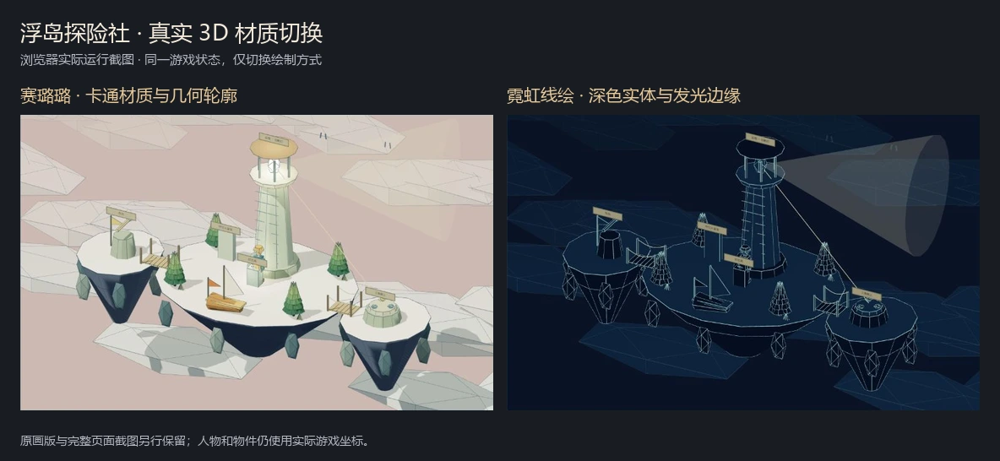

# 九款游戏的实时画风扩展

2026-10-02。本轮保留已有原画，增加四种可以直接试玩的绘制方式。原有任务、物件位置、可达路径、碰撞与进度继续由各游戏规则驱动；画风按钮只切换绘制方式，不重新创建游戏。

## 试玩与对照

- [温室新版](http://127.0.0.1:8962/games.html?game=wasteland&look=cel#game-view)
- [浮岛 3D 线绘](http://127.0.0.1:8962/games.html?game=islands&look=neon#game-view)
- [已保存的原画版](http://127.0.0.1:8962/versions/painted-20261002/games.html?game=wasteland#game-view)

九款上方都有“同一个游戏，换一种世界”选择器。`look=paint/pixel/cel/paper/neon` 可直达指定画风；没有 URL 参数时沿用当前浏览器上次选择。

| 画风 | 二维游戏实际表现 | 浮岛实际表现 |
| --- | --- | --- |
| 原画版 | 沿用手绘场景与人物素材 | 沿用原有立体场景材质 |
| 像素世界 | 低分辨率背景、像素关节人物与几何物件 | 降低实际渲染分辨率，使用量化色彩材质 |
| 动态赛璐璐 | 清晰轮廓、色块阴影；呼吸、走路与实际活动姿态 | Toon 材质与几何轮廓 |
| 纸片剧场 | 分层纸景、折面与偏移硬阴影，关节角色在舞台中行动 | 柔和漫反射、纸面色彩与边缘描线 |
| 霓虹线绘 | 深色实体、发光线条、流动信号与场景物件轮廓 | 深色实体与几何边线，保留道路、工具和场景调查 |

新二维人物以代码绘制关节和身体，跟随实际角色位置、朝向和活动。步态随移动变化；搬家跟随跳跃、举物和休息状态；旅店跟随饮茶、阅读与写画活动。植被有生长与摆动，城市背景随跑动滚动。动画时钟跟随游戏暂停与页面可见性，不额外改变存档。非原画模式隐藏旧的人物位图回应头像。

这四种方向共用已有玩法与部分场景几何。它们不是四个重新设计的游戏，也没有把全部二维游戏改成 3D；浮岛继续使用真实 Three.js 场景。现阶段用于比较整体画风与实时角色表现，后续仍需为选定方向细化动作、美术和关卡。

## 当前效果怎样保存

修改画风前，已把原有 Web 源文件与资源复制到 `web/versions/painted-20261002/`，共149份文件。复制清单与原始 SHA-256 在 [快照记录](painted-version-snapshot.json)。保存版只改两处：入口提示与独立的存档前缀，其余内容和资源保持复制时的字节。

保存版首次读取某款时，若没有独立存档，会读取已有版本的对应进度；之后写入 `dumpling-painted-preserved-v1-`，新版仍写入 `dumpling-extension-v1-`。因此，两版可以从同一已有进度开始，后续分别保存。清空浏览器存储仍会影响本地进度；源代码和素材快照保存在项目文件中。

## 本轮验证

[实际界面记录](art-directions-check.json)包含九款 × 四种新画风的36次切换、九款手机布局、温室原画切回、山路实际走近调查、原画独立存档与正常试玩进度保留。正常入口切换前后库存一致：水5、电4、零件1、居民5/5、种苗3/5。保存版检查入口继续情境后，其库存改变，新版检查入口库存保持原值，确认分开保存。

[55项规则检查](worlds-rules-check.json)通过；该检查模拟绘图与3D渲染器，画面证据由真实浏览器另行提供。36次切换检查确认画布、选择状态及无加载错误，没有逐种画风重新完成所有章节，也没有测量帧率或真人体验。

完整截图保存在 `assets/art-directions/`。对照图仅裁取实际场景并加标题，制作脚本为 `tooling/prepare-art-directions-evidence.py`。

## 实现位置

`art-direction.js` 管理选择与动画时钟，`art-directions.css` 提供响应式选择器。`worlds-art.js` 在原位图绘制与 `procedural-art.js` 间分派；`moving-art.js` 保留原素材并接入 `procedural-moving.js`；`islands-art.js` 切换材质、几何描边与实际渲染分辨率。所有模式使用原来的游戏模块、动作入口与保存格式。
