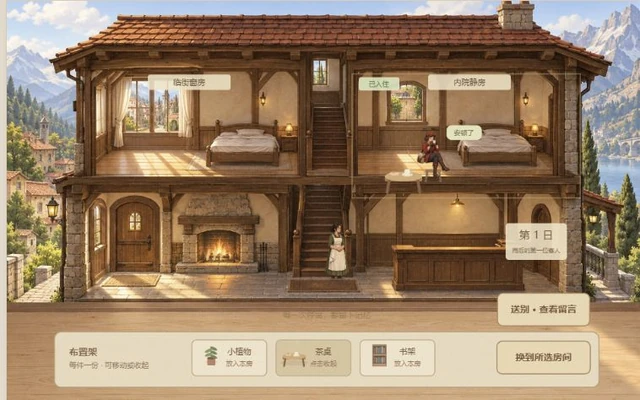
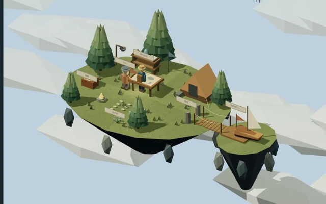

# 新游戏方向 · 第一版设计与交付范围

> 本笔记记录第一轮。下文六项构想在第二轮已经实现，当前范围见 [第二轮扩展](extensions-v2.md)。

整理日期：2026-10-02，Asia/Shanghai。

本轮把 Dumpling Dell 作为设计参考：借鉴探索、收集、照顾、布置、即时反馈与保存机制，重新设计玩家身份、故事和规则。交付的是七日小旅店、浮岛探险社、淘气搬家公司三个实际可玩的第一版。前期三个短体验及二十种材质实验留在研究页附录。

[打开三款游戏](http://127.0.0.1:8962/games.html?game=inn) · [查看原作与研究](http://127.0.0.1:8962/)

## 扩展的对象是什么

| 原作结构 | 新组合 | 玩家真正需要做的事 |
| --- | --- | --- |
| 照顾与布置，结果写入保存 | 七日小旅店：接待差异化旅人，调整两间房 | 读懂需求，观察入住行为，修改安排；以前的接待成为下次相遇的记忆 |
| 探索、发现与地图解锁 | 浮岛探险社：工具改变通路，调查结果回到营地 | 准备工具，走到可达区域，判断先调查哪条线索；通过地图与陈列看见成果 |
| 即时动作反馈与小游戏 | 淘气搬家公司：不同货物形成动作问题 | 估计重量与落点，搬、跳、轻放或投掷；根据碰撞和失误调整下一次尝试 |

新三款包含明确的行动规则和持续后果。它们没有复述原作人物和故事，也不代表原作引擎可以直接切换成这些游戏。

## 七日小旅店：理解旅人，再安排空间

入口：[games.html?game=inn](http://127.0.0.1:8962/games.html?game=inn)。玩家是旅店主人，画面是暖色绘本式的旅店剖面：纸感、木纹、窗光、灯火、前台、楼梯和两间房。

两间房各有固有条件：临街窗房有较明亮的窗光，也会听见街道；内院静房安静，光线较柔和。植物、茶桌、书架每件只有一份，可移动到另一房或收回布置架。家具位置实际显示在房间中。

核心过程是 **问候并听需求 → 选择房间和布置 → 安排入住 → 观察活动 → 调整或送别 → 读留言 → 下一日**。

| 游戏日 | 旅人 | 当日需要 |
| --- | --- | --- |
| 1 | 乔乔 · 山路邮差 | 安静、茶桌 |
| 2 | 芽芽 · 植物学徒 | 窗光、植物 |
| 3 | 砚舟 · 游记作者 | 安静、书架 |
| 4 | 乔乔回访 | 窗光、茶桌；这次要观察天色、提早出发 |
| 5 | 芽芽回访 | 窗光、植物、茶桌；摊开手稿观察新芽 |
| 6 | 砚舟回访 | 安静、书架、茶桌；完成游记 |
| 7 | 乔乔第三次来访 | 安静、茶桌、植物；这次不赶路了 |

听完需求才能安排。旅人会提着行李经过楼梯，在房中安顿；需要等实际安顿好后再送别。满足需求时，邮差在茶桌旁喝茶、植物学徒画叶片、作者翻书；条件不适合时，旅人显得迟疑，回应指出具体缺项。入住后仍可调整家具或换房，活动随安排改善。

送别保存当天房间、布置、满足情况与具体留言。合适的接待留下明信片、压花书签或游记页，满意的回访还留下印章；不合适的接待也能进入下一日，回访会提起此前欠缺的条件。重新遇见同一人时，需求可能变化，不能只复制上次安排。

完成第七日送别，再合上回访簿，即结束本章。家具、留言与纪念物继续保留。当前是固定七日、单住客接待章节，没有多住客同时入住、收入成本或长期旅店经济系统。

## 浮岛探险社：让工具改变真实可达空间

入口：[games.html?game=islands](http://127.0.0.1:8962/games.html?game=islands)。玩家是浮岛调查员，画面采用低多边形幻想 3D：云海、立体岛面、绳桥、风帆与遗迹。

当前有营地“风帆湾”和遗迹“回声拱门”两个区域。角色在岛面实际行走，空海与尚未连通的平台无法通行。点击物件会先走近，再调查；WASD / 方向键移动，E 调查附近物件。

1. 在营地取得绳索，走到锚柱架桥。桥改变真实通行条件，东侧航台可以抵达。
2. 可以带上探险灯，并调查可选的羽叶草；随后乘风帆前往遗迹。
3. 遗迹有风晶和星纹两条线索，可选择调查顺序。星纹平台受封印阻挡，需要用探险灯照亮槽口；没带灯可以回营地取。
4. 两项调查齐全后回营，把线索放上航图归档。地图和标本陈列留下此次成果。

获得绳索并不立即完成探险，它先使下一段路可走；发现也不只增加计数，两条记录在营地共同指向下一站。完成归档即结束第一章。之后可以重访已开放区域、查看陈列；“云塔信号”是尚未开放的下一章，不是已可进入的第三个区域。

当前实现固定的两个区域、工具通路与调查归档，没有大型开放世界、战斗、随机远征或程序化任务。三维渲染使用 Three.js r160。

## 淘气搬家公司：把反馈变成可掌握的动作

入口：[games.html?game=movers](http://127.0.0.1:8962/games.html?game=movers)。玩家控制搬运工小橘，画面采用明快漫画语言：粗轮廓、鲜明货物、动作和拟声反馈。

第一单搬轻纸箱、大冰箱、易碎花瓶箱；完成后解锁第二单的长沙发、玩具纸箱和纪念花瓶箱。两单各三件货物，台阶、斜坡和车厢高度有所变化。

- A/D 或左右方向键行走，W/上方向键/空格跳跃，E 拿起或轻放，F 投掷。
- 点击货物可走过去拿起，拿着货物点击车厢可自动搬过去轻放；键盘和手机控制可以接手。
- 重家具让行走与跳跃变慢；纸箱可以弹跳；易碎箱受到较大冲击会损坏，整单需要重新打包再试。
- 货物完整落稳在车厢里才算装车。第一单完成收到感谢信并开启第二位客户；两单完成是本版本的收尾。

这里的动作后果发生在操作过程中：投掷、重力、惯性、碰撞、地面和斜坡共同决定物件位置与损坏；不是按三处热点直接宣布完成。点击辅助也受到这些规则约束。

物理为本项目编写的简化数值规则，当前是两单横版动作关卡，没有完整刚体引擎、大型关卡编辑器、联机协作或真实搬家模拟。

## 保存、共用操作与实现范围

`games.html` 与 `games.js` 提供游戏切换、当前目标和回应、操作按钮、手机控制、声音、暂停、大画面及保存。每款独立保存，刷新后恢复。

保存键为 `dumpling-extension-v1-inn`、`dumpling-extension-v1-islands`、`dumpling-extension-v1-movers`。约每 1.1 秒检查写入，按钮操作、切换及页面隐藏或离开时也保存。旅店保留日期、房间、家具与历史；浮岛保留位置、区域、工具、开通状态与调查；搬家保留订单、角色、货物状态与完成情况。

“重新开始”只清当前款，其余游戏不清除。存档属于此浏览器、此站点；没有账号、云同步或跨浏览器迁移。原作使用自己的存档，旧短体验及材质实验也分别处理。

声音默认关闭，玩家主动开启后播放 Web Audio 合成的旋律与反馈。各游戏模块由公共更新循环调用，不独立启动动画循环；每个模块提供可序列化状态与真实点击目标，便于统一验收。

## 哪些感受仍是设计假设

| 游戏 | 设计希望支持的感受 | 真人试玩需要观察的内容 |
| --- | --- | --- |
| 七日小旅店 | 认识过客、照顾得到回应、熟悉的地方留下相遇 | 是否注意到旅人差异，是否愿意改房，回访记忆是否让人想继续接待 |
| 浮岛探险社 | 好奇、发现、自己打开一条路的进展感 | 是否理解工具作用，是否主动决定调查顺序，归营成果是否产生下一步意愿 |
| 淘气搬家公司 | 动作掌握、小意外、完成工作后的满足 | 是否理解轻重与易碎差异，是否从失败调整方法，是否愿意接第二单 |

这些感受没有经过真人验证。工程检查可以说明操作、规则、前置条件、错误恢复、章节完成和保存是否工作；不能据此得出喜欢、留存或商业效果结论。方法见 [游戏画风与情绪研究](game-art-emotion.md)。

本轮记录：[新游戏验收](extension-v1-check.json)、[研究页接入检查](extension-presentation-check.json)。既有 `play-experience-check.json` 和材质相关记录只属于前期轮次，不混算为新游戏验证。

## 六项后续构想，尚未制作

| 构想 | 玩家身份与拟定玩法 | 需要重新设计的关键规则 |
| --- | --- | --- |
| 旧城失物局 · 黑白侦探 | 调查员观察现场、对照证词、归还失物 | 证据与证词关系、判断依据与归还后果 |
| 山间小驿站 · 国风江湖 | 游历者结识过客，依照虚构药草与任务规则行走山路 | 虚构物件辨识、过客需求、路线与事件的联系 |
| 小小生态岛 · 自然微缩 | 环境照料者调整水源、植被，观察物种变化 | 水源、植被、物种之间的系统反馈与变化过程 |
| 最后一座温室 · 厚重废土 | 社区照料者修复设施、分配有限物资 | 资源约束、不同需求、安排影响下一日的规则 |
| 记忆渡船 · 梦境幻想 | 引渡者整理物件与记忆，帮助旅人找归途 | 物件与记忆关系、空间变化、选择与归途 |
| 屋顶快递赛 · 街机竞技 | 快递员练习跳跃、传递和运送路线 | 可读路径、动作熟练度、计时与反馈 |

游戏页列出这些构想用于说明扩展范围；没有对应可玩章节，也没有发布实施承诺。下一步应依据三款现有原型的实际试玩反馈，选择一个方向深化。

## 原作与前期内容

原作能力、运行数量、技术来源和许可范围继续保留在 [项目 README](../README.md) 与 [原作研究笔记](research.md)。原作截图和代码归原作者，没有已确认的公开仓库或许可证；本项目嵌入原网页并保留来源，没有批量收录原作源码。

旧三个短体验是照顾、探索、寻找的阶段性小原型；二十种材质实验是绘制方法对照。它们可作为研究过程查阅，不与本轮三款新游戏混为同一套内容。

新增人物、故事、场景和规则为本项目原创；Three.js 遵循保留的 [MIT 许可证](../web/THREE-LICENSE.txt)。尚未发布新的公开入口，也没有为原创内容选择统一开源许可证。
