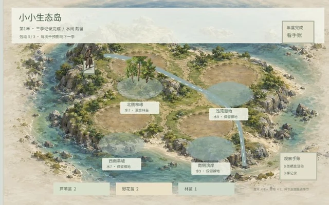
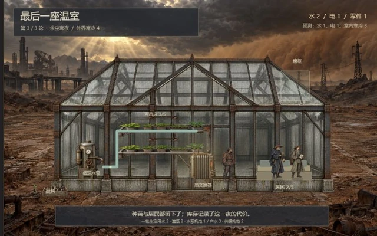
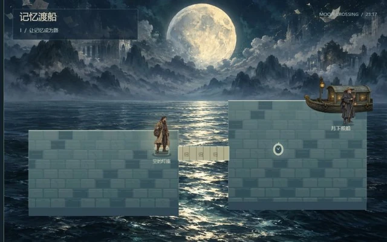
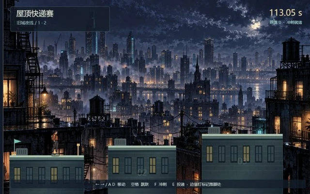

# 第二轮：六种不同的游戏方向

这轮从同一案例的“进入世界、采取行动、得到回应、保存经历”结构出发，加入六个原创短章或关卡。它们与旅店、浮岛、搬家一起组成九个试玩入口。重点是让画风、人物处境与实际规则相互支持：悬疑需要证据，生存需要收支，动作挑战需要可练习的路线。

[进入九种试玩](http://127.0.0.1:8962/games.html?game=detective) · [回到研究页面](http://127.0.0.1:8962/#prototypes)

| 方向 | 画风怎样支持玩法 | 实际可以做什么 | 体验意图与当前范围 |
| --- | --- | --- | --- |
| 旧城失物局 / 黑白侦探 | 雨夜、黑白对比、证据桌与成年证人，让玩家注意不同说法 | 在失物局和街区走近调查，收集四件证据、三份证词，点选两件证据对照，选择归还对象和理由。错误判断留下记录，仍可纠正 | 想知道真相、重新理解人物；一桩固定胶片案，未制作多案件推理生成 |
| 山间小驿站 / 国风江湖 | 水墨色山川、雨中行旅、断桥与落石显示各处困境 | 沿可行山路调查。一根绳只能修复一处，两份干粮按旅人需求亲手分配；接通路线、补给对象与结案后果不同 | 行旅与帮助他人的取舍；单段救援，没有完整武学或开放江湖 |
| 小小生态岛 / 自然微缩 | 地形、植被与自然观察手账让环境变化可比较 | 四块地、三类苗木、三种水闸，每季三点劳动。降雨、蒸发、水闸、湿地与成熟树冠影响水位，健康和植被年龄决定栖息活动。三季后回退比较或保留布局进入新年 | 理解系统、观察长期变化；简化的虚构生态规则，不是现实生态预测 |
| 最后一座温室 / 厚重废土 | 锈蚀设备、沙尘、破窗、成年居民与光线变化显示设施状态 | 用有限零件维修水泵、窗框和热交换器；耗电搜寻废料；安排居民供水、灌溉与供暖。先看预测，再结算三轮气候，库存与活力真实变化；失败可重试并保留记录 | 压力、责任与恢复的满足；三轮资源情境，可能提前失败，没有长期社区经营 |
| 记忆渡船 / 梦境幻想 | 月夜剪影、漂浮档案与超现实岸线表现记忆主题 | 实际携带与摆放船票、怀表。记忆搭桥，重量改变水位，物件的意义打开门；道路变化后才能抵达第二空间与终局。两种归岸选择保留不同物件 | 好奇、告别与解释空间；两个谜题空间和两种终局 |
| 屋顶快递赛 / 都市街机 | 城市夜色、楼顶边缘灯、检查点旗与跑者轮廓帮助读取路线 | 移动、跳跃、短冲刺、平台落地，跌落回最近检查点并加4秒；走到收件柜才可投递。完成旧城夜线后挑战高架急件，各自记录最佳用时，重跑保留成绩 | 掌握技巧、改善表现；两条固定路线，没有在线排行或程序关卡 |

## 真实画面

下列画面取自浏览器中的实际游戏状态。江湖已架绳并交付补给；生态已完成三季生长；温室已维修并完成气候结算；梦境展示物件打开的第二空间；屋顶赛展示第二条路线的投递结果。

## 操作与保存

侦探、江湖、生态、梦境可以点选场景对象。侦探、江湖、梦境还可用方向键/WASD移动，E查看附近；梦境用F放回携带物件。温室主要通过检查设施和操作按钮安排。屋顶赛用左右/AD、空格跳跃、F冲刺、E投递；手机有对应方向和动作按钮，可组合操作。

共用页面支持声音主动开启、暂停、大画面、切换和重新开始。九款分别用 `dumpling-extension-v1-` 加各自ID保存；存档封装仍为版本1，扩展页面版本为2，保留原有三款进度。“重新开始”仅清除当前游戏；街机关卡内“重跑”保留最佳成绩。约1.1秒检查保存，操作、切换、隐藏或离开页面也会保存。没有云存档或跨浏览器同步。

## 验证与边界

[第二轮游戏检查](extension-v2-check.json)记录隔离浏览器中的真实点击、键盘和按钮操作；调试接口仅用于读取状态。覆盖六种方向的完整章节、规则前置条件、误判或失败恢复、分支或系统后果、存档恢复、暂停、手机布局与九入口键盘导航。[研究页检查](extension-v2-presentation-check.json)记录九个入口、嵌入与链接同步、实际截图加载、手机操作及离屏停止更新。原有三款仍由[第一轮游戏检查](extension-v1-check.json)回归。

这些记录验证工程行为，不测量玩家是否喜欢、感动或愿意继续，也不证明某个年龄层适合。六段的受众与情绪价值需要真人试玩反馈；目前均是可完成的短原型，内容、美术精细度和长期目标尚未达到成熟商业游戏规模。

后续扩展应围绕具体体验深化：侦探增加可以反证的案件，江湖增加跨章节人情后果，生态增加迁徙与更可解释的反馈，温室增加人物需要与跨天气决策，梦境增加物件语义组合，街机增加路线选择和技巧挑战。先观察玩家如何理解规则、何处犹豫、完成后还想做什么，再确定内容规模。
