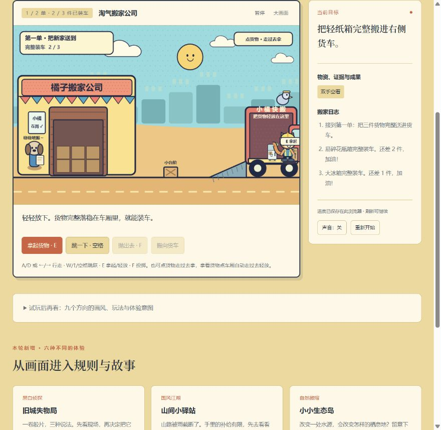

# 搬家日 · 产品样板升级

本记录描述上一轮搬家日升级。其余八款已在后续完成美术与共用体验升级，当前情况见[八款世界升级记录](worlds-product.md)。

2026-10-02。当前入口：[搬家日](http://127.0.0.1:8962/games.html?game=movers)。本次聚焦用户正在看的搬家方向；其余八款保留探索原型。原型功能检查通过，不能证明画面、故事和游玩意愿已经达到产品要求。

## 从实测画面看到的差距

- 研究页的标题、卡片、说明与笔记占据主视觉，游戏画面缺少沉浸空间。
- 简单几何角色与粗轮廓物件缺少统一美术细节，人物身份和世界生活感较弱。
- 两单货物主要验证搬运规则；谁搬家、为何珍惜这些物件、行动之后得到什么回应，没有形成足够明确的游玩理由。
- 失误主要依靠整单重试，已做的工作与长期记录不够可见。

这些是本次界面与原型的证据；并不意味着所有卡通或儿童游戏都缺乏产品能力。画风受众、内容深度与制作完成度是不同问题。

## 当前真实实现

**美术与界面。** 成年搬运角色、手绘街区、透明货车与货物、人物六种动作姿态；晴天、雨后、夜晚三种场景。三个场景是原创生成位图，雨线、微光、影子和动作由 Canvas 实时绘制。画面与操作集中展示，研究说明保留在原入口。

**人物与故事。** 林夏第一次独立生活，陈叔搬迁旧书店，周阿姨搬到家人附近。每份委托有来信、三件承载生活记忆的物件与不同的感谢信。故事通过当前任务与结果呈现，尚未实现角色对话演出、室内布置或分支剧情。

**真实规则。** 行走、跳跃、拾取、轻放和投掷仍由物理与碰撞决定；重量改变速度和起跳能力，货物必须落稳在车厢里才能计入交付。点击货物走近与点击货车辅助送达均经过实际路径，方向控制可以接手。碰撞斜坡与可见斜坡共用坐标。

**失误与回报。** 易碎包装受冲击后可补救，已装车的货物保留；补包装用时和评价扣分有可见后果。三份委托完成后留下感谢信、交付用时与评价，最佳记录可以打开查看，刷新后保留。旧搬家存档的已交付物件迁移到新版本。

**手机操作。** 390 × 844 实际浏览器检查，画面不横向溢出；主要游戏按钮至少 44 CSS 像素高，方向与动作按钮为 47 像素高。当前方向自动滚入可见区域，重复动作按钮在手机上精简。

## 当前检查与实际边界

检查记录见 [moving-day-product-check.json](moving-day-product-check.json)。截图来自真实浏览器，不是效果图；测试入口使用独立存档前缀，没有覆盖正常入口的玩家进度。

本次完成一个有统一美术、三段故事和操作闭环的短篇样板。还不能据此称为经过商业验证的发行成品：三单沿用同类搬运结构，长期内容、人物关系成长、场景交互密度、声音制作和真人试玩仍需要继续深化。没有新增账户、云存档、支付或在线服务。

## 其他方向应按什么标准继续升级

先完成一段完整、可亲历的情境，再扩内容数量。各方向不应仅套不同颜色：

| 方向 | 美术与人物重点 | 应深化的实际游玩过程 |
| --- | --- | --- |
| 黑白侦探 | 统一雨夜街区、成年人物立绘、证据材质与光影 | 现场调查 → 证词矛盾 → 自己判断 → 当事人回应 |
| 国风行旅 | 山路尺度、旅人动作与风雨变化 | 察看险路 → 分配有限工具 → 开辟真实路线 → 接到旅人 |
| 自然微缩 | 生态分层、水位变化与自然声音 | 栽植或调水 → 系统变化 → 观察存活和栖息 → 做下一季选择 |
| 废土生存 | 设施运行状态、居民表情、尘雾与灯光 | 核对资源 → 修复设备 → 面对天气 → 承担结果 |
| 梦境解谜 | 可读的空间层次、记忆物件和人物演出 | 发现异常 → 搬动物件改变通路 → 理解记忆 → 作归岸选择 |
| 都市动作 | 场景纵深、跑者动作与清晰碰撞边界 | 练习路线 → 掌握起跳和冲刺 → 克服检查点 → 比较成绩 |

每个方向都应检查：玩家能否理解目标、自己采取行动、看到明确后果、从失误恢复、保存成果并愿意继续。最后一项需要真人体验回答，工程脚本不能代替。

## 素材与实现位置

`web/games/movers.js` 为核心状态与物理，`moving-contracts.js` 为三份委托，`moving-art.js` 为运行时位图渲染，`moving-interface.js` 为委托、结果与记录界面；`web/moving-day.css` 管理产品布局。

14 个运行时 WebP 约 2.5 MB（2.38 MiB）。原始 PNG 位于 `assets/product/sources`，不随公开网页加载。`tooling/prepare-moving-assets.py` 按固定图集槽位切图，保留透明通道，统一人物脚底基线，再转换为 WebP；没有通过程序重画人物或去背景。素材由内置 ImageGen 原创生成，原始生成文件另保留在生成目录。本项目原创内容尚未选择统一开源许可证。
