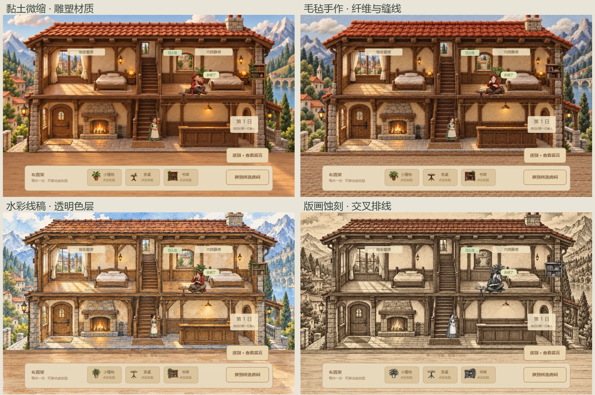

# 画风扩展 · 2026-10-03

本轮聚焦美术风格，沿用同一间旅店的故事、玩法、坐标、家具布置与存档，以便直接比较画面。原有八种旅店画风与独立原画快照保留。

## 已接入的四套样板

| 画风 | 主要视觉语言 | 配套素材 | 实际呈现 |
| --- | --- | --- | --- |
| 黏土微缩 | 雕塑轮廓、黏土表面、柔和接触阴影 | 场景、四位人物的待机/走路/活动姿态、家具 | Canvas 2D 图片素材；不是可转动的三维模型 |
| 毛毡手作 | 羊毛纤维、织物、缝线、柔软边缘 | 同上 | Canvas 2D 图片素材 |
| 水彩线稿 | 透明色层、墨线、纸面留白、颗粒笔触 | 同上 | Canvas 2D 图片素材 |
| 版画蚀刻 | 深色墨块、细线、交叉排线、古纸 | 同上 | Canvas 2D 图片素材 |

每套包含一个场景、十六个人物姿态和四件家具，共 84 个运行素材。人物走路跟随实际移动，活动姿态跟随入住状态；家具跟随房间布置。当前四套只接入旅店，其他游戏尚未制作对应美术。原有微缩、体素与电影光影模式仍使用可旋转镜头的真实 Three.js 场景。

[直接试玩](http://127.0.0.1:8962/games.html?game=inn&look=clay#game-view) · [展厅对比](http://127.0.0.1:8962/showcase.html?play=legacy-inn#play)

## 后续画风候选

以下是尚未完成的美术方向；不需要先增加游戏规则或故事章节。

| 方向 | 视觉重点 | 可沿用的游戏场景 | 素材与渲染需求 |
| --- | --- | --- | --- |
| HD-2D 像素光影 | 精细像素人物、立体布景、景深与局部光 | 旅店、车站、旧城 | 原创像素动作、三维场景或深度分层、像素一致性 |
| 低多边形 3D | 设计过的轮廓、可见平面、干净配色 | 浮岛、远征、搬家 | 独立模型、骨骼动作、统一光照 |
| 日式 3D 卡通渲染 | 分段阴影、笔画轮廓、动画脸部与服装 | 山路、浮岛、战斗 | 美术模型、动画、卡通着色器与轮廓 |
| 水墨留白 | 枯湿笔触、墨色层次、山石留白 | 山路、渡口 | 水墨人物与场景、分层笔触、动画素材 |
| 厚涂油画 | 笔触体积、浓密色层、戏剧光线 | 旅店、旧城、停电故事 | 专门的场景与动作原画、统一材质 |
| 纸艺立体剧场 | 实体纸纤维、剪切边缘、折叠与投影 | 梦境、平台跳跃 | 独立纸艺素材或纸面三维模型；与已有程序纸片模式区别 |
| 木刻 / 浮世绘 | 套色块面、木纹压印、平面构图 | 山路、海岛 | 木刻人物动作、完整场景与物件美术 |
| 铅笔 / 炭笔 | 素描排线、擦痕、局部高光 | 悬疑、车站 | 专门绘制的灰度动作与环境 |
| 黑白电影 | 强烈明暗、轮廓光、胶片颗粒、镜头构图 | 悬疑、旧城、车站 | 重新设计照明、材质与构图；仅去色不足以构成这一方向 |
| 哥特建筑插画 | 高耸剪影、装饰纹样、冷色光与玻璃 | 旅店、车站、战斗 | 对应角色、建筑、道具及统一光照 |
| 复古早期 3D | 有意设计的低模、低分辨率纹理、受限色彩 | 冒险、车站 | 专门低模与贴图；区别于缺少细节的草模 |
| 成熟写实 3D | 实体材质、自然表情、摄影式光照 | 搬家、旧城、远征 | 成套美术模型、PBR 材质、角色动画与场景灯光 |

画风比较应同时看轮廓、形体比例、材质、色彩、照明、镜头与动画，固定游戏内容可以更清楚地观察美术变化。后续优先补齐模型与动画素材，再接入真实三维方向。

## 素材保存与验证

- 使用内置 ImageGen；未使用 CLI/API fallback。
- 最终提示词、原始输出路径与被弃用的第一版记录：`assets/art-styles/style-generation-final-20261003.json`。
- 原始生成素材已复制到 `assets/art-styles/sources/`，运行素材在 `web/assets/art-styles/`。
- 图集只裁切、缩放、压缩，保留生成的透明度；未对图像程序重绘、换色或重建背景。
- 实际浏览器检查见 `notes/style-packs-check-20261003.json`：12 种旅店画风切换保留完整游戏状态，实际移动绘制动作帧，入住绘制活动素材，家具绘制与布置一致，390px 手机布局、展厅控制与画风记忆通过。
- 1516 个既有视觉素材 SHA-256 保持一致；测试仅使用 QA 存储，没有写入用户的正常存档。

这是一轮可玩的美术样板，逐帧动作数量仍有限。
