# 011 · Combination Soup Studio · 交互展示与业务价值

## 2026-10-08 · 完整网页发布

以原网站为视觉与交互参考，分项接入五种效果，沉淀四类技能；品牌活动、桌灯与庭院构成三个实际业务场景。马桶和耳机完整产品页，以及 Foundry 的目标、选配和交付工作台，连接产品目标、制作要求、可操作状态与结果文件。我们的价值是帮助用户理解、选择并保留结果，同时为团队积累可复用的制作和交付方法。

**完整入口**：[研究首页](https://yydshly.github.io/0930_codex_project/projects/011-combination-soup-studio/) · [全景图](https://yydshly.github.io/0930_codex_project/projects/011-combination-soup-studio/understanding-map.html) · [文字理解](https://yydshly.github.io/0930_codex_project/projects/011-combination-soup-studio/understanding.html) · [目标工作台](https://yydshly.github.io/0930_codex_project/projects/011-combination-soup-studio/foundry/studio.html) · [马桶](https://yydshly.github.io/0930_codex_project/projects/011-combination-soup-studio/foundry/showroom.html?example=toilet) · [耳机](https://yydshly.github.io/0930_codex_project/projects/011-combination-soup-studio/foundry/showroom.html?example=headphones) · [服务查询](https://yydshly.github.io/0930_codex_project/projects/011-combination-soup-studio/foundry/?example=coverage&template=coverage) · [独立交付](https://yydshly.github.io/0930_codex_project/projects/011-combination-soup-studio/foundry/?example=headphones&step=delivery)。

[发布浏览器验收](notes/publication-browser-summary.json)核对桌面与手机、全部效果入口、真实下载和独立包运行。初次虚拟路由与重建并发产生的环境异常及稳定复核均保留证据。正式 HTTPS 的[文件与链接校验](notes/deployment-checks.json)通过 6 个页面、94 个文件、68 个地址，文件大小及 SHA-256 与发布清单一致；[线上浏览器检查](notes/publication-online-browser.json)的 10 项检查全部通过，包括马桶/耳机实时模型、PNG 与 ZIP 下载。引导 PNG 与原有文件完全一致。

公开版保留 6 个页面、全部运行模块、必要素材、字体与许可，以及选定场景录像；PNG、JSON、简报和 ZIP 仍由浏览器实际状态生成。模型服务仅允许在本机使用，公网不会探测访客的本机服务。新目标采用预置方案或有限本地规则，陌生产品仍需新增资产、形体与业务；完整自动质量修正没有实现。

引导图沿用既有 2026-10-03 全景图，展示 18 项研究的历史快照。相关研究分别标明已经公开的网页和仅在本机保留的项目，不把尚未发布的页面写成可用入口。原站公开源码及开源许可未确认；固定系列影像、概念模型、虚构型号与示例规则均有边界说明。商业价值尚未实测。


**一张图理解整个项目**：[放大阅读](https://yydshly.github.io/0930_codex_project/projects/011-combination-soup-studio/understanding-map.html) · [高清 PNG](web/assets/understanding-map.png) · [来源与制作记录](notes/understanding-map-record.json)。11 个板块和 16 张实际画面集中展示目标、效果、原理、技能、场景、产品案例、价值与质量交付规划；区分固定生成影像、实时模型和待建设能力。


**理解与网页研究汇总**：[阅读网页](https://yydshly.github.io/0930_codex_project/projects/011-combination-soup-studio/understanding.html) · [内容源](notes/understanding-summary.md)。汇总产品化共识、当前能力与边界、页面入口、18 项研究及质量交付规划；网页与文档共用同一内容源。

**产品入口**：[首页案例区](https://yydshly.github.io/0930_codex_project/projects/011-combination-soup-studio/?revision=20261003-17#product-cases) · [目标工作台](https://yydshly.github.io/0930_codex_project/projects/011-combination-soup-studio/foundry/studio.html?revision=20261003-17) · [马桶完整页](https://yydshly.github.io/0930_codex_project/projects/011-combination-soup-studio/foundry/showroom.html?example=toilet&revision=20261003-16) · [马桶选型工作台](https://yydshly.github.io/0930_codex_project/projects/011-combination-soup-studio/foundry/?example=toilet&step=preview&revision=20261003-16) · [耳机完整页](https://yydshly.github.io/0930_codex_project/projects/011-combination-soup-studio/foundry/showroom.html?example=headphones&revision=20261003-16)。首页、工作台和独立案例之间已有回链；固定案例携带 `example`，避免被最近保存的另一个产品覆盖。

[产品入口检查](notes/product-navigation-check.json) 核对桌面与手机的直达、回链、案例切换、工作台预览及旧草稿覆盖情形；截图保存在 `assets/qa/navigation/`。本轮调整入口关系，不重复判定产品材质与视觉质量。

先体验五个原站效果，再通过四类技能工作台理解可复用的任务流程、输入输出与价值。工作台连接实际业务原型，记录当前结果并导出交付计划；子项目内已建立可复用的 Codex 技能包。

[演示入口](web/index.html) · [原网站](https://combinationsoupstudio.com.au/) · [效果拆分](notes/effects-breakdown.md) · [详细研究](notes/research.md) · [效果验证](notes/effects-verification.json) · [场景验证](notes/verification.json)

| 信息 | 内容 |
| --- | --- |
| 对象 | 官网、公开前端、三档套餐与 AI 可读文件 |
| 快照 | 2026-10-02；URL、标题、状态与 UTF-8 SHA-256 见 [来源核对](notes/source-audit.json) |
| 来源性质 | 网站案例，未确认公开源码仓库、commit 或开源许可证 |
| 本项目内容 | 五个独立效果模块、原站视频 URL 接入、业务原型、引导图与本机截图 |
| 状态 | 原站效果已有分项核对；业务场景当前为第八版，庭院水面倒影、植物层次、选择结果与方案面积差异均可查看和导出；商业收益未实测 |
| 平台 | 现代桌面与手机浏览器，静态 HTML/CSS/JavaScript；产品与庭院展示使用本地 MIT Three.js r160 与 WebGL，无法使用 WebGL 时保留二维兼容预览 |
| 发布 | 已公开发布到 GitHub Pages；[发布记录](notes/deployment-summary.json)、[文件校验](notes/deployment-checks.json)与[线上浏览器验收](notes/publication-online-browser.json)可核对 |

## 造型与展示重做 · Idea Foundry V1.7

[新版完整产品页](https://yydshly.github.io/0930_codex_project/projects/011-combination-soup-studio/foundry/showroom.html?example=headphones&revision=20261003-16) · [工作台](https://yydshly.github.io/0930_codex_project/projects/011-combination-soup-studio/foundry/studio.html?example=headphones&revision=20261003-16) · [实际审视、修改与证据](notes/headphone-art-direction-v16.md)

以已有系列影像为标杆重新做实际耳机形体：缩紧头梁、放大耳罩，改为端帽和短连接杆，重建柔软耳垫、金属面板边缘与操作细节。校准中性银色与连续背景，近景单独观察真实耳罩。产品页以宽幅画面和主要选配为中心，折叠、部件及换光线收进次级探索；手机模型给视角工具条留出独立空间。

保留真实模型、当前状态和独立交付；没有将系列照片充作实时选配画面。形体与层级已更接近参考，复杂皮革和光学细节仍有差距，不以“最终摄影级”或测试数量来评价本轮审美质量。

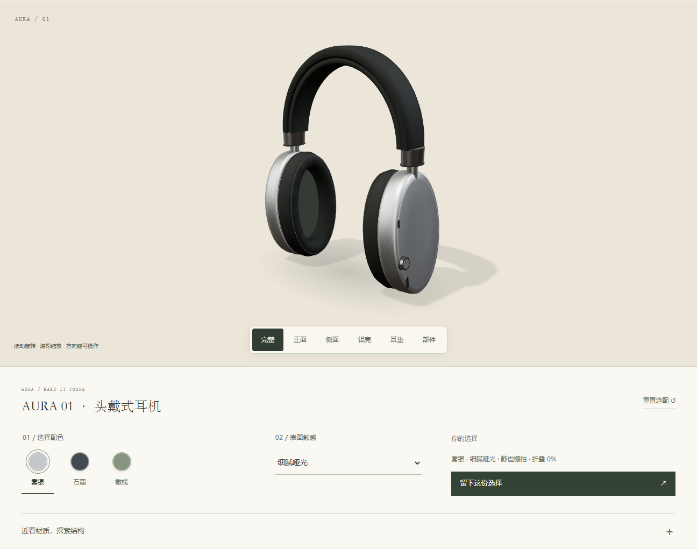

## 材质细节与实际近景 · Idea Foundry V1.6

[新版工作台](https://yydshly.github.io/0930_codex_project/projects/011-combination-soup-studio/foundry/studio.html?example=headphones&revision=20261003-15) · [完整耳机页](https://yydshly.github.io/0930_codex_project/projects/011-combination-soup-studio/foundry/showroom.html?example=headphones&revision=20261003-15) · [改进、要求与验证](notes/headphone-material-focus-v15.md)

补齐曲面纹理坐标并修复外壳法线接缝，细化金属、织物、耳垫缝线和头梁内侧包覆；校准棚拍与夜色反射。铝壳、耳垫分别近看，旋转后保持耳罩观察范围，工作台可放大画面检查细节。折叠绕固定连接点旋转，半折叠和完全折叠均保持支架连接。焦点和角度进入制作简报、配置与独立包；旧相机记录仍可读取。

21 项新增观察与交付检查、43 项耳机回归、5 项兼容检查通过。实际包经隔离运行，近景 PNG 与当前画布一致；1440、768、390 像素下六个视角与放大预览均无横向溢出。当前仍为原创概念展示，专属实物形体与资料需要另行制作。

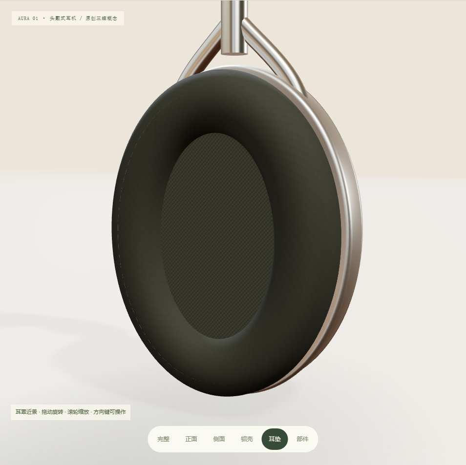

## 在目标工作台直接试用产品 · Idea Foundry V1.5

[新版工作台](https://yydshly.github.io/0930_codex_project/projects/011-combination-soup-studio/foundry/studio.html?example=headphones&revision=20261003-14) · [修改与验证记录](notes/foundry-live-workbench-v14.md)

耳机示例打开即呈现制作方案和实际模型。配色、表面、折叠、环境及自定义视角可在工作台试用，选择进入完整产品页、可读简报与独立下载包。文案和范围调整后立即更新效果；目标改变或调整未应用时，停用旧预览。工作台复用完整产品页的同一个渲染器，陌生产品仍明确保留模块缺口。

23 项新增流程、5 项兼容与 43 项耳机回归通过，实际下载包经隔离运行；1440、768、390 像素的模型与控件分开布局并无横向溢出。当前展示仍采用已实现的 AURA 概念，新的形体与素材需要制作，在线生成未进行真实调用。

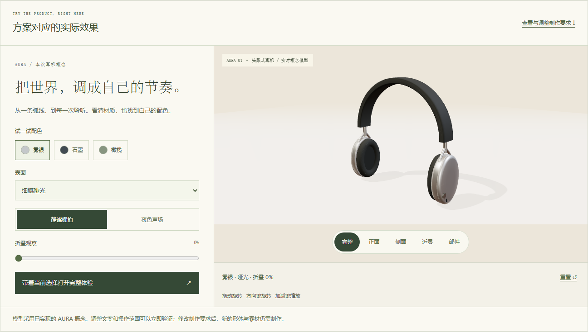

## 制作方案可调整、可交接 · Idea Foundry V1.4

[新版目标工作台](https://yydshly.github.io/0930_codex_project/projects/011-combination-soup-studio/foundry/studio.html?example=headphones&revision=20261003-13) · [新版耳机选配](https://yydshly.github.io/0930_codex_project/projects/011-combination-soup-studio/foundry/showroom.html?example=headphones&revision=20261003-13) · [本轮修改与验证](notes/foundry-refinement-v13.md)

输入先聚焦产品与任务。制作方案按方案、素材与缺口、调整与验收分栏呈现，可修改文案、具体要求与验证方法，再调整表面比较和部件展开范围。应用后文案与范围进入实际页面，制作要求随简报和项目包保留；未知产品仍需要自己的运行模块。

耳机选配增加即时摘要、重置和手机返回画面入口，并改善控件可读性与头梁端面。26 项新增验证与 43 项耳机回归通过；实际下载包经隔离运行，修改的文案与关闭的操作仍生效。在线生成仍待真实调用验证。

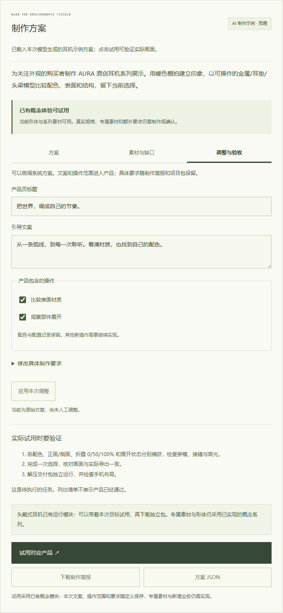

## 从产品目标到制作要求 · Idea Foundry V1.3

[目标工作台 · 耳机验证](https://yydshly.github.io/0930_codex_project/projects/011-combination-soup-studio/foundry/studio.html?example=headphones&revision=20261003-12) · [完整耳机产品页](https://yydshly.github.io/0930_codex_project/projects/011-combination-soup-studio/foundry/showroom.html?example=headphones&revision=20261003-12) · [制作要求生成契约](skills/interactive-business-experience/references/product-planning.md)

填写产品与访客任务，再补充受众、优先项、风格与素材。方案分别列出构图、材质、手机布局、素材、交互、缺失资料和可观察的验收任务。耳机案例把方案带入工作台，完成旋转、配色、表面、折叠、部件和环境选择，再下载配置、真实画面与独立运行包。

方案来源明确区分：本次代理模型制作并预置的耳机示例、按输入整理的本地规则草案，以及服务端配置后的在线模型生成。本机当前无 API 密钥；在线入口关闭，接口已用模拟传输及错误样本验证，没有真实在线调用证据。离线规则不保证理解任意自然语言。

已实现的头戴耳机、马桶与桌灯模块可以试用；输入咖啡机、入耳式耳机等新类别只生成制作清单，保留模块缺口。已有模块采用当前概念系列的影像与形体，制作要求不会自动改写任意产品或素材。

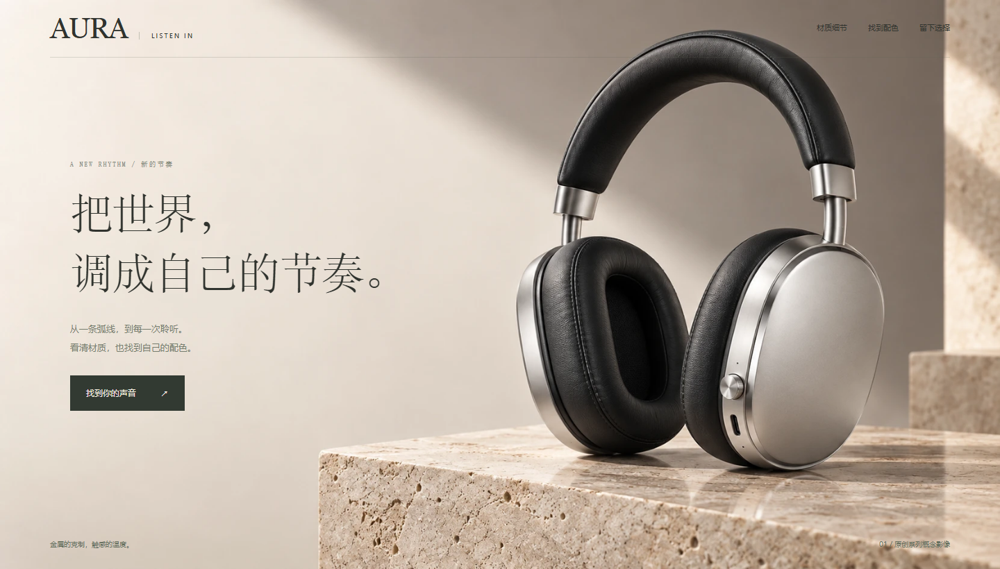

[制作与验证记录](notes/headphone-build-v12.md) · [流程检查](notes/headphone-verification-v12.json) · [默认完整交付包](notes/headphone-downloads-v12/idea-foundry-headphones-showcase-v12.zip) · [隔离运行复核](notes/headphone-final-delivery-v12.json) · [素材与生成要求](notes/headphone-assets-v12.json)

可选在线要求服务在独立终端运行 `python projects/011-combination-soup-studio/tooling/planning-server.py`，端口 8952；凭据只读取服务端环境 `OPENAI_API_KEY`，模型可用 `OPENAI_MODEL` 指定。静态预览仍为 8951。接口使用 [Responses API 结构化输出](https://developers.openai.com/api/docs/guides/structured-outputs)，输出经类别和数据校验；不返回可执行代码。

## 从新想法到独立产品 · Idea Foundry V1.2

[完整马桶产品展示](https://yydshly.github.io/0930_codex_project/projects/011-combination-soup-studio/foundry/showroom.html?example=toilet&revision=20261002-11) · [产品制作工作台](web/foundry/index.html) · [马桶案例直接试用](https://yydshly.github.io/0930_codex_project/projects/011-combination-soup-studio/foundry/?example=toilet&step=preview&revision=20261002-11) · [工作台契约](skills/interactive-business-experience/references/product-foundry.md)

[马桶项目的具体制作与验收要求](skills/interactive-business-experience/references/product-quality-brief.md)已经按页面、素材、三维、交互和交付拆分；其中明确区分当前证据与后续质量目标，后续新产品可据此改写。

填写目标用户、问题、输入与完成结果，选择一个任务模板，再调整品牌与业务配置。构建后可实际操作，下载配置、画面或查询摘要；交付包包含可独立运行的页面、所需本地模块、产品定义、README 和最近一次试用结果。可以新建多个产品、本机保存和用 JSON 导入继续。

| 首版任务 | 可直接配置 | 按产品另接 |
| --- | --- | --- |
| 产品选配 | 名称、标题、品牌色、配色、材质/灯光/结构操作范围 | 其他产品真实几何与素材，库存、报价、订单 |
| 马桶选型 | 三款可编辑目录、尺寸、水箱类型、电源要求、坑距与配色；现场空间、盖板与部件、示例报价 | 厂商真实 SKU、供水与安装要求、正式报价与订单 |
| 服务资格查询 | 服务名称、地区、是否覆盖、规则说明 | 业务方确认数据，真实提交与咨询送达 |

工作台复用的是任务模块、配置校验、预览状态与交付流程。自由文本由用户明确整理，当前构建不调用在线模型。勾选需要 AI 会保留接入需求与任务说明。超出当前两类模板的新产品，需要新增运行模块后复用共同底座；尚不是任意产品的自动生成平台。

马桶驱动的补全覆盖创建者与消费者两端：创建者修改目录尺寸、价格、坑距、电源和规划值；消费者比较型号、观察盖板/部件与尺寸、填写现场条件并导出完整选型单。形体和核对结果共同受目录参数驱动。默认未测量项为待补充，坑距不一致、空间不足、后排水、电源缺失会列出冲突。参数匹配只表示示例规则一致，安装仍需图纸和现场复核。测量说明依据 [TOTO 坑距定义](https://reborntotoitems.toto.com.cn/cn/faq/55.html)，选型条件参考 [KOHLER 选型指南](https://experience.kohler.com/en/inspiration/buying-guides/toilets-buying-guide)；目录与价格为本项目虚构示例。

[正式展示版实现与复核](notes/toilet-presentation-v11.md) · [实际运行检查](notes/toilet-verification-v11.json) · [完整案例交付包](notes/toilet-downloads-v11/idea-foundry-toilet-showcase-v11.zip) · [独立交付复核](notes/toilet-final-delivery-v11.json) · [上一版功能补全](notes/toilet-build-v10.md)

正式展示版包含原创生成的横版/竖版主视觉、材质特写、完整品牌页、实时 WebGL 选型、卫浴与摄影棚环境。3D 使用连续陶瓷外壳、石材贴图、釉面反射、接地阴影与实际地面反射；主体参数和现场核对仍受目录驱动。故事影像为固定系列意象，选型区才是随配置变化的实际三维画面。

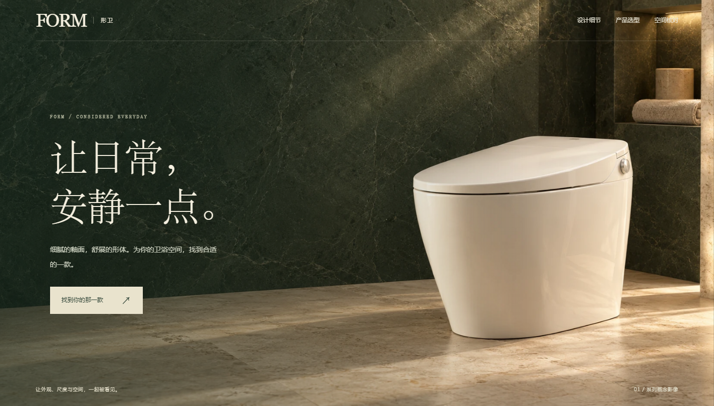

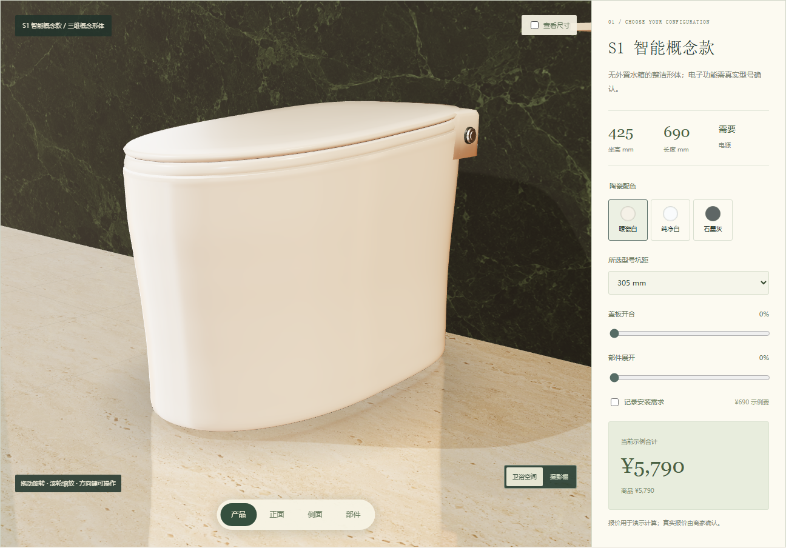

实际验证包括 ZIP 完整性、脱离原站的独立运行、当前选配恢复、地区规则生效、过期查询清除、多产品保存、导入恢复、异常输入以及 390/768 像素布局。见 [验证记录](notes/foundry-v1-verification.json)、[实际交付包](notes/foundry-v1-downloads) 与 [视觉复核](notes/foundry-v1-review.md)。任务价值指标需真实用户测量。

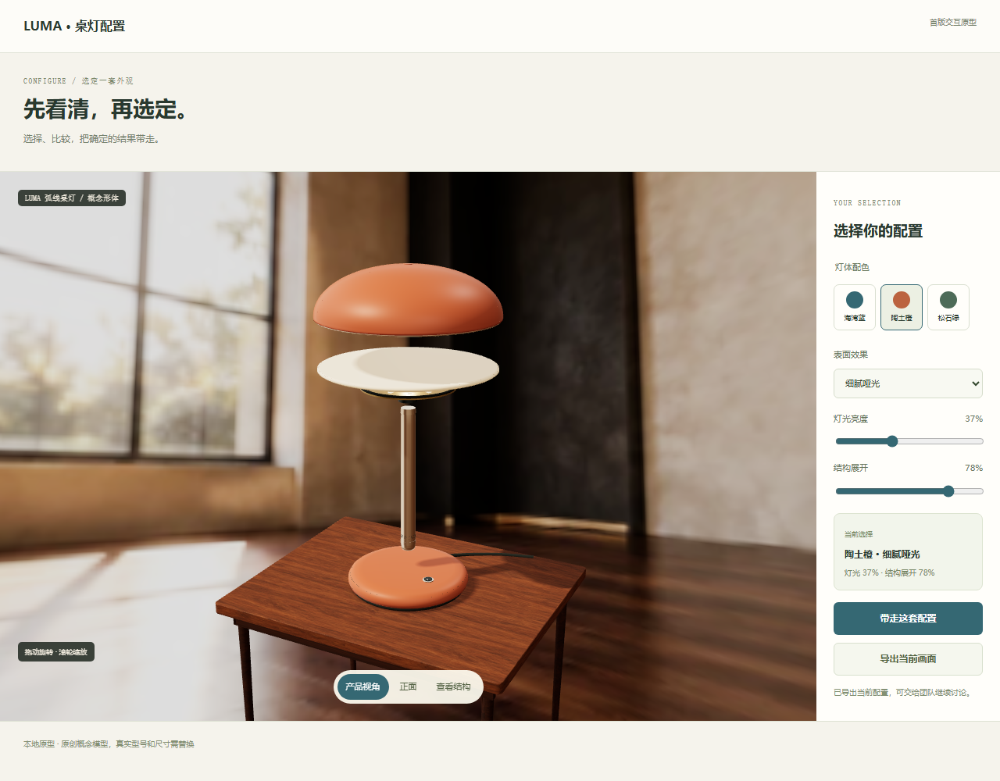

## 引导图与演示

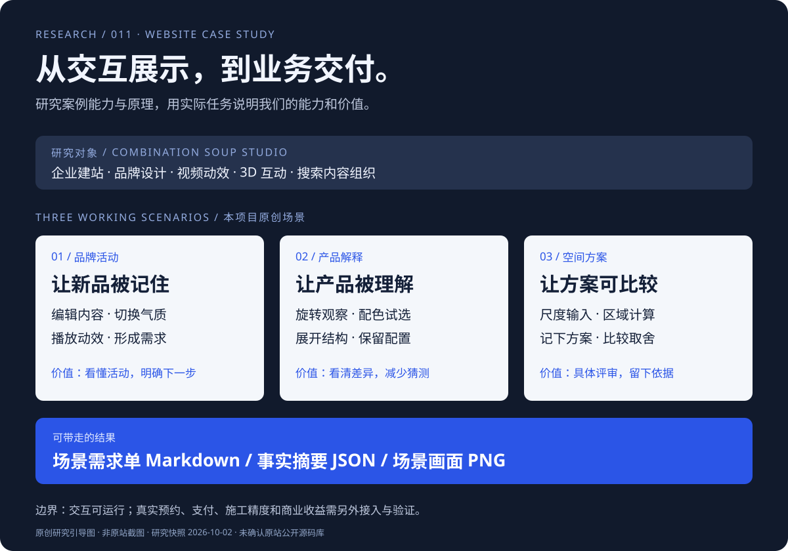

引导图为本项目原创，非原网站截图。下方图片来自本项目真实浏览器运行。

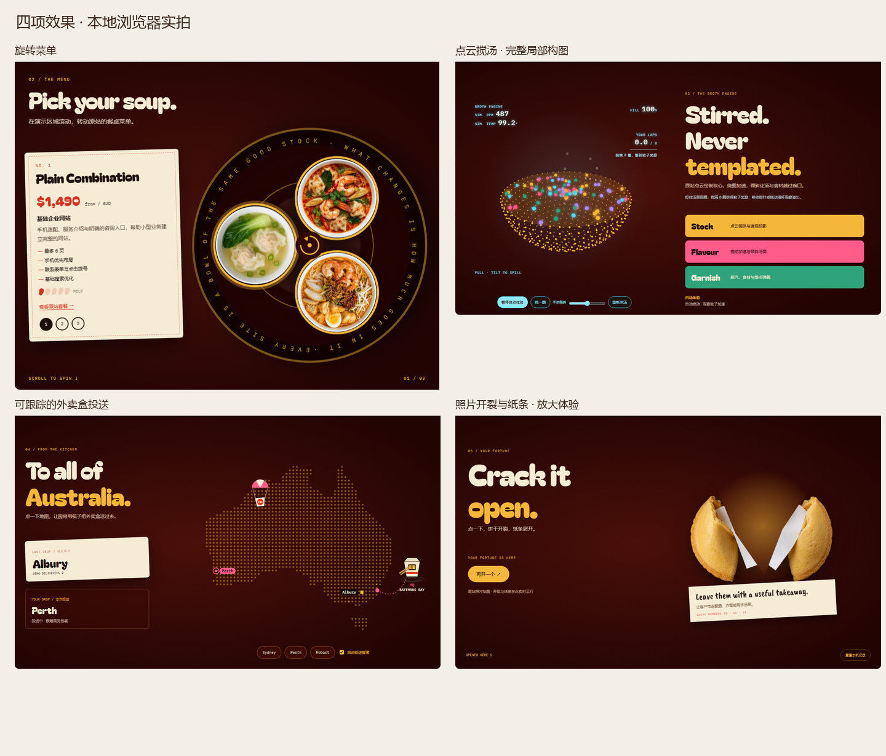

[实际操作录像](assets/effects-refined.mp4) · [原站与本地组件对照](assets/qa/source-local-comparison.png) · [视觉验收](design-qa.md)

五项效果分别为汤碗与蒸汽、旋转菜单、搅汤引擎、投送地图、幸运饼干。每项单独 mount/dispose，拥有直接入口、控件、来源说明和项目归属。新增代码均归属 011；002、004、005 为可结合的已有研究方向。详见 [拆分与接入说明](notes/effects-breakdown.md)。

## 案例能力与原理

官网声明提供企业建站、本地搜索、电商、品牌、视频动效、3D 互动和 AI 搜索内容组织。基础网站最多 6 页，1,490 澳元起；扩展网站最多 12 页；电商增加商品目录、购物车、Stripe、配送、税费与订单邮件。Logo 450 澳元起；品牌、视频、3D 与 AI 搜索另行报价。

公开前端能确认 HTML/CSS/JavaScript、Canvas 2D、视频、滚动与指针事件、设备方向与运动事件，以及咨询与统计接口。服务菜单和点餐小票分别承接套餐理解与需求提交。

正文、JSON-LD、robots.txt 与 llms.txt 提供业务事实和抓取入口。爬虫访问不等于引用或推荐；Google 的 AI 搜索仍采用基础 SEO，不要求特殊 AI 文件。原站后端仅观察到接口，未执行购买、咨询送达或项目交付测试。

## 用实际任务展示我们的能力

品牌和产品为虚构业务案例；交互与文件输出在本机真实运行。

| 场景 | 可操作内容 | 可交付内容与客户价值 | 采用条件 |
| --- | --- | --- | --- |
| 品牌新品活动 | 编辑名称、标题、目标，选择虚构茶款，切换三种配色与动效 | 活动页原型、统一表达、行动入口、需求单；让客户理解活动与下一步 | 活动时间、地址、照片与真实预约服务 |
| 产品解释与配置 | ARC 桌灯 WebGL 三维展示；拖动/键盘旋转、滚轮/双指与按钮缩放；三色、两种材质、棚拍/夜景、四视角、四部件热点、结构展开与重置 | 可操作产品解释、配置与观察状态、PNG、需求单和技能计划；让客户看清结构并保留选择 | 真实产品尺寸、素材或标准模型；材质与灯光需按客户数据校准 |
| 庭院方案评审 | 实时三维与总览平面、拖动/键盘旋转和缩放、尺度与区域占比、日夜、水面、保存方案 A 并比较 | 概念图、面积、比较、PNG 与需求单；把空间取舍放到同一张图 | 现场测量、照片或扫描，以及施工深化 |

“生成场景需求单”记录问题、当前参数、交付、价值、采用条件与验收方法，支持 Markdown 下载与复制。事实 JSON 随场景更新，可下载；产品与庭院支持 PNG。

文件只在浏览器本机生成，没有发送预约或订单。方案 A 仅保留在当前页面，刷新清除。没有编造收入、转化率、咨询数量或 AI 推荐数量。

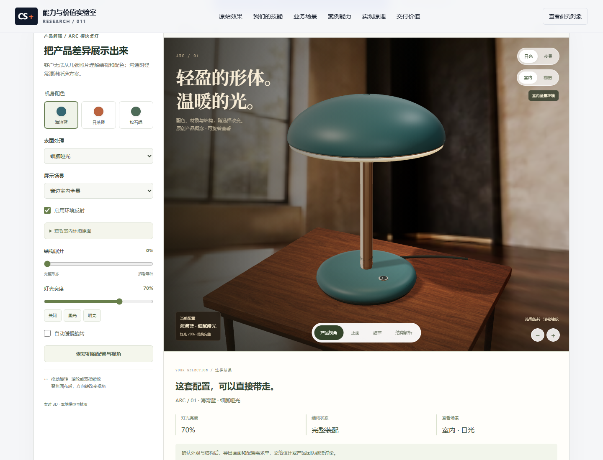

ARC 桌灯为本项目原创产品概念，采用本地 Three.js r160 实时 WebGL 渲染。曲面几何、PBR 材质、生成的 LDR 棚拍环境反射、木质展示台、灯光与阴影随选择更新；产品、正面、细节与结构四个视角帮助观察形体，灯罩、扩散板、支柱和底座四个热点提供部件解释。夜景、灯光、配色、材质与结构参数进入配置记录、PNG、需求单和技能计划。

[直接体验产品展示](https://yydshly.github.io/0930_codex_project/projects/011-combination-soup-studio/?effect=broth&scene=product&revision=20261002-4#product-preview) · [32 秒实际操作录像](assets/product-showcase-refined.mp4) · [独立视觉复核](notes/product-visual-review.md) · [细节画面](assets/qa/product-final-detail-1440.png) · [结构解析](assets/qa/product-final-structure-1440.png) · [产品验证](notes/product-showcase-verification.json)

当前模型及材质用于概念表达，未按实物尺寸、物理照明或工业标准标定，也未使用实物照片。二维兼容预览保留选配、结构查看与导出，不能自由旋转或缩放。交互产品解释与配置记录的价值可直接检查；理解正确率、选配耗时及商业效果仍需真实用户测试。

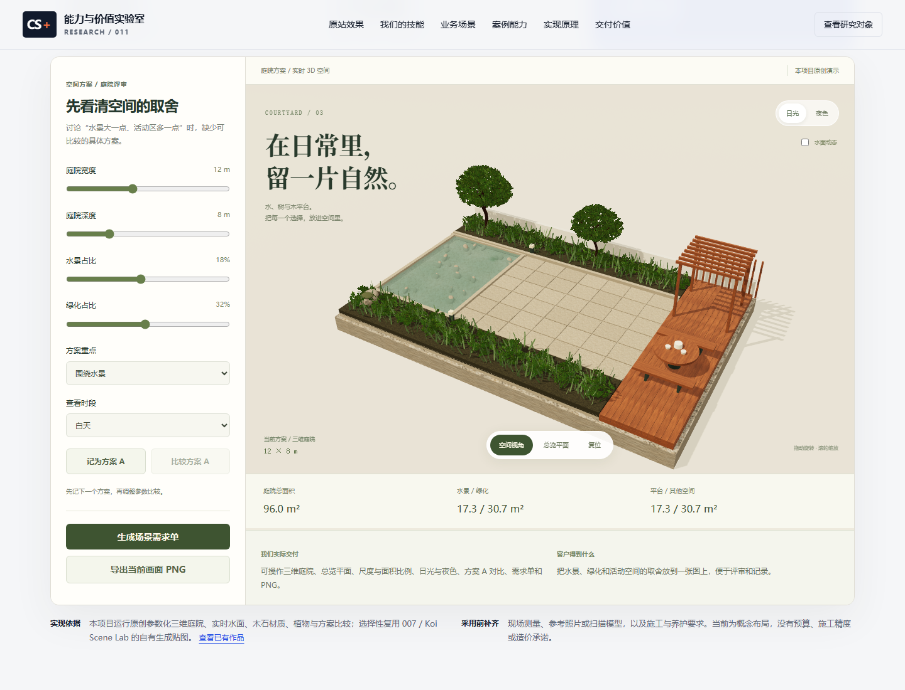

庭院区域按输入比例构建三维几何，同时提供正交总览平面，面积来自同一参数。水景方案预留 18% 平台，聚会方案预留 30%；至少保留 5% 其他空间，必要时约束绿化上限并说明。图形不是真实地点测绘或施工图。

## 从研究案例沉淀我们的技能

[技能工作台](web/index.html?skill=explain#skills) · [项目内技能文件](skills/interactive-business-experience/SKILL.md) · [组件地图](skills/interactive-business-experience/references/component-map.md) · [交付契约](skills/interactive-business-experience/references/delivery-contract.md) · [实际结果验证](notes/skill-verification.json)

技能名为 `interactive-business-experience`，用于将业务任务构建为可操作、可导出、可验收的交互体验。它保存任务选择、内容与状态分离、输出契约、素材适配与验收方法；五个原站视觉只是参考机制。新客户项目按自己的素材、数据与规则实现。技能保存在本子项目，未安装到全局或 `.agents/skills`。

| 技能方向 | 参考机制 | 当前业务证据 | 价值与验证 |
| --- | --- | --- | --- |
| 品牌叙事与选型 | 动态首屏、滚动聚焦与选项同步 | 品牌编辑、三款虚构茶款选择、主题与目标、需求单 | 用户明确选择；比较理解、选款耗时和需求完整度 |
| 操作式产品解释 | 操作改变状态、及时反馈 | ARC 桌灯 WebGL、材质与夜景、四视角/四热点、结构展开及配置导出 | 用户通过操作理解差异、留下明确配置；测理解正确率、选配耗时和错误 |
| 区域服务查询 | 地域选择、目标反馈与服务详情 | 本地虚构地区与服务查询、覆盖/未覆盖反馈、结果导出 | 减少覆盖确认往返；测查找耗时与咨询缺失字段 |
| 内容揭晓与任务反馈 | 开启、展示、重复与重置状态 | 三条普通提示、下一步行动、次数与内容记录 | 提示帮助完成下一步；测知识理解与相关任务完成 |

工作台可编辑项目、用户任务和计划范围，预览或下载 Markdown 交付计划与 JSON 契约。品牌/产品的实际参数、区域查询结果或揭晓内容会进入同一计划。各场景最新快照保留在本次页面会话中，切换业务场景不丢结果；刷新后重新开始。编辑计划不自动改写业务原型。

“原型 + 业务接入计划”增加接口约定和待接清单，不表示已经接通预约、库存或奖励。原型验收能确认结果完整；客户理解、选择、有效咨询和团队重复交付耗时需真实采样，尚无收入或转化提升证据。

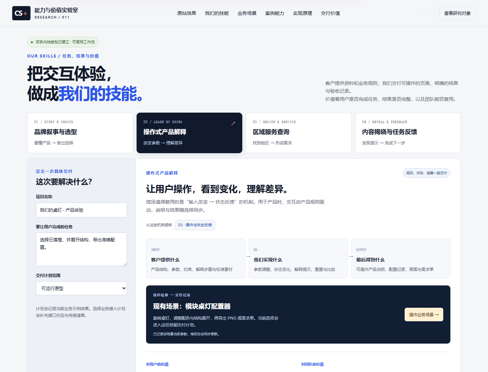

调用示例：让代理读取本项目 `skills/interactive-business-experience/SKILL.md`，为指定客户和任务构建页面，使用客户提供的素材与规则，交付运行原型、结果数据和验收记录。技能详情只在调用时读取，原站研究素材不作为默认客户资产。

## 对我们现有工作的价值

本项目把已有视觉、动效、配置与空间研究组织成“明确任务 → 操作体验 → 理解差异 → 生成需求 → 定义验收”的流程。

- [002 · Huashu Design](../002-huashu-design/README.md)：视觉组织、素材、演示与导出经验。008 的动效接入仍需逐项核验。
- [005 · Plush Lab](../005-plush-lab/README.md)：参数配置、互动和结果输出经验。本项目桌灯为独立实现。
- [007 · Koi Scene Lab](../007-koi-scene-lab/README.md)：庭院 3D 与尺度研究。本项目实现独立参数化庭院三维场景，仅选择性复用 007 的自有生成木、石、砾石贴图。

网站案例的主要增量是服务包装、能力展示与需求承接方法。预约、支付、订单邮件和客户管理需要独立接入；客户理解、咨询与评审收益需实际测量。

## 本地运行

从仓库根目录启动共享预览，跨项目作品入口也可访问：

```powershell
python scripts/build_site.py
python -m http.server 8951 --bind 127.0.0.1 --directory _site
```

访问 https://yydshly.github.io/0930_codex_project/projects/011-combination-soup-studio/ 。单独查看也可将目录改为 projects/011-combination-soup-studio/web，但跨项目入口需要共享预览。无需 npm 安装；ES modules 请通过 HTTP 加载。

## 验证与扩展

此前 48 项业务场景检查覆盖内容同步、文本输入安全、动效开关、键盘场景切换、原产品旋转/展开/重置、面积约束、比较保留当前参数、Markdown/JSON/PNG 实际下载、390/768/1280 像素视口与减少动态偏好，属于升级前的回归记录。效果模块通过 41 项功能检查，包括汤量实际下降的溢出、城市到达、跨刷新记录及减少动态偏好；另有 34 项布局检查覆盖 390/768/1440 像素下三档菜单、地图标题、控制区与饼干纸条。均无未处理浏览器错误。首屏视频为明确标示的外部媒体依赖。见 [效果验证](notes/effects-verification.json)、[布局验证](notes/layout-verification.json)、[场景验证](notes/verification.json) 和 [截图对照](design-qa.md)。effects-verification-v1.json 仅保留历史版本。

产品展示升级的独立 50 项检查见 [product-showcase-verification.json](notes/product-showcase-verification.json)，核对实际 WebGL 像素、夜景与发光、配色/材质、视角/展开、部件说明、旋转/缩放、重置、实际 PNG、需求单、技能计划，以及 390/768/1440 像素布局。记录无未处理浏览器错误；这份报告不含实物标定或手机硬件性能结论。上一版独立视觉复核只对应 revision 20261002-4；用户对质感的反馈已重新开启评审，不能用该结论证明新版达到原站质感。第五版的实际画面与行为核对见下文。

复现脚本为 tooling/verify-effects.mjs、tooling/verify-layout.mjs 和 tooling/verify.mjs，依赖本机 Playwright；功能脚本支持 CAPABILITY_NODE_PACKAGE 和 CAPABILITY_PREVIEW_URL。tooling/capture-effects.mjs 捕获源站与本地画面，tooling/record-effects.mjs 录制操作，tooling/compose-evidence.py 将真实截图排入对照图。验证下载文件存于 notes/verification-downloads。

四类技能工作台本轮通过 39 项行为与布局检查，包含真实 Markdown/JSON 下载、地区与服务组合、内容重复与重置、跨场景参数保留和 390/768/1440 像素布局。产品升级后，原有业务场景 48 项回归检查也通过。详见 [技能价值记录](notes/skills-and-value.md)。

下一步按真实需求接入服务、标准模型和测量数据，再验收任务完成、有效咨询与评审往返。静态 Pages 不能独立提供预约、支付回调、邮件或数据库。

## 来源与许可

研究来源：[官网](https://combinationsoupstudio.com.au/)、三档套餐、[llms.txt](https://combinationsoupstudio.com.au/llms.txt)、[Google AI 搜索文档](https://developers.google.com/search/docs/appearance/ai-features?hl=zh-CN)。

未确认原站开源许可。汤碗视频以原站 URL 直接加载，未随项目打包；运行截图中展示了该原站素材，权利归原权利人。四项效果采用选定原站素材与绘制组件的拆分适配，场景代码与引导图为本项目研究产物。来源网站及其商标仍归原权利人所有。

ARC 桌灯几何与产品交互为本项目原创概念实现；第三方渲染库 Three.js r160 在 `web/vendor/three-r160.min.js` 本地提供，MIT 许可文本见 [THREE-LICENSE.txt](web/vendor/THREE-LICENSE.txt)。

[返回总索引](../../README.md#项目索引)

## 20261002-5 · 三个业务场景的质感升级

[品牌活动](https://yydshly.github.io/0930_codex_project/projects/011-combination-soup-studio/?effect=broth&scene=brand&revision=20261002-5#scenes) · [产品配置](https://yydshly.github.io/0930_codex_project/projects/011-combination-soup-studio/?effect=broth&scene=product&revision=20261002-5#scenes) · [庭院评审](https://yydshly.github.io/0930_codex_project/projects/011-combination-soup-studio/?effect=broth&scene=garden&revision=20261002-5#scenes)

品牌使用原创生成的茶具摄影、可编辑包装标签、大标题与克制动效。产品加入真实木纹展示台、生成的棚拍全景反射、涂层微纹理和更细的金属支柱，保持实时三维、结构解释与配置导出。庭院从色块平面图升级为独立三维几何、木石贴图、叶片植物、真实场景反射水面、日夜灯光和三维/正交视角，保持面积约束与方案 A 比较。

[三个场景实际操作录像](assets/business-scenes-v5.mp4) · [升级前后真实截图](assets/business-scenes-v5-comparison.png) · [素材路径与生成提示词](notes/scene-assets-v5.json) · [本轮视觉核对](notes/scene-visual-review-v5.md) · [场景行为与导出验证](notes/business-scenes-v5-verification.json)

三个场景都保留真实输入、状态和本地交付。摄影为 AI 生成概念素材；产品及庭院是可交互概念模型，未做实物或现场校准。棚拍全景是生成的 LDR 素材，不能视作测量 HDR 环境。这一版补齐了上一版缺少的素材、材质和构图层次；视觉偏好仍需用户判断，功能通过不等于与原站质感相同。

## 20261002-6 · 让素材参与可见体验

[查看桌灯的室内场景](https://yydshly.github.io/0930_codex_project/projects/011-combination-soup-studio/?effect=broth&scene=product&revision=20261002-6#scenes) · [查看庭院近景](https://yydshly.github.io/0930_codex_project/projects/011-combination-soup-studio/?effect=broth&scene=garden&revision=20261002-6#scenes) · [当前实际操作录像](assets/business-scenes-v6.mp4)

桌灯默认放在可见的室内全景中，可切换简洁棚拍、日光/夜景、开关环境反射，并展开环境原图。房间原图既进入背景，也经 PMREM 参与模型的表面反射；窗、墙与地面现在实际可见。背景使用独立广角取景，随观察方向转动，是生成全景呈现，没有可行走的房间几何或现场测量。

庭院增加水景与植物近景，放大同一三维场景中的水面、石材、叶片和枝干；叶片使用带弯曲的几何与透明贴图，原图也可展开查看。总览平面、旋转、日夜、面积约束及方案 A 比较继续保留。

价值是让用户检查“放进场景后看起来如何”和“材料细节是什么”，同时留下明确配置与当前画面。展示场景、反射和真实观察状态进入 JSON、需求单及技能计划。没有 WebGL 时关闭不支持的功能；全景加载失败则明确回退棚拍。

[真实截图组合](assets/scene-refinements-v6-gallery.png) · [视觉核对](notes/scene-visual-review-v6.md) · [新增功能核对](notes/scene-refinements-v6-verification.json) · [庭院及品牌回归](notes/business-scenes-v6-verification.json)。本轮复用第五版素材，没有重新生成房间或叶片。

## 20261002-7 · 支撑、植物与水景细节

[新版桌灯](https://yydshly.github.io/0930_codex_project/projects/011-combination-soup-studio/?effect=broth&scene=product&revision=20261002-7#scenes) · [新版庭院](https://yydshly.github.io/0930_codex_project/projects/011-combination-soup-studio/?effect=broth&scene=garden&revision=20261002-7#scenes) · [实际操作录像](assets/scene-polish-v7.mp4)

桌灯的室内展示增加真实桌框与桌腿，调整主视角留白与涂层高光。庭院的规整树冠改为沿渐细枝条分布的非对称叶簇，草叶缩细、弯曲并增加色差。水池基础围绕盆体分区，池底下凹，石子位于水下；实时表面与细波纹保留日夜和动态开关。使用已有生成素材，没有重新生成产品照片或场景贴图。

本轮还复现并修复手机选配后的旧画面问题：用户滚到下方编辑时，画布已离开视口，过去会跳过绘制；现在明确修改或导出时刷新一次，持续动画仍在隐藏时暂停。产品和庭院离开视口后的 PNG 均与最新画面一致。

[前后真实截图](assets/scene-polish-v7-comparison.png) · [当前效果组合](assets/scene-polish-v7-gallery.png) · [视觉与修复记录](notes/scene-visual-review-v7.md) · [47 项场景核对](notes/scene-refinements-v7-verification.json)。产品 50 项与品牌/庭院 41 项回归也已在第七版通过。交互模型仍用于概念演示，未做实物、现场或手机硬件性能标定。

## 20261002-8 · 材质层次与选择结果

[庭院](https://yydshly.github.io/0930_codex_project/projects/011-combination-soup-studio/?scene=garden&revision=20261002-8#scenes) · [桌灯](https://yydshly.github.io/0930_codex_project/projects/011-combination-soup-studio/?scene=product&revision=20261002-8#scenes) · [品牌活动](https://yydshly.github.io/0930_codex_project/projects/011-combination-soup-studio/?scene=brand&revision=20261002-8#scenes) · [实际操作录像](assets/scene-polish-v8.mp4)

水面改为相机对应的平面反射：当前场景从镜像相机渲染，水面以下由裁剪平面排除；倒影、光泽、细波纹与水下池底共同形成层次。树冠沿主枝与细枝分布，增加内外疏密和叶色变化；灌木使用单独弯曲叶片几何。木石凹凸减弱，日光方向、阴影和植物色彩统一。桌灯微调哑光高光、室内取景与反射环境，继续保留旋转、选配和结构解析。

三个场景都提供即时选择结果。庭院结果区给出真实面积与当前相对 A 的差值；查看 A 时，画面、面积和导出均指向 A，同时独立保留当前参数。需求单与 JSON 包含两套方案及差值。产品记录所选颜色、表面和灯光，品牌记录活动主题和行动目标；导出按钮紧邻结果，便于把讨论交给团队继续推进。

模块分别为 `web/planar-water.js` 和 `web/scene-decision.js`，没有复制原站整页或新增通用 SDK。平面反射公式选择性适配 Three.js r160 的 MIT Reflector；原项目 LICENSE 保留在 `web/vendor/`。本轮复用既有素材。

[当前效果](assets/scene-polish-v8-gallery.png) · [同视角前后对照](assets/scene-polish-v8-comparison.png) · [视觉记录](notes/scene-visual-review-v8.md) · [选择与交付验证](notes/scene-decision-v8-verification.json)。客户可评审概念外观和空间取舍；实物材质、现场施工和真实业务收益仍需各自验证。
