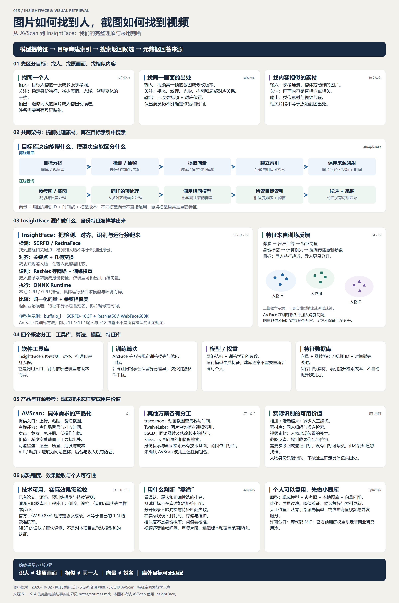

# 013 · InsightFace · 人脸与视频截图检索理解

> 从 AVScan 的截图反查问题出发，整理图像检索、人脸身份识别、特征向量与目标数据库的关系。模型提供特征提取能力，目标库决定可搜索范围，检索返回候选，元数据回答图片或视频来源。

**网页入口：** [总览与全部展示](web/index.html) · [完整理解](web/understanding.html) · [放大原有全景图](web/map.html) · [原理与向量教学示意](web/mechanisms.html) · [14 组来源与研究记录](web/sources.html)。原站与源库的链接在网页首屏及参考区分别展示。

**已验证公开入口：** [完整研究网页](https://yydshly.github.io/0930_codex_project/projects/013-insightface-retrieval/) · [原图放大与下载](https://yydshly.github.io/0930_codex_project/projects/013-insightface-retrieval/map.html) · [原理示意](https://yydshly.github.io/0930_codex_project/projects/013-insightface-retrieval/mechanisms.html)。2026-10-08 初次发布的九个正式文件哈希与 63 项公网浏览器检查通过，详见 [发布记录](notes/publication.md)。

| 信息 | 内容 |
| --- | --- |
| 主要源库 | [deepinsight/insightface](https://github.com/deepinsight/insightface) |
| 研究起点 | [AVScan](https://avscan.cc/)，其公开后台源码未确认 |
| 整理日期 | 2026-10-02，Asia/Shanghai |
| 研究状态 | 理解汇总完成；上游识别效果未在本机实测 |
| 研究版本 | 当日公开文档与 master 源码；未固定 commit，未下载模型权重 |
| 上游授权 | 库代码 MIT；官方提供的预训练模型限定非商业研究，需分别核对 |
| 产物 | 原有总览图（PNG 与可编辑 SVG）、五个完整网页、原理教学示意、研究说明、来源与制作记录 |
| 网页整理 | 2026-10-08；GitHub Pages 完整静态发布，识别效果仍未实测 |

## 一张图建立整体理解

[完整 PNG](assets/understanding-map.png) · [可编辑 SVG](assets/understanding-map.svg) · [放大阅读](web/map.html) · [来源记录](notes/sources.md)

图为本研究原创概念汇总，不是上游界面截图。二维特征空间是教学示意，不是真实模型输出或评测图。全图同时概括任务、原理、源库能力、参考项目、实际价值、成熟程度与边界。

## 我们最终形成的理解

1. 图搜图通常使用可比较的视觉表示。现代路线经常使用模型输出的向量；传统像素、视觉指纹和局部特征也可用于部分匹配，不是所有检索都必须依赖人脸模型。
2. 找人、找同一画面、找内容相似的素材，是三种不同任务。身份模型希望同人换表情和背景后仍接近；副本匹配希望保留具体画面差异；语义模型关注内容是否相关。
3. 人物占据画面大部分，不意味着必须先认人才能找出处。来自原视频的截图仍保留姿态、纹理、光影与构图的组合；认出人物身份本身不能确定作品与时间。
4. 模型和数据库分工不同。模型决定如何提取特征；目标视频或图库决定能搜索哪些内容；索引记录图片路径、脸框或视频 ID、时间戳、模型版本。
5. 模型训练与日常建库是两件事。训练更新网络参数；建库通常调用现成模型处理素材并保存向量，不需要为每个人单独重新训练。
6. 最像不等于就是。排名总会产生候选，系统还要允许目标不在库中、匹配不足和多个不确定结果。
7. 个人可以使用现成模型做小图库检索原型；从零训练领先模型、建设大规模视频索引和长期维护高并发服务，需要更多资源。

## 三种需求与技术路线

| 需求 | 关注的特征 | 目标库保存内容 | 返回结果 |
| --- | --- | --- | --- |
| 参考照找同一个人的其他照片 | 稳定身份特征，尽量减少背景和拍摄条件影响 | 每张脸的向量、图片路径、脸框、模型版本；姓名映射可选 | 疑似同人的照片，不自动知道姓名 |
| 截图查原视频及位置 | 同源画面的视觉结构与局部细节 | 帧特征、视频 ID、时间戳、模型版本 | 已收录视频候选与对应位置 |
| 图片查类似场景、物体或动作 | 内容与语义相似度 | 图片或片段向量、来源信息 | 相关素材，不保证原始出处 |

人脸检索可以作为视频查找的可选辅助，不应当作所有查询的必经条件：没有清晰脸的正确视频可能被排除。是否组合，要用实际样本比较效果。

## AVScan 的能力与可参考价值

[首页](https://avscan.cc/)提供上传、粘贴、裁切截图的入口，宣称免费、免注册、不限次数，并返回作品番号与对应时间点。[关于页面](https://avscan.cc/about)宣称 ViT 与向量数据库；[条款](https://avscan.cc/terms)说明不托管视频。

按其描述，可将路线理解为：提前为收录视频抽帧并建立特征索引，查询时提取截图特征，检索候选后读取作品和时间信息。具体抽帧频率、权重、训练方式、索引引擎、候选复核与覆盖范围没有经本研究确认。

用户价值是把“有画面但没有片名”的寻找工作变成一次检索。可能的产品壁垒包括覆盖、索引质量、准确率、速度、更新维护与成本。首页赞助链接证明存在广告和导流入口；收入方式、收益规模、联盟佣金均未验证。

“全球首个”“高精度”“毫秒级”是网站宣称，本项目没有独立测试。ViT 是架构名称，不能单独证明检索效果。未确认 AVScan 使用 InsightFace、SSCD、Faiss 或本文讨论的任何具体组合。

## InsightFace 源库的能力与底层

InsightFace 是工具库与研究项目集合，提供人脸检测、对齐、识别、训练实现、预训练模型和评测工具；功能依所选模型包与版本而异。常见链路如下：

| 环节 | 底层与作用 |
| --- | --- |
| 找到人脸 | SCRFD、RetinaFace 等检测网络，输出脸框与关键点 |
| 对齐与预处理 | 根据关键点做 norm_crop 等几何变换，并规范图像数值 |
| 提取身份特征 | ResNet/IResNet、MobileFaceNet 等识别网络 |
| 训练方法 | ArcFace 等角度间隔方法；ArcFace 是训练损失，不是完整推理网络 |
| 训练好的模型 | 神经网络结构与训练权重，处理新照片时通常直接使用 |
| 执行与比较 | ONNX Runtime 本地 CPU/GPU 推理；ArcFaceONNX 实现余弦相似度 |

普通 FaceAnalysis() 默认使用 buffalo_l。官方模型表列出 SCRFD-10GF 与 ResNet50@WebFace600K 的组合；其他包不是同一模型。公开 IResNet 代码默认输出 512 维，但维度可配置，512 不是所有模型的强制要求。

源库不自带全网人物姓名库或视频出处库。人脸向量对应哪张图、哪个登记人、哪个视频，需要业务系统维护。普通人脸识别也不能替代背影和全身人物重识别。

## 特征向量怎样形成

彩色人脸首先是像素数值。公开 IResNet 实现依次使用卷积、非线性、残差层、展平与线性层，生成特征向量。可以借助局部纹理、轮廓和空间组合理解它，但不能将某一维固定解释成鼻子高度、眼睛宽度或姓名。

训练时利用身份标签和不同拍摄条件的照片，计算损失，经反向传播更新参数。ArcFace 对归一化特征与类别方向的角度加入间隔，让训练决策更严格，促使不同身份更容易分开。团簇只是目标示意，不保证真实向量完全不重叠；ArcFace 也不是直接对每对同人图片施加距离损失。

使用时权重已经学好。参考照和图库中的脸经相同模型与兼容预处理生成向量，再比较相似度。不同模型的向量不能直接混用；更换识别模型通常需要重新提取索引。

## 技术成熟程度与实际识别价值

已有正式论文、可用工具、权重与持续独立评测，说明该路线可以工程使用。[NIST FRTE 1:N](https://pages.nist.gov/frvt/html/frvt1N.html)单独评估图库身份检索的误认与漏认；这不是本项目或 buffalo_l 的认证。

官方公布 buffalo_l 在 LFW 的成绩为 99.83%。这是特定测试协议的成绩，不等于自己的大图库检索准确率。官方指南指出 1:1 成绩不能直接外推到大规模 1:N，图库规模、质量、群体构成与阈值会影响结果。

实际价值包括相册整理、活动照片检索、素材归组、视频中人物出现位置的候选查找。不需要先知道姓名，但需要参考照片或已登记目标；没有目标时可以聚类，不能知道用户心里想找哪一组。要输出姓名，必须有登记映射。

| 验收问题 | 价值 |
| --- | --- |
| 能找回多少同人照片，侧脸、遮挡和低清样本怎样 | 衡量漏认与实际召回 |
| 返回结果混入多少其他人 | 衡量误认 |
| 目标不在库时能否返回没有可靠匹配 | 衡量开放集拒识 |
| 正确结果是否出现在前几名 | 衡量人工筛选候选的实用性 |
| 是漏检了脸，还是特征匹配失败 | 找到应改进的环节 |
| 实际图库规模下的耗时与存储 | 判断可持续运行的成本 |

余弦分数不是同一人的概率；不存在本文提供的通用阈值。视频截图还受抽帧间隔、重复镜头、编辑版本与覆盖范围影响，精确时间可能需要在候选附近进一步匹配。

## 可参考项目

| 来源 | 值得参考的能力 | 边界 |
| --- | --- | --- |
| [InsightFace](https://github.com/deepinsight/insightface) | 检测、对齐、身份向量、训练和评测 | 目标库与映射需另建，具体权重需核对授权 |
| [SSCD](https://github.com/facebookresearch/sscd-copy-detection) | 同源图片和修改版本的匹配特征 | 视频抽帧与时间映射另接，仓库已归档 |
| [Faiss](https://github.com/facebookresearch/faiss) | 大量向量相似度搜索与索引权衡 | 不负责提取人脸特征，不自带图库 |
| [trace.moe](https://github.com/soruly/trace.moe) | 动画截图查作品、集数、时间的系统样本 | 收录范围有限，效果不能直接外推到真人视频 |
| [TwelveLabs](https://docs.twelvelabs.io/api-reference/any-to-video-search/make-search-request) | 图片或文字搜索指定视频索引并返回片段 | 相关内容检索不等于精确同源帧定位 |

## 个人可行性与采用判断

个人原型可以从小图库、现成权重、几张参考照、质量过滤与本地匹配开始。先看误认与漏认，再决定是否需要大型向量索引。调用模型做原型与从零训练领先模型的工作量不同；大量视频还涉及素材建设、索引更新、并发和持续成本。

找“这个人出现在哪些照片或素材”适合身份模型；找“这张截图出自哪里”适合画面匹配。按目标选择与组合，比仅追求更大的模型更有参考价值。

## 阅读、制作与验证范围

网页包含完整研究首页、全文理解、原图阅读、原理教学示意、全部来源与记录五个页面。数值教学使用人工设定的三维向量，演示余弦排序、阈值与目标不在库时的拒识；不执行真实人脸识别或上传素材。图的文字和布局可由 scripts/build_overview.py 重建，PNG 由 scripts/export_overview.cjs 导出；本次沿用既有 PNG / SVG，不重新绘制，详见 [制作记录](notes/production.md)。

完整网页由 `python projects/013-insightface-retrieval/scripts/build_web.py` 从研究说明与笔记生成，站点由根目录 `python scripts/build_site.py` 打包。运行 `python -m http.server 8939 --bind 127.0.0.1 --directory _site` 后访问 `/projects/013-insightface-retrieval/`。公开文件范围与 SHA-256 由站点的 `publication-manifest.json` 记录。网站阅读无需第三方运行依赖。

[完整发布范围与检查方法](notes/publication.md)保留原图哈希、五页内容和九个运行文件的范围；发布验收分别检查文件完整性与网页交互，不据此声称真实识别已经验证。

本轮核对公开文档、论文和选定源码，并检查图像布局、完整阅读网页与研究清单。没有运行上游模型、处理真人照片、上传 AVScan 样本、测量其速度或收益；网页发布只展示研究资料与明确标注的教学示意。

库代码 MIT 与官方预训练模型的非商业研究条件分开；其他权重按具体授权核对。本项目不包含上游权重、训练数据或完整源码。

---

[返回总索引](../../README.md#项目索引)
