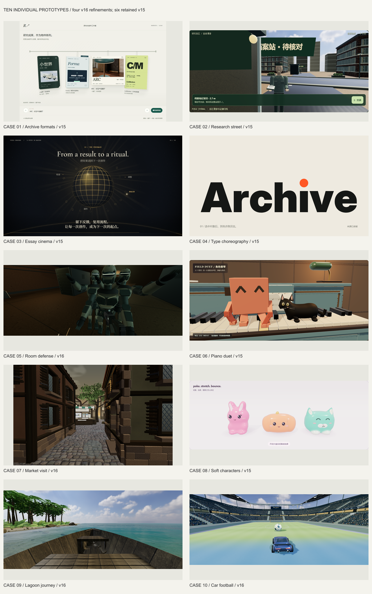

# 015 · AI Creative Products · 十个案例的独立分析与优化

## 完整理解与网页发布 · 2026-10-08

本项目参考十个 Opus 社区案例，逐项建立十个原创浏览器原型；当前运行代码没有调用 Opus 或模型生成后台。完整网页集中展示实际画面、原作参考、独立试玩、单项原理、可控制输入、真实输出、扩展产品与个人价值。

- [完整入口与十项效果](https://yydshly.github.io/0930_codex_project/projects/015-ai-creative-products/)
- [完整理解与逐项范围](https://yydshly.github.io/0930_codex_project/projects/015-ai-creative-products/research.html)
- [原作与当前效果对照](https://yydshly.github.io/0930_codex_project/projects/015-ai-creative-products/#products)
- [原作视频展厅](https://yydshly.github.io/0930_codex_project/projects/015-ai-creative-products/#effects)
- [已有高清能力引导图](assets/library-overview/creative-products-capability-overview-v16.png)

入口沿用 2026-10-03 已生成的 3600 × 6640 PNG / SVG，没有重新生成。当前 05 / 07 / 09 / 10 为 v16，其他六项为 v15；十项各自采用 CSS / Canvas / Three.js，输入、状态与时间规则驱动可操作效果。不同项目分别支持离线 HTML、图片、无声或配乐 WebM、WAV、脚本和体验 JSON；不表示每项都支持全部导出或通用恢复。

05 原作使用 Opus 与 Astra，09 还包含 Sonnet、Meshy 与 Three.js；其他已知与未知工具链逐项注明。我们的 06 网页音画和示例影片已更新，Python / Blender 配方的新造型及本机离线渲染仍未验证。原作精细度、物理完整性、真机性能及商业成效不由本次部署证明。

`publication-files.json` 明确登记公开网页、脚本、模型、材质、字体、音乐样片、配方与许可；`scripts/creative_publish.py` 按清单保持相对路径发布，并生成文件大小与 SHA-256 清单。其余研究、历史截图、逐项验收和制作记录保留在本仓库，公网静态文件范围由公开清单说明。运行资源本地托管，原作者视频点击后才从原媒体服务器加载。

把 Min Choi 的十个原作分别作为独立项目：观察这一例的关键效果，定位对应演示的具体问题，选择本例的优化重点，再用实际操作验收。每个项目保留自己的来源、技术依据、产品对应和剩余差距。研究日期：2026-10-02；最近逐例优化：2026-10-03。



[打开原作与当前画面对照](https://yydshly.github.io/0930_codex_project/projects/015-ai-creative-products/#products) · [网页入口](web/index.html) · [十例参考与差距](notes/ten-demos.md) · [八组产品计划](notes/product-opportunities.md) · [原始来源与范围](notes/research.md)

## 第 05、07、09、10 项逐项精修 v16

本轮只继续这四项，各自依据原作画面定位差距；01、02、03、04、06、08 保留 v15 的主体重做。对照页使用各项当前实际运行画面，进入独立演示可以核对相同模型与操作。

| 项目 | v16 本例重点 | 当前记录 |
| --- | --- | --- |
| 05 机房生存 | 贴身肩甲与胸腹层片、关节软套；枪械分件和金属/涂层/橡胶细节；巡逻投影 | [05](notes/case-05-optimization.md) |
| 07 研究集市 | 沿梁长度的旧木纹、窗角雨痕与墙脚磨损、不等长石层；相连四层树冠 | [07](notes/case-07-optimization.md) |
| 09 热带营地 | 真实海床颜色/深度折射、扫描岸石与阔叶林缘；修复船舱穿水 | [09](notes/case-09-optimization.md) |
| 10 车球场 | 连续圆角双层看台、真实通道空隙、凹入回廊与深桁架；连续草皮 | [10](notes/case-10-optimization.md) |

[内置浏览器验收](notes/v16-in-app-verification.json)保存本轮实际画面、下载状态与受影响操作。05 实际命中后充能恢复；07 三个快捷导览展位均查看并导出；09 登船、下船及风暴/夜景/低密度状态记录一致；10 跳跃、落地、接触、刹车、BOOST 与跟球相机读取真实运动。07 的快捷导览不写成步行验收，09 的登船记录不写成完整航行验收，10 实际观察到 90 秒时间结束及 1/3 进球，三球获胜路径未重新验收。

新版四张封面来自内置浏览器当前画布 PNG，其余六张保留 v15；来源与状态见 [当前封面记录](notes/v16-current-cover-provenance.json)。原作和 v15 的比较图是历史保存的材料。本轮检查不证明已达到原作画质，也不证明手机真机帧率。

09 新增的八块主岸石来自 [Boulder 01 / Rico Cilliers / Poly Haven](https://polyhaven.com/a/boulder_01)，许可 CC0，原始校验与转换见 [来源记录](notes/case-09-v16-boulder-source.json)。水体采用当前相机的一次屏幕空间折射，焦散仍为图形近似；树木和其他资产仍有明显简化。05 未复现原片人类敌人，10 人群仍为静态图集。

## v15 历史：十项逐例重做主体

v15 从每一例的主体轮廓、材质、构图和光照分别入手。产品页先放十组「原作参考 / 当前实际运行」画面，再进入这一项的可操作演示；通用产品计划收起，保留供后续研究。原作画面使用先前保存的原帖缩略图与关键帧，不写成本轮重新访问原作所得。

| 项目 | 本次可见重做 | 独立记录 |
| --- | --- | --- |
| 01 作品集 | 四种比例和材质的影像档案、折页海报、套封与分层卷宗；细挂轨与单件展开 | [01](notes/case-01-optimization.md) |
| 02 任务街区 | 连续外套与袖形、较短头颈、近景交谈构图；保留任务驱动回应 | [02](notes/case-02-optimization.md) |
| 03 观点片 | 中英文衬线、受光论文页、独立砖墙舞台、前层光束球和曲线 | [03](notes/case-03-optimization.md) |
| 04 发布片 | 巨型黑字与橙点、前后受光环字、径向点阵和连续片时运动 | [04](notes/case-04-optimization.md) |
| 05 机房生存 | 相连枪身与枪托、胸腰护甲及关节、暖色门洞导光 | [05](notes/case-05-optimization.md) |
| 06 钢琴动画 | 珊瑚色短肢机器人、连续黑猫、蓝灰旧漆琴体；当前示例视频重新渲染 | [06](notes/case-06-optimization.md) |
| 07 研究集市 | 灰泥与木梁色阶、浅角石、相连枝杈和小叶树冠 | [07](notes/case-07-optimization.md) |
| 08 软胶角色 | 短厚兔耳、包状橙团、宽脸薄荷猫；贴面表情和连续白脚色区 | [08](notes/case-08-optimization.md) |
| 09 热带营地 | 连续船壳与内舱、长凳和舷外机；密集林缘、浅水光斑与远岛 | [09](notes/case-09-optimization.md) |
| 10 车球场 | 低矮连续轿跑、轮拱与扩散器；双层看台、凹进通道和顶棚 | [10](notes/case-10-optimization.md) |

实际检查覆盖各项受影响的操作与导出，证据链接在各自记录中；十张新版封面均来自最终浏览器渲染，出处见 [封面记录](notes/v15-current-cover-provenance.json)。[主站检查](notes/art-direction-main-verification.json)核对十组图、独立演示入口、手机布局及保留的产品计划；[构建检查](notes/reference-bundle-verification.json)核对发布资源与当前源文件。

这些检查证明操作与当前输出相连，不证明美术已经达到原作质量。07、09 的自然资产、05 的人物/武器材质、10 的场馆层次仍明显简化，08 的折痕、耳内与足部仍可精修。02 原片没有可核对的人物特写，因此不声称忠实还原其人物；06 当前网页与示例视频已更新，但导出的 Blender 配方尚未移植新造型，本机未验证 Blender 渲染。

## 历史优化记录

以下为各批次当时的改动与验收；当前四项以 v16 为准，其余六项为 v15，具体范围见十份独立记录。

## 第 02、05、07 项分别继续精修 v14

- 02 任务街区：点状眼睛改为有厚度的眼睑、虹膜与瞳孔，加入眉和嘴线、衣领与握笔手细节。真实交谈时看向玩家，选错时皱眉并看记录板，实际核对成功后才微笑确认；人物表情、头手姿态与任务结果同步。
- 05 机房生存：枪械细化后坐、回弹和回正，短枪口光与光束由实际枪口出发。Raycaster 击中机器人和环境分别触发冷暖火花；墙面落点不计为机器人命中，枪械回应不改变瞄准射线。
- 07 研究集市：沿原片眼高巷道细化两座入口房屋，挖空墙皮并凹进窗玻璃，加入菱形铅条、分片百叶和铰链、拱门、多层檐口及错缝墙脚。维持原建筑范围、碰撞、遮挡发现和三处成果陈列。

本轮继续分别定位每一例的可见差距，依据与验收见 [02](notes/case-02-optimization.md)、[05](notes/case-05-optimization.md)、[07](notes/case-07-optimization.md)。人物表情与枪械回应为本地有限几何反馈，建筑是两座入口立面的原创精修；未推定原作内部算法，未扩展完整 RPG、弹道仿真或全村资产制作。

独立验收：02 表情与任务链 21/21，05 射击 20/20 和受影响近战 13/13，07 建筑与参观链 21/21，主站集成 37/37，均无运行错误或相关本地资源缺失。02 三态截图保持同一真实站位；05 实测关闭门面与机柜阻挡射线，机器人命中才减少防护；07 实际步行、推墙、视线发现和 E 查看通过。主站实际下载保留同一人物、枪械、建筑与参观状态，三项均通过 390px 宽度检查。画面来自实际网页运行，软件渲染记录不证明真机流畅。

## 第 01、04、08 项分别继续优化 v13

- 01 作品集：硬板封面改为六分区薄纸；同一印刷内容沿连续边缘展开，弯曲和贴页阴影跟随实际开合角度。保留原档案对象、到位焦点、手机空间及在线/离线共用行为。
- 04 发布片：开关圆点进入第一张真实研究卡，成果角标在片尾接回关闭态。首尾文字与形状连续切换，纳入、合并和待补数量来自同一结果；关闭后完整成果仍可阅读和实际导出。
- 08 触碰角色：合并同角色的小附件，保留连续外皮精度、HDR 与微透射；附件顶点和法线跟随同一局部场。拖动输入按帧合并，松手处理最后位置，归静避免重复提交。

三项依据、改动与差距分别见 [01](notes/case-01-optimization.md)、[04](notes/case-04-optimization.md)、[08](notes/case-08-optimization.md)。01 的六分区为有限 CSS 纸弯曲；04 是原创本地整理与无声片；08 仍是连续形变与有界补偿，没有完整布料、纸张或软体物理。

01 的影响链验收为 21/21，04 为 26/26，08 为 18/18，主站集成为 31/31，均无页面错误或本地资源缺失。04 实际完整 15 秒 WebM 的六处寻址通过，中段四个圆点像素锚点保持。同一孤立 Headless Chromium / SwiftShader 的真实持续拖动对照中，08 三角形从 238,642 降至 106,354，总调用从 92 降至 16，画布均为 960×367；帧间隔中位从 333.3ms 降至 200ms，事件处理从 16.1ms 降至 0.2ms。几何处理约 12.8→12.4ms，收益主要来自减少提交与重复绘制；软件渲染仍约 5 帧/秒，不证明低端真机流畅。

## 第 03、09、10 项分别优化 v12

- 03 观点叙事片：命题纸页留在检验旁，同一记录点由检验进入反馈球，再接到流程曲线。对象与文字分别切换；纯时间线支持正反寻址，画面、脚本与无声 WebM 使用同一接力状态。
- 09 热带营地：沿岸加入连续湿沙、不同尺度碎石与岩石，棕榈下层增加曲面宽叶植被，减弱远处水面的高频细纹。天气、时刻和密度仍改变实际环境；步行和船体都检查岸石占位，贴石时拒绝会进入岩石的转向，保留坐姿登船及独立环顾。
- 10 车球挑战：修正轮胎接地与正反滚动方向；车身回应真实加速、转弯、撞球和落地，连接杆维持车身与轮毂的关系。实际球车位置仍由已有简化运动模型判断，反馈是有限视觉弹簧。

三项各自的来源、诊断、验收和剩余差距见 [03](notes/case-03-optimization.md)、[09](notes/case-09-optimization.md)、[10](notes/case-10-optimization.md)。原作未公开的转场、素材制作或物理引擎不作推定；03 接力是我们的编辑推演，09 没有调用 Meshy，10 没有完整车辆刚体或逐轮轮胎动力学。

本轮独立验收：03 为 19/19、09 为 24/24、10 为 18/18，主站集成为 28/28，均无运行错误；构建的 133 个公开资源与源文件一致。03 实际导出六镜共 12 秒的 1280×720 无声 WebM，原生寻址通过；实时录制在 6 秒处有约 40 毫秒采样偏移。09 的连续贴石驾驶及转向检查、10 的加速/刹车/转弯/撞球/落地使用真实页面操作；手机宽度与软件渲染记录不证明真机帧率，10 本轮未重验整场 90 秒及三球目标。

## 第 02、05、07 项分别优化 v11

- 02 任务街区：记录员具有相连的肩、肘和颈部，走近后转向访客，实际交谈、选错、核对与归档驱动不同回应。人物、证据灯、标牌与终端共用任务结果；仍须走近才能答题或提交。
- 05 机房生存：机器人停步蓄势、锁定方向，挥击时才检查距离与前方范围，随后恢复再追逐。后退或绕开可以让攻击落空，躲避、受伤与射线命中分别记录。
- 07 研究集市：三个展位分别制作纸档案与主题样板、角色钢琴默认配方、研究路线与来源档案。实物陈列对应已有案例，近看详情提供实际原型入口，参观凭证读取本次发现、到达与查看记录。

人物与进攻采用本例的真实时间循环，隐藏时暂停，移动仍以小步检查碰撞。人物动作、方向近战和展品陈列是我们的原创实现；原作未披露的算法不作推定。07 的静态钢琴谱板仅说明默认配方，不与另一个页面的实时编辑同步。各自的依据、验收与剩余差距见 [02](notes/case-02-optimization.md)、[05](notes/case-05-optimization.md)、[07](notes/case-07-optimization.md)。

本轮独立验收：02 为 22/22、05 为 13/13、07 为 18/18，均无运行错误。动作和参观画面取自实际本地运行；软件渲染的计时与帧率记录不证明低端手机 GPU 流畅。

## 第 01、04、08 项分别优化 v10

- 01 作品集：固定内页与双面封面共用书脊，翻开结束后进入阅读。陈列对象不再重建，键盘焦点保持连续，在线与离线 HTML 使用同一控制器。档案翻开是我们对原作物件聚焦与单件浏览的扩展。
- 04 发布片：可编辑的研究卡实际参与整理，完全重复的记录合并，缺少来源的记录保留待补。输入、画面与实际成果文件共用一份结果，保留曲线、环字与点阵接力。
- 08 触碰角色：主体使用连续外皮，局部拖揉跨耳根、头部和身体平滑传递，并加入有边界的横向厚度补偿。属于几何近似，不等于严格体积守恒或完整软体物理。

各自的原作目标、验收与剩余差距见 [01](notes/case-01-optimization.md)、[04](notes/case-04-optimization.md)、[08](notes/case-08-optimization.md)。

01 的独立检查为 28/28、04 为 15/15、08 最终受影响链为 10/10。08 在同设备 Headless Chromium / SwiftShader 的松手恢复从 9.07 秒缩短至 1.84 秒；互动时限制最长边 960px，归静恢复原清晰度。此环境的帧率仍约 2 帧/秒，样本较少，不证明低端真机流畅。厚度指标为横向包围跨度比例；顶点采样雅可比为诊断，不替代自碰撞处理。

## 第 06 项继续优化 v9

v9 这一轮继续第 06 项钢琴音乐动画。针对 v8 仍有的滑步、悬空猫爪、交接往返和远景问题，补齐连接的腿部关节、固定世界坐标的支撑脚、短步、收爪及轻微视线；交接时保留站位。演奏特写与完整琴房可切换，网页增加可直接播放的原创成片。

实际模型的 9,600 姿态、57,600 腿段连接、288 次触键、93 个边界和 21 组往返寻址通过，几何验收见 [第 06 项步态检查](notes/case-06-gait-verification.json)。这些数字验证姿态与模型连接，画面由真实 WebGL 截图和实际输出视频核对。

## 逐个项目优化 v8

选择一例时，主站只展示它自己的原作目标、优化前的问题与本次重点；实际演示紧接其后，下面是本例改动、验收、差距与原作视频。技术依据和产品方向仍可展开查看。体验 JSON 增加当前案例的独立诊断，和实际状态一起导出。

| 项目 | 本例的优化重点 | 独立分析与验收 |
| --- | --- | --- |
| 01 作品集 | 薄纸弯曲与贴页阴影随实际角度进入阅读，背面、内页和焦点连续。 | [01 记录](notes/case-01-optimization.md) |
| 02 任务街区 | 目光、眉眼、嘴线与相连头手姿态回应实际交谈、复核和确认。 | [02 记录](notes/case-02-optimization.md) |
| 03 观点叙事片 | 纸页、检验记录、反馈球与曲线接力，文字切换保留阅读秩序。 | [03 记录](notes/case-03-optimization.md) |
| 04 发布片 | 开关接入真实研究卡，成果回到片尾关闭态，完整成果继续可读与导出。 | [04 记录](notes/case-04-optimization.md) |
| 05 机房生存 | 真实枪口、有限后坐与不同落点火花对应射击事实，保留可躲避近战。 | [05 记录](notes/case-05-optimization.md) |
| 06 钢琴动画 | 实际触键之后继续修正支撑步态、肢体连接、交接站位与演奏特写。 | [06 记录](notes/case-06-optimization.md) |
| 07 研究集市 | 入口窗洞、百叶、拱门、檐口与墙脚形成近看层次，再发现三组展品。 | [07 记录](notes/case-07-optimization.md) |
| 08 触碰角色 | 连续外皮保留，合并附件和输入减少拖揉重复绘制，松手弹性恢复。 | [08 记录](notes/case-08-optimization.md) |
| 09 热带营地 | 岸线具有湿沙、不同尺度石块和下层植被，步行与船上近看保持一致。 | [09 记录](notes/case-09-optimization.md) |
| 10 车球挑战 | 轮胎接地与滚动、车身惯性和落地压缩对应真实运动，维持轮组连接。 | [10 记录](notes/case-10-optimization.md) |

逐例数据来自 notes/case-XX-optimization.json，经校验生成 web/case-optimization-data.js；不把各例诊断合并成一份能力总结。各项记录分别保留实际检查和截图。这些优化仍不等于完整复现原作的资产、离线画质、玩法或商业效果。

## 已有视觉基底 v7

十例保留原作的能力对应，在造型、材质、光照、构图和动效节奏上进一步优化。作品集加入真实成果封面与纸面陈列；叙事与发布片细化六组分镜；三维场景加入摄影 PBR 材质、HDR 环境光、模型倒角与场景细节；软体角色改善材质与表情；钢琴把镜头集中到角色与琴键。

摄影材质与两张 HDR 来自 [Poly Haven](https://polyhaven.com/license)，本地来源、原始校验和与转换记录见 [材质清单](notes/visual-material-sources.json)。新增 RGBELoader 与 RoundedBoxGeometry 使用 Three.js r160 官方 MIT 实现。场景几何与交互仍由本项目编写。

前后画面与原作关键帧对照保存在 assets/qa/visual-polish/ 及游戏、世界目录中。v7 的视觉验收和交互记录见 [视觉优化记录](notes/visual-polish.md)。原作的高级模型、离线电影光照和完整玩法仍有差距；增强网页材质尚未移植到 Blender 示例配方。

## 本次修正

原作的关键能力必须落到实际演示。第一人称场景、三维操控和角色钢琴动画等参考点，不能用不同机制的简化示例代替。主站逐项显示原作依据、原作披露的技术、我们的实现、可操作核对点、仍保留的差距，并直接显示原作视频供比较。

未知技术不作推定：03/04/07 等内部流程未公开。我们的 Three.js、Canvas、Web Audio 和录制代码属于本地实现。06 明确披露 Python / Blender，本项目增加共用音符事件、实际 Python WAV 与 bpy 场景/关键帧配方；本机没有 Blender，离线渲染未验证。

## 十例能力与产品

| 编号 | 原作 | 需要保留的能力 | 我们的演示 | 产品用途 |
| --- | --- | --- | --- | --- |
| 01 | [三次提示生成作品集网站](https://x.com/cambreedesigns/status/2104999693113766152) | 把作品做成可探索的物件陈列，而不是只把图片排进卡片。 | [空间作品集生成器](web/index.html#demo-01) | 空间作品集与案例站生成器 |
| 02 | [Fallout 风格浏览器游戏](https://x.com/chrisfirst/status/2104644598626934858) | 程序化三维 RPG：自由探索、任务分支和终端式状态界面组成同一个系统。 | [程序化研究街区 RPG](web/index.html#demo-02) | 三维互动任务与剧情训练工具 |
| 03 | [回应「AI 是普通技术」的视频](https://x.com/sevdeawesome/status/2104985610012504181) | 观点有推进关系，画面、文字与镜头随论证变化，最后能交付一段动态视频。 | [研究观点叙事片](web/index.html#demo-03) | 观点与课程叙事编辑器 |
| 04 | [三次提示制作发布宣传片](https://x.com/uxmiles/status/2104618175803609305) | 大字、图形变化与产品功能演绎共同构成发布片，而不是三张静态说明页。 | [研究工作台动效发布片](web/index.html#demo-04) | 新品发布动效编辑器 |
| 05 | [COD Zombies 网页移植](https://x.com/p_e_cooper/status/2104980433972703483) | 第一人称房间生存：瞄准、移动、敌人靠近和波次资源形成实时闭环。 | [第一人称机房生存](web/index.html#demo-05) | 第一人称情境训练工具 |
| 06 | [Python 编曲与 Blender 动画](https://x.com/kevin_t_ngo/status/2105304249060274631) | Python 编曲、实体钢琴上的角色演奏和 Blender 渲染形成音乐短片；原作具体触键算法未知。 | [角色钢琴音乐动画](web/index.html#demo-06) | 音乐与角色动画配方工具 |
| 07 | [作者自述的 Opus 创作展示](https://x.com/DODOREACH/status/2104821709891404194) | 可进入的村镇集市空间：建筑、木石材质、摊位、树木和环境光雾一起建立场景。 | [三维研究集市](web/index.html#demo-07) | 三维虚拟展会编辑器 |
| 08 | [第四款游戏的制作展示](https://x.com/AugustCastilIo/status/2105350465001029697) | 立体软萌角色的触碰、压缩回弹、跳起和反馈设置本身就是可参考的能力。 | [立体吉祥物触碰沙盒](web/index.html#demo-08) | 互动角色与品牌反馈组件 |
| 09 | [12 小时搭建 Three.js 世界](https://x.com/maxt3chno/status/2105216139647127750) | 原生浏览器三维世界整合：地形、水草、天空、动态天气、日夜和自由探索。 | [可漫游的热带研究营地](web/index.html#demo-09) | 浏览器三维导览与环境演练工具 |
| 10 | [浏览器汽车足球同人游戏](https://x.com/BlendiByl/status/2104800823620632641) | 立体车球场、追车或球相机、加速、惯性与真实碰撞共同决定操控手感。 | [三维车球物理挑战](web/index.html#demo-10) | 三维操控与物理挑战工具 |

原作提示次数、开发耗时、模型与工具使用按作者自述。产品用途是我们的推演，不是作者推荐。原型没有复现原作的全部画质、资产、玩法或自动生成过程；各项差距见对照页与 [十例记录](notes/ten-demos.md)。

## 操作与交付

主站有原作效果、案例拆解、能力地图、八组综合产品计划与十项对应演示。每项有页内和独立入口，状态由真实交互更新，可导出体验 JSON（含来源、参考点、独立优化记录和范围）。作品集可导出独立 HTML；叙事与发布动效可导出 WebM、脚本与静帧；音乐 WebM 按 24 帧/秒逐帧生成并配乐，还可导出 WAV 与当前 Python / Blender 配方。逐帧生成耗时取决于设备，浏览器不支持编码能力时显示兼容范围。

音乐导出使用 WebCodecs 及本地锁版 webm-muxer 5.1.4（MIT）。来源、NPM 校验与维护状态见 web/labs/vendor/webm-muxer-SOURCE.txt；本地模块不向第三方发送乐谱或画面。

[ARC 台灯选型](web/demo/index.html) 复用项目011的原创模型，保留为额外选型实验，不计入这十项。八组综合产品研究继续在 [完整计划](notes/product-opportunities.md) 中保留；十个局部原型不等于十个完整商业产品。

## 本地运行

从研究集根目录执行：

```powershell
python -m http.server 8975 --bind 127.0.0.1 --directory projects/015-ai-creative-products/web
```

主站 /#demo-01 至 /#demo-10；独立页 /labs/?id=1 至 /labs/?id=10。使用本地 Three.js 和原生浏览器 API，没有模型后端。原视频只在点击播放后请求作者媒体服务器，失败保留原帖入口，没有下载原视频。

Python 编曲：

```powershell
python projects/015-ai-creative-products/web/labs/pipeline/music_blender.py --audio-only --out field-duet-output
```

Blender 操作写在脚本开头，可建场景/关键帧并按需渲染；需要用户机器安装 Blender，本机尚未验证该步骤。浏览器导出脚本内嵌当前旋律和节奏，使用同一套音符事件。

## 验证记录

v16 的当前运行证据见 [内置浏览器验收](notes/v16-in-app-verification.json)，四项分别保留实际下载、CPU 检查和剩余差距。此前记录作为各版本的历史验收保留。

v14 的新增验收分别记录在 [02 表情与任务](notes/case-02-face-v14-verification.json)、[05 射击与真实遮挡](notes/case-05-v14-shot-checks.json)、[05 近战回归](notes/case-05-v14-melee-checks.json)、[07 近景建筑与参观](notes/case-07-architecture-verification.json)。主站逐例说明、实际体验文件、手机和显隐集成见 [v14 主站验收](notes/v14-page-integration-verification.json)。

v13 的新增验收分别记录在 [01 薄纸与离线文件](notes/case-01-paper-verification.json)、[04 首尾闭环与实际视频](notes/case-04-bookends-verification.json)、[08 形体与输入](notes/case-08-v13-performance-checks.json)、[08 解析导数](notes/case-08-v13-analytic-check.json)；08 同条件持续拖动对照保存在 [改前](notes/case-08-v13-before-performance.json) 与 [改后](notes/case-08-v13-after-performance.json)。主站操作、体验文件、手机与显隐集成见 [v13 主站验收](notes/v13-page-integration-verification.json)。

v12 的新增验收分别记录在 [03 镜头接力](notes/case-03-sequence-verification.json)、[03 实际视频](notes/case-03-video-verification.json)、[09 岸线与环境](notes/case-09-v12-verification.json)、[09 接触与转向](notes/case-09-v12-contact-verification.json)、[10 车辆反馈](notes/case-10-v12-checks.json)、[10 撞球反作用](notes/case-10-v12-contact-axis.json)；主站操作、实际体验下载、手机布局和显隐集成见 [v12 主站验收](notes/v12-page-integration-verification.json)。站点构建的实际资源校验见 [公开资源一致性](notes/reference-bundle-verification.json)。

v11 的新增验收分别记录在 [02 人物回应](notes/case-02-recorder-checks.json)、[05 实际进攻](notes/case-05-melee-checks.json)、[07 展品与参观](notes/case-07-exhibits-verification.json)；主站嵌入、体验导出、手机布局与显隐集成见 [v11 主站验收](notes/v11-page-integration-verification.json)。这些记录针对本轮改动，不替代原作完整画质或真机性能验证。

新版记录为 notes/reference-*.json，包含实际交互、桌面/手机截图、导出与显隐处理；截图保存在 assets/qa/reference-revision/。Python WAV 和事件文件在 notes/reference-music-python/，网页实际导出记录在 notes/reference-music-downloads/。原作关键帧为研究证据，截图与原片版权属于原作者。

上一版 notes/ten-demos-verification.json 保留为历史记录，它不证明改造后实现已验收。原作播放、页面研究交互与额外 ARC 的既有验证继续保留。测试通过数量不等于原作完整复现或商业有效。

[Min Choi 原串帖](https://x.com/minchoi/status/2105685231298630009) · [串帖镜像](https://threadreaderapp.com/thread/2105685231298630009.html)。当前已静态公开发布，未接入在线订单、联机或收费；真实用户与商业效果待验证。

[返回研究集](../../README.md)
