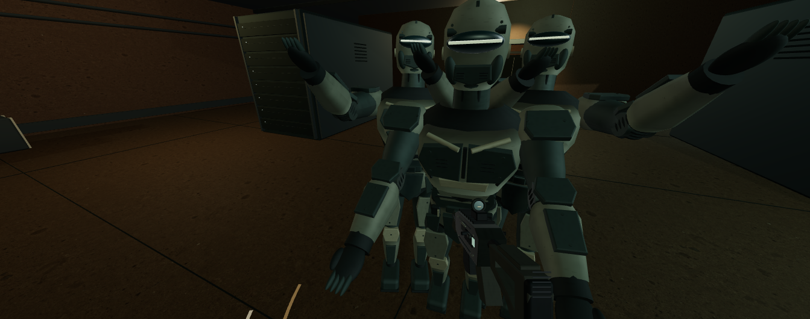

# CASE 05 · 独立分析与本轮优化 v16

[原作](https://x.com/p_e_cooper/status/2104980433972703483) · [独立演示](http://127.0.0.1:8975/labs/?id=5&v=16)

## 原作目标

原视频室内第一人称生存通过敌人逼近、身体动作与开火/受伤构成可判断威胁；参考可见的战斗动作与反馈，不推断原作AI或弹道算法。

## 优化前的问题

v15 已连起枪身与守卫肢体，但圆球肩甲、整块对称胸甲与均一亮色机匣仍像玩具，靠近时缺少层片和关节的材质分工。

## 本例重点

本例先修贴身护甲、枪械分件和表面细节，再用真实射线命中、充能与近处巡逻画面核对。

## 本次具体改动

- 肩部改为贴身扁壳，胸部左右甲片与腹部叠片分开；髋甲、肘膝盖、前臂/胫部甲和鞋尖围绕原关节连接。
- 关节加入肋纹软套，护甲采用低对比涂层与细紧固件，减弱光滑球体和整块塑料感。
- 枪械加入机匣接缝、侧拉机柄、六角紧固件与护木凹面；金属拉丝、涂层、橡胶与少量边缘磨损分开处理。
- 机房增加真实投影的巡逻聚光灯，使守卫、柜体与暖色门洞形成近处明暗层次；当前画布可直接保存 PNG。

## 实际验收

- 内置浏览器实际查看近处守卫和枪械并保存当前画布；原作和 v15 截图为历史比较材料，不标成本轮重新访问原作。
- 实际开火/充能下载记录为 shots=1、hits=1、ammo=12、reloading=false；该次静止观察后关卡失败，不据此声称过关或三波验收。
- CPU 几何检查确认位置/法线/UV 有限、中心射线能命中腹部、四个近战阶段的肘膝连接未变；不把几何检查当成画质或性能证明。

## 仍有的差距

- 守卫与枪械仍为原创实时几何及局部程序化表面；原片人类敌人、原游戏模型与动画库没有复现。
- 近处轮廓、护甲接触和房间资产仍有美术差距；新增阴影未得出真实显卡或手机帧率结论。
- 保留单人机房与简化追击、方向近战、射线命中；没有弹道仿真、完整敌人系统或联机。

[内置浏览器验收](v16-in-app-verification.json) · [CPU 检查](case-05-v16-geometry.json)

实际下载：[case-05-v16-close](case-05-v16-close.json) · [case-05-v16-fire-reload](case-05-v16-fire-reload.json)

v15 验收与截图保留在 JSON 的 previousVersions 中，供历史比较；检查通过不表示达到原作画质。
