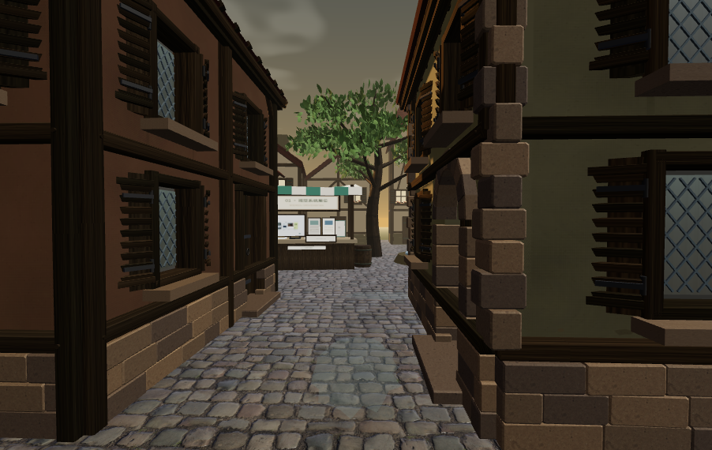

# CASE 07 · 独立分析与本轮优化 v16

[原作](https://x.com/DODOREACH/status/2104821709891404194) · [独立演示](http://127.0.0.1:8975/labs/?id=7&v=16)

## 原作目标

原作 07 的 00:22 眼平窄巷可见凹进菱形铅窗、百叶及铰链、右侧拱门、层次屋檐和砖石地脚，建筑遮挡远处摊位，步行后逐渐进入集市。原作者工具链与 NPC 对话机制未确认。

## 优化前的问题

v15 木纹方向与梁件轴向不一致，木梁和百叶边缘过齐；灰泥缺少窗角与雨水路径的细节，树冠仍像彼此分开的叶球。

## 本例重点

围绕本例入口巷道分别修木材轴向、墙脚与窗边磨损、石块尺度和连接树冠，并复核三处展位的参观记录。

## 本次具体改动

- 木纹沿每根梁与百叶木条的长度映射，加入三档旧木色阶、轻微变截面和贴合木榫。
- 灰泥按实际门窗位置加入窗角细裂、雨痕、地脚湿痕与掉灰；修正竖向 UV，使墙脚细节落在底部。
- 基脚石采用不等长度与接触倒角，角石调整交替宽高；原 16 窗、32 片百叶、64 个铰链及 0.2m 凹进保留。
- 连续微弯主干、42 组延长枝梢和四层重叠树冠代替独立叶球；入口树冠展开角与叶簇尺度单独重调，黄昏环境光校准为 0.60。

## 实际验收

- 内置浏览器实际核对入口和新树冠，保存当前画布；原作参考为历史保存的 00:22 关键帧。
- 通过三个导览快捷入口走近并查看展品，实际 JSON 保存 3/3 参观；本次导览记录 walkingDistance=0，不把快捷到达写成步行路线验收。
- 实际切到夜景并将树木密度设为 0，下载状态保留 time=night、treeDensity=0 与同一三处参观记录。
- CPU 检查建筑连接、纹理映射与树冠结构；纹理测试使用模拟 Canvas/加载器，视觉结论来自另行保存的浏览器画面。

## 仍有的差距

- 树冠仍为程序化几何，近看叶簇边界与枝叶细节有差距；后方建筑仍采用较整齐的旧模型。
- 定向墙面磨损与木纹改善尺度和层次，尚未达到原作自然资产的复杂轮廓与细碎表面。
- 门窗静态、树无风动、展品仍为三个固定集合；没有新增布局编辑、对话或多人展会，也未验证手机真机帧率。

[内置浏览器验收](v16-in-app-verification.json) · [CPU 检查](case-07-v16-static-verification.json)

实际下载：[case-07-v16-entry](case-07-v16-entry.json) · [case-07-v16-three-visits](case-07-v16-three-visits.json) · [case-07-v16-night-no-trees](case-07-v16-night-no-trees.json)

v15 验收与截图保留在 JSON 的 previousVersions 中，供历史比较；检查通过不表示达到原作画质。
