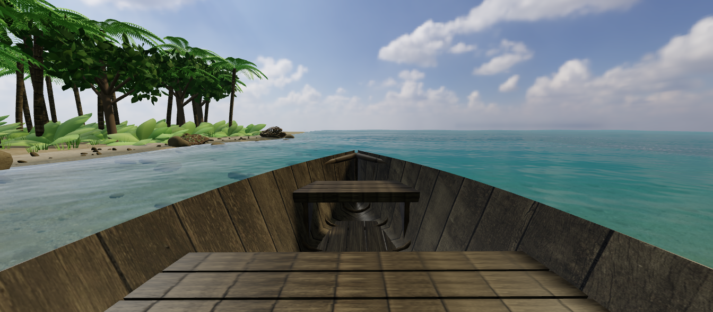

# CASE 09 · 独立分析与本轮优化 v16

[原作](https://x.com/maxt3chno/status/2105216139647127750) · [独立演示](http://127.0.0.1:8975/labs/?id=9&v=16)

## 原作目标

原作09的00:45船上实帧中，浅水、湿沙、不同尺度岩石、林下绿植和树冠连续衔接，并随航行换位。原帖明确原生Three.js整合环境逻辑、用Meshy生成船和手部等模型；本例借鉴的是连续世界与近岸观察关系。

## 优化前的问题

v15 近岸水面主要依靠青绿色和图形光斑，遮住真实海床；重复岸石与单一棕榈林缘仍显程序化，船舱还出现水面穿入底板的问题。

## 本例重点

本例把可见水下场景、扫描岸石和阔叶林缘落到实际海岸，修复船内水面，再核对登船、环境切换和本地资源。

## 本次具体改动

- 加入实际水下场景颜色/深度捕获，水面按波形扰动采样并随深度吸收衰减；110 块水下石与海床可透过近岸水面观察。
- 船内按船体位置和航向遮除水面，修复水面穿入底板；低能力环境保留无深度折射的降级路径。
- 八块主要岸石使用 Poly Haven 的 Boulder 01（Rico Cilliers，CC0）扫描模型及摄影贴图，离线降为每块 5,954 三角形；按原岩石包络再缩放 0.85，原 24 处碰撞范围保留。
- 增加 15 棵阔叶树与棕榈形成林缘层次，密度控制真实可见数量；同时修复扫描资源释放、折射 UV 回退深度采样和离屏渲染状态恢复。

## 实际验收

- 内置浏览器实际登船并保存当前画布，近岸可见海床与石块，船舱底板不再被水面穿入；下载状态记录 boatBoarded=true、扫描岸石 loaded=true 与 refraction.supported=true。
- 实际下船并切到风暴、hour=24、density=4，下载状态记录 6 棵可见阔叶树；天气、日夜、密度与环境详情读取同一状态。
- CPU 审查本地二进制布局、索引、法线与八块变换后岩石包络，并修复资源和折射回退问题；运行画面另由内置浏览器保存。
- 本次记录中的 boatDistance 与 exploration.distance 为 0，登船和导览检查不等于重新验收完整航行或步行碰撞路线。

## 仍有的差距

- 折射为当前相机的一次屏幕空间捕获，焦散仍是图形近似，没有多次散射或物理追踪焦散。
- 阔叶树、低层叶丛和其余岩石仍较简化，只有八块主要岸石替换为扫描资产；自然环境整体仍与原作有差距。
- 没有调用原作 Meshy 流程或原作资产；船体运动与碰撞仍是简化模型，没有完整浮力和海洋动力学，环境指标也未经现实校准。

[内置浏览器验收](v16-in-app-verification.json) · [CPU 检查](case-09-v16-static-review.json)

实际下载：[case-09-v16-boat](case-09-v16-boat.json) · [case-09-v16-storm-night-low-density](case-09-v16-storm-night-low-density.json)

v15 验收与截图保留在 JSON 的 previousVersions 中，供历史比较；检查通过不表示达到原作画质。

扫描资产：[Boulder 01 / Rico Cilliers / Poly Haven](https://polyhaven.com/a/boulder_01)，CC0。原始文件校验、简化与贴图转换见 [来源记录](case-09-v16-boulder-source.json)。
