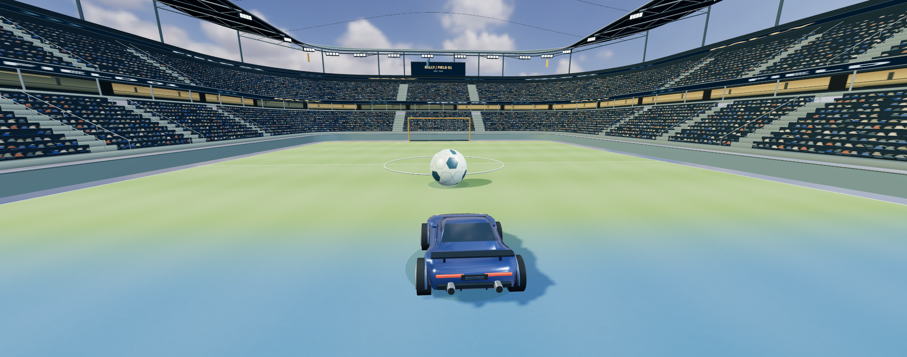

# CASE 10 · 独立分析与本轮优化 v16

[原作](https://x.com/BlendiByl/status/2104800823620632641) · [独立演示](http://127.0.0.1:8975/labs/?id=10&v=16)

## 原作目标

原作把驾驶、Boost、腾空、碰撞与跟球镜头放在连续三维操控中；本例参考轮胎接地、车身惯性和接触反馈共同表达动力变化。

## 优化前的问题

v15 四面直看台拼成方盒，整齐点阵人群、薄顶棚与分层草皮条带削弱了连续场馆感；本轮保留已重做的低矮赛车，单独处理场馆。

## 本例重点

把四面看台接成连续圆角场馆，细化座席、通道、棚架与草皮的不同尺度，再核对真实驾驶反馈。

## 本次具体改动

- 重建连续圆角双层看台和 24 排座席；通道位置留出真实空隙，扶手、座席台阶与不规则静态人群图集形成近处层次。
- 前脸后方设置凹入暖光回廊、分开的墙柱与栏杆，广告带与回廊分层；连续顶棚加入 31 组深桁架和分段灯具。
- 一张连续 PBR 草皮替代叠放地面，主客色区平缓混合并加入克制割草纹；草皮顶面与地面判定重合。
- 保留 v15 赛车、0.38m 实际轮组、悬架、车球冲量与相机规则；静态场馆合并绘制，当前画布可直接保存 PNG。

## 实际验收

- 内置浏览器实际查看追车场馆并保存当前画布；arenaArtwork 记录连续圆角场馆、双层 24 排座席与 31 组桁架。
- 实际驾驶后跳跃记录 jumps=1、car.y=2.228、grounded=false；后续记录落地 1 次、车球接触 2 次、刹车 1 次、BOOST=97.5、grounded=true 并切换跟球相机。
- 实际运行状态为 55 次绘制调用、239,470 三角形，静态合并省去 1,404 次提交；这些为当前帧统计，不证明真实设备帧率。
- CPU 检查场馆几何、草皮与轮组位置；本轮没有重新验收完整 90 秒比赛或三球目标。

## 仍有的差距

- 场馆与赛车仍为原创几何，人群是静态图集，未复现原作车辆或场馆资产。
- 视觉围栏为圆角，实际可玩碰撞仍是原矩形；顶棚与缆索不新增玩法碰撞，顶棚未向整场投射大面积阴影。
- 保留单人简化物理，没有完整车辆刚体、逐轮轮胎动力学、空中翻滚或联机；未得出真机性能结论。

[内置浏览器验收](v16-in-app-verification.json) · [CPU 检查](case-10-v16-geometry.json)

实际下载：[case-10-v16-arena](case-10-v16-arena.json) · [case-10-v16-drive-jump](case-10-v16-drive-jump.json) · [case-10-v16-camera-brake](case-10-v16-camera-brake.json)

v15 验收与截图保留在 JSON 的 previousVersions 中，供历史比较；检查通过不表示达到原作画质。
