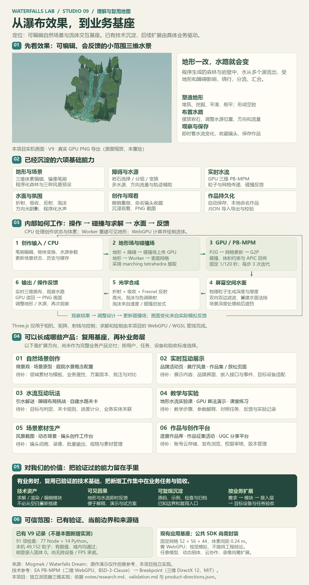
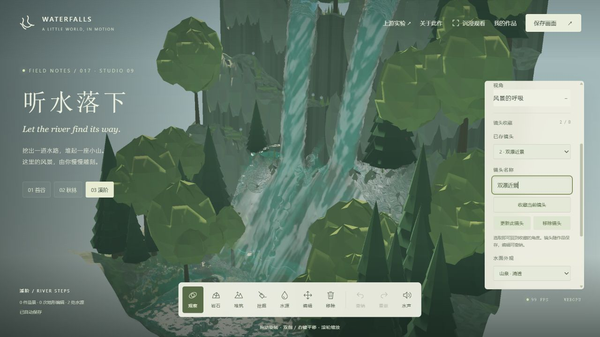
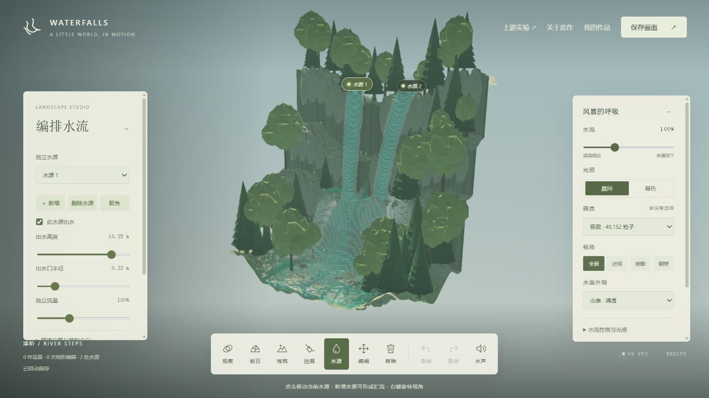
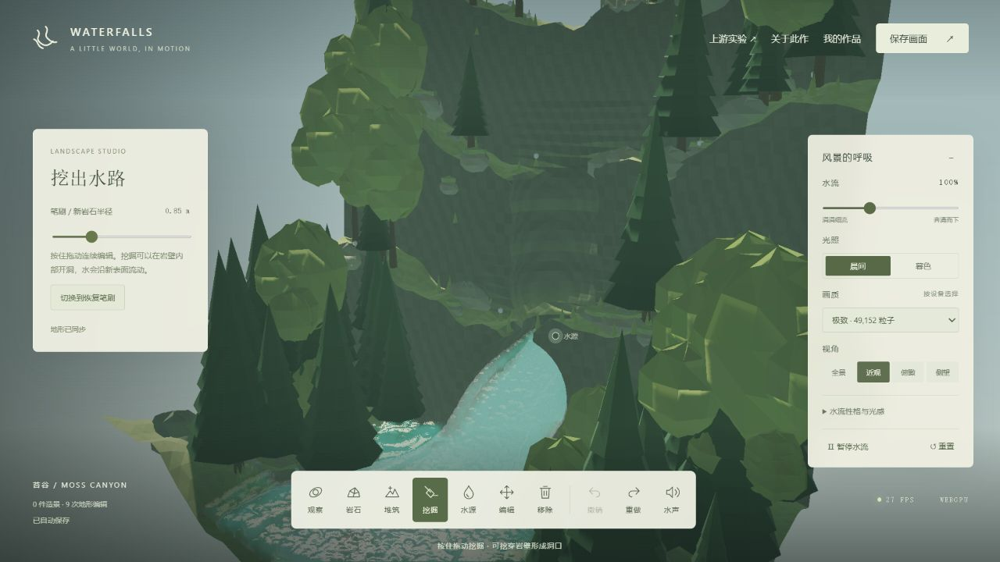
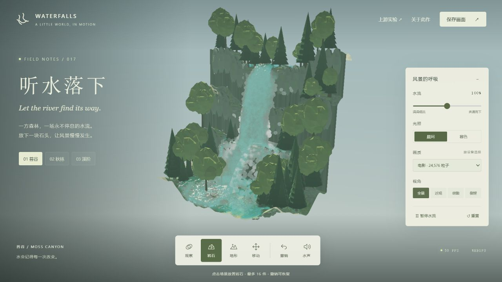
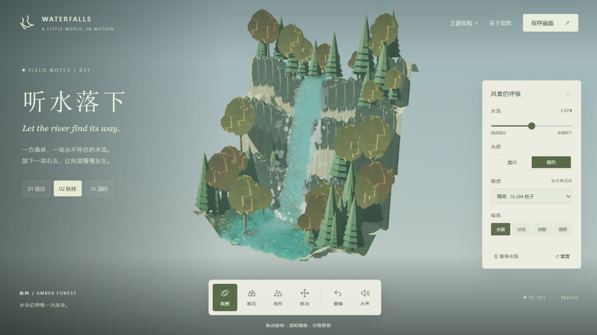
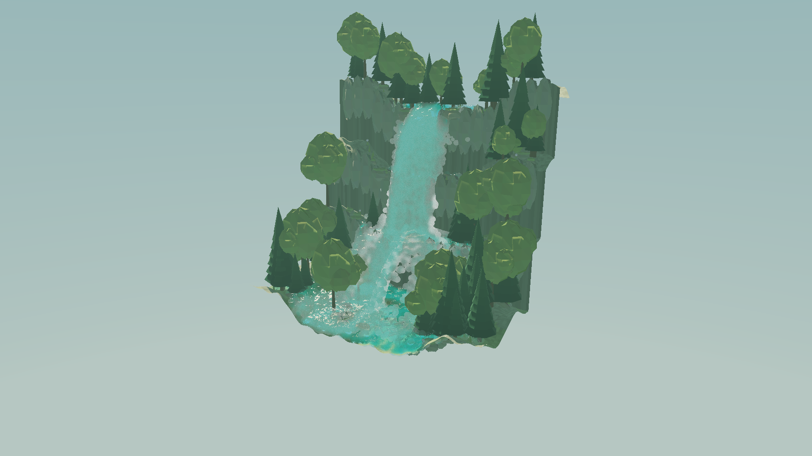

# 017 · Waterfalls Lab · 实时瀑布与流体造景

一方可旋转的森林瀑布，水流在 GPU 上实时计算。放下、移动岩石，堆筑地形或挖穿岩壁，让多股水从不同位置出发，分流、绕行，再重新汇合。作品可以命名保存并带到另一台设备。这是受 Mogmek 的 **Waterfalls Dream** 启发的独立浏览器实验，参考 EA 的 PB-MPM 和 Breakpoint 的三维扩展实现。

先看 [工作室效果](web/index.html)，再读 [完整理解与所有入口](web/understanding.html)。理解页从真实 V9 画面开始，串联当前能力、内部技术、六类产品方向、复用价值、接入步骤与验证边界；工作室顶部和说明面板均有入口。它是随静态站发布的说明页，不需要 WebGPU 即可阅读。



汇总图可单独查看 [完整 PNG](assets/understanding-map.png) 或 [可编辑 SVG](assets/understanding-map.svg)。顶部使用已有 V9 实机输出，文字与图形由 [生成脚本](tooling/build-understanding-figure.py) 排版；本次整理没有生成或重绘模拟画面。图中的 91 项检查与 GPU 结果对应 2026-10-03 的 V9 历史记录；2026-10-09 的整理、发布包与浏览器复核另见 [发布记录](notes/publication.md)。

| 信息 | 内容 |
| --- | --- |
| 完成内容 | 三维流体、多水源喷射、五种体素笔刷、精确对象编辑、作品与镜头收藏、沉浸观看、三种水面外观、EA 原版对照 |
| 状态 | STUDIO 09 基础保留；2026-10-09 完整发布包和本地浏览器复核通过，线上验证待完成 |
| 灵感来源 | [Mogmek · Waterfalls Dream](https://x.com/mogmek/status/2105966008720900321) |
| 技术参考 | [EA PB-MPM](https://github.com/electronicarts/pbmpm)、[Breakpoint](https://github.com/danieljgerhardt/Breakpoint) |
| EA 研究版本 | `61749b6c2d2631ed243f86882752ba43196f2de7` · BSD-3-Clause |
| Breakpoint 研究版本 | `9e3d1761de439fd04b928c03358cf109ec34002d` · MIT |
| 运行条件 | 支持 WebGPU 的浏览器、可用 GPU、localhost 或 HTTPS |
| 部署 | 已接入共享站静态构建；[GitHub Pages 发布目标](https://yydshly.github.io/0930_codex_project/projects/017-waterfalls-lab/) 尚待部署与线上验证 |

## 完整整理与发布 · 2026-10-09

网页保留完整理解、真实 V9 效果、GPU 工作室、EA 原版对照、六类产品方向、内部模块与接入边界；首屏效果后集中展示所有入口、原作和技术参考、图像与源码。引导图沿用上轮生成的 [PNG](assets/understanding-map.png) / [SVG](assets/understanding-map.svg)，不重绘；技术与作品格式仍为 STUDIO 09 / version 2。

公开静态包包含工作室、完整理解页、来源许可、EA 原版全部资源、实机截图、汇总图、两个示例作品及冻结 V9 基础包。`publication-manifest.json` 记录逐文件大小和 SHA-256。研究全文、源码、测试与历史记录保留在项目目录中，可以从网页的 GitHub 入口阅读。

本次完成的是网页入口、理解整理、完整静态发布与现有工作室复核，模拟基线和作品 version 2 继续保留。当前验证如下：

| 2026-10-09 本轮验证 | 结果与范围 |
| --- | --- |
| Node 回归 | 原有 77 项串行全部通过 |
| 仓库 Python 回归 | 67 项无失败；其中 7 项 Windows 符号链接测试跳过 |
| 完整发布包 | 61 项公开资源、107 处依赖引用检查通过；原 PNG / SVG 与冻结 ZIP 字节保持一致 |
| 本地浏览器 | 37 / 37 检查通过，覆盖理解页、全部公开链接与下载、无 JavaScript 阅读、工作室交互及窄屏入口 |
| 本机真实 WebGPU | 系统 Edge `154.0.4258.62`、Intel `gen-12lp`、ANGLE D3D11；8,192 粒子均有限且在域内，明显穿入固体为 0 |
| 线上验证 | [发布目标](https://yydshly.github.io/0930_codex_project/projects/017-waterfalls-lab/) 尚待部署与验收，本地通过不代表公网已验收 |

浏览器复核使用独立浏览器上下文，不读取原用户作品存储。GPU 结果来自本次实际执行，不沿用历史结果；没有测试统一 FPS、实体手机或跨设备性能，也没有新增公共 SDK。详情见 [本地浏览器报告](notes/publication-local-browser.json) 和 [发布记录](notes/publication.md)。

公网与本机页面属于不同的浏览器存储来源，已有自动保存与命名作品不会自动迁移。请先在原本机工作室打开“我的作品”导出 JSON，再到公网工作室导入；保存的是设计、镜头与设置，水流重新模拟。静态 Pages 不提供云同步或多人协作。

## 可复用基础 · STUDIO 09

当前 V9 作为后续业务扩展的基础版本保留。已有地形编辑、流体模拟、场景渲染、作品保存与镜头能力；本阶段的功能探索结束。后续根据明确的业务目标选择需要的能力，再补接入层与业务逻辑。基础版本的价值是复用已经实现和验证的底层工作，业务可用性需要在目标场景和设备上验收。

| 已有基础 | 入口 | 接入时要补什么 |
| --- | --- | --- |
| 三维流体与水面渲染 | `src/gpu.js` 的 `WaterfallEngine`、`src/shaders.js` | 按业务画布与宿主页面封装生命周期，确认 WebGPU 和性能预算 |
| 地形、障碍与水源 | `src/voxel.js`、`src/terrain-worker.js`、`src/object-editor.js`、`src/sources.js` | 适配业务素材、实体与操作；扩大模拟域需要同步调整求解器和编辑范围 |
| 作品与历史 | `src/project.js` 的 `encodeProject` / `decodeProject` | 对接业务存储、账号、项目权限和数据迁移 |
| 镜头与图片输出 | `src/camera-views.js`、引擎的相机与截图方法 | 按业务补展示编排、导出规格与宿主交互 |

作品格式保持 `waterfalls-lab` version 2；内置场景文件可用于复现。解码只保留已定义字段，导入会重建对象 ID，业务 ID 与元数据应放在外部关联数据中，或通过明确的格式迁移加入。当前模块仍有页面与浏览器环境依赖，尚未封装为可直接挂载 / 卸载的 SDK。

复用时依次确认业务目标、选用能力、封装接入层、实现业务逻辑，再用目标设备验收保存 / 恢复、交互、稳定性与性能。保留现有上游许可。2026-10-03 的 91 项自动检查与本机 GPU 历史记录见 [验证记录](notes/validation.md)；它们不替代新业务验收。

基线清单见 [foundation-v9.json](notes/foundation-v9.json)，其中的校验值对应首次沉淀时的归档文件。源码、构建产物、检查与示例见 [基础归档](artifacts/waterfalls-lab-studio09-foundation.zip)。后续文档补充保留这份归档；未来业务扩展应建立自己的变更和验收记录。

## 技术基座与产品方向

本项目可定位为“可编辑自然场景与流体交互基座”，组合地形、障碍、水源、实时渲染、编辑历史、设计存档和镜头输出。下面的方向是后续业务匹配索引，各产品需要的新增能力仍待业务选择后实现。结构化清单见 [product-directions.json](notes/product-directions.json)。

| 基座方向 | 可扩展的产品 | 可以复用 | 业务层需要补充 | 相对改造量 |
| --- | --- | --- | --- | --- |
| 可编辑自然场景 | 微景观创作工具、自然场景原型编辑器、庭院水景概念配置工具 | 地形雕刻、岩石布局、多水源、撤销、作品存档 | 领域素材与模板、业务属性、方案版本、批注与对比 | 中；沿用现有素材的限定工具较小 |
| 实时场景展示与交互 | 品牌活动页、展厅交互风景、作品集自然场景组件、放松型互动页面 | 实时水流、场景渲染、光照、相机、沉浸观看 | 展示内容、操作范围、品牌界面、嵌入生命周期与事件、目标设备适配 | 独立展项小；嵌入业务应用中 |
| 地形与水流玩法 | 引水解谜、障碍布局挑战、可创作的水路关卡 | 水流碰撞与反馈、笔刷、对象编辑、水源、重置与历史 | 目标区域、达成判定、关卡规则、进度与计分、稳定业务实体关联 | 中；复杂机关与动态刚体较大 |
| 模拟教学与实验 | 地形水流实验课、GPU 流体算法演示、互动课堂练习 | 可调参数、暂停 / 重置、预设、粒子诊断和编辑反馈 | 教学步骤、参数解释、对照任务、问题反馈、实验记录 | 小至中 |
| 场景素材生产 | 风景截图工具、动态背景素材工具、镜头与场景创作工作台 | 实时渲染、水面外观、光照、镜头收藏、PNG 输出 | 镜头动画、录像、批量任务、输出规格、素材管理 | 静态截图工具小；动态素材工作流中 |
| 作品库与创作平台 | 造景作品库、作品征集活动、UGC 创作与分享平台 | 编辑器、可保存的设计数据、镜头、图片预览 | 账号、云存储、发布与浏览、权限、内容审核、版本管理 | 中至大，新增平台服务较多 |

改造量是相对当前实现的技术估计，不是工期或商业收益预测。每个方向都复用部分现有模块，再按用户任务补充接入层与业务流程；无需为所有方向同时建设公共平台。最贴近当前基础的是限定自然场景创作、独立互动展示和定性教学；玩法、动态素材与作品平台分别增加规则、输出流程或服务端能力。

领域边界也随产品目标确认：庭院水景方向适合视觉概念比较，工程水量与结构设计需要专业模型；教学方向适合定性观察和算法讲解；大型地图、任意模型碰撞、真实尺度 / GIS、自由刚体和确定性回放都需要额外架构工作。视频、无缝循环、云分享和多人协作属于待补能力。

选择产品方向时记录目标用户、具体任务、交付形态、复用模块、新增能力与验收指标，之后再开展对应业务扩展。当前 V9 源码与运行基线继续保留。

## 实际效果



2026-10-03 的 V9 本机真实浏览器历史画面，49,152 个粒子。泡沫使用平滑的不规则斑块，减少水面上反复出现的规则条纹；收藏全景和近景后可以随时返回，也可以进入带明确退出按钮的沉浸观看。纯风景导出见 [landscape-v9.png](assets/landscape-v9.png)，窄屏编辑与沉浸画面见 [mobile-v9.jpg](assets/mobile-v9.jpg)、[immersive-mobile-v9.jpg](assets/immersive-mobile-v9.jpg)。窄屏测试使用桌面浏览器的 390 × 844 视口，没有实测手机 GPU。

以下为保留的早期效果记录。



本项目真实浏览器截图。V3 可以新增多处水源，分别调节出水口、流量、方向和速度，让两股水在三层溪阶汇合；清透山泉、澄蓝冰川和深绿翡翠共享真实模拟，泡沫量可调。树林与岩壁采用原创程序化低多边形造型。



洞口由体素挖掘形成，保留顶壁并参与流体碰撞。V3 补上平滑、削平、对称雕刻和贴合表面的笔刷范围预览。



岩石参与求解器碰撞。移动工具可以拖动已放置的物体，撤销可恢复之前的造景状态。



三套场景：苔谷、秋林、溪阶。可以切换晨间 / 暮色、全景 / 近观 / 俯瞰 / 侧望，观察同一份三维模拟。



“保存画面”从 GPU 读取当前场景，生成无界面的 PNG，先预览再下载。

新版手机布局截图见 [mobile-v3.jpg](assets/mobile-v3.jpg)。这是桌面浏览器的 390 × 844 视口验证，不代表手机 GPU 兼容性已实测。

## V9 · 历史优化与验证 · 2026-10-03

- 镜头最多收藏八个，可命名、更新、移除并随作品导入导出；镜头列表编辑支持撤销 / 重做，不重置水流，也不改变当前观察角度。旧 version 2 文件可以继续打开。
- “沉浸观看”进入纯风景，保留“返回编辑”按钮，H / Esc 可退出并恢复之前的工具。观看期间保留旋转、缩放与暂停，避免隐藏界面时触发编辑快捷键。
- 修复碰撞数组复用后水源轨迹未及时刷新的问题，移动岩石、地形变化或重置后按碰撞版本重新预测。
- 实测定位泡沫条纹来源，改用两层平滑噪声生成随时间漂移的不规则斑块；保持已有速度 / 碰撞泡沫信号和强度调节。
- 面板标题与收起按钮滚动时保持可见；超出视野的水源标记隐藏，标记层裁切，修复近景和窄屏下的页面溢出。

77 项 Node 与 14 项 Python 检查通过。真实浏览器完成双瀑、分组拖动、对称雕刻 / 单次撤销、镜头收藏 / 刷新恢复、原生文件选择器导入、作品导出、GPU PNG 导出和沉浸进出验证；16,384 与 49,152 粒子检查全部为有限值、全部在域内、明显穿入固体为 0。没有进行统一 FPS 性能对比，结果只代表本机测试。详见 [验证记录](notes/validation.md)。

## V8 · 前次优化

- 拖动时缓存地形和未移动对象的碰撞，只重算移动组；尺寸、高度、旋转、精确坐标和贴地也提供编辑范围。没有变化时跳过碰撞上传。
- 对象 GPU 缓冲区保留，变换与选中颜色按顶点范围更新；连续范围合并上传。新增、删除、改类型和重排时重建布局，阴影和场景继续使用同一份网格。
- 保留原始逐面随机颜色，局部更新与完整生成逐顶点一致。地形原地雕刻、撤销、预设切换和组成员变化正确使碰撞缓存失效，避免旧位置残留实体。

300 件造景中移动 3 件、连续更新 40 次的单次 CPU 对比：完整更新 4318.18 ms，增量更新 71.96 ms，约 60.01 倍；对象顶点待上传数据从 279,936,000 字节降至 3,006,720 字节，减少 98.93%。两条路径的碰撞、顶点与颜色完全一致。这只测编辑计算和待上传字节，不代表整页 FPS 或 GPU 耗时。复现：`node projects/017-waterfalls-lab/tooling/benchmark-editing.mjs`。

67 项 Node 与 14 项 Python 检查通过，包含真实引擎方法的按范围上传、缓冲区生命周期、重置后碰撞初始化和阴影 / 场景绘制检查，以及真实应用事件的编辑范围检查。GPU 与 DOM 接口使用替身；浏览器运行环境仍初始化失败，本轮没有新的实机截图或帧率数据。文件版本、作品库和自动保存键继续兼容。

## V7 · 前次优化

- 多件造景可一起移动、复制、镜像、贴地、删除与聚焦。Ctrl / Command 点击增减选择，触屏可开启“点击追加 / 移除选择”，编辑模式 Ctrl A 全选；拖动已选对象直接移动整组，无须退出追加选择。
- 同组移动使用统一位移，边界处保留间距；靠边复制优先向内部偏移。每次批量操作可以一次撤销，复制后自动选中新副本，多选时隐藏单件尺寸与坐标控件。
- 页面隐藏或离开时立即提交未完成拖动并保存最新造景与相机，平时仍按 650 ms 合并保存。保存失败保留上一次文件、显示失败状态并可重试；初始化失败时不写入默认场景。
- 导出名称也进入自动保存；作品或名称修改后隐藏旧下载链接，避免下载过期文件。输入框保留原生 Ctrl A / D / Z 行为。
- 文件原有容量统一为 2,000 件造景、256 水源、16,384 笔编辑；新增操作在超过容量时提示，避免生成无法重新打开的文件。版本仍为 2，存储键保持不变。

58 项 Node 与 14 项 Python 检查通过。批量移动 / 点选、边界保形、整体撤销、页面离开保存、配额失败、文件容量和实际引擎多选高亮均有代码级检查。浏览器工具进程本轮仍未能启动，没有新视觉、移动硬件或 GPU 帧率实测。

## V6 · 前次优化

- 按实际造景三角形选取最近对象，包含岩石粗糙表面、苔帽和旋转；地形遮挡后不误选背后的物体。较小或被遮挡的对象仍可从菜单选取。拾取几何按需缓存。
- 拖动保留抓取偏移，Shift 升降与水平移动互相切换时重新建立起点；接近水平的侧视角使用备用移动面。单击选取不产生撤销记录，一次拖动只占一次历史，松开时提交最后位置。
- 新增水平自由 / X / Z / Y 方向与 0.10 / 0.25 / 0.50 m 移动吸附。吸附按位移步长计算，保留原有坐标偏移；Y 方向也可用于触屏升降。
- 造景“镜像”和水源“镜像新增”沿 x=0 复制；水源水平朝向同步反转，启停和其他设置保留。Ctrl D 快速复制选中造景或当前水源。
- 物体网格仅在对象或选取状态变化时重建；拖动的碰撞与网格更新按 32 ms 合并，并在结束时立即提交。切换作品后清除旧对象控件；旧作品格式和存储键保留。

44 项 Node 与 14 项 Python 检查通过。新增真实应用事件代码的 DOM / GPU 替身测试，检查最终拖动、单次撤销、作品切换、快捷复制与触屏事件。这些检查不替代浏览器、显卡或实体触屏验证；浏览器运行时仍无法启动，本轮没有新视觉 / GPU 实测或帧率结论。

## V5 · 前次优化

- 快速拖动按距离补齐笔刷，间距为半径的 23%；按批次更新体素、碰撞与网格，整笔仍能一次撤销。离开表面或发生大幅跳跃会断开笔画，避免把不同表面连起来。
- 水面柔化增加“细节 / 平衡 / 柔和”三档，分别使用 1 / 2 / 3 轮现有双边滤波；切换不重置水粒子。更多滤波会增加绘制开销。
- 模拟参数改为复用 12 份内存块，保持原来的 80 字节布局；水源只在配置变化或 GPU 资源重建时重新打包上传，全局流量变化只更新参数。
- 旧作品缺少柔化字段时使用原来的单轮滤波，新作品默认平衡；文件格式与本地存储键保持兼容。

本轮 29 项 Node 和 14 项 Python 检查通过。新增检查直接调用实际引擎的 CPU 调度与渲染方法，验证每个子步的独立参数、水源按需上传及三档滤波的纹理依赖；同时验证快慢采样一致、实际碰撞场内无笔刷间隙和作品往返兼容。这些命令层检查使用模拟 GPU 接口，不代替真实 GPU 与视觉验证。浏览器运行环境仍无法初始化，未新增实机截图或统一 FPS 对比。

## V4 · 已完成的补全

- 水源增加“瞄准落点”：选择后点击地形，根据当前喷射速度与重力计算方向；无法到达的目标会提示。
- 水源工具显示预计空中轨迹及首次触地位置，也提示关闭、埋入实体或离开模拟域。轨迹不计算水体之间的作用，实际水流以 GPU 模拟为准。
- 连续雕刻在主线程与地形 Worker 中复用体素场，追加笔刷只应用新增记录；撤销、改写历史和切换场景时重新构建。
- 加载、导入作品及切换示例可以撤销，恢复作品名称、相机、画质、流量和其他设置。普通雕刻撤销只恢复造景，不覆盖其间调整的光感。

120 笔雕刻的单次 CPU 对比：完整回放累计 2663.07 ms，增量更新 74.10 ms，约 35.94 倍；数据逐点一致。这仅比较体素编辑，不能换算为整页 FPS。复现命令：`node projects/017-waterfalls-lab/tooling/benchmark-terrain.mjs`。

V4 的 19 项 Node 与 14 项 Python 检查通过。V4 当时的浏览器自动化环境初始化失败，未完成新增界面截图、交互和 GPU 复测。上面的图片与下方 GPU 结果为 V3 已保存的实机记录。

## 本地运行

完整阅读、EA 对照、示例作品和基础 ZIP 下载，应从仓库生成的 `_site` 运行。在仓库根目录执行：

```powershell
python scripts/build_site.py
python scripts/waterfalls_publish.py --check --site _site/projects/017-waterfalls-lab
python -m http.server 8992 --bind 127.0.0.1 --directory _site
```

打开 [完整理解与入口](http://127.0.0.1:8992/projects/017-waterfalls-lab/understanding.html) 或 [互动工作室](http://127.0.0.1:8992/projects/017-waterfalls-lab/)。端口可按本机占用情况调整。不要直接双击 `index.html`；WebGPU 需要 localhost 或 HTTPS 安全上下文。首次打开会编译着色器，兼容性或设备错误会显示在页面上。

只调试工作室时也可用 `python -m http.server 8987 --bind 127.0.0.1 --directory projects/017-waterfalls-lab/web`，打开 <http://127.0.0.1:8987/>。源 `web/` 没有发布器生成的 `downloads/`，因此不能用该方式验收完整阅读和下载入口；下载作品与基础包应使用 `_site`。

修改源码后的构建：

```powershell
cd projects/017-waterfalls-lab/tooling
npm ci
node build.mjs
node --test --test-concurrency=1 ../tests/*.test.mjs
```

依赖固定为 Three.js `0.180.0`（相机、矩阵与轨道控制）和 esbuild `0.25.10`。模拟与渲染由本项目原生 WebGPU / WGSL 实现。构建后运行不依赖外部 CDN。详细操作见 [Web 说明](web/README.md)。

## 可以做什么

- 连续堆筑、挖掘、平滑、削平和恢复三维地形；快速拖动自动补齐笔刷，对称笔刷同时编辑两侧，范围预览贴合地形。
- 岩石没有原先 16 件的硬上限；可选取、平移、升降、独立调整三轴大小、旋转、复制、贴地和删除。
- 新增、删除、选取和独立启停多处水源；调整坐标、出水口半径、流量、朝向、俯仰角和喷射速度，点选落点瞄准并显示预计轨迹。
- 对象与水源支持精确坐标和聚焦；编辑状态下仍可旋转、平移、缩放相机，编辑面板可收起。
- 三种水面外观、三档柔化、可调泡沫；调节时间速度、重力、黏性和曝光。
- 使用 8,192 / 16,384 / 24,576 / 49,152 粒子四档画质，暂停或继续水流。
- 撤销与重做最近 60 次操作；场景切换、重置、加载和导入作品也可撤销，恢复整份作品与相机。
- 自动保存并恢复最近编辑，命名保存多份作品，导入 / 导出作品 JSON。
- 收藏最多八个命名镜头，随作品保存；进入沉浸观看并通过按钮、H 或 Esc 返回编辑。
- 在“我的作品”体验“穿山溪流”和“双瀑汇流”；示例切换也可撤销并恢复作品名称。
- 打开水声、切换场景和光照、导出纯风景 PNG；查看流速 / 厚度和真实 GPU 粒子诊断。
- 运行 `upstream/` 的 EA 原版二维示例，比较液体、沙等材料模型。

快捷键：`Space` 暂停；`R` 重置；`H` 沉浸观看 / 退出；`Esc` 退出沉浸；`V` 观察；`B` 堆筑；`X` 挖掘；`G` 编辑；`W` 水源；`Ctrl Z` 撤销；`Ctrl Shift Z` 重做；`Delete` 删除选中物体或当前水源；`F` 聚焦选中对象或水源；`Ctrl D` 快速复制；编辑模式 `Ctrl A` 全选。编辑时 `Shift` 拖动升降物体，右键拖动旋转，`Alt` 临时用左键旋转，滚轮缩放。观察工具右键拖动平移。手机工具栏可以横向滚动，控制面板默认折叠。

[双瀑汇流作品文件](assets/river-confluence.waterfalls.json)与[穿山溪流作品文件](assets/river-cavern.waterfalls.json)可从页面“我的作品 → 导入作品文件”打开。保存包含设计、相机与设置，重新打开后会重新模拟水流。

## 实现与价值

水流使用三维 PB-MPM 液体模型：粒子保存位置、位移、APIC 仿射速度和体积比，每个粒子向 27 个网格节点传递质量与动量，再通过体积约束迭代和碰撞回传到粒子。采用固定 `1/120 s` 时间步，每步 3 次约束迭代。三维体素场存储地形，球形笔刷执行并、差与恢复操作，椭球物体合并到同一碰撞场。GPU 使用三线性采样和场梯度处理网格及粒子碰撞；地形表面在 Worker 中通过 marching tetrahedra 重建。

渲染先生成森林阴影和场景深度，再绘制水粒子的球面深度和累加厚度；双边滤波后重建法线，合成折射、吸收、菲涅耳反射和泡沫。物理位置直接驱动渲染，没有预录视频或固定瀑布动画。

造景操作有可见的因果反馈，也提供了可以读源码、看中间结果、与上游比较的 GPU 实验。架构、公式、性能选择和来源见 [研究笔记](notes/research.md)，实测记录见 [验证记录](notes/validation.md)。

## 已验证与边界

以下为 2026-10-03 的 V3 历史记录：13 项 Node 测试覆盖空腔、体素网格、48 件物体碰撞、多水源权重与喷射方向、平滑与削平、旧作品兼容和无效文件拒绝；仓库 14 项 Python 检查通过。实机验证包括 5 水源动态增减、独立开关与坐标、对称雕刻、撤销重做、聚焦、作品导入和重新加载。49,152 个活跃粒子全部有限、在域内，检查时没有明显穿入固体。完整历史记录见 [验证记录](notes/validation.md)，当前整理与部署包复核见 [发布记录](notes/publication.md)。

原作者完整 Godot 游戏的实现和美术没有公开在上述参考库中；EA 原版是二维示例。本项目独立实现三维效果，不代表已经复刻原作的所有功能或视觉细节。

模拟与雕刻运行在当前山谷范围内，体素间距 0.24 m。摆放物体可移动和缩放，但不模拟自由刚体动力学。泡沫是速度与碰撞启发式，没有独立气泡模型。体积约束带稳定性限幅，适合视觉交互，不适合作为工程水动力计算。导入作品限制为 5 MB、2,000 件物体、256 处水源与 16,384 次笔刷操作，以防异常文件占用过多资源；日常编辑没有 16 件上限。作品在当前浏览器本地保存，跨浏览器需导出文件。移动设备的实际 WebGPU 可用性与性能仍取决于浏览器和 GPU。

## 来源与许可

- 原作灵感：[Mogmek 的 X 演示](https://x.com/mogmek/status/2105966008720900321)、[作者公开的技术参考说明](https://www.reddit.com/r/godot/comments/1wef6xj/3d_realtime_water_simulation_all_the_references/)。
- EA 上游运行代码及数据保存在 `web/upstream/`，保留 [BSD-3-Clause 声明](web/EA-PBMPM-LICENSE.txt)。上游仅修正 logo 文件名大小写，避免部署到大小写敏感服务器时丢图；未修改其求解器。
- 三维算法参考 Breakpoint，保留 [MIT 声明](web/BREAKPOINT-LICENSE.txt)。
- Three.js 保留 [MIT 声明](web/THREE-LICENSE.txt)。
- 新增程序化场景、界面、三维 WGSL 实现与截图由本轮实现产生，没有下载原作模型或视频。网页内可访问 [来源与许可](web/source-notice.html)。

[返回总索引](../../README.md#项目索引)
