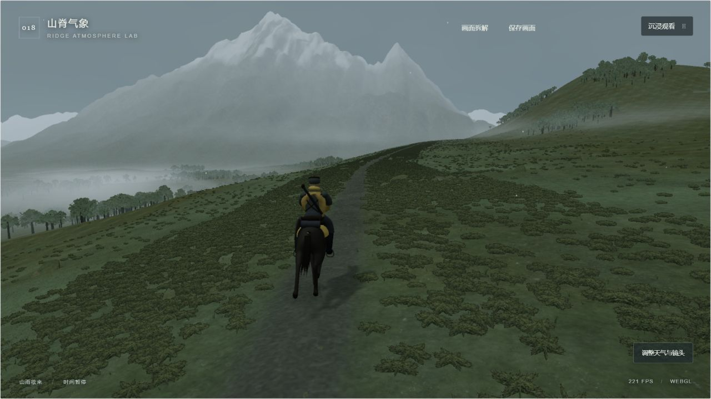

# 018 · Ridge Atmosphere Lab · 云海山脊与骑行镜头

从 [tententen_777 的山脊骑行视频](https://x.com/tententen_777/status/2106077153293115629) 出发，研究山体轮廓、谷地云层、空气透视、草木随风和第三人称镜头如何共同产生开阔、宁静的风景体验，并建立可实时运行的独立三维实验。

这是对画面效果的研究和自建视觉原型。原游戏的模型、贴图、引擎、着色器与资源管线尚未核实，当前实现不能视为原游戏同精度重制。

| 信息 | 内容 |
| --- | --- |
| 研究日期 | 2026-10-03 |
| 效果来源 | [tententen_777 · X 山脊骑行视频](https://x.com/tententen_777/status/2106077153293115629) |
| 原作公开代码 | 未确认 |
| 自建技术 | Three.js / WebGL、程序化几何与着色器、浏览器实时交互 |
| 状态 | 研究中 |
| 研究记录 | [画面分析与实现取舍](notes/source-analysis.md) |
| 运行说明 | [Web 运行说明](web/README.md) |
| 公开演示 | 尚未发布 |

| 原帖视频参考 | 本项目实时场景 |
| --- | --- |
|  |  |

左图是原帖播放器约 `00:51 / 00:56` 的浏览器截帧，包含播放器底栏，是视觉参考；原帖页面证据见 [source-page.jpg](assets/source-page.jpg)。右图来自本机浏览器的重建版。第一版因风景布局和骑马效果差被用户否定；已继续修订为宽斜坡、连通群峰、低矮草毯与同步骑乘节奏，不能沿用第一轮“功能齐全即验收通过”的结论。

## 画面为什么有这种感觉

山脊、云层、植被和镜头承担不同的视觉任务：近景给出尺度和运动，中景山脊承载行进路线，远景通过逐层减弱的对比拉开空间，低云遮住谷底并露出山峰。较慢的相机移动让这些层次产生持续的视差。

分析记录区分可从画面直接看到的现象、对可能技术的推断，以及本项目自行选择的实现方法。原帖没有提供足以证明其渲染算法的代码，不能从“看起来像体积云”推出“原作一定使用射线步进”。详细对应见 [研究记录](notes/source-analysis.md)。

## 当前实验

实时场景由宽阔的不对称草坡、左侧雪峰、右侧山肩、逐渐弯曲的小径、三维谷雾，以及沿路径行进的骑行主体与跟随镜头组成。控制默认折叠，按需调整阴云、晨雾和暮光，以及风、雾和透光。默认画面可直接拖动旋转、滚轮缩放，首个手势保留当前视角并切到自由观察，相机仍随马前进；点击“沿山脊骑行”恢复跟随。暂停、重置、PNG 预览和沉浸观看用于检查和体验。

山体与角色是真实三维几何。地表使用扫描的色彩、法线和粗糙度贴图；草灌采用透明纹理交叉片与细草几何，实例在世界空间随风弯曲。谷雾采用 3D 噪声密度、28/16 次射线采样和实际深度裁剪，与 `FogExp2` 空气透视配合。它是渲染近似，没有真实气象模拟、复杂多次散射或云体自阴影。

进一步细化保留第三版布局与草木实例预算：草叶与地表使用连续苔草底色承接，减轻草根黑边，并变化草卡尺寸、角度和镜像；树林改为重叠叶冠和不规则林簇。返回跟随时相机位置与朝向平滑恢复，近距离环绕保持在地面上方。暂停复用阴影图，截图同步重绘后读取，避免常驻保留帧缓冲。

马模型原本朝 +Z，旧版却沿 −Z 移动，造成倒退骑行。本轮将马匹转正并调整尺度；对原始 15 个形变姿态同步细分、重算法线，保留原动画。骑手改为屈膝、前伸手臂、靴子、马镫和缰绳，鞍与坐姿跟随实际形变脊背，短围肩露出深色上背，两侧衣片不对称垂落。速度为 4.2 m/s、动画周期 1.0 s，与实测接触蹄的后掠速度匹配，减少持续滑步。身体、围肩和不齐尾毛随实际马背运动联动；保留原奔跑形变，尚不是新制作的四拍步行骨骼动画。

手掌现在随真实马头有限响应，袖子独立弯折，胸口吸收部分马背俯仰；接触阴影随真实蹄位变淡和扩散。缰绳与袖子复用曲线和缓冲区，尾毛使用解析变形法线；暂停与重置同时核对几何、法线、手部连接和阴影。

## 本地运行

本机运行入口：[共享站点中的 018 场景](http://127.0.0.1:8951/projects/018-ridge-atmosphere-lab/)。开发预览：<http://127.0.0.1:8988/>。源码在 `app/`，开发入口为 `npm run dev`，`npm run build` 将客户端产物同步至 `web/`。静态网页通过 localhost HTTP 服务运行，避免 `file://` 下的模块与资源限制。完整启动、构建与操作步骤见 [Web 运行说明](web/README.md)。

## 验证与边界

自动检查覆盖路线连续性、植被真实尺寸、真实马模型朝向与形变、触地与腾空、鞍和骑手联动、暂停与重置、风漂移、体积雾渲染状态恢复，以及共享子路径的真实资源打包。构建与检查证明对应的代码行为；视觉判断需要实际对照图，见 [本轮验收记录](design-qa.md)。

最终构建、资源字节与共享站入口的核对见 [构建与打包记录](notes/build-validation.json)。

本轮桌面、窄屏、运动状态、着色器和打包版观察证据见验收记录。启用了局部动态 shadow map；仍不具备原片的精细角色、植被资产和完整游戏级光影。手机检查是浏览器视口模拟，实体手机硬件未实测。PNG 操作提供实际原始像素预览和标准下载链接；系统下载目录自动写入未验证。

本原型针对画面构成和实时表现，使用程序化风景、程序化骑手与独立马模型。没有复用原游戏的美术资产，也未建立完整游戏玩法或商业级资源规模。马模型的非商业与相同方式共享条件独立于 Three.js 代码的 MIT 许可，详见下方来源。

## 来源与许可

- 原始视觉参考：[tententen_777 的 X 帖子](https://x.com/tententen_777/status/2106077153293115629)。原帖文字为「これだけで神ゲーってわかるね🫠」。
- Three.js 0.180.0 是本项目选用的技术基础：[官方仓库](https://github.com/mrdoob/three.js)、[本地 MIT 声明](web/assets/THREE-LICENSE.txt)。
- 马模型为 Three.js r180 的 [Horse.glb](https://raw.githubusercontent.com/mrdoob/three.js/r180/examples/models/gltf/Horse.glb)；[官方马匹示例](https://github.com/mrdoob/three.js/blob/r180/examples/webgl_morphtargets_horse.html) 署名 **Mirada，来自 ROME “3 Dreams of Black”**。本地原文件未修改；运行时细分、朝向、毛色、尾毛和动画节奏经过调整。骑手、鞍、马镫、缰绳与披肩由本项目构造。
- 地表扫描贴图：[Aerial Grass Rock](https://polyhaven.com/a/aerial_grass_rock)，Rob Tuytel / Poly Haven，[CC0 许可](https://polyhaven.com/license)，保留 [本地来源声明](web/assets/POLYHAVEN-LICENSE.txt)。
- 草灌纹理由内置 ImageGen 生成，用作实时三维交叉片材质；[原始透明资产](app/public/assets/foliage-clump.png)、[精确提示词和元数据](assets/foliage-prompt.md)。它不是整体风景背景，也没有使用原视频像素作为场景材质。
- ROME 的 3D assets 与 textures 使用 **CC BY-NC-SA 3.0 Unported**；依据 Three.js r180 中的 [ROME 许可说明](https://github.com/mrdoob/three.js/blob/r180/examples/textures/lensflare/LICENSE.txt)。本地保留 [马模型声明](web/assets/HORSE-LICENSE.txt) 与 [完整来源说明](web/assets/SOURCE-NOTICE.txt)。当前用于非商业研究；商业应用应换用获准商业使用的马模型。
- 来源画面与本项目画面应分别注明；本地截图只能证明本地版本的实际表现。

[返回总索引](../../README.md#项目索引)
