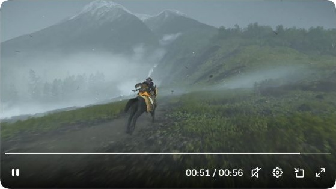

# 山脊骑行画面的分析与实现取舍

研究日期：2026-10-03。视觉来源：[tententen_777 的 X 视频](https://x.com/tententen_777/status/2106077153293115629)。原帖文字为「これだけで神ゲーってわかるね🫠」，可译为“光看这段，就知道是神作了”。这句话是发布者的观感，不是游戏名称或技术说明。

## 证据范围

本轮保存了 [原帖页面截图](../assets/source-page.jpg) 与 [播放器画面截帧](../assets/source-frame.jpg)。页面截图显示视频进度约为 `00:51 / 00:56`；截帧来自浏览器实际显示的原帖视频，保留了播放器底栏。它是原始视觉参考，不能作为本项目实现的截图。

原帖没有提供原作代码、材质、模型或性能数据，尚不能确认游戏名称、引擎或云雾的实际算法。静态截图可以核对空间、颜色和遮挡，无法单独证明草叶、风或相机的运动规律。

## 截帧直接观察

骑手与黑马背向镜头，位于画面中下方；黄橙色衣物在灰绿环境里形成小面积的暖色焦点。近景是暗灰泥地和成片灰绿草，后方道路沿山坡展开。左后方的高峰带雪灰色山顶，右侧是较低的草坡与树带，形成不同高度的轮廓。

几条低雾带从左侧谷地延伸至右边山腰，透出远处树木的剪影。远峰颜色偏灰蓝、对比和细节减弱；近景泥地和植被更深。这一帧的关键是低云和带状谷雾包围山体，不宜简单替换成均匀铺满整个画面的白色平面。

天空是灰蓝色的漫射光环境，没有明显晴日的强硬阴影。近景草、泥土和岩坡的色相受限，暖色骑手承担主体识别。画面里的细小暗点可以看到，但一张截图不足以判定它们是草叶、飞鸟或粒子。

以下“视觉目标”用于解释需要还原的构成；“自建路线”是本项目采用的技术，不作为原作算法的证据。

## 从画面目标到技术实验

| 视觉目标 | 作用 | 本项目的自建路线 | 需要关注的失败模式 |
| --- | --- | --- | --- |
| 近中远景分层的山体 | 建立距离、坡度与空间尺度 | 程序化连续地形，保留可读的山脊与行进路径 | 所有山体同样锐利、等间距峰形、近景过于平面 |
| 谷地低云、带状山腰雾与透出的峰顶 | 隐去谷底、保留可读的山体轮廓 | 在低高度带构造缓慢变化的云层；与距离雾共同形成远景 | 云层成为贴在画面的白色幕布，遮住全部山体，重复图案明显 |
| 远山偏淡、细节减少 | 通过空气透视拉开层次 | 距离/高度相关雾色和对比衰减 | 仅降低整体不透明度而失去前后关系 |
| 风草、灌木和枝叶的微动 | 给静态风景加入生命感和运动尺度 | 批量植被、局部弯曲、不同相位的风场 | 植被整片同步摇摆、根部滑动、近景穿模 |
| 骑行主体与跟随镜头 | 给出人和山脊的尺度、产生视差 | 程序化简化骑行主体、路线前进、平滑相机跟随 | 相机追随产生抖动、主体遮挡远景、速度与步态不同步 |
| 柔和光色与受控对比 | 使云层明亮而山体仍有体积 | 天空环境光、方向光、雾色和色调映射共同调节 | 云高光过曝、山体剪影化、饱和度过高 |

## 可直接观察、可推断与自建技术

画面可以支持对轮廓、层次、颜色、遮挡、运动和相机方向的描述；连续视频还能帮助比较近远景视差和风的变化。它不能直接证明原作使用哪种噪声、是否采用体积纹理、是否有动态天气求解或植被物理。

“空气透视”“低云遮蔽谷底”“跟随镜头”的解释描述视觉机制。落实到本原型时，我们会根据浏览器实时负担选择近似方法，并在源码说明中明确它们；例如，纹理/网格/着色器组合的云层可以研究云海构成，但不等于大气流体模拟。

## 自建实现中的关键近似

当前大气模块将天空、三维低云与距离雾分开处理。天空在包围相机的大球面上产生低对比蓝灰云层；谷雾使用有位置和半径的三维密度场、48³ 噪声纹理，以及高档 28 / 轻档 16 次射线采样。不透明场景先写入颜色与深度，雾积分在真实表面处终止，再完成色调映射。该方法取代了第一版的水平透明雾片。距离雾仍采用 Three.js `FogExp2`，并保留独立开关。

这些方法能控制雾带、轮廓露出和远近对比，但没有沿视线积分三维密度，没有真实水汽输送、云内多重散射或物理天气求解。它们是本项目为浏览器实时负担选择的近似，与原作可能使用的技术没有等同关系。

天空和谷云使用随模拟时间累计的风相位；调整风力改变之后的漂移速度，不直接把此前时间乘上新风速，避免云纹理瞬间换位。逻辑检查覆盖这种连续性、暂停时停止漂移、静风与重置，尚需与最终浏览器画面核对。

照明采用阴天漫射与方向光；骑行主体周围启用了 1024² 的局部动态 shadow map，阴影相机随骑手移动。暂停时复用阴影图，在模型载入、重置、风力或可见性变化后更新。近地接触阴影随真实混合蹄位变淡/扩散。这不是原片的完整全局光照或云体自阴影。

跟随镜头沿程序化山脊路径前进，以指数平滑更新相机位置，前看路径的下一段；近处环绕镜头随马前进，允许从侧面观察实际步态。骑马主体使用 Three.js r180 的 Horse.glb 和变形目标动画；[官方示例](https://github.com/mrdoob/three.js/blob/r180/examples/webgl_morphtargets_horse.html) 署名 Mirada from ROME。骑手、鞍、佩剑和随风弯曲的披风为程序化几何。ROME 素材许可为 CC BY-NC-SA 3.0，依据 [r180 的 ROME 许可说明](https://github.com/mrdoob/three.js/blob/r180/examples/textures/lensflare/LICENSE.txt)；这与 Three.js 代码的 MIT 许可分别记录。

地形通过相同的确定性高度函数生成山脊网格、采样骑马落点并放置植被，避免三者使用不一致的路径。近景为约 1,100 × 860 m 的山脊，网格在路径中心更密；远景宽约 12,000 m，纵向延伸至更远的山谷，另用 30,000 × 30,000 m 的低细节谷底衔接自由观察时的边缘。远山使用不规则峰形和多尺度噪声，仅左后主峰保留局部残雪。

材质根据坡度、高度和路径遮罩混合泥土、草和岩面，并加入 Poly Haven 的 CC0 扫描色彩、OpenGL 法线与粗糙度贴图，按约 15 米的真实比例取样。没有使用原游戏贴图。树林不规则成簇分布于右侧山肩、远坡与谷地，冠形由细小叶片组成，取代了第一版的锥形树列。

浏览器默认植被采用 ImageGen 生成的透明草灌纹理与三张交叉片，每簇约 0.17–0.29 米高；高档 52,000 簇，轻档 19,000 簇，84% 集中于完整路线两侧的核心近场，其余散布于宽坡。另混入高档 16,000 / 轻档 3,500 簇细草，打破圆饼状轮廓。草卡有镜像、尺寸和角度变化，以连续苔草底色连接扫描地表，根部色场在顶点阶段计算。树林为 1,400 / 440 株，每株 110 片叶卡分成重叠冠层，按16片不规则林簇分布。顶点着色器按世界位置、时间与独立相位弯曲上部，根部固定，alpha test 保留植物轮廓及真实深度。程序化细草分支也保留。岩石、低灌丛和林木为独立实例几何；配置数量不是跨设备性能证明。

对应入口：`app/src/scene/math.js`、`app/src/scene/terrain.js`、`app/src/scene/atmosphere.js`、`app/src/scene/renderer.js`、`app/src/scene/rider.js`。

## 实现与验证范围

当前目标是建立可实时调整和体验的风景原型，而非逐像素复刻、完整地图或原游戏玩法。云层和距离雾可独立开关，以比较几何遮挡、低云和远景对比各自的作用。代码配置、构建/打包检查和真实浏览器检查分别记录；尚未取得结果的项保留为未验证，不提前宣称浏览器或 GPU 验收通过。

可复用经验主要包括：怎样分配画面各层的对比，怎样使雾与云服务于空间，怎样让风草只弯曲上部，以及怎样通过平滑跟随保持山脊路线可读。

来源与技术基础：[X 原帖](https://x.com/tententen_777/status/2106077153293115629)、[Three.js 官方仓库](https://github.com/mrdoob/three.js)。Three.js 是我们选用的工具，未证明原作采用它。
