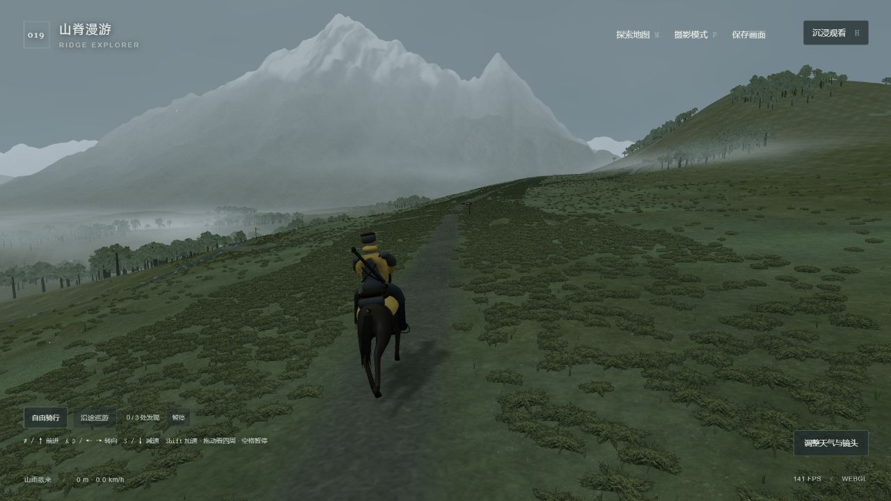
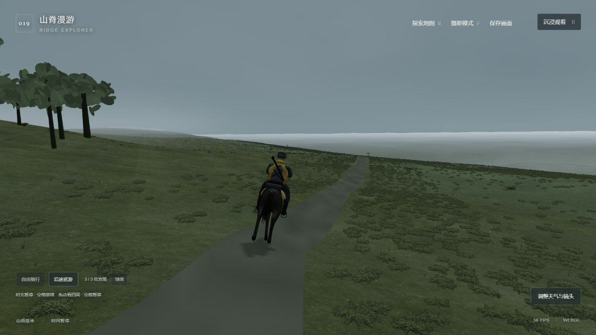
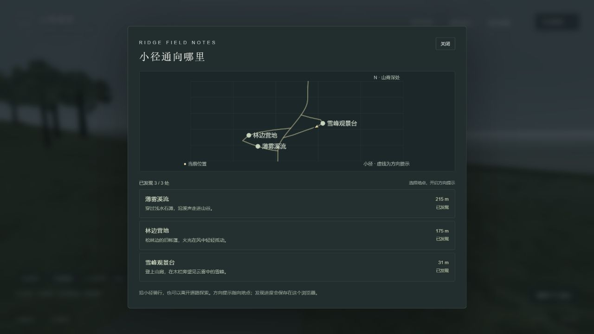

# 019 · Ridge Explorer · 山脊漫游

把已经认可的山脊风景继续构建成可以自己骑马探索的小世界。018 的山体布局、草木、谷雾、骑手、拖动镜头、天气和 PNG 导出先独立保存；019 在独立目录内扩展控制、路线、地点发现与摄影。本轮 v2 继续补全小径导航、地点停留、继续上次骑行和可选的山间声音。

本机入口：[019 山脊漫游](http://127.0.0.1:8951/projects/019-ridge-explorer/)。开发预览：[8990](http://127.0.0.1:8990/)。原版仍可从 [018 山脊气象](http://127.0.0.1:8951/projects/018-ridge-atmosphere-lab/) 打开。

上图是 v1 在本机 [8951 公共子路径预览](http://127.0.0.1:8951/projects/019-ridge-explorer/)的实际默认画面，1280 × 720。v2 继续保留这套风景与紧凑界面。来源对照、不同地点与摄影操作见 [画面与交互验收](design-qa.md)。

## 完整理解与公开发布 · 2026-10-09

[完整网页与全部入口](https://yydshly.github.io/0930_codex_project/projects/019-ridge-explorer/understanding.html) · [019 实时骑马探索](https://yydshly.github.io/0930_codex_project/projects/019-ridge-explorer/) · [018 保存基线](https://yydshly.github.io/0930_codex_project/projects/018-ridge-atmosphere-lab/)。理解页展示我们的营地实拍作为引导图，汇总两版关系、风景构造原理、三个地点、实际路线、操作、摄影、声音、浏览器存档、保存下载、场景价值、扩展路线和来源许可。

网页发布明确包含静态运行依赖、十张选定实拍/对照图、原始 PNG，以及只读 018 冻结 ZIP 和逐文件清单；ZIP 保持原 SHA，不包含浏览器存档或私有环境。文章无需 JavaScript 阅读。源码保留在本目录，公开文件按 `scripts/ridge_publish.py` 的白名单和 SHA 清单发布；本次上线结果和新验证以 `notes/publication.md`、`notes/deployment-checks.json` 为准。下面的 v1 / v2 构建和浏览器记录仍属于 2026-10-03 历史实验。

## 保存的当前能力

原版保存为 [20261003-polished-baseline.zip](../018-ridge-atmosphere-lab/releases/20261003-polished-baseline.zip)，配套 [SHA-256 文件清单](../018-ridge-atmosphere-lab/releases/20261003-polished-baseline.json) 与 [基线能力说明](../018-ridge-atmosphere-lab/notes/baseline-capabilities.md)。归档包括源码、锁定依赖清单、客户端网页、实际资源、许可和已有验收证据，排除依赖目录、缓存和私有环境文件。

恢复时将 ZIP 解压到独立目录。`web/` 已包含可通过 HTTP 打开的客户端；需要继续编辑时按 `app/package-lock.json` 安装依赖。清单记录每个原始文件的 SHA-256，可以核对恢复后内容。基线 ZIP 与清单原先仅保存在研究目录；2026-10-09 的完整理解页增加经哈希校验的公开下载。冻结内容保持原值。

| 保留下来的能力 | 在 019 中的作用 |
| --- | --- |
| 三维山脊、扫描地表、草灌与林簇 | 继续作为可探索的真实地面与景观 |
| 分层谷雾、距离雾和三种天气 | 在骑行与摄影过程中调整同一场景 |
| 真实马模型、形变步态与联动骑手 | 保留角色，并使移动控制与动画速度对应 |
| 首次拖动立即接管镜头、滚轮缩放 | 随时环绕观察，返回跟随镜头 |
| 暂停、重置、沉浸和原始 PNG 导出 | 检查场景，也用于停下来取景 |

保存范围与基线限制以原版说明为准。两版是独立项目，019 的修改不写回 018。

## 扩展的场景

这里是一块有边界的三维区域。主山脊小径向谷侧分出溪流与营地环线，另一侧分出雪峰观景支线，两条支线重新接回主路。它们有真实地面高度和可见路径，地图使用同一组世界坐标。

| 地点 | 场景内容 |
| --- | --- |
| 薄雾溪流 | 浅水石滩、流动水面和穿过溪边的路线 |
| 林边营地 | 帐篷、石围火堆、木料与风中火光 |
| 雪峰观景台 | 山肩上的木栏与可观察雪峰和云海的位置 |

自己控制马匹行进和转向，靠近地点时触发发现。`M` 打开地图，选择地点后，金色路线标出沿真实小径的路径与剩余路程；跟着转向提示骑过去，离开小径时会先提示返回路边。也可选择“沿途巡游”，沿连通环线游览三个地点，进入每个地点中心 2 米范围后停留 12 秒；点击“继续巡游”可提前出发。

到达地点附近后，按 `E` 或点击“停留看看”打开地点卡；“在此取景”将镜头对准当地景物并进入摄影，马匹保留实际位置。`P` 进入或结束普通摄影，`H` 切换沉浸观看。天气、风力、雾和光线仍在折叠的控制面板中调整。

桌面使用 `W / ↑` 前进、`A / ←` 与 `D / →` 转向、`S / ↓` 制动，按住 `Shift` 加速。基础速度 4.2 m/s，加速为 6.3 m/s；释放前进后逐渐停下，并从奔跑形变平滑回到原模型的触地静止姿态。暂停和摄影保留当前姿态。具体界面操作见 [Web 运行与操作说明](web/README.md)。

地点发现记录保存在当前浏览器的 `ridge-explorer.visited.v1`。v2 另将最近的骑手位置、朝向、累计路程、世界时刻、天气和取景参数记录到 `ridge-explorer.ride.v1`。重新打开仍先展示起点和默认风景；点击起点处的“继续上次骑行”才恢复该记录，恢复后从静止的自由骑行开始。回到起点和刷新保留发现进度及最近的有效骑行记录。记录仅在当前浏览器中保存，浏览器存储不可用时仍可探索。

摄影模式冻结世界时间和骑行，使用环绕镜头、28–80° 视角与“原色”“暖调”“冷调”取景；同样的色调会出现在 PNG 导出中。天气面板里的“山间声音”默认关闭，点击后才启用程序合成的风声、溪流、篝火与马蹄声。溪流和火堆按实际位置远近变化，蹄声随真实移动距离触发；暂停、摄影和页面隐藏时静音。声音不写入骑行记录，也不会随恢复自动开启。

营地使用实际 GLB 模型；支线、溪流、观景设施和动态火光由本项目的实时几何与材质构建。原始 X 视频提供的是风景参考，这些探索地点与玩法是本项目的新增设计。

## 构建与验证

019 源码在 `app/src/`，依赖与锁定清单在 `app/`。从本子项目目录运行 `npm --prefix app ci` 安装依赖，`npm run dev` 启动开发版；`npm run test` 运行场景检查；`npm run build` 产生客户端并复制到 `web/`。

在仓库根目录运行 `python scripts/build_site.py`，将已经登记的 019 客户端复制到 `_site/projects/019-ridge-explorer/`，与 018 的路径分开。`python scripts/projects.py check` 检查目录、清单和首页的一致性。

`python -m unittest discover -s tests -p test_ridge_explorer_site.py -v` 使用真实构建检查模型与许可逐字节保留、JS/CSS 子路径，以及精确白名单和私有文件过滤。原版的 `test_ridge_site.py` 保留独立回归。运行打包检查前应先完成客户端构建；检查不会生成替代场景，也不能证明实际 WebGL 画面通过。

v1 历史验收通过 25 项场景自动检查、3 项 019 真实客户端打包检查和目录清单检查；原版 3 项打包检查也通过。当时构建为 `index-D_APDzv3.js` / `index-C4J52dvW.css`，18 个客户端公开文件在 `web/` 与共享站逐项 SHA-256 一致，目录封面也一致。018 的 105 个原文件和 ZIP 内成员均与保存清单一致，ZIP 为 30,828,413 字节。上述散列和文件数量属于 v1，不代表 v2 的最终构建。

v1 记录见 [构建与保存核对](notes/build-validation.json)、[公开文件清单](notes/final-public-files.json)和 [画面与交互验收](design-qa.md)；[首次构建的自动验证](notes/automation-validation.json)也作为历史保留。v1 的 8992 静态客户端已实际依次巡游发现溪流、营地和观景台，达到 3/3；刷新保留进度，8951 摄影版导出实际 1920 × 1080 PNG。下方截图与导出链接属于这一轮历史验收。

v2 已通过全部 43 项场景检查、3 项最终客户端打包检查及 19 项目录一致性核对，新增覆盖真实小径导航、存档校验、巡游停留、音频生命周期和营地地面/烟雾。最终构建及实际浏览器证据见 [v2 构建记录](notes/build-validation-v2.json)、[v2 公开文件清单](notes/final-public-files-v2.json)和 [画面与交互验收](design-qa.md)。当时正式本机入口已更新，未发布公开网址；2026-10-09 发布入口见上方完整理解与上线记录。

| 三处发现后的观景台 | 三处发现的地图 |
| --- | --- |
|  |  |

[最新公共默认画面](assets/explorer-final-latest.png) · [最新摄影操作画面](assets/explorer-photo-latest.png) · [实际导出的 28° 暖调 PNG](assets/explorer-export-final.png)

[v2 正式默认画面](assets/explorer-v2-production.png) · [营地最终取景](assets/explorer-v2-camp-polished.png) · [营地实际 PNG](assets/explorer-v2-camp-polished-export.png) · [最终手机界面](assets/explorer-v2-mobile-final.png)

## 边界与来源

这是有限区域内的浏览器探索原型。不是完整开放世界；有简化的树干与营地道具接触、坡度和边界约束，没有游戏级物理系统、动物 AI、任务剧情或新的四拍步行骨骼动画。马匹沿用原模型的奔跑形变，速度变化会改变动画节奏；实体手机 GPU 未实测。

- 原始风景参考：[tententen_777 · X 山脊骑行视频](https://x.com/tententen_777/status/2106077153293115629)。原游戏名称、模型和渲染实现未核实。
- 保存的直接基础：[018 山脊气象说明](../018-ridge-atmosphere-lab/README.md) 与 [原始画面分析](../018-ridge-atmosphere-lab/notes/source-analysis.md)。
- Three.js 0.180.0：[官方仓库](https://github.com/mrdoob/three.js)，MIT 声明保留在 `app/public/assets/THREE-LICENSE.txt`，随网页发布。
- 马模型：Three.js r180 的 `Horse.glb`，Mirada / ROME “3 Dreams of Black”，CC BY-NC-SA 3.0。原文件与 `HORSE-LICENSE.txt` 保留；本项目的程序化骑手、鞍、缰绳及运行时调整与其分别说明。该模型仍受非商业和相同方式共享条件约束。
- 地表扫描：Rob Tuytel / Poly Haven 的 [Aerial Grass Rock](https://polyhaven.com/a/aerial_grass_rock)，CC0；声明保留在 `POLYHAVEN-LICENSE.txt`。
- 草灌透明纹理：沿用 018 的 ImageGen 原创资源，提示词与元数据保存在 [原版资源记录](../018-ridge-atmosphere-lab/assets/foliage-prompt.md)。
- 营地资产：Kenney [Nature Kit 2.1](https://kenney.nl/assets/nature-kit)，CC0。复用本仓库 010 已保存的 `tent_detailedOpen.glb`、`campfire_stones.glb` 与 `log.glb`；重新按物理尺度与山脊色调调整。原始 `License.txt` 与本次 `NOTICE.txt` 保留在 `app/public/assets/exploration/`，随网页发布。

三个营地模型与原始许可均已逐字节核对本仓库既有来源，记录见 [资产 SHA-256 与出处](notes/exploration-asset-provenance.json)。

[返回总索引](../../README.md#项目索引)

新增代码按场景数据、地形/物件、骑行运动和界面分层，可从同一高度场继续添加新路线和地点；能力对应见 [保存与扩展说明](notes/capability-map.md)。
